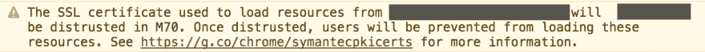

# Chrome 70 将不信任所有赛门铁克证书

> 原文：<https://dev.to/codebyamir/chrome-70-will-distrust-all-symantec-certificates-54jb>

# 这是什么意思？

从 Google Chrome 版本 70 开始，任何具有剩余赛门铁克证书的网站都将被标记为不可信，包括 2016 年 6 月 1 日之后发布的网站。

[T2】](https://res.cloudinary.com/practicaldev/image/fetch/s--yF1Mp5ET--/c_limit%2Cf_auto%2Cfl_progressive%2Cq_auto%2Cw_880/https://thepracticaldev.s3.amazonaws.com/i/savnt0og7opbopv4239t.png)

Chrome 70 的发布时间表如下:

*   2018 年 7 月 20 日(金丝雀)
*   2018 年 9 月 13 日(测试版)
*   2018 年 10 月 16 日(稳定)

# 为什么会这样？

Google 决定不信任 Symantec 颁发的 SSL 证书，因为其证书颁发方式存在问题。

赛门铁克的 PKI 业务以多个品牌(Thawte、VeriSign、Equifax、GeoTrust、RapidSSL)运营，这些品牌在没有适当监督或验证的情况下签发证书。

在几起备受瞩目的事件中，赛门铁克被指有见不得人的行为，因此谷歌决定扔掉锤子，不信任他们在 Chrome 中的证书。

在谷歌[宣布](https://security.googleblog.com/2017/09/chromes-plan-to-distrust-symantec.html)宣布其决定后，赛门铁克意识到他们的证书将几乎一文不值。因此，他们决定将整个 CA 业务出售给 DigiCert，并退出市场。

# 我需要在我的网站上做什么？

为了避免 Chrome 浏览器出现关于您的网站不可信或不安全的安全警告，请尽快更换赛门铁克证书。

DigiCert 为受此影响的任何人提供免费的替换证书。