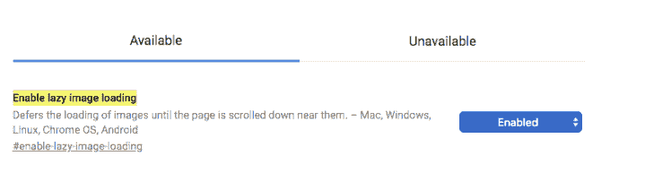
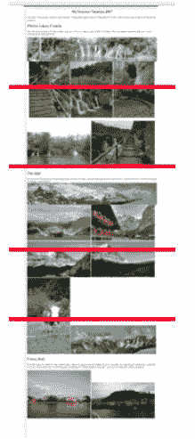
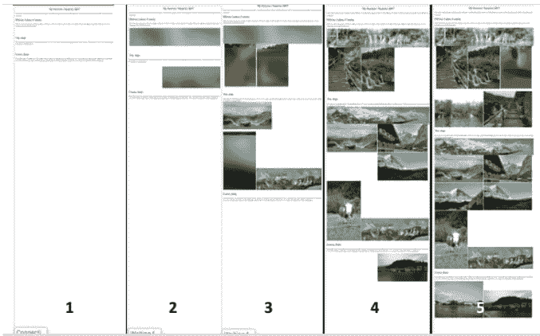
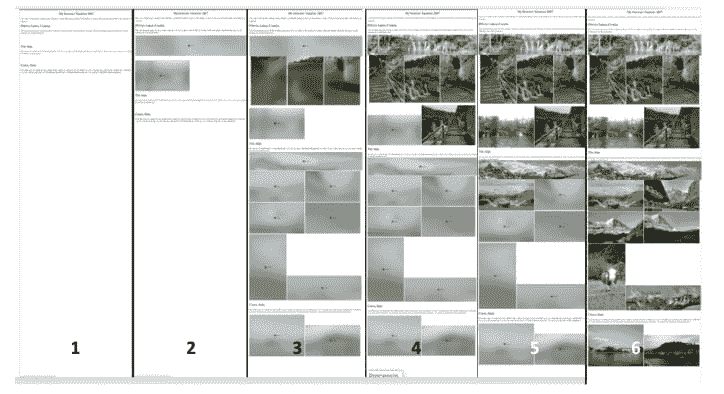
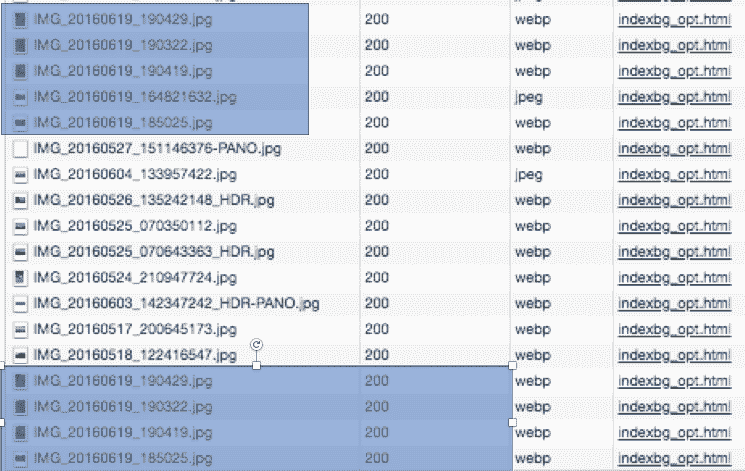

# Chrome 的实验图像懒加载标志

> 原文：<https://dev.to/dougsillars/chromes-experimental-image-lazy-loading-flag-4860>

惰性加载是一种仅在需要时才加载内容的技术。在图像的情况下，这通常意味着仅当图像在屏幕上时)。在这篇文章中，我研究了 Chrome Canary 的新图像延迟加载标志，并测量了自动延迟加载图像的性能影响。

根据 HTTP 存档，移动网站的中位数为 1271 KB，拥有 501 KB 的图像(这意味着在第 50 百分位，图像占页面权重的 40%)。此外，在 HTTP Archive 中的 LightHouse 审计发现，中间站点有 92 Kb 的图像(18%的图像 Kb)在屏幕外。(约占总吨位的 7%)。我[最近查看了在惰性负载灯塔测试中得分为“0”的站点](https://dougsillars.com/2018/05/21/state-of-the-web-top-image-optimization-strategies/)(60%的站点完全没有通过这项测试)，我发现这些站点的平均节省量为 520KB。灯塔审计公司估计，在 3G 连接下，得分为 0 的页面加载速度将会快 3.5 秒！

这些数据清楚地表明，利用 Javascript 延迟加载图片是加快网站加载速度的一个好方法。Dean Hume 写了一篇关于使用交叉点观察器来延迟加载图像的文章。2018 年 8 月，Chrome 在 Canary 宣布了一个实验标志，浏览器将在不使用 Javascript 的情况下懒惰加载图像。这是非常令人兴奋的——这样的实现可以加速今天网络上的每一页。在 Canary 中，浏览到 Chrome://flags，并启用“启用延迟加载”

[T2】](https://res.cloudinary.com/practicaldev/image/fetch/s--OWFebfDC--/c_limit%2Cf_auto%2Cfl_progressive%2Cq_auto%2Cw_880/https://cdn-images-1.medium.com/max/719/0%2AE077SlB9MDpUvXH6)

### 那么它是如何工作的呢？

为了研究懒惰加载标志，我构建了一系列包含大量图片的页面。

让我们来看看 HTTP 网站，看看页面在关闭延迟加载的情况下是如何加载的。以下是完全加载页面的屏幕截图，每个视窗都用红线标记:

[T2】](https://res.cloudinary.com/practicaldev/image/fetch/s--jJfke5KS--/c_limit%2Cf_auto%2Cfl_progressive%2Cq_auto%2Cw_880/https://cdn-images-1.medium.com/max/219/0%2APWoDyUez1sZy5VZr)

### 无懒加载

那么，这个页面是如何加载的呢？让我们来看看我一路上拍的几张快照:

[T2】](https://res.cloudinary.com/practicaldev/image/fetch/s--9J2zwLAW--/c_limit%2Cf_auto%2Cfl_progressive%2Cq_auto%2Cw_880/https://cdn-images-1.medium.com/max/677/0%2AQnfY49lu4nCtrFmU)

1.  有文字，但是没有图像。
2.  折叠占位符图像上方有一个绿色，与最终视窗#3 中的一个一样。
3.  第一个填充图像出现，但不在页面顶部。文本仍在移动。
4.  顶部的 4 张图片中有 3 张已经加载，折叠下方也有很多。文本仍在移动。
5.  所有图像已加载。所有的文字终于到位。

很明显,“顶视图”内容没有被优先化，因为它只在页面加载结束时才完全出现。

### 懒装

现在，启用延迟加载标志，让我们观察页面加载:

[T2】](https://res.cloudinary.com/practicaldev/image/fetch/s--5tvkwPHU--/c_limit%2Cf_auto%2Cfl_progressive%2Cq_auto%2Cw_880/https://cdn-images-1.medium.com/max/724/0%2AnrL7a3jKVqkO7q9k)

1.  只有文字。
2.  前两个占位符图像(都在第一个视窗中)
3.  所有的背景图片都已就位。页面完全展开，并且正在加载顶视图中的 3 个图像。
4.  顶视口竞争
5.  第二个和第三个视口完成
6.  页面完成。

差异比比皆是。首先，启用了惰性加载标志后，页面在这个过程的早期就已经完全布局好了。浏览器对每个图像进行 HTTP 206(部分内容)请求。请求每个图像的前 2KB。在图像的前 2 KB 中是元数据，包括图像的尺寸和大小(以 KB 为单位)。有了这些信息，浏览器可以创建占位符图像并最终确定页面的框架。仔细观察每张背景图片，Chrome 还增加了每张图片的大小(KB ):

[T2】](https://res.cloudinary.com/practicaldev/image/fetch/s--SdZVsvaF--/c_limit%2Cf_auto%2Cfl_progressive%2Cq_auto%2Cw_880/https://cdn-images-1.medium.com/max/668/0%2ACAcgIr_wByg5Qslt)

其次，既然浏览器知道了页面上图像的顺序，就可以按照从上到下的顺序请求图像，将最重要的图像(在顶部)加载到页面上较低的图像上。

### Chrome 懒人加载更快吗？

今天——没有。我的 WebPageTest 运行的延迟加载比没有 Lazy Loading 时稍微慢一些(SpeedIndex 慢了大约 500ms)。然而，我希望随着该特性变得更加成熟，这种情况会有所改变。目前，根据我是用 WebPageTest 还是用我的 Mac 进行测试，行为会有所不同。我还看到了使用和 http/https 请求图像时的差异。

### 桌面行为(金丝雀 71.0.3558.0)

在 Canary desktop 中，对于每个映像，第一个请求是前 2 KB，第二个请求是完整的 200，请求整个映像(这确实意味着每个映像的前 2 KB 被下载两次)。

此外，我看到我页面顶视图中的前四张图片被下载了两次( [875676](https://bugs.chromium.org/p/chromium/issues/detail?id=875676) )。这肯定会损害页面加载时间和速度指数。

[T2】](https://res.cloudinary.com/practicaldev/image/fetch/s--UOsRGDfS--/c_limit%2Cf_auto%2Cfl_progressive%2Cq_auto%2Cw_880/https://cdn-images-1.medium.com/max/745/0%2Aga3q99SUwTo6TEP3)

### 网页测试行为(金丝雀 71.0.3554.4)

要在 WebPageTest 中启用 LazyLoading，请在 Chrome 选项卡中使用命令行术语**–enable-features = lazy image loading**标志，(并确保您使用的是 Canary！).

在 WPT 运行时，所有的图像请求都是部分内容。请求 1 是前 2 KB，第二个请求是剩余部分(避免桌面上看到的 2KB 重复下载)。

比较带/不带 LazyLoading 标志的运行提供了该特性的一些初始基准。目前，使用 LazyLoading 标志的 SpeedIndex 要慢大约 500ms(用我的测试网站)。这里有一个[代表性的对比](https://www.webpagetest.org/video/compare.php?tests=180921_0Q_d2a5d31a0e6757d9804a13b6cb89edda,180921_K2_aad9e437c954b8c3fe8293cb2cdc3f0f#)。

注意:最上面一行是惰性负载，下面是标准负载。

### 结论:

实验性的 LazyLoading 特性在许多方面增强了页面负载。请求每个图像的前 2 KB 允许浏览器快速获得图像尺寸，并使用图像占位符完全布局页面。此外，知道页面上每个图像的位置允许浏览器首先请求第一视口内的图像，然后在页面上按顺序(从上到下)加载后续图像。今天，Chrome Canary 中的 LazyLoading 功能比定期加载页面稍慢，但我预计该功能将在实验性标志的背后继续发展和改进，并将达到比不基于浏览器的 LazyLoading 更快的 SpeedIndex 值(加载第一个视口)。

我很高兴跟踪这个功能，因为在浏览器中实现一个大的性能特性改进将有助于加快整个网络的速度。

*原载于 2018 年 9 月 21 日*[*【dougsillars.com】*](https://dougsillars.com/2018/09/21/chromes-experimental-image-lazy-loading-flag/)*。*