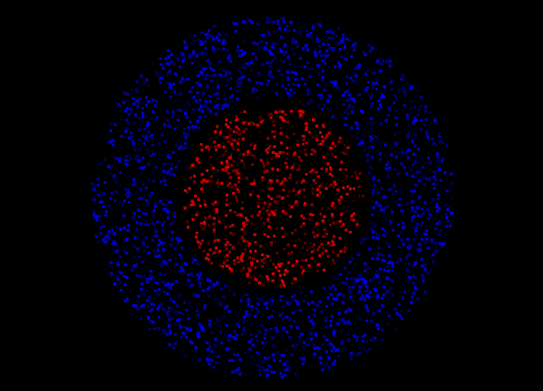

# 嗜铬细胞

> 原文：<https://dev.to/victorqribeiro/chromostereopsis-fdg>

[T2】](https://res.cloudinary.com/practicaldev/image/fetch/s--h4fFy5E4--/c_limit%2Cf_auto%2Cfl_progressive%2Cq_auto%2Cw_880/https://thepracticaldev.s3.amazonaws.com/i/d0bj8vwmq1y83iezdklh.png)

色立体视觉是一种视觉错觉，由此在二维彩色图像中传达深度印象，通常是红-蓝或红-绿颜色，但也可以用红-灰或蓝-灰图像来感知。

用于生成该图像的代码是[这里是](https://jsfiddle.net/victorqribeiro/vxf2ajzm/)

你可以在这里阅读更多关于彩色立体视觉的信息