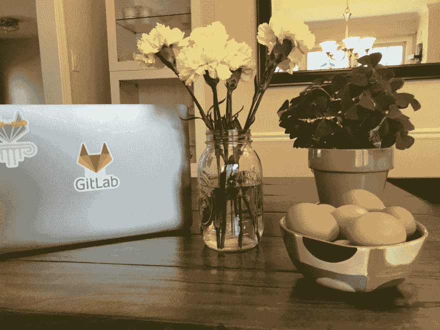
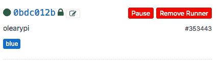
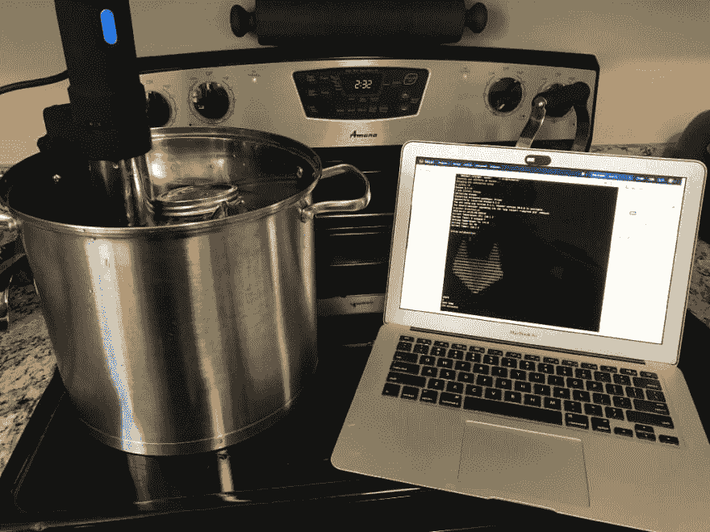

# CI/CD 所有的事情:从 GitLab 引入自动早餐(某种程度上)

> 原文：<https://dev.to/olearycrew/ci-cd-all-the-things-introducing-auto-breakfast-from-gitlab-sort-of-3d93>

GitLab 文化的一大部分是[互相感谢](https://about.gitlab.com/handbook/communication/#say-thanks)所做的伟大工作。这可以是任何事情，从帮助解决一个棘手的技术问题，到简单地分享一个美好的[咖啡休息电话](https://about.gitlab.com/culture/all-remote/#coffee-break-calls)来结束一天的工作。一天，一名销售团队成员感谢 Customer Success 的某人为他做了一次精彩的 [GitLab CI/CD](https://about.gitlab.com/features/gitlab-ci-cd/) 演示。客户事后评论“好吧，GitLab 不做什么？”

大量以心脏为主题的表情符号反应随之而来。我们已经看到用户用 GitLab CI/CD 做了一些非常惊人的事情，从[增加到每周移动发布](https://about.gitlab.com/2017/06/07/continous-integration-ticketmaster/)到[自动化枯燥的 Git 操作](https://about.gitlab.com/2017/11/02/automating-boring-git-operations-gitlab-ci/)，到[节省 90%的 EC2 成本](https://about.gitlab.com/2017/11/23/autoscale-ci-runners/)。然而，有一件事我们没有看到。所以除了这种爱，这个问题还得到了一个半讽刺的回答:

> 不幸的是，它不会为你做早餐。

我从来不会让无聊的谈话被忽视，我用我最喜欢的一句话来回答:

[T2】](https://res.cloudinary.com/practicaldev/image/fetch/s--KTVY3KB4--/c_limit%2Cf_auto%2Cfl_progressive%2Cq_auto%2Cw_880/https://cdn-images-1.medium.com/max/466/0%2AGRSEFacBCMhZ_19G.png)

我不得不承认，我的状态是[:咖啡 _ 鹦鹉:](https://github.com/jmhobbs/cultofthepartyparrot.com/issues/55)可能与我热情的回复有关…

### 挑战

当时我对如何完成这件事只有一个模糊的想法。我的评论引发了许多关于物联网设备的建议。虽然一个装有永远不会打补丁的 Linux 版本的烤面包机很吸引人，但我想做一些更大的事情。

几年前，一些朋友知道我喜欢烹饪，于是聚在一起给我买了一台 Anova Sous Vide。他们没有计算到的是，在八年内生四个孩子对学习久经考验的[法式烹饪方法](https://en.wikipedia.org/wiki/Sous-vide)会起到反作用。因此，这个工具在它的时代并没有太多的用处。

然而，此时我想到了两件事:

1.  我喜欢一家知名咖啡店新推出的真空蛋卷
2.  Anova Sous Vide 使用[蓝牙低能耗(BLE)](https://en.wikipedia.org/wiki/Bluetooth_Low_Energy) 让你通过应用程序控制它

### 菜谱(烹饪)

虽然我确实喜欢咖啡店里的蛋卷，但我并不是一直都有。我会给他们 5 星的评级，但是他们比我想花的多花了一些*钱*😉因此，我在 Anova 的网站上找到了一份[真空吸蛋食谱](https://recipes.anovaculinary.com/recipe/sous-vide-egg-bites-bacon-gruyere)。

### 菜谱(技术)

一旦我有了诀窍，我所需要的就是逆向工程 BLE 连接，弄清楚如何从命令行工作，建立一个项目，并让它与 GitLab CI/CD 集成…没什么大不了的。幸运的是，我发现了一个名为 PyCirculate 的奇妙项目，它已经用 Anova 解决了许多 BLE 连接问题。这让我想知道以前是否有人做过自动早餐…但是我还没有找到他们！

[T2】](https://res.cloudinary.com/practicaldev/image/fetch/s--vKapu-mz--/c_limit%2Cf_auto%2Cfl_progressive%2Cq_auto%2Cw_880/https://cdn-images-1.medium.com/max/1024/0%2AftCztjcrF_GunE8n.png)

现在我有了食谱和所有的配料，是时候开始了……(我无法告诉你当我想到那个笑话时有多开心。我说过我是爸爸了吗？)

### 设置早餐管道

一旦我在我的笔记本电脑上安装并运行了这个项目，我就将代码上传到 GitLab 的公共存储库中的自动早餐组中。接下来，我将 [GitLab Runner](https://docs.gitlab.com/runner/) 安装在 [RaspberryPi](https://www.raspberrypi.org/) 上。我将 Pi 注册为我的项目的特定运行者。我使用了一个 [runner 标签](https://docs.gitlab.com/ee/ci/runners/README.html#using-tags)，这样我可以确保烹饪工作只在一个有蓝牙连接的设备上运行。

[T2】](https://res.cloudinary.com/practicaldev/image/fetch/s--PuJBoEfM--/c_limit%2Cf_auto%2Cfl_progressive%2Cq_auto%2Cw_880/https://cdn-images-1.medium.com/max/431/0%2AIh8rZdaElnwaPbBb.png)

当我在 auto-breakfast/eggs 上运行管道时，它使用 RaspberryPi 来执行，因此可以创建到 Anova 的 BLE 连接。只需点击 GitLab 中的一个按钮，我的早餐管道就开始运行了。我所要做的就是高枕无忧，让 GitLab CI/CD 完成所有工作。

[T2】](https://res.cloudinary.com/practicaldev/image/fetch/s--1J7qjoKo--/c_limit%2Cf_auto%2Cfl_progressive%2Cq_auto%2Cw_880/https://cdn-images-1.medium.com/max/1024/0%2AFQGAGuZqLYOQ_yOR.JPG)

### 结果

鸡蛋咬得太棒了！我甚至用一些很棒的爱尔兰威士忌切达奶酪修改了食谱。然而，我要说的是，做好准备确实需要多花一点功夫。然而，现在它已经完成了，我有一个可重复的、单键的方法来再次烹饪食谱(减去鸡蛋破裂和食品加工)。就像带有. gitlab-ci.yml 的 CI/CD 可以帮助使软件构建和部署更加可靠和可重复一样，它也可以成为一顿美妙的早餐😎

图中没有:一个非常凌乱的厨房和一个非常困惑的妻子。

[照片](https://unsplash.com/photos/I-ykyShydj0?utm_source=unsplash&utm_medium=referral&utm_content=creditCopyText)莱蒂·库格勒在 [Unsplash](https://unsplash.com/?utm_source=unsplash&utm_medium=referral&utm_content=creditCopyText)

*原载于 2018 年 6 月 29 日*[*【about.gitlab.com】*](https://about.gitlab.com/2018/06/29/introducing-auto-breakfast-from-gitlab/)*。*