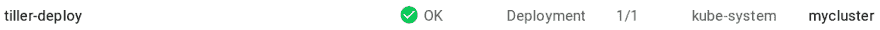

# 带无人机、Kubernetes 和头盔的 CI/CD-第 1 部分

> 原文：<https://dev.to/depado/cicd-with-drone-kubernetes-and-helm---part-1-4mdp>

这篇文章转自我的博客。[在这里找到原帖](https://blog.depado.eu/post/ci-cd-with-drone-kubernetes-and-helm-1)。

# 简介

持续集成和交付是困难的。这是每个人都同意的事实。但是现在我们有了所有这些奇妙的技术，问题主要是“我如何把这个和那个连接起来？”或者“我如何让这两个产品协同工作？”

嗯，对于这些问题，从来没有简单而通用的答案。在本系列文章中，我们将使用三种流行的产品，即 Kubernetes、Helm 和 Drone，逐步构建一个完整的持续集成和交付管道。

第一篇文章介绍了本系列中使用的各种技术。它面向对 Docker、容器如何工作以及 Kubernetes 的基础知识有所了解的初学者。如果您有一个正在运行的 k8s 集群和一个正在运行的 Drone 实例，您可以完全跳过它。

## 步骤

*   与 GKE 一起创建一个 Kubernetes 集群
*   为 Tiller 创建一个服务帐户
*   初始化舵
*   向 Helm 添加一个回购
*   在新 k8s 集群上部署无人机
*   在我们的新无人机实例上启用 HTTPS

## 涉及的技术

### 无人机

[无人机](https://drone.io/)是一个基于 Docker 构建的持续投放平台，用 Go 编写。Drone 使用一个简单的 YAML 配置文件(docker-compose 的超集)来定义和执行 docker 容器中的管道。

它与 Travis 的方法相同，将管道定义为存储库中的代码。最酷的特性是管道中的每一步都在 Docker 容器中执行。起初这看起来似乎违背直觉，但它实现了一个伟大的插件系统:你可能
使用的每个无人机插件都是一个 Docker 图像，无人机将在需要时拉出。你不需要像用 Jenkins 那样直接在 Drone 上安装任何东西。

在 Docker 内部运行的另一个好处是，无人机的[安装程序](http://docs.drone.io/installation/)真的很简单。但是我们不会把无人机安装在裸机服务器或
虚拟机上。在教程的后面会有更多的介绍。

### Kubernetes

> Kubernetes(通常风格化为 K8s)是一个开源的容器编排系统，用于自动化部署、扩展和管理容器化的应用程序，最初由 Google 设计，现在由 Cloud Native Computing Foundation 维护。它旨在提供一个“跨主机集群自动部署、扩展和操作应用程序容器的平台”。它与一系列容器工具一起工作，包括 Docker。 <cite>[维基百科](https://en.wikipedia.org/wiki/Kubernetes)</cite>

维基百科对 k8s 的总结相当不错。基本上，k8s 抽象了运行它的底层机器，并提供了一个我们可以部署应用程序的平台。它负责在
不同的节点上正确分发我们的容器，因此如果一个节点关闭或与网络断开，应用程序仍然可以访问，同时 k8s 会修复该节点或为我们提供一个新的节点。

我建议至少阅读本教程的 [Kubernetes 基础知识](https://kubernetes.io/docs/tutorials/kubernetes-basics/)。

### 掌舵

Helm 是 Kubernetes 的产品包经理。它允许我们在 Kubernetes 集群中创建、维护和部署应用程序。

基本上，如果你想在你的 Kubernetes 集群中安装一些东西，你可以查看是否有相应的图表。例如，我们将使用无人机图表来部署它。

Helm 允许您将应用程序部署到不同的名称空间，更改图像的标签，并在运行时覆盖您可以放入 Kubernetes 部署文件中的每个参数。这意味着您可以使用同一个图表在您的临时环境和生产环境中部署您的应用程序，只需在命令行或值文件中覆盖一些值。

在本文中，我们将看到如何使用预先存在的图表。在下一篇文章中，我们将看到如何从头开始创建一个。

## 免责声明

在本教程中，我们将使用 [Google Cloud Platform](https://cloud.google.com) ,因为它允许轻松创建 Kubernetes 集群，并且有一个私有的容器注册中心，我们稍后会用到。

# 群

如果您已经拥有一个 k8s 集群，并且 Kubernetes 版本高于 1.8，那么您可以跳过这一步。

在这一步中，我们将需要`gcloud`和`kubectl` CLI。查看如何[为你的操作系统安装谷歌云软件开发工具包](https://cloud.google.com/sdk/downloads)。

如前所述，本教程不是关于创建和维护 Kubernetes 集群的。因此，我们将使用[谷歌 Kubernetes 引擎](https://cloud.google.com/kubernetes-engine/)来创建我们的游乐场集群。创建它有两种选择:要么在 GCP 提供的 web 界面中，要么直接使用`gcloud`命令。在撰写本文时，谷歌提供的 k8s 的默认版本是`1.8.8`，但只要你在`1.8`之上，你就可以选择你想要的任何版本。*即使没有理由不选择最高稳定版本...*

选择`1.8`是因为在这个版本[中，RBAC](https://en.wikipedia.org/wiki/Role-based_access_control) 被默认激活，并且是默认的认证系统。

为了降低集群的成本，您可以修改机器类型，但尽量保持至少 3 个节点；这将允许零停机迁移到不同的机器类型，并升级 k8s 版本，如果你想保持这个集群活跃和运行。

要验证您的集群是否正在运行，您可以检查以下命令的输出:

```
$ gcloud container clusters list
NAME       LOCATION        MASTER_VERSION  MASTER_IP    MACHINE_TYPE   NODE_VERSION  NUM_NODES  STATUS
mycluster  europe-west1-b  1.10.2-gke.1    <master ip>  custom-1-2048  1.10.2-gke.1  3          RUNNING 
```

Enter fullscreen mode Exit fullscreen mode

您还应该得到我从这个代码片段中删除的`MASTER_IP`、`PROJECT`和`LOCATION`。从现在开始，在代码片段和命令行示例中，`$LOCATION`将指您的集群的位置，`$NAME`将指您的集群的名称，`$PROJECT`将指您的 GCP 项目。

一旦集群开始运行，您就可以发出以下命令来检索连接到集群的凭证:

```
$ gcloud container clusters get-credentials $NAME --zone $LOCATION --project $PROJECT
Fetching cluster endpoint and auth data.
kubeconfig entry generated for mycluster.
$ kubectl cluster-info
Kubernetes master is running at https://<master ip>
GLBCDefaultBackend is running at https://<master ip>/api/v1/namespaces/kube-system/services/default-http-backend/proxy
Heapster is running at https://<master ip>/api/v1/namespaces/kube-system/services/heapster/proxy
KubeDNS is running at https://<master ip>/api/v1/namespaces/kube-system/services/kube-dns/proxy
kubernetes-dashboard is running at https://<master ip>/api/v1/namespaces/kube-system/services/kubernetes-dashboard/proxy
Metrics-server is running at https://<master ip>/api/v1/namespaces/kube-system/services/metrics-server/proxy 
```

Enter fullscreen mode Exit fullscreen mode

现在`kubectl`被配置为在您的集群上运行。最后一个命令将打印出您需要知道的关于集群位置的所有信息。

# 舵柄

首先，我们需要`helm`命令。[安装说明](https://github.com/kubernetes/helm/blob/master/docs/install.md)见本页。

头盔实际上由两部分组成。Helm 本身是客户端，Tiller 是服务器。Tiller 需要安装在我们的 k8s 集群中，以便 Helm 可以使用它，但首先我们需要为 Tiller 提供一个**服务帐户**。Tiller 必须能够与我们的 k8s 集群进行交互，因此它需要能够创建部署、配置图、机密等。欢迎来到 **RBAC** 。

所以让我们创建一个名为`tiller-rbac-config.yaml`
的文件

```
--------
apiVersion: v1
kind: ServiceAccount
metadata:
  name: tiller
  namespace: kube-system

--------
apiVersion: rbac.authorization.k8s.io/v1beta1
kind: ClusterRoleBinding
metadata:
  name: tiller
roleRef:
  apiGroup: rbac.authorization.k8s.io
  kind: ClusterRole
  name: cluster-admin
subjects:
  - kind: ServiceAccount
    name: tiller
    namespace: kube-system 
```

Enter fullscreen mode Exit fullscreen mode

在这个 yaml 文件中，我们声明了一个名为 tiller 的 [ServiceAccount](https://kubernetes.io/docs/admin/authorization/rbac/#service-account-permissions) ，然后我们声明了一个 [ClusterRoleBinding](https://kubernetes.io/docs/admin/authorization/rbac/#rolebinding-and-clusterrolebinding) ，它将 tiller 服务帐户与集群管理授权关联起来。

现在我们可以使用刚刚创建的服务帐户部署 tiller，如下所示:

```
$ helm init --service-account tiller 
```

Enter fullscreen mode Exit fullscreen mode

[T2】](https://res.cloudinary.com/practicaldev/image/fetch/s--M9uRscKq--/c_limit%2Cf_auto%2Cfl_progressive%2Cq_auto%2Cw_880/https://blog.depado.eu/assets/kube-drone-helm/tiller-service.png)

请注意，以这种方式部署 tiller 不一定是好的做法。使用 RBAC，我们可以限制 Tiller 在集群中可以执行的操作以及它可以操作的名称空间。[参见本文档](https://github.com/kubernetes/helm/blob/master/docs/rbac.md)了解如何使用 RBAC 来限制或修改 k8s 集群中 Tiller 的行为。

这一步对于本系列的后续部分非常重要，因为我们稍后将使用这个服务帐户与来自 Drone 的 k8s 进行交互。

# 部署无人机

## 静态 IP

如果您有一个域名，并希望将一个子域与您的无人机实例相关联，您将必须在您的 Google Cloud 控制台中创建一个外部 IP 地址。给它起一个名字并记住这个名字，我们将在配置无人机图表之后使用它。

将此静态 IP 与您的域相关联(请记住，DNS 传播可能需要一些时间)。

对于本文来说，外部 IP 地址名称将是`drone-kube`，域将是`drone.myhost.io`。

## 整合

首先，我们需要为我们的无人机实例设置 Github 集成。看看[这个文档](http://docs.drone.io/install-for-github/)或者如果你使用另一个版本控制系统，查看无人机文档如何创建正确的集成。目前，无人机支持以下 VCS:

*   [GitHub](http://docs.drone.io/install-for-github/)
*   [GitLab](http://docs.drone.io/install-for-gitlab/)
*   [Gitea](http://docs.drone.io/install-for-gitea/)
*   [Gogs](http://docs.drone.io/install-for-gogs/)
*   [比特巴克云](http://docs.drone.io/install-for-bitbucket-cloud/)
*   [比特巴克服务器](http://docs.drone.io/install-for-bitbucket-server/)
*   [编码](http://docs.drone.io/install-for-coding/)

请记住，如果您没有使用 Github 集成，下一节中环境变量的变化需要匹配。

## 图表和配置

在谷歌上快速搜索后，我们可以看到无人机的[图表。它在 Helm 图表的`incubator`中，所以首先我们需要将回购添加到 Helm 中。](https://github.com/kubernetes/charts/tree/master/incubator/drone) 

```
$ helm repo add incubator https://kubernetes-charts-incubator.storage.googleapis.com/
$ helm repo update 
```

Enter fullscreen mode Exit fullscreen mode

现在完成了，我们可以看看这张图表的[配置](https://github.com/kubernetes/charts/tree/master/incubator/drone#configuration)部分。我们将创建一个`values.yaml`文件，其中包含我们的无人机实例正常工作所需的信息。

```
service:
  httpPort: 80
  nodePort: 32015
  type: NodePort
ingress:
  enabled: true
  annotations:
    kubernetes.io/ingress.class: "gce"
    kubernetes.io/ingress.global-static-ip-name: "drone-kube"
    kubernetes.io/ingress.allow-http: "true"
  hosts:
    - drone.myhost.io
server:
  host: "http://drone.myhost.io"
  env:
    DRONE_PROVIDER: "github"
    DRONE_OPEN: "false"
    DRONE_GITHUB: "true"
    DRONE_ADMIN: "me"
    DRONE_GITHUB_CLIENT: "the  github  client  secret  you  created  earlier"
    DRONE_GITHUB_SECRET: "same  thing  with  the  secret" 
```

Enter fullscreen mode Exit fullscreen mode

好吧！我们的静态 IP 与我们的域相关联。我们必须将这个保留 IP 的名称放入入口的注释中，这样它就知道应该绑定到哪个 IP。我们将使用 GCE 负载平衡器，由于我们没有 TLS 证书，我们将告诉 Ingress 可以接受 HTTP 连接。(请不要打我，我保证我们以后再看如何启用 TLS。)

我们还声明了 Drone 本身用来与 VCS 通信的所有变量，在本例中是 Github。

就是这样。我们准备好了。让我们启动头盔！

```
$ helm install --name mydrone -f values.yaml incubator/drone 
```

Enter fullscreen mode Exit fullscreen mode

假设您的 DNS 记录现在已经传播，您应该能够使用`drone.myhost.io` URL 访问您的 Drone 实例！

# TLS

## 部署证书管理器

过去，我们有 [kube-lego](https://github.com/jetstack/kube-lego) ，它现在被弃用，取而代之的是[证书管理器](https://github.com/jetstack/cert-manager/)。

[文档](http://cert-manager.readthedocs.io/en/latest/getting-started/2-installing.html)指出安装证书管理器就像运行这个命令一样简单:

```
$ helm install --name cert-manager --namespace kube-system stable/cert-manager 
```

Enter fullscreen mode Exit fullscreen mode

## 创建 ACME 发行者

Cert-manager 由几个组件组成。它使用所谓的[自定义资源定义](https://kubernetes.io/docs/tasks/access-kubernetes-api/extend-api-custom-resource-definitions/)，并允许使用`kubectl`来控制证书、发行者等等。

一个[发行者](https://cert-manager.readthedocs.io/en/latest/reference/issuers.html)或[集群发行者](https://cert-manager.readthedocs.io/en/latest/reference/clusterissuers.html)代表一个可以从中获得 x509 证书的认证机构。

颁发者和 ClusterIssuer 之间的区别在于，颁发者只能在自己的命名空间中管理证书，并且只能从该命名空间中被调用。ClusterIssuer 不依赖于特定的名称空间。

我们将创建一个 Let'sEncrypt ClusterIssuer，以便为我们的无人机实例和未来的部署颁发证书。让我们创建一个名为`acme-issuer.yaml` :
的文件

```
apiVersion: certmanager.k8s.io/v1alpha1
kind: ClusterIssuer
metadata:
  name: letsencrypt
spec:
  acme:
    server: https://acme-v01.api.letsencrypt.org/directory
    email: your.email.address@gmail.com
    privateKeySecretRef:
      name: letsencrypt-production
    http01: {} 
```

Enter fullscreen mode Exit fullscreen mode

在这里，我们创建启用了 HTTP 质询的 ClusterIssuer。我们将在本文中只看到这个挑战，参考[文档](https://cert-manager.readthedocs.io/en/latest/)了解更多关于挑战的信息。**记得更改您的发卡机构的相关电子邮件地址！**

```
$ kubectl apply -f acme-issuer.yaml 
```

Enter fullscreen mode Exit fullscreen mode

我们还可以使用 Let'sEncrypt staging 环境创建一个 ClusterIssuer，该环境对请求中的错误更加宽容。如果您想在不发布真实证书的情况下进行测试，请使用这个。创建一个新文件`acme-staging-issuer.yaml` :

```
apiVersion: certmanager.k8s.io/v1alpha1
kind: ClusterIssuer
metadata:
  name: letsencrypt-staging
spec:
  acme:
    server: https://acme-staging.api.letsencrypt.org/directory
    email: your.email.address@gmail.com
    privateKeySecretRef:
      name: letsencrypt-staging
    http01: {} 
```

Enter fullscreen mode Exit fullscreen mode

```
$ kubectl apply -f acme-staging-issuer.yaml 
```

Enter fullscreen mode Exit fullscreen mode

## 证书

现在我们有了使用 Let'sEncrypt 产品的 ClusterIssuer，我们可以创建一个清单来解决 ACME 挑战。首先，我们需要无人机图表创建的入口名称:

```
$ kubectl get ingress
NAME            HOSTS             ADDRESS       PORTS     AGE
mydrone-drone   drone.myhost.io   xx.xx.xx.xx   80        1h 
```

Enter fullscreen mode Exit fullscreen mode

现在我们有了这些信息，让我们创建`drone-cert.yaml`文件:

```
apiVersion: certmanager.k8s.io/v1alpha1
kind: Certificate
metadata:
  name: mydrone-drone
  namespace: default
spec:
  secretName: mydrone-drone-tls
  issuerRef:
    name: letsencrypt # This is where you put the name of your issuer
    kind: ClusterIssuer
  commonName: drone.myhost.io # Used for SAN
  dnsNames:
  - drone.myhost.io
  acme:
    config:
    - http01:
        ingress: mydrone-drone # The name of your ingress
      domains:
      - drone.myhost.io 
```

Enter fullscreen mode Exit fullscreen mode

这里有很多领域需要说明。其中大多数都非常明确，可以在关于 HTTP 验证的文档中找到[。](http://cert-manager.readthedocs.io/en/latest/tutorials/acme/http-validation.html)

这里重要的是:

*   `spec.secretName`:存储证书的秘密。通常这将以`-tls`为前缀，这样就不会与其他秘密混淆。
*   `spec.issuerRef.name`:我们之前为 ClusterIssuer 定义的命名
*   `spec.issuerRef.kind`:指定发布者为 ClusterIssuer
*   `spec.acme.config.http01.ingress`:无人机部署的入口名称

现在让我们应用这个:

```
$ kubectl apply -f drone-cert.yaml
$ kubectl get certificate
NAME            AGE
mydrone-drone   7m
$ kubectl describe certificate mydrone-drone
...
Events:
  Type     Reason                 Age              From                     Message
  ----     ------                 ----             ----                     -------
  Warning  ErrorCheckCertificate  33s              cert-manager-controller  Error checking existing TLS certificate: secret "mydrone-drone-tls" not found
  Normal   PrepareCertificate     33s              cert-manager-controller  Preparing certificate with issuer
  Normal   PresentChallenge       33s              cert-manager-controller  Presenting http-01 challenge for domain drone.myhost.io
  Normal   SelfCheck              32s              cert-manager-controller  Performing self-check for domain drone.myhost.io
  Normal   ObtainAuthorization    6s               cert-manager-controller  Obtained authorization for domain drone.myhost.io
  Normal   IssueCertificate       6s               cert-manager-controller  Issuing certificate...
  Normal   CertificateIssued      5s               cert-manager-controller  Certificate issued successfully 
```

Enter fullscreen mode Exit fullscreen mode

我们需要等待最后一行出现，即`CertificateIssued`事件，然后才能更新我们的 Ingress '值。这可能需要一些时间，请耐心等待，因为 Google 云负载平衡器可能需要几分钟来更新。

## 升级无人机的数值

现在我们有了包含适当 TLS 证书的秘密，我们可以回到我们之前使用的`values.yaml`文件，使用它的图表来部署 Drone，并将 TLS 秘密添加到入口部分！我们还将在我们的入口上禁用 HTTP(只服务 HTTPS)，并修改我们的`server.host`值以反映 HTTPS 的变化。

```
service:
  httpPort: 80
  nodePort: 32015
  type: NodePort
ingress:
  enabled: true
  annotations:
    kubernetes.io/ingress.class: "gce"
    kubernetes.io/ingress.global-static-ip-name: "drone-kube"
    kubernetes.io/ingress.allow-http: "false" # ← Let's disable HTTP and allow only HTTPS
  hosts:
    - drone.myhost.io
  # Add this ↓
  tls:
    - hosts:
      - drone.myhost.io
      secretName: mydrone-drone-tls
  # End
server:
  host: "https://drone.myhost.io" # ← Modify this too 
  env:
    DRONE_PROVIDER: "github"
    DRONE_OPEN: "false"
    DRONE_GITHUB: "true"
    DRONE_ADMIN: "me"
    DRONE_GITHUB_CLIENT: "the  github  client  secret  you  created  earlier"
    DRONE_GITHUB_SECRET: "same  thing  with  the  secret" 
```

Enter fullscreen mode Exit fullscreen mode

我们只需要升级我们的部署:

```
$ helm upgrade mydrone -f values.yaml incubator/drone 
```

Enter fullscreen mode Exit fullscreen mode

您还需要修改您的 Github 应用程序。

# 结论

在本文中，我们看到了如何在 GKE 上部署 Kubernetes 集群，如何创建一个具有适当集群角色绑定的服务帐户来部署 Tiller，如何使用 helm 以及如何以无人机为例部署图表。

在下一篇文章中，我们将看到如何为一个 Go 项目编写一个高质量的管道，以及如何推进到 Google Cloud Registry。

# 感谢

感谢 [@shirley_leu](https://twitter.com/shirley_leu) 校对这篇文章，纠正我的英文错误！

这篇文章转自我的博客。[在这里找到原帖](https://blog.depado.eu/post/ci-cd-with-drone-kubernetes-and-helm-1)。