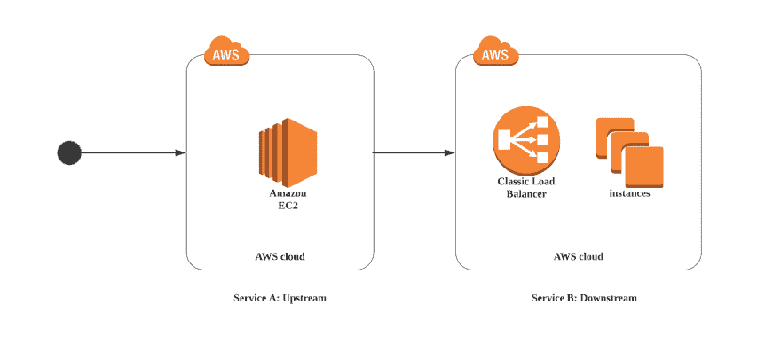
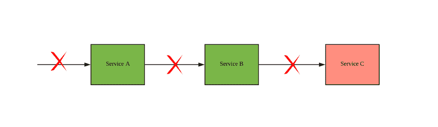
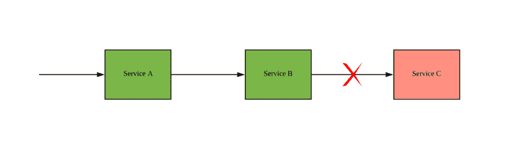
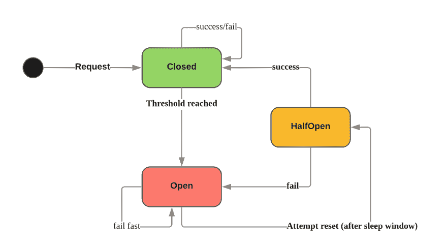

# 断路器并重试

> 原文：<https://dev.to/trongdan_tran/circuit-breaker-and-retry-2klg>

原文章[此处](https://medium.com/@trongdan_tran/circuit-breaker-and-retry-64830e71d0f6)

今天，我们来讨论微服务架构中的弹性。通常，服务可以通过同步或异步的方式相互通信。我们假设将一个大的整体系统分成更小的块将有助于分离服务的责任。实际上，管理服务间的通信可能更加困难。你可能听说过两个众所周知的概念:断路器和重试。

# 断路器

[T2】](https://res.cloudinary.com/practicaldev/image/fetch/s--6lGX08vW--/c_limit%2Cf_auto%2Cfl_progressive%2Cq_auto%2Cw_880/https://thepracticaldev.s3.amazonaws.com/i/dciztnhl32z86lt5pxmt.png)

想象一个简单的场景，来自用户的请求调用服务 A，然后调用另一个服务。我们可以调用 B 作为 A 的依赖服务或下游服务。到达服务 B 的请求在传播到不同的实例之前将通过负载平衡器。

后端服务中的系统故障可能由于多种原因而发生。例如，缓慢的数据库、网络故障或内存争用。在这种情况下，如果对服务 A 的响应是超时或服务器错误，它可能会让我们的用户再试一次。在混乱的情况下，我们可以做些什么来保护下游服务。

[T2】](https://res.cloudinary.com/practicaldev/image/fetch/s--8ROaID23--/c_limit%2Cf_auto%2Cfl_progressive%2Cq_auto%2Cw_880/https://thepracticaldev.s3.amazonaws.com/i/addeibo14m0dpdf5wmq2.png)

断路器提供对故障率和资源的更多控制。断路器的设计可以快速优雅地处理错误，无需等待 TCP 连接超时。这种故障快速机制将保护下游层。该机制最重要的部分是我们立即向调用服务返回一些响应。没有被挂起的请求填满的线程池，没有超时，并且有望减少令人烦恼的最终消费者。同时，这也为下游服务的恢复提供了足够的时间。很难完全防止故障，但是可以减少故障造成的损失。

[T2】](https://res.cloudinary.com/practicaldev/image/fetch/s--MdcktJw9--/c_limit%2Cf_auto%2Cfl_progressive%2Cq_auto%2Cw_880/https://thepracticaldev.s3.amazonaws.com/i/coh3am1ph43ylqc1z1sz.png)

通过使用 hystrix 断路器，我们可以在上游服务中增加后退行为。例如，服务 B 可以访问副本服务或缓存，而不是调用服务 c。引入这种回退方法需要集成测试，因为我们可能不会在愉快的道路上遇到这种网络模式。

## 状态

[T2】](https://res.cloudinary.com/practicaldev/image/fetch/s--uDw1iQTA--/c_limit%2Cf_auto%2Cfl_progressive%2Cq_auto%2Cw_880/https://thepracticaldev.s3.amazonaws.com/i/n8gg07uqgxnbmu8a0vvf.png)

断路器有 3 种主要状态:

*   Closed:允许请求通过的默认状态。如果请求成功/失败但低于阈值，则状态保持不变。可能的错误有*最大并发*和*超时*错误。
*   打开:所有请求将被标记为失败，错误为*电路打开*。这是一种故障快速机制，无需等待超时时间结束。
*   半开:周期性地，请求检查系统的尝试已经恢复。如果是，断路器将切换到*闭合*状态或保持在*断开状态*。

## 断路器理论上

以下是控制电路设置的 5 个主要参数。