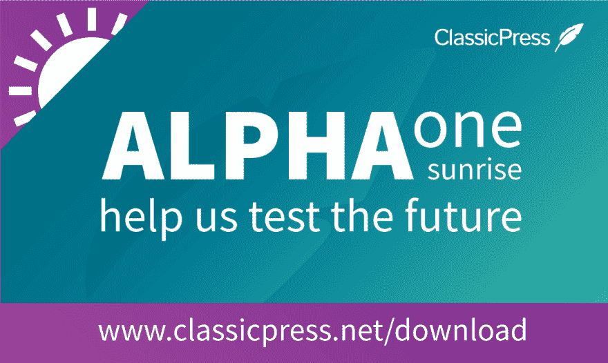

# ClassicPress 发布- alpha 版本准备测试

> 原文：<https://dev.to/scotty_bowler/classicpress-launches---alpha-version-ready-for-testing-594k>

[T2】](https://res.cloudinary.com/practicaldev/image/fetch/s--FatJDJm8--/c_limit%2Cf_auto%2Cfl_progressive%2Cq_auto%2Cw_880/https://thepracticaldev.s3.amazonaws.com/i/14nhutn6e5t0ilrn0dpp.png)

# ClassicPress 来了！

经过数十名志愿者数百小时的紧张工作，我非常兴奋地宣布 ClassicPress 的第一个 alpha 版本，代号为 Sunrise。

ClassicPress 是 WordPress 的一个以商业为中心的分支，功能强大，用途广泛，可预测。

这是为版本 1 做准备的巨大进步(发布日期将在月底宣布)。为了确保我们发布 ClassicPress 的生产就绪版本，我们需要确保所有东西都经过了彻底的测试。

可以帮忙测试一下 ClassicPress 吗？

参观 https://www.classicpress.net/download/开始吧