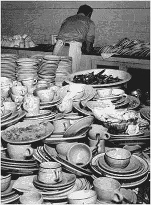
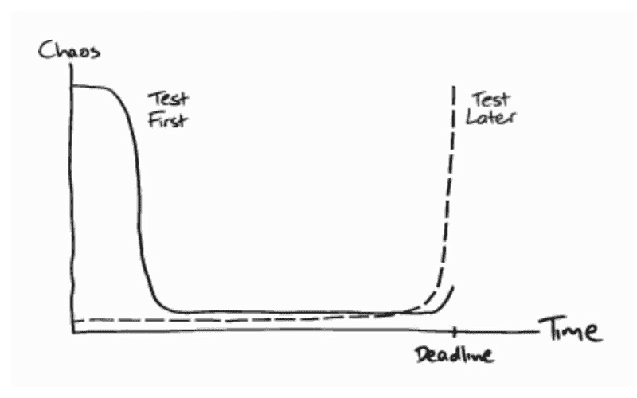

# 干净的代码，废话还是常识？

> 原文：<https://dev.to/fefas/clean-code-bullshit-or-common-sense-3lal>

## 普通故事

鲍勃开始在一家新公司工作。很快他意识到他的新工作将与一个非常古老和复杂的遗留系统有很大关系。这是一个缺乏测试的代码。既没有任何文件。没有关于底层工作流的解释，这些工作流应该代表为解决某一天被一些利益相关者询问的业务需求而做出的决策，然后被添加到 backlog 中，被实现和交付。然而，那个涉众和最初的开发人员一样，已经不在公司了。

应该被称为域的东西总是与基础设施密切相关…许多类有一千多行…方法有如此多的 if 语句创建了如此多的路径…10 层深的名称空间…大量使用类扩展…

几乎每个任务都是为了解决一个 bug。其中一些是很久以前创建的，另一些是最近通过新的修复程序引入的。试图调查代码历史以找出一些变化的原因以及它们如何与代码的其他部分相关联甚至没有帮助，因为提交没有被很好地组织并且具有糟糕的消息…

为了改变一个小的行为，他不得不花几个小时调试并试图理解那里写的东西。经过一整天的工作，结果有时会改变或增加 10 行。大部分新代码都是一个 if 语句，决定更新一些值，因为它是错误的，不知何故导致了一个 bug…类没有验证自己…到处都是 getters 和 setters

*他遇到了糟糕的代码……*

[T2】](https://res.cloudinary.com/practicaldev/image/fetch/s--U37JzymJ--/c_limit%2Cf_auto%2Cfl_progressive%2Cq_auto%2Cw_880/https://blog.fefas.net/asseimg/2018-04-08-clean-code-bullshit-or-common-sense-washing-bunch-of-dirty-dishes.jpg%3Fversion%3Dcc840fd)

## 为什么一般会这样？

让我们开始澄清一些事情:请不要误会我！我不想简单地说代码是一个$#@&也不想责怪开发者或公司，因为它不会把我们引向任何东西。这是真的，我们确实有很多不专业的开发人员，但仅仅责备不是重点，我们必须考虑更广泛的场景才能更深入。

那么，为什么会这样呢？为什么我们总是涉水？

有许多因素促成了它。让我们想象一个公司在成长，雇佣更多的员工来更快地成长，新的开发人员进来，老的开发人员离开，动态的业务不断地改变需求，IT 和业务之间的沟通有差距，开发人员如此专注于实现 sprint 承诺，这种匆忙总是给项目中的每个人带来压力，没有人关心了解用户-产品关系，没有人关心编写测试， 开发人员不能设计，因为它似乎不能提供短期价值，TDD 是哲学，公司不投资时间来培训其团队，最有价值的实践是解决今天的问题，英雄文化兴起，我们总是需要更多的日志来试图实现正在发生的事情，我们需要领导市场…

> 我可以把它总结为匆忙和不学习的结果。

在这种情况下，输出的坏代码至少是全面的。我们的世界有时并不是一个好地方，我们必须面对这个现实。

## 那还有什么意义呢？

我带你们来这里不是为了给出一个*简单的答案*，因为它根本不存在。

我写这篇文章的目的是，当开发人员抱怨糟糕的代码时，回答那些有现成答案的人:*看……这个系统在工作，为公司赚钱。这才是最重要的，开发人员是被雇佣来维护它的。*

好吧…我明白了，我同意“最有价值的东西是一个运行的软件”。这听起来很神奇，可以安慰我们这些开发者。然而，我们仍然有一个大问题。

真的是一个跑步软件有价值吗？

当软件变成维护问题而不是推动业务时，一个高度依赖技术运行并希望创新的公司将永远无法实现其目标。回到 Bob 的情况，添加或更改应用程序的行为几乎是不可能的。在不破坏其他任何东西的情况下，如何可能交付一个改变业务工作流的新特性？风险太高，未知的副作用可能是灾难性的，这样，该公司试图生存而不是创新…现在只是蛮力…竞争正在那里崛起。

对我来说，在这种情况下很难看到产生的价值。

> 今天软件赚钱不代表未来软件还赚钱。

糟糕的代码会搞垮老牌公司，让创业公司早早夭折……**不是因为开发者不在前线，我们就不能成为故障原因**。

干净的代码，也就是关心代码，也就是测试第一，是实现软件业务真正增长的方法。让我们学习，让我们改进我们的工艺，让我们学习如何管理匆忙！

> 作为开发人员，编写干净的代码是我们的责任…这不是为了更快地实现明天的目标，而是为了更快更安全地实现明年的目标…

你有没有问过自己，你的经理对你有什么期望？你认为是短期结果还是长期结果？

我知道，我知道…完美是不可企及的…有时我们确实需要处理紧急的问题。然而，我的观点是，我们不应该让自己遵从那些糟糕的代码，只是跟着它走…

## 我的经历说明了什么？

我确实有一个真实的案例，我们在开始时花了更多的时间来实现良好的奇偶校验开发-生产环境，为项目的每个运行实例完全隔离数据库，为整个应用程序进行端到端测试，为每个代码库进行功能和单元测试，自动化部署，六边形架构…嗯…许多主题对许多人来说是不可及的和富有哲理的…对他们来说只是胡扯…

[T2】](https://res.cloudinary.com/practicaldev/image/fetch/s--8yGmBjDz--/c_limit%2Cf_auto%2Cfl_progressive%2Cq_auto%2Cw_880/https://blog.fefas.net/asseimg/2018-04-08-clean-code-bullshit-or-common-sense-tdd-chaos-vs-time-graph.jpg%3Fversion%3Dcc840fd)

这并不容易…这很有挑战性。然而，我们工作的结果变成了一个几乎零错误率的产品。当发现一个新的 bug 时，就要编写一个新的测试场景。部署快速、安全，并且可以随时执行。新的特性很容易添加，旧的特性很容易改变……这就是 TDD 的好处……这就是敏捷团队！

> 我们应该与不良代码作斗争，并始终尽力而为。只有一个错误:不去尝试…

以下是一些参考资料:

*   罗伯特·马丁，2008 年。[干净代码:敏捷软件技术手册](https://www.amazon.com/Clean-Code-Handbook-Software-Craftsmanship/dp/0132350882)
*   纳特·普莱斯；史蒂夫·弗里曼，2009。[在测试的引导下开发面向对象的软件](https://www.amazon.com/Growing-Object-Oriented-Software-Guided-Tests/dp/0321503627)