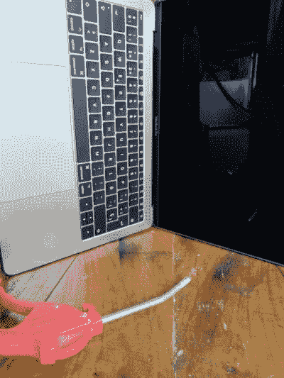

# 清洁我们的 Macbook

> 原文：<https://dev.to/ab0nilla/cleaning-my-macbook-584n>

大家好，今天我清洗了我的笔记本电脑、服务器和网络设备，并与大家分享了我清洗 macbook 的步骤。

没有编程的一天。清理你的设备，清理你的头脑——我。
第一步:你的笔记本电脑

要求第 1 部分:
衣服和压缩空气(我有压缩机，因为我家里有服务器、交换机和路由器、汽车发动机等等)。

[T8】](https://res.cloudinary.com/practicaldev/image/fetch/s--phwYFGM9--/c_limit%2Cf_auto%2Cfl_progressive%2Cq_auto%2Cw_880/https://thepracticaldev.s3.amazonaws.com/i/d2bv9fk00znf1dklesrb.jpg)

要求第 2 部分:
硅胶用于机身、键盘和触摸屏。和你视网膜的水晶清洁剂(笔记本电脑，不适合你)。

商场里有两种常见的硅树脂，脂肪型和干性，脂肪型是清洗电脑的一个可怕的选择，触摸它的感觉很难看。

我的笔记本电脑:(

清洁 1:
在所有笔记本电脑上使用空气压缩。

[苹果官方清洁 macbook pro 2017 键盘指南](https://support.apple.com/en-us/HT205662)

清洁 2:
注意！！:“不要使用含有过氧化氢的喷雾、溶剂、研磨剂或清洁剂，否则可能会损坏漆面”。[苹果官方清洁 macbook 指南](https://support.apple.com/en-us/HT204172)

也许你有一个粘性或胶粘颗粒，用布和糖来清除。
用“微尘”披上，因为去掉了大颗粒，一点力气，又加了很多糖，算是糖；如果你不吃糖，你的笔记本会被划伤。

清洁 3:

使用硅胶

立正！！:“不要使用含有过氧化氢的喷雾、溶剂、研磨剂或清洁剂，否则可能会损坏漆面”。[苹果官方清洁 macbook 指南](https://support.apple.com/en-us/HT204172)

清洁机身、键盘和触摸板；DONT 用这个在你的屏幕上！！！
[T3】](https://res.cloudinary.com/practicaldev/image/fetch/s--Qw4IGAFF--/c_limit%2Cf_auto%2Cfl_progressive%2Cq_auto%2Cw_880/https://thepracticaldev.s3.amazonaws.com/i/eydrfg4cdz98tzwgeni6.jpg)

清洁 4:
用无绒布清洁屏幕。“避免砂布、毛巾、纸巾和类似可能造成损坏的物品”[苹果官方指南清洁 macbook pro 2017 键盘](https://support.apple.com/en-us/HT205662)
再次强调，要糖，糖，macbook 需要糖。

结果:

[T2】](https://res.cloudinary.com/practicaldev/image/fetch/s--EQcho1xH--/c_limit%2Cf_auto%2Cfl_progressive%2Cq_auto%2Cw_880/https://thepracticaldev.s3.amazonaws.com/i/ldv1b600bkenewo8xcgk.jpg)

最后
使用你的外围设备，去公园，在网飞看电影，读你的书，让硅胶生效。如果你在使用键盘时涂上“硅胶”，会出现斑点，这种斑点不是永久性的，但你需要重复“清洁 2”步骤。

清洁愉快。

PD:我的英语不好