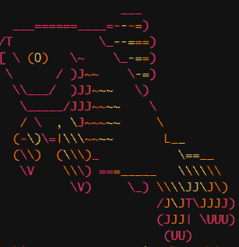
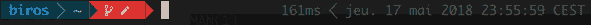
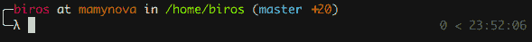
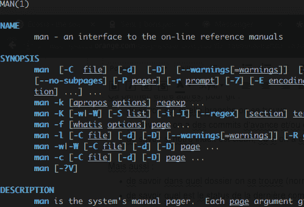
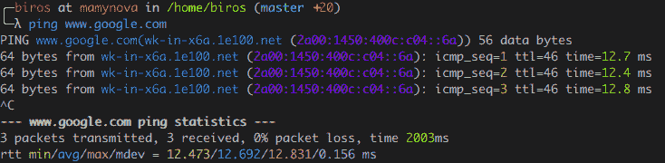
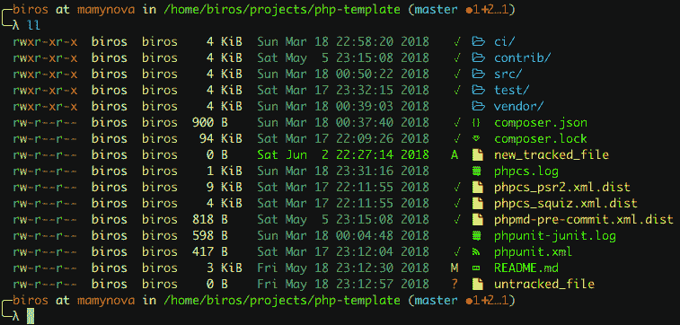
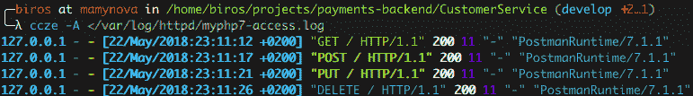
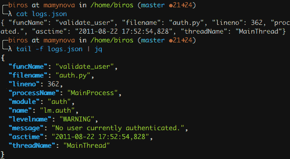

# CLI Love Inside

> 原文：<https://dev.to/biros/cli-love-inside-4lgl>

[T2】](https://res.cloudinary.com/practicaldev/image/fetch/s--opYGyfHN--/c_limit%2Cf_auto%2Cfl_progressive%2Cq_auto%2Cw_880/https://thepracticaldev.s3.amazonaws.com/i/9oidjshiaqgz6rkp4dac.png)

> 命令行是一个强大的工具，但不幸的是，我们大多数人都放弃了它。
> 
> 这篇文章的目标是让你们中的一些人适应 CLI ( *命令行界面*)，不管你是不是开发人员。

编码时，我们发现自己面临这样的选择:IDE 还是文本编辑器+ CLI？

现代 IDE 嵌入了(几乎)所有必需的开发工具:代码编辑、语法突出显示、自动格式化、版本控制、编译、调试，...甚至是运行时环境！

因此，为什么选择一个简单的文本编辑器呢？

就我个人而言，我做出这个选择是因为我宁愿每个任务使用一个工具，而不是每个任务都使用一个工具。

我更喜欢学习掌握每个工具，可能比在 IDE 中更深入，即使这需要更多的时间，而不是让 IDE 为我做所有的事情，并在出现问题时卡住。

这看起来似乎很有哲理，但是在 IDE 中，我们有时可能会觉得受到所提议功能的约束和限制，而在 CLI 中，有大量的工具、脚本和框架可以用于许多用例、许多环境和许多语言...Unix 的强大功能允许所有这些命令的互操作性。

当然，如果你在 Windows 下，你会遇到一些麻烦，因为终端模拟器有其局限性，但如果你被 CLI 说服，你会冒险切换到 Linux(或者如果你在 Windows 10 下，可能只使用 WSL:)。

## 🐟鱼壳

鱼外壳(或“鱼”)是一个面向用户交互的外壳，与更面向脚本的 **Bash** 相反。因此，它是日常交互使用的一个很好的选择。

它包括许多命令和工具的原生语法高亮显示，自动完成也是原生的。

Zsh 是这种用例的另一个可靠的替代方案。

下面是一个用 **git** 自动完成的例子:

[T2】](https://res.cloudinary.com/practicaldev/image/fetch/s--rJW_ZUmG--/c_limit%2Cf_auto%2Cfl_progressive%2Cq_66%2Cw_880/http://www.imgurupload.cimg/2018/08/15/fish_autocompletione460c49118e7ac47.gif)

通过输入`git`，然后`<tab>`， **fish** 提出 **git** 命令列表(`checkout`，`commit`，`log`，...).通过按几次`<tab>`，我们可以浏览命令，直到我们找到想要的命令，然后我们只需点击`<enter>`进行验证(例如`git checkout`，这里 **fish** 展示了它的所有魔力:它能够自动完成你的 repo 的 git 分支列表！当然，除了 git 之外，它还可以与许多其他工具一起工作。

两个框架允许增强鱼的特性: [oh-my-fish](https://github.com/oh-my-fish/oh-my-fish) 和[渔夫](https://github.com/fisherman/fisherman)。

它们都允许为提示和插件安装主题。

### 💲提示

乍一看，定制他的提示符似乎没什么用，但是如果 CLI 是你的主 UI，那么它就变成强制的了。

除了别的以外，它还允许知道:

*   你在哪一个分支
*   如果您有向/从遥控器推/拉的提交
*   如果您的索引干净与否，如果您有未提交或未跟踪的文件
*   ...

而且:

*   你在哪个文件夹里
*   最后一个命令的状态是什么
*   最后一个命令的响应时间
*   ...

有几十种提示可供选择，因此每个人都可以根据自己的喜好进行选择。我这边选了两个: [bobthefish](https://github.com/oh-my-fish/theme-bobthefish) 和 [neolambda](https://github.com/ipatch/theme-neolambda) ，可以用 **oh-my-fish** : `omf install bobthefish`安装。

第一个是高度可视化的，基于[电力线](https://github.com/powerline/powerline)，这是 **Vim** 的状态线，包括许多图案和符号，使其更加*用户友好*:

[T2】](https://res.cloudinary.com/practicaldev/image/fetch/s--13CgTaIl--/c_limit%2Cf_auto%2Cfl_progressive%2Cq_auto%2Cw_880/https://thepracticaldev.s3.amazonaws.com/i/hbszkvtuiywwt2ofu1e1.png)

第二个更时尚，功能更少，但是很有趣。

[T2】](https://res.cloudinary.com/practicaldev/image/fetch/s--GuY8CLiQ--/c_limit%2Cf_auto%2Cfl_progressive%2Cq_auto%2Cw_880/https://thepracticaldev.s3.amazonaws.com/i/e7lg5uvjqpt11jqbkke9.png)

除了提示之外，许多插件可以增强用户体验，特别是:

*   **colorman** 为手册页(`omf install colorman`)添加了语法高亮显示

    [T2】](https://res.cloudinary.com/practicaldev/image/fetch/s--jD0LHkVd--/c_limit%2Cf_auto%2Cfl_progressive%2Cq_auto%2Cw_880/https://thepracticaldev.s3.amazonaws.com/i/n2mmy1y4saihsqr63uo9.png)

*   [grc](https://github.com/oh-my-fish/plugin-grc) ，为很多 Unix 命令增加了语法高亮: **tail** ， **ping** ， **cat** ， **ps** ， **df** ，...(安装它:`fisher grc`)

    *   使用 **ping** 的示例:

    [T2】](https://res.cloudinary.com/practicaldev/image/fetch/s--XvqEXRSy--/c_limit%2Cf_auto%2Cfl_progressive%2Cq_auto%2Cw_880/https://thepracticaldev.s3.amazonaws.com/i/61s797gefnhew4aljs4p.png)

*   pj 是一个插件，可以快速地从一个项目切换到另一个项目，无论是在你的终端还是在你的编辑器(`omf install pj`)

*   [g2](https://github.com/fisherman/g2) 是一个包装器，用来简化 **git** 的用法。

### 💄拉皮条我的终端！

*   [色彩](https://github.com/athityakumar/colorls)(`gem install colorls`)——这个`ls`包装真的是*必备的*。它给 **stdout** 上色；它使用颜色强度来强调当前目录的文件的修改日期；它使得文件大小*可读*；此外，它还显示当前文件/文件夹的 **git** 状态！

    [T2】](https://res.cloudinary.com/practicaldev/image/fetch/s--Iyy9usGx--/c_limit%2Cf_auto%2Cfl_progressive%2Cq_auto%2Cw_880/https://thepracticaldev.s3.amazonaws.com/i/r4vltr66ur6uvt61a6oo.png)

### 🌈给我的原木上色！

如果您和我一样，是一名开发人员或 devops 工程师，那么可视化日志就是您工作中的一项经常性任务，拥有良好的工具对于提高工作效率来说是必不可少的。

现代的 IDE 不适合查看日志，因为它们已经被您的源文件过载了，而且，它们巨大的重量可能会对您的编辑器的性能产生重大影响。当文件的重量超过 10Mb 时，这就是我在 Atom 中遇到的情况。

解决方案:使用您的终端跟踪日志，同时受益于可用的工具来自动套用格式，启用语法突出显示和执行搜索。

我根据日志类型使用两种不同的工具:

*   **ccze** 为传统日志( **Apache** ， **syslog** ， **php** ，...)

    [T2】](https://res.cloudinary.com/practicaldev/image/fetch/s--0fgWNSHI--/c_limit%2Cf_auto%2Cfl_progressive%2Cq_auto%2Cw_880/https://thepracticaldev.s3.amazonaws.com/i/s0sm668b1y0cjvwki27m.png)

*   JSON 日志的 jq

    [T2】](https://res.cloudinary.com/practicaldev/image/fetch/s--_r0o0X4w--/c_limit%2Cf_auto%2Cfl_progressive%2Cq_auto%2Cw_880/https://thepracticaldev.s3.amazonaws.com/i/8xusizqcb3y2ozqicsx9.png)

jq 的好处在于，在 JSON 语法突出显示的基础上，它自动格式化你的日志以方便阅读。因此，如果您有 ELK 的一行压缩 JSON 日志或任何其他数据分析堆栈，它将允许您*解包*您的日志，并使它们*人类可读*。

jq 是一个更强大的工具，应该有自己的文章，因为它实际上是一个 JSON 解析器，有自己的查询描述语言，就像 XML 的 **xpath** 一样，但是具有 JSON 的简单性。

因此，通过在每个日志文件的末尾添加一个专门的术语`tail -f`，并根据类型将 stdout 发送到 **jq** 或 **ccze** ，您将可以快速访问您需要的信息，并以优雅的方式进行格式化。

## 👾其他出色的 CLI 工具

*   [ccat](https://github.com/jingweno/ccat) :针对**猫**的语法高亮显示
*   [tig](https://github.com/jonas/tig) :允许增强许多已知 **git** 命令(如`git log | tig`)的输出
*   [howdoi](https://github.com/gleitz/howdoi) :如果你想知道如何用 PHP 格式化日期，那么只需输入`howdoi format date php`
*   [htop](https://hisham.hm/htop/) :显示当前进程列表
*   [眼色](https://github.com/nicolargo/glances) ( `pip install glances`):你的电脑的监督控制台(进程，RAM，网络，I/O，捕获器，...)
*   [clog](https://github.com/clog-tool/clog-cli) ( `cargo install clog`):从你的 **git** repo 的元数据生成变更日志
*   谷歌人:谷歌命令行界面
*   [懒鬼](https://github.com/TidalLabs/Slacker) / [重要峰](https://github.com/matterhorn-chat/matterhorn) : CLI 分别为**懈怠**和**重要峰**
*   [嘟嘟](https://github.com/ihabunek/toot)(`pip install toot`)**乳齿象**的 CLI
*   [dockly](https://github.com/lirantal/dockly) ( `npm install -g dockly`):从你的任期内监控你的集装箱和 **Docker** 图像
*   [神童](http://wayneashleyberry.github.io/wunderline/) ( `npm install -g wunderline`):神童**的 CLI**
*   [纽曼](https://github.com/postmanlabs/newman) ( `npm install -g newman`):你想把**邮差**整合到你的 CI/CD 管道里？那么**纽曼**就是为你打造的！
*   [ttyrec](https://github.com/mjording/ttyrec) / [ttygif](https://github.com/icholy/ttygif) :允许从一个 shell 会话中创建动画 gif，以包含在一篇博文中(例如，这就是我在本文中使用的)

> 对于上面引用的每个命令/工具，我将安装它的命令放在括号中。如果没有的话，你可以在你的软件包管理器中或者在网上找到它。
> 
> 这些命令大多需要第三方包管理器，如 **pip** (python)、 **npm** (Node.js)、 **gem** (Ruby)或 **cargo** (Rust)。

请随意评论这篇文章来分享你自己的 CLI！