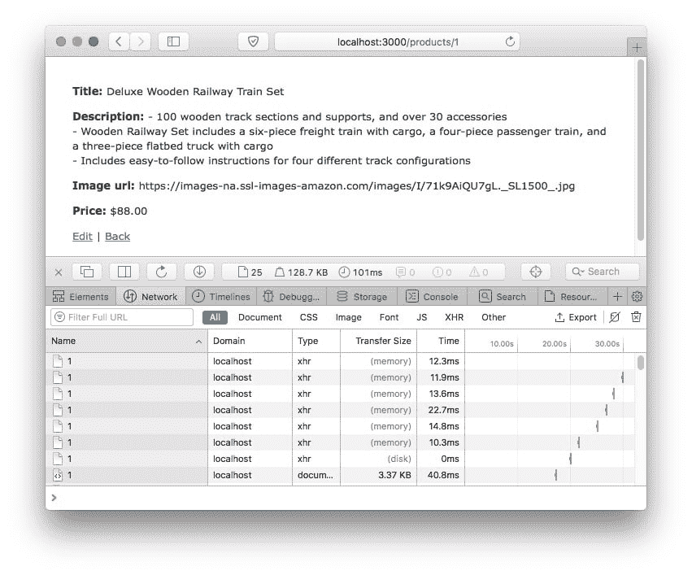

# Rails 中的客户端缓存:条件 GET 请求

> 原文：<https://dev.to/appsignal/client-side-caching-in-rails-conditional-get-requests-ck5>

除了[俄罗斯娃娃缓存](https://blog.appsignal.com/2018/04/03/russian-doll-caching-in-rails.html)之外，还有更多技术可以提高 Rails 应用的性能。这一次我们将关注 Rails 内置的条件 GET 支持，它允许您将呈现的页面存储在用户的浏览器缓存中。

## Etag 和 Last-Modified 头

当您的浏览器对您的 Rails 应用程序中的页面执行 HTTP GET 请求时，路由器会将它链接到您的控制器动作之一。然后，控制器将从数据库请求所需的数据，并呈现视图。然后，一个 HTTP 响应(以`200 OK`作为响应代码)被发送回浏览器，并在响应主体的视图中呈现 HTML，供浏览器解析和显示。

当再次请求资源时，我们将通过相同的管道。在某些情况下，这是不必要的，因为页面在此期间没有变化。为此，HTTP 提供了它的 *ETag* 和 *Last-Modified* 头。使用这些，浏览器可以存储响应体，并在消息头过期时使用它们使之失效。

*Etags* 或*实体标记*用于客户端缓存验证，因此您可以将它们视为 HTTP 响应的缓存键。它们在每个请求的 HTTP 响应头中被传递回浏览器。

```
~ $ curl -I http://localhost:3000/products/1
HTTP/1.1 200 OK
...
ETag: W/"9462d76cc55aeb6249fa990e39231c7c"
Last-Modified: Wed, 25 Apr 2018 08:27:04 GMT
... 
```

Enter fullscreen mode Exit fullscreen mode

如果稍后重复响应，浏览器会在其缓存中找到现有的响应，并使用上次请求中存储的 Etag 作为`If-None-Match`头。这个头将告诉我们的 Rails 应用程序，我们已经在缓存中有了这个版本。

如果请求中的 Etag 与当前的匹配，Rails 将发送一个没有响应体的`304 Not Modified`响应。这将告诉浏览器使用本地缓存中的文件。

```
~ $ curl -i -H 'If-None-Match: W/"9462d76cc55aeb6249fa990e39231c7c"' http://localhost:3000/products/1
HTTP/1.1 304 Not Modified
...
ETag: W/"9462d76cc55aeb6249fa990e39231c7c"
Last-Modified: Wed, 25 Apr 2018 08:27:04 GMT
... 
```

Enter fullscreen mode Exit fullscreen mode

## Rails 中的条件 GET 请求

如果我们从本地 Rails 应用程序请求一个页面，我们可以看到 Rails 自动为每个请求添加了一个 Etag。如果我们连续几次请求同一个页面，我们可以看到每次请求的 Etag 变化。

虽然 Rails 默认为每个请求生成一个 Etag，但是它使用整个响应体的摘要来生成它。这意味着布局中的 [`<%= csrf_meta_tags %>`](http://api.rubyonrails.org/classes/ActionView/Helpers/CsrfHelper.html#method-i-csrf_meta_tags) 会关闭 Etag，因为 csrf-token 元标签会随着每个请求而改变。因为这会改变每个请求的主体，所以 Etag 会失效，本地缓存会被标记为陈旧。

除此之外，Rails 在默认情况下永远不会返回一个`304 Not Modified`，因为本地缓存在我们的控制器中永远不会被显式地标记为新的。

## `fresh_when`和`stale?`

要将请求头中的 Etags 用于条件 get，我们需要在本地缓存中将一个对象显式标记为“新鲜”。例如，对于显示产品的页面，只要产品和视图模板没有改变，我们就可以保持缓存新鲜。为了做到这一点，我们将做两件事。

1.  我们将显式地设置组成我们的 Etag 的值，因为使用整个响应主体将需要我们呈现整个主体来检查缓存的响应是否有效，这就抵消了本地缓存页面的加速。
2.  在呈现视图之前，我们将比较来自请求头的 Etag 和我们预测的 Etag，如果它们匹配，我们将忽略呈现。

Rails 带有助手，可以为我们做任何事情。我们可以使用 [`fresh_when`](http://api.rubyonrails.org/classes/ActionController/ConditionalGet.html#method-i-fresh_when) 将 Etag 和最后修改日期明确地基于产品。

```
# app/views/products/show.html.erb
def show
  @product = Product.find(params[:id])
  fresh_when @product
end 
```

Enter fullscreen mode Exit fullscreen mode

如果你有一个显式的`respond_to`块，用 [`stale?`](http://api.rubyonrails.org/classes/ActionController/ConditionalGet.html#method-i-stale-3F) 代替`fresh_when`。

```
# app/views/products/show.html.erb
def show
  @product = Product.find(params[:id])

  if stale?(@product) 
    respond_to do |format|
      format.html
    end
  end
end 
```

Enter fullscreen mode Exit fullscreen mode

现在，请求一个产品页面将在本地缓存响应。对同一页面的任何后续请求都将包含 Etag，以告诉 Rails 我们有一个缓存的响应，然后将该响应与新的 Etag 进行比较。如果匹配，Rails 将跳过呈现页面，并立即返回一个`304 Not Modified`。

[T2】](https://res.cloudinary.com/practicaldev/image/fetch/s--UcRi1_IF--/c_limit%2Cf_auto%2Cfl_progressive%2Cq_auto%2Cw_880/https://blog.appsignal.cimg/blog/2018-05/conditional_get.jpg)

*注意*:刷新页面将总是请求页面的未缓存版本。要测试您的条件是否有效，请使用链接或使用后退按钮导航。

你觉得这篇文章和之前的 [AppSignal 学院系列](https://blog.appsignal.com/category/academy.html)的文章怎么样？我们还有一些关于 Rails 缓存的文章，但是请不要犹豫[让我们知道](https://twitter.com/appsignal)你希望我们接下来写什么(缓存相关的或者其他的)!