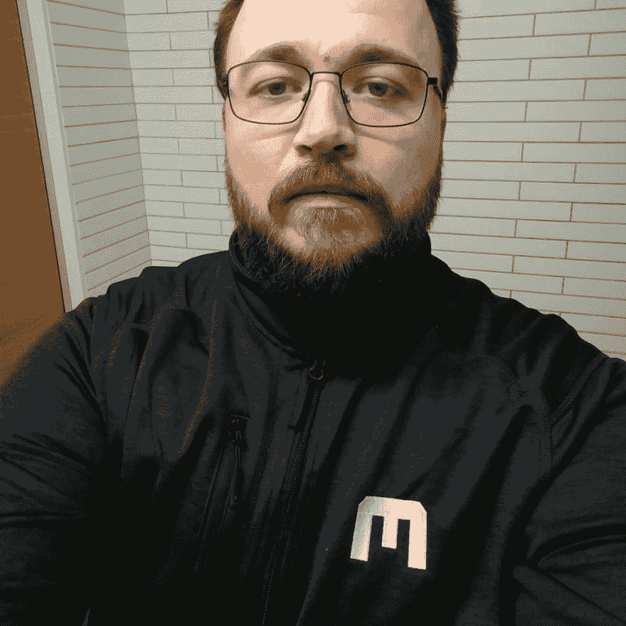

# 使用 lafur Waage 进行代码审查、游戏开发和 C++

> 原文：<https://dev.to/samjarman/code-reviews-game-dev-and-c-with-lafur-waage-4aon>

这是我的“开发聊天”系列中的一篇文章，在这篇文章中，我大约每周都会与一位出色的开发人员或技术人员交谈。你可以在这里阅读更多。如果你觉得这些对你有用，请在评论中告诉我！

[T2】](https://res.cloudinary.com/practicaldev/image/fetch/s--pCBlfOHM--/c_limit%2Cf_auto%2Cfl_progressive%2Cq_auto%2Cw_880/https://static1.squarespace.com/static/58bfb8c059cc68cc36914ea9/t/5aa4d0fb9140b73db68b8a72/1520750869137/olafur.jpg%3Fformat%3D1000w)

### 自我介绍！你是谁？你在哪里工作？

我叫 lafur Waage，来自冰岛，在首都附近的一个叫 hafnarfjr ur 的小镇长大。目前我在瑞典马尔默做程序员。这是育碧工作室。

我已经在那里呆了 4 年，现在在 Uplay 团队工作。我们的主要焦点是育碧的 PC 客户端 Uplay。因此，我们需要对客户端、它所连接的服务以及任何后端门户和工具进行编程，以使这种规模的客户端能够正常工作。

我们还通过 SDK、工具、数字产品和软件包管理、消耗品来帮助游戏团队，甚至不时地在客户端或服务中实现一个功能来帮助他们的开发。

我主要是 C++程序员，但也涉猎了很多语言。

### 是谁或什么让你开始编程的？

我从来没有想过成为一名程序员。在冰岛，当你 16 岁时，你要么去类似于美国高中的学校直到你 19/20 岁，要么去职业学校学习一门手艺。由于我是一个非常呆头呆脑的人，有一些严重的欺凌，所以我不想去同一所学校的 bullys。所以我去了一所职业学校，我的几个朋友也去了。我学了两年基础电气工程，然后开始给一个电工打工。

学习它非常有趣，但实际工作非常无聊，只是铺设电缆。所以我辞职了，开始送披萨，并在三个镇外的一所学校学习新闻学，仍然避开学校的主干道。别担心，这是冰岛，三个镇之外不远。

完成后，我开始在一家电话公司的技术支持呼叫中心工作。

事情是这样的，在这段时间里，我一直在编程。作为一个呆头呆脑的家伙，我非常喜欢计算机。就年龄/年龄而言，1998 年我 16 岁，所以网络开始蓬勃发展。

我从来都不是那种硬核意义上的程序员，所以我用 PHP 为我自己或我的反恐精英部落制作了网站。复制粘贴和修改，直到它的工作(排序)。

在呼叫中心工作两年后，我的一个朋友告诉我，他认识的一家公司正在寻找像我这样的人。我申请了，第二天被叫去上班，当场就被录用了。(仅供参考，这并不总是一件好事)

在那里，我开始了我的程序员生涯。我从 1998 年开始在业余时间摆弄它，但直到 2007 年我才开始全职编程。后来我去了大学，获得了计算机科学学位。

### 我看到你在 twitter 上打开了你的 DMs 进行代码评审？进展如何？

正如我在之前的回答中所说。我最终在一所大学学习了计算机科学。在那里，我申请成为一名教师助理，基本上每学期都有几节课是我的助理。我这样做是因为我发现我真的很喜欢教别人编程。

毕业后，我开始在其他地方工作，我怀念教书的日子，但从来没有为此做过什么。

所以当我开始越来越多地使用 Twitter 时，我发现这里有一个接触人们的机会。所以我去年决定向任何开始学习编程的人开放我的 DM。我会检查他们所有的代码并给他们一些提示。

像这样打开你的 DM 有好处也有坏处。

让我们从负面开始，这样这个问题至少可以有一个好的结尾。

**底片:**

如果有足够多的追随者，你会收到很多消息，其中很多都是废话。人们张贴迷因，给你发送色情等。谢天谢地，这已经平息了一点。

另一个消极的方面是，大部分合法请求评论的人都是已经非常了解编程的人。我已经得到了 STL 类的自定义实现。我被要求对一个软件的安全关键点进行安全评估。我得到了高级数学库，并被要求找到所有的问题。尽管这条推文字面意思是“如果你正在学习编程，并且你有一小段代码，你想让代码被审查？然后给我发消息。”

谢天谢地，当我向人们解释这一点时，他们总是很友好并道歉。为此欢呼吧！

**阳性:**

我喜欢人们在还没开始学习的时候就给我发信息。他们有一种学习的动力，知道它是有感染力的，即使是通过文字。他们询问资源、陷阱等。我通常会让他们去可汗学院学习最基本的知识，因为那些教程非常直观。我认为在编程时，你能得到关于你在做什么的视觉反馈是非常重要的。

对于其他人，那些刚刚开始并有代码片段的人，我收集了我见过的最常见的错误，并[创建了一个描述它们的图片库](https://imgur.com/a/zEraS)，我觉得这很受欢迎。

### 瑞典马尔默的编程场景是怎样的？

它很小，但是在成长。马尔默是一个小镇，所以任何场景都不错。我们有[foo cafe malm](http://foocafe.se/malmoe)定期举办讲座和研讨会。移动/网络相关公司的场景非常大。

我比马尔默的其他科技公司更了解游戏相关领域。我们有 Massive(分部)，Tarsier(小噩梦)，Simogo(一年步行)，King 也在这里，但我不知道他们在那里的办公室做什么！

我们有[游戏大会](https://www.thegameassembly.com/games)，一所专注于游戏设计和编程的学校，马尔默每年还举办[北欧游戏大会](https://conf.nordicgame.com/)。

### 你觉得在游戏平台上工作会像在真实游戏中工作一样困难吗？

是也不是。当游戏大多在秋季推出时，我们会努力在此之前准备好他们需要的任何功能(或者我们希望在游戏发布前推出)。所以我们想在 10 月/11 月之前发布新特性，这样我们就有了夏天和初秋的时间来开发它们。

这不是最好的策略，因为人们正在放暑假，而你在开发的时候离游戏发布太近了。因此，我们希望在夏季之前开始，甚至可能在新年之后开始，以避免危机。

因此，即使我们是一个活生生的产品，我们也会有困难时期。但这不是你下班后连续几周坐几个小时的仰卧起坐。我们非常严格地要求不要这样做，如果发生了类似的事情，那就是非常严重的事情。Massive 的工作文化非常反对这一点。

### 迄今为止，在你的软件生涯中，你学到的最难的一课是什么？

我首先想到的是如何与团队合作，但我觉得这是每个行业都存在的问题。

所以我要说的是理解大量代码。不仅仅是它做了什么，有什么影响，还要看看这个代码是如何与其他系统交互的，然后试着找出如何让它变得更好。不仅仅是在性能优化上，更是以事后诸葛亮的眼光看待设计，简化。

这非常困难，我认为我永远也不会真正擅长，但我会随着时间的推移变得越来越好。

### 对于成功的软件职业生涯，你的第一条建议是什么？

这个真的很简单。

不要把工作带回家或长时间加班。你会发疯的。

而且，如果你的工作是为了完成项目，那么你不会在这个行业生存太久。你被当作生产代码的工具，而不是你工作的公司的有价值的一部分。

### 工作之外，你有什么爱好吗？你认为它们对你的科技事业有任何帮助吗？

我有几个爱好，根据我在那个季节的心情，我轮流着去做。是的，它们肯定有助于我的技术职业，要么是直接与编程相关，要么是刺激我的大脑并让我保持敏锐的东西。

我涉猎开锁，物理谜题(如木制谜题)，我喜欢听任何类型的非小说类有声读物。

### 你会推荐什么书/资源？

对于编程，我喜欢阅读大多数 C++博客，观看其中一些博客制作的可爱内容。链接在“大声喊出来”部分。

对于非小说类书籍，我的必读建议是:

罗伯特·格林的掌控

卡罗尔·塔夫里斯和埃利奥特·阿伦森犯了错误(但不是我犯的)

马尔孔·格拉德威尔的《局外人》

和

[如何赢得朋友&影响人戴尔·卡耐基](https://www.amazon.com/How-Win-Friends-Influence-People/dp/0671027034/ref=sr_1_1?s=books&ie=UTF8&qid=1520749929&sr=1-1&keywords=How+to+Win+Friends+and+Influence+People+Dale+Carnegie&refinements=p_n_feature_browse-bin%3A2656022011)

### 最后，做出你的大喊！你想让读者去看什么？

对于你们这些 C++书呆子来说。看看肖恩·帕伦特和钱德勒·卡鲁斯的任何会议演讲，不管视频质量如何。这些东西太神奇了。

这里有两个让你开始:

CppCon 2015: Sean Parent " [更好的代码:数据结构"](https://www.youtube.com/watch?v=sWgDk-o-6ZE)

CppCon 2015: Chandler Carruth [“调优 C++:基准、CPU 和编译器！天啊！”](https://www.youtube.com/watch?v=nXaxk27zwlk)

也看看简森·特纳的《C++周刊》，这家伙一直在大量生产内容。

如果你在推特上没有关注这些人，那么你就错过了。(排名不分先后)

*   斯蒂芬·t·拉瓦韦杰[@斯蒂芬·拉瓦韦杰](https://twitter.com/StephanTLavavej)
*   meeting c++[@ meeting PP](https://twitter.com/meetingcpp)
*   艾伦·沃尔夫 [@Atrix256](https://twitter.com/Atrix256)
*   比利·奥尼尔 [@MalwareMinigun](https://twitter.com/MalwareMinigun)
*   马特戈德堡[@马特戈德堡](https://twitter.com/mattgodbolt)
*   凯特·格雷戈里[@格雷格康斯](https://twitter.com/gregcons)
*   本·迪恩[@本 _ 迪恩](https://twitter.com/ben_deane)

可能更多，对不起。