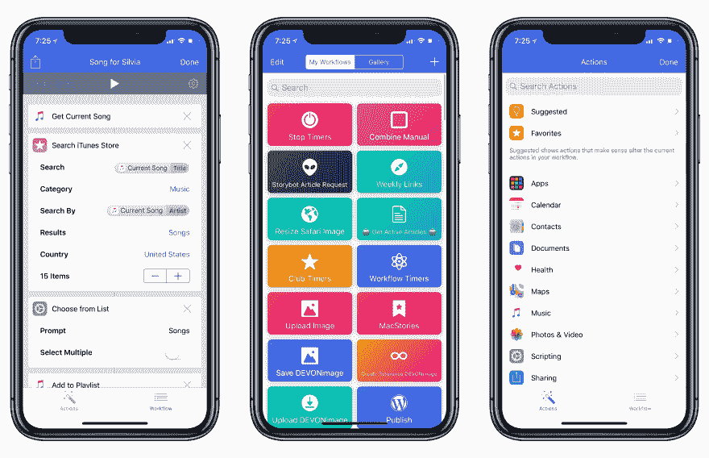
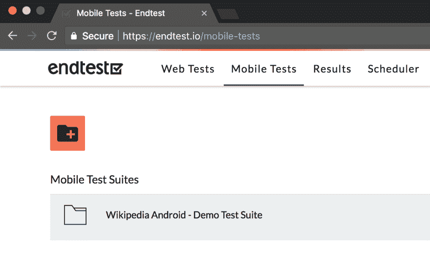
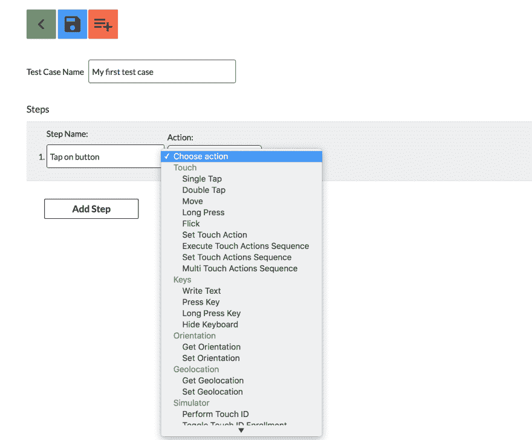
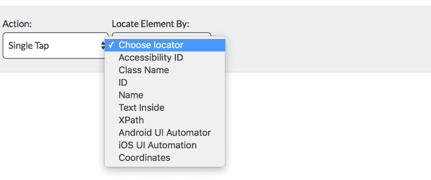
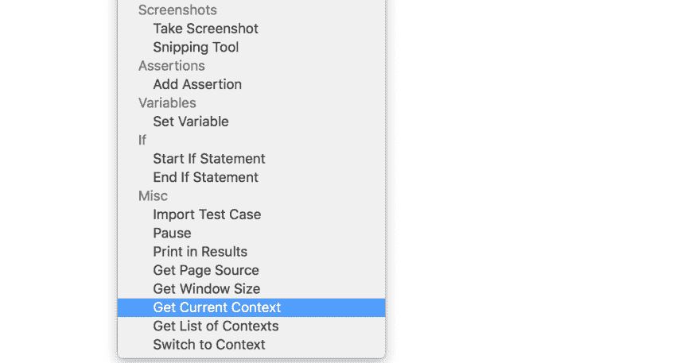
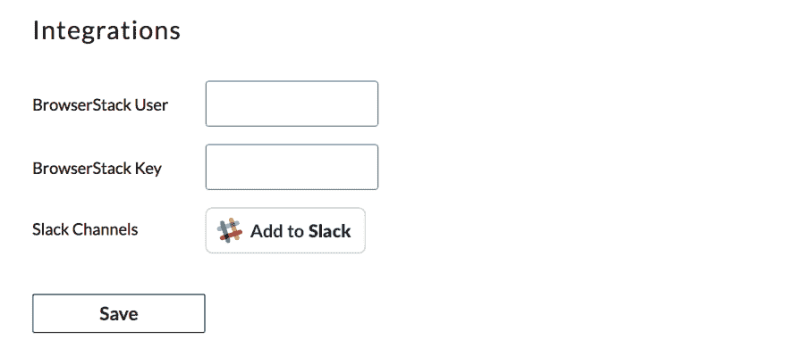
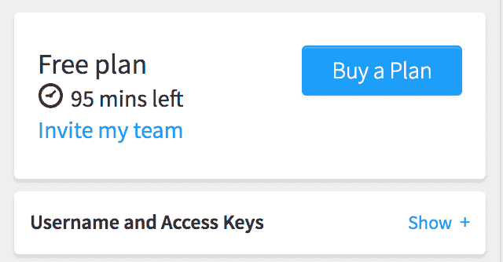
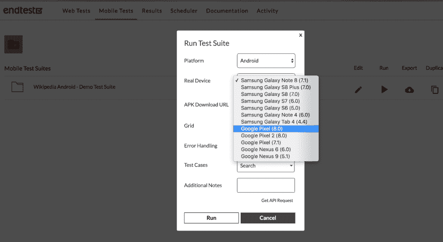
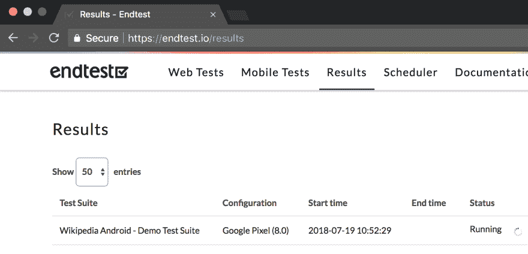

# 面向移动应用的无代码自动化测试

> 原文：<https://dev.to/razgandeanu/codeless-automated-testing-for-mobile-apps-4ho9>

[T2】](https://res.cloudinary.com/practicaldev/image/fetch/s--vTWLzoXs--/c_limit%2Cf_auto%2Cfl_progressive%2Cq_auto%2Cw_880/https://2672686a4cf38e8c2458-2712e00ea34e3076747650c92426bbb5.ssl.cf1.rackcdn.com/2017-11-08-19-27-06.jpeg)

老实说，对移动应用程序进行自动化测试并不容易。

学习使用 Calabash 或 Appium 编写测试代码可能需要一些时间，并且您可能会遇到一些阻碍。

我坚信测试人员的目标应该是想出有趣的场景，而不是写代码。

今天，我将向您展示如何使用无代码替代方案。

这个平台允许您创建、管理和运行自动化测试，而无需编写任何代码。

它基本上是免费使用的，并且它们有一些非常好的功能，例如:
跨浏览器网格，在 Windows 和 macOS 机器上运行
自动化测试的无代码编辑器
支持 Web 应用
支持本地和混合 Android 和 iOS 应用
测试运行的无限制视频记录
截图比较
地理定位
If 语句
上传测试中的文件
一个 API，用于轻松集成您的 CI/CD 系统

让我们开始吧。只需前往[终点测试](https://endtest.io)。

首先，要使用这个平台，你需要注册(别担心，是免费的)。

在您注册之后，您可以看到您已经有了一些样本测试套件。

[T2】](https://res.cloudinary.com/practicaldev/image/fetch/s--1RTSSVm0--/c_limit%2Cf_auto%2Cfl_progressive%2Cq_auto%2Cw_880/https://i.imgur.com/b3FSLWQ.png)

您可以使用它们的无代码编辑器来创建您自己的测试:

为了定位元素，你可以从几个定位器类型中选择:

如您所见，我们有大量的操作。我们甚至有处理上下文的动作，这在处理混合移动应用时很有用:

[T2】](https://res.cloudinary.com/practicaldev/image/fetch/s--jb_K_XD6--/c_limit%2Cf_auto%2Cfl_progressive%2Cq_auto%2Cw_880/https://i.imgur.com/Zy0ERdo.png)

因为测试可以在真实的移动设备上运行，所以我们可以将 Endtest 与 BrowserStack、SauceLabs 和 AWS DeviceFarm 连接起来。

让我们用 BrowserStack 连接 Endtest。

[T2】](https://res.cloudinary.com/practicaldev/image/fetch/s--6d26gOJt--/c_limit%2Cf_auto%2Cfl_progressive%2Cq_auto%2Cw_880/https://i.imgur.com/UiILxna.png)

你所要做的就是进入[设置](https://endtest.io/settings)页面，添加你的 BrowserStack 用户名和访问密钥，你可以从 BrowserStack 的[应用自动化页面](https://app-automate.browserstack.com/dashboard)获得。

[T2】](https://res.cloudinary.com/practicaldev/image/fetch/s--vAGxcJTE--/c_limit%2Cf_auto%2Cfl_progressive%2Cq_auto%2Cw_880/https://i.imgur.com/7xk7LiN.png)

如果你在 [BrowserStack](https://browserstack.com) 上没有账户，只需注册免费试用，你将获得 100 分钟的 App Automate。

好了，现在我们已经连接了 Endtest 和 BrowserStack，我们终于可以运行 Wikipedia Android - Demo 测试套件了。

[T2】](https://res.cloudinary.com/practicaldev/image/fetch/s--yeEAXuu0--/c_limit%2Cf_auto%2Cfl_progressive%2Cq_auto%2Cw_880/https://i.imgur.com/90YBMeg.png)

单击“运行”按钮后，我们会被重定向到“结果”部分:

[T2】](https://res.cloudinary.com/practicaldev/image/fetch/s--VmwYYYAI--/c_limit%2Cf_auto%2Cfl_progressive%2Cq_auto%2Cw_880/https://i.imgur.com/4nSFGgS.png)

测试完成后，我们得到详细的结果，我们可以看到截图和视频记录。

很棒，对吧？