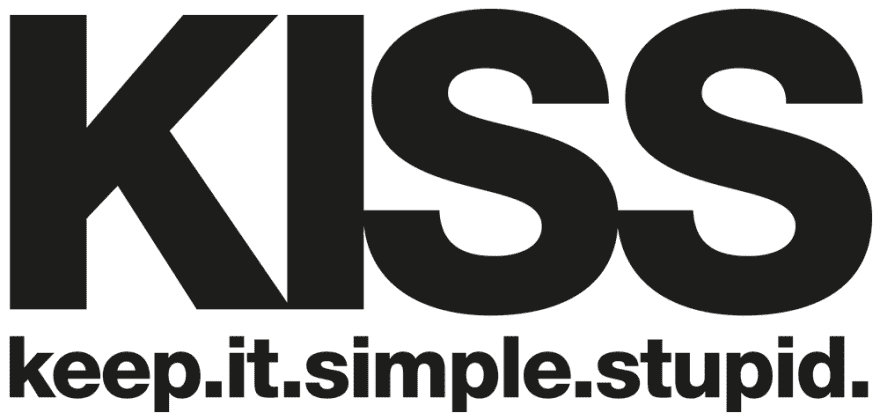
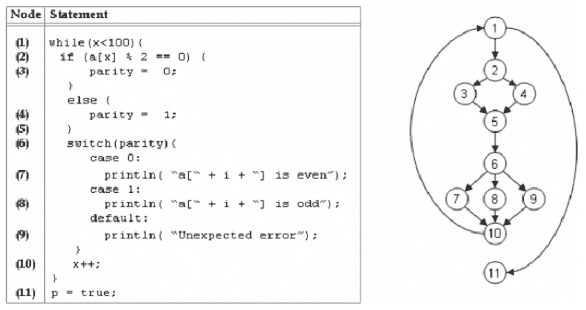
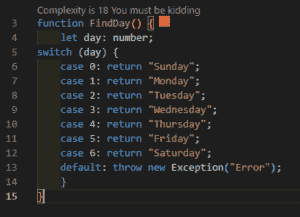

# 编码概念！圈复杂度

> 原文：<https://dev.to/designpuddle/coding-concepts---cyclomatic-complexity-3blk>

圈什么？甚至拼写检查都不能识别这个单词，但是它是一个非常有用的软件度量标准，可以帮助你理解你的软件是如何工作的。

几年前读到过，它的使用似乎已经恶化。我觉得它是开发人员宝库中非常有价值的工具，应该用于代码审查和代码库的可维护性。我们都知道要保持代码的“简单”**“我们都听说过**吻**原则，但是有人告诉过我们什么是简单，以及我们应该如何衡量它吗？**

 **这就是圈复杂度进入框架的地方。

[T2】](https://res.cloudinary.com/practicaldev/image/fetch/s--Xmva24wj--/c_limit%2Cf_auto%2Cfl_progressive%2Cq_auto%2Cw_880/https://keepitsimplestupid.dk/wp-content/uploads/2017/08/KISS_logo_C.png)

## 定义

*维基百科提供:*

> **圈复杂度**是一个[软件度量](https://en.wikipedia.org/wiki/Software_metric "Software metric")，用来表示程序的复杂程度。它是通过程序的[源代码](https://en.wikipedia.org/wiki/Source_code "Source code")的线性独立路径数量的定量度量。它是由托马斯·j·麦凯布于 1976 年发明的。使用程序的[控制流图](https://en.wikipedia.org/wiki/Control_flow_graph "Control flow graph")计算圈复杂度:[图](https://en.wikipedia.org/wiki/Graph_(discrete_mathematics) "Graph (discrete mathematics)")的节点对应于程序的不可分割的命令组，如果第二个命令可能在第一个命令之后立即执行，则[有向](https://en.wikipedia.org/wiki/Directed_graph "Directed graph")边连接两个节点。圈复杂度也可以应用于程序中的单个[函数](https://en.wikipedia.org/wiki/Function_(computer_science) "Function (computer science)")、[模块](https://en.wikipedia.org/wiki/Modular_programming "Modular programming")、[方法](https://en.wikipedia.org/wiki/Method_(computer_science) "Method (computer science)")或[类](https://en.wikipedia.org/wiki/Class_(computer_science) "Class (computer science)")。

## 这到底意味着什么

本质上，这是通过一个逻辑的不同**数量的路由。换句话说，它通常是在可维护性指数的背景下考虑的。特定功能中的分支越多，维护其操作的心理模型就越困难。这个指标大致相当于**1 加上循环和 if 语句的数量**。这是如何配置值的一个很好的视图，是的，x 可能大于 100，直接向前移动，这条路径的复杂度为 1，但是代码块/方法本身的得分为 11。**

[T2】](https://res.cloudinary.com/practicaldev/image/fetch/s--ILJ5ZKQR--/c_limit%2Cf_auto%2Cfl_progressive%2Cq_auto%2Cw_880/https://www.researchgate.net/profile/Seifedine_Kadry/publication/288695710/figure/fig3/AS:323620028076034%401454168435561/Control-Flow-Graph-where-the-Cyclomatic-Complexity-of-McCabe-is-Calculated.png)

## 我为什么要在乎？

代码覆盖率正在成为开发周期中不可或缺的一部分。圈复杂度最终会影响您需要为给定代码编写的不同单元测试的数量。通过一个方法的额外路径将需要编写一个额外的测试，以及一个额外的你的代码可能会出错的地方。

当你把这些都考虑进去的时候，你的代码的圈复杂度最终决定了它的有效性、简单性、可维护性和一般的实用性。所以这很重要，你不觉得吗？

高“复杂性”可以直接转化为低可读性，这也意味着新开发人员更难理解正在发生的事情。

> 我相信你一定有过这样的经历:看着一些代码，却不知道发生了什么，也不知道为什么要这样写。

所以下次你写东西的时候，请记住，下一个看它的人可能不是你。让它保持这样的状态，你会很高兴发现它。当我完成一个新功能时，这种方法总是帮助我。

## 圈复杂度有多重要？

谁不喜欢一个好的表呢，这个表展示了一个方法可以有哪些不同的值，以及这意味着什么？

| 复杂性 | **什么意思** |
| 1-10 | 易于测试的结构化且编写良好的代码。 |
| 10-20 | 相当复杂的代码，对测试来说可能是一个挑战。取决于你在做什么，如果这些价值观是出于一个好的理由，它们仍然是可以接受的。 |
| 20-40 | 很难测试的非常复杂的代码。您应该考虑对此进行重构，将其分解成更小的方法，或者使用设计模式。 |
| >40 | 疯狂的代码，根本不可测试，几乎不可能维护或扩展。这里确实有问题，需要进一步检查。 |

这些不同的层次帮助我们更好地理解我们正在编写的代码，以及这对我们可能需要的任何测试资源的影响。这也让我们意识到，任何高度的复杂性都会在未来给我们带来问题，应该在下一个可用的机会花时间来重构它。

## 我们能做些什么来解决这个问题？

上表显示了不同的复杂程度，以及何时应该开始重构代码。我们将看看实现这一点的几种方法。到目前为止，最简单的方法是删除任何不需要的 **if** 或 **else** 语句。这些问题有时会在开发过程中突然出现，然后无法消除。您可能在代码库中找到的一个常见示例是这样的。

```
var msg = "";
if (month == 12 &amp;&amp; day == 25) { // + 2
      msg = "Merry Christmas"; // +1
} else {
     msg = "Have a nice day"; // +1
}
return msg; // +1 - Total 5 
```

上面的代码看起来没什么问题。然而，如果我们简单地**移除 else 语句**并将默认消息移动到声明中，我们就直接移除了 1 个复杂性点。这是一个容易的改变，也是一个普遍的改变。

高复杂性的另一个罪魁祸首是 case 或 switch 语句。

```
switch (day) { // +1
                case 0: return "Sunday"; // +2
                case 1: return "Monday"; // +2
                case 2: return "Tuesday"; // +2
                case 3: return "Wednesday"; // +2
                case 4: return "Thursday"; // +2
                case 5: return "Friday"; // +2
                case 6: return "Saturday"; // +2 
                default: throw new Exception(); // +2 Total 17!
        } 
```

在某些情况下，你无法摆脱上述代码块，这就是它们的设计目的。但有时 switch 语句只是糟糕的代码设计。如果您的 switch 语句可能会增加，那么策略模式是一个很好的方法。在上面的例子中，我们不太可能将新的日子添加到日历中，但是举个例子:

```
switch (carGarage) {
case 'seat': return contactSeat(); // +2
case 'audi': return contactAudi(); // +2
default: return contactFord();  // +2 - Total 6
} 
```

我们这里有 3 个 case 语句，但是看一下它当前实现的内容，可以预期它会扩展。添加额外的 case 语句是扩展这段代码的一个可能的解决方案，但是这将增加每个额外 case 的复杂性！策略模式可以很好地解决这个问题。

```
enum CarDealerTypes { Seat, Audi, Ford }

interface CarDealerStrategy {
    CallDealer();
}

class SeatDealer implements CarDealerStrategy {
    CallDealer() {
        CallSeat(); // +1
    }
}

class AudiDealer implements CarDealerStrategy {
    CallDealer() {
        CallAudi(); // +1
    }
}

class FordDealer implements CarDealerStrategy {
    CallDealer() {
        CallFord(); // +1
    }
}

class Dealership {
    // Here is our alternative to the case statements, easy right!
    CallDealer(dealer: CarDealerStrategy) {
        dealer.CallDealer(); // +1
    }

    // These are the methods that will ultimately be used
    ContactAudiDelership() {
        this.CallDealer(new AudiDealer()); // +1
    }
} 
```

这是一个较高的设置成本，并且开始时稍微复杂一些。但是，在你的 15 switch 语句被添加后，你会很高兴你决定用 **switch** 的方法！此外，我们还改进了复杂度，从案例语句中原来的 **3 到**策略模式**中的 **1** 。想象一下，如果您的 switch 语句执行额外的逻辑，并且嵌入了额外的 if 语句，您会发现这将成为一个真正的测试难题！**

## 用那个头！

[T2】](https://res.cloudinary.com/practicaldev/image/fetch/s--SACX_jXs--/c_limit%2Cf_auto%2Cfl_progressive%2Cq_66%2Cw_880/https://static1.squarespace.com/static/55309ca8e4b0491a492b1585/t/576ebbabe4fcb5ab514e1468/1466874797165/noggin.gif)

> 与一切发展相关的事情一样，要记住的最重要的事情是，你不能因为想改变就改变。

重构和改进你的代码库对于保持一个干净简洁的环境是必不可少的。如果你发现你的代码运行平稳，没有给你或你的客户带来任何问题，那么**不要改变它**，因为代码度量告诉你它是错误的。

代码从编写的那一刻起就是遗留的，所以在下一轮开发中，您的重构可能会过时。如果要修改代码，请对其进行改进。一个好的程序员应该在处理一个故事或功能时修复他们发现的任何问题，但不要修改需要额外测试的代码，这些测试不会直接影响他们目前正在做的事情。

## 工具

所以你理解这个概念，你理解如何修复它，但是找出潜在问题的最简单的方法是什么！大多数 IDE 应该提供一些内置工具来帮助你。我现在来看几个例子:

### [Visual Studio](https://blogs.msdn.microsoft.com/zainnab/2011/05/17/code-metrics-cyclomatic-complexity/)

只需通过分析|计算解决方案的代码指标来计算您的代码指标。在这里找到更多细节: [Visual Studio -代码度量帮助](https://blogs.msdn.microsoft.com/zainnab/2011/05/17/code-metrics-cyclomatic-complexity/)

### [【vscode】](https://marketplace.visualstudio.com/items?itemName=kisstkondoros.vscode-codemetrics)

我链接了一个我最近一直在使用的很棒的扩展，它将在函数的顶部显示复杂性！在这里找到它:[代码度量扩展](https://marketplace.visualstudio.com/items?itemName=kisstkondoros.vscode-codemetrics)

[T2】](https://res.cloudinary.com/practicaldev/image/fetch/s--z4VOteuE--/c_limit%2Cf_auto%2Cfl_progressive%2Cq_auto%2Cw_880/http://blog.designpuddle.com/wp-content/uploads/2018/09/Complexity-300x217.png)

大多数 IDE 都有适合的工具，所以去那里找一个适合你的吧！

我希望这篇关于**圈复杂度**的介绍能给你一些思考，并在将来的某个时候帮助你。下面的附加阅读更深入这个主题，所以如果你对这个主题更感兴趣，请随意阅读。一如既往，请在下面的评论中告诉我们你的想法。

**这是我自己的博客:[设计水坑博客-编码概念-圈复杂度](https://blog.designpuddle.com/web-development/coding-concepts-cyclomatic-complexity/)**

* * *

## 附加阅读

**麦凯布完整论文:**【http://mccabe.com/pdf/mccabe-nist235r.pdf】T2

**不同的视角，为什么你不该用它？https://www.cqse.eu/en/blog/mccabe-cyclomatic-complexity/**T2

**和一些更多的澄清:**[https://dzone . com/articles/what-exact-is-McCabe-cyclomatic-complexity](https://dzone.com/articles/what-exactly-is-mccabe-cyclomatic-complexity)**