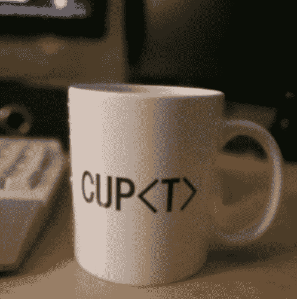

# 编码概念-泛型

> 原文：<https://dev.to/chris_bertrand/coding-concepts---generics-34cf>

# 什么是泛型，我们为什么要使用泛型？

> **泛型编程**是[计算机编程](https://en.wikipedia.org/wiki/Computer_programming "Computer programming")的一种风格，其中[算法](https://en.wikipedia.org/wiki/Algorithm "Algorithm")是根据[类型](https://en.wikipedia.org/wiki/Data_type "Data type")编写的，这些类型稍后将被指定，然后在需要时被实例化为作为[参数](https://en.wikipedia.org/wiki/Parameter_(computer_programming) "Parameter (computer programming)")提供的特定类型。这种方法是由 [ML](https://en.wikipedia.org/wiki/ML_(programming_language) "ML (programming language)") 在 1973 年首创的，<sup id="cite_ref-2">[【2】](https://en.wikipedia.org/wiki/Generic_programming#cite_note-2)</sup>允许编写常见的[函数](https://en.wikipedia.org/wiki/Function_(computer_science) "Function (computer science)")或[类型](https://en.wikipedia.org/wiki/Type_(computer_science) "Type (computer science)")，它们的区别仅在于使用时操作的类型集合，从而减少[重复](https://en.wikipedia.org/wiki/Duplicate_code "Duplicate code")。这样的软件实体在 [Ada](https://en.wikipedia.org/wiki/Ada_(programming_language) "Ada (programming language)") 、 [C#](https://en.wikipedia.org/wiki/C_Sharp_(programming_language) "C Sharp (programming language)") 、 [Delphi](https://en.wikipedia.org/wiki/Delphi_(programming_language) "Delphi (programming language)") 、 [Eiffel](https://en.wikipedia.org/wiki/Eiffel_(programming_language) "Eiffel (programming language)") 、 [F#](https://en.wikipedia.org/wiki/F_Sharp_(programming_language) "F Sharp (programming language)") 、 [Java](https://en.wikipedia.org/wiki/Java_(programming_language) "Java (programming language)") 、 [Rust](https://en.wikipedia.org/wiki/Rust_(programming_language) "Rust (programming language)") 、 [Swift](https://en.wikipedia.org/wiki/Swift_(programming_language) "Swift (programming language)") 、 [TypeScript](https://en.wikipedia.org/wiki/TypeScript "TypeScript") 和 [Visual Basic 中被称为泛型。网](https://en.wikipedia.org/wiki/Visual_Basic_.NET "Visual Basic .NET")。它们被称为[ML](https://en.wikipedia.org/wiki/Parametric_polymorphism "Parametric polymorphism")中的参数多态、 [Scala](https://en.wikipedia.org/wiki/Scala_(programming_language) "Scala (programming language)") 、[Haskell](https://en.wikipedia.org/wiki/Haskell_(programming_language) "Haskell (programming language)")(Haskell 社区也使用术语“泛型”来表示一个相关但有些不同的概念)和[Julia](https://en.wikipedia.org/wiki/Julia_(programming_language) "Julia (programming language)")；[模板](https://en.wikipedia.org/wiki/Template_(C%2B%2B) "Template (C++)")在 [C++](https://en.wikipedia.org/wiki/C%2B%2B "C++") 和 [D](https://en.wikipedia.org/wiki/D_(programming_language) "D (programming language)") 中；以及 1994 年出版的有影响力的书[设计模式](https://en.wikipedia.org/wiki/Design_Patterns_(book) "Design Patterns (book)")中的参数化类型。<sup id="cite_ref-GoF_3-0">[【3】](https://en.wikipedia.org/wiki/Generic_programming#cite_note-GoF-3)</sup>设计模式的作者注意到，这种技术，尤其是当与[委托](https://en.wikipedia.org/wiki/Delegation_(programming) "Delegation (programming)")结合使用时，非常强大，然而，动态的、高度参数化的软件比静态软件更难理解。

所以这是一个有点冗长的，非常不可描述的来自维基百科的定义。我对泛型着迷有一段时间了，它们可能很难掌握，理解为什么以及应该在哪里使用它们。使用泛型的主要动机是在成员之间提供有意义的类型约束，泛型或参数多态性在大多数编程语言中使用，尽管它们可能更难理解，但使用它们有 5 个主要好处。

## 利益

*   编译时更强的类型检查。
*   修复编译时错误比修复运行时错误更容易
*   消除管型。这反过来更快。
*   使编码人员能够实现通用的解决方案，这些解决方案可以重复用于多种目的。
*   面向未来的数据类型。

使用泛型比使用标准类型更强大，并且允许我们创建某种形式的封装和定义良好的一致 API。如何使用这些函数并不重要，但是理解如何在不同的成员之间传递这种类型的信息是很有好处的，并且您可以在外部使用它们的返回类型，这将为您的代码中发生的事情提供更具描述性的视图。

本质上，泛型只是意味着你可以将一个类型分配给一个类。因此，我们将在本例中看到“T”。

> 为什么使用泛型？抽象出数据类型，允许您重用代码并提高可维护性。

因此，让我们通过一个简单的 TypeScript 示例来说明我的意思。

## 一个标准的类示例

我们将从一个**非**通用列表开始，并将其转换为一个通用列表！

```
class Stack
{
private stack: any[];
  pushItem(item){
  this.stack.push(item);
  }
} 
```

Enter fullscreen mode Exit fullscreen mode

上面的例子是一个基本类，它包含一个名为 stack 的数组。任何东西都可以加入这个数组！让我们添加一个字符串、一个数字和一个新的 person 对象。

```
 var newStack = Stack();
var aString = "A String";
var aNumber = 100;
var aPerson = {firstName:"John", lastName:"Doe", age:50, eyeColor:"blue"};
newStack.pushItem(aString);
newStack.pushItem(aNumber);
newStack.pushItem(aPerson); 
```

Enter fullscreen mode Exit fullscreen mode

这是可行的，也许你想要一个数组来容纳混杂的对象。然而，在大多数情况下，这将导致您在数组中迭代、排序或过滤值时出现许多问题。最糟糕的是，直到运行时你才会知道这些错误。这些在代码执行之前不会被发现，因此在测试期间可能不会被发现。

而使用泛型列表不会让您向堆栈中添加它无法处理的类型。

> 要使用通用容器，必须在实例化时使用尖括号符号指定容器的类型。

这实际上很简单，让我们看看上面的例子，但这次让我们制作两个单独的数组实例，一个可以保存数字，一个可以保存字符串。首先，我们需要创建泛型类。

## 一般的方式

[](https://res.cloudinary.com/practicaldev/image/fetch/s--iIya1Hpn--/c_limit%2Cf_auto%2Cfl_progressive%2Cq_auto%2Cw_880/https://s3-eu-west-1.amazonaws.com/cdn.josephwoodward.co.uk/blog/cup_of_type_t_programming_mug.jpg)T3】

```
class GenericStack<T>;
{
  private stack: T[]; 
  function pushItem(item: T) { 
  this.stack.push(item); 
  }
} 
```

Enter fullscreen mode Exit fullscreen mode

如你所见，代码与我们上面的例子非常相似！那么有什么大惊小怪的？这给我们带来了什么好处？初始化这个新类的时候，让我们看看这个例子。

```
var numberStack = GenericStack<Number>(); 
var stringStack = GenericStack<String>(); 
var aString = "A String"; 
var aNumber = 100; 
var aPerson = {firstName:"John", lastName:"Doe", age:50, eyeColor:"blue"};

// These will pass the typescript compiler
stringStack.pushItem(aString); 
numberStack.pushItem(aNumber);

// But these would all fail.
numberStack.pushItem(aPerson);
numberStack.pushItem(aString);
stringStack.pushItem(aPerson);
stringStack.pushItem(aNumber); 
```

Enter fullscreen mode Exit fullscreen mode

那么这一切意味着什么呢？本质上，我们只创建了一个类，但是根据引用的类型改变了它的行为。它本质上是类和类型之间的契约。是的，我们可以只创建两个独立的类，但是那样我们会重复代码。

想象一下，如果我们创建一个 Person 类，而不仅仅是一个 JObject，我们可以创建一个**generic stack<Person>()**

这是一个很小的例子，但是类型安全是一个很大的问题，尤其是在 JavaScript 中。因为 JavaScript 不是编译语言，所以 Typescript 为我们提供了类型安全和预编译的好处来捕捉这种错误。

> 如前所述，如果没有泛型类，错误只会在运行时出现。

开发的一个主要部分是构建可重用的、定义良好的组件，如果这个类包含更多的功能，它可以由整个组织的团队以最小的努力重用，允许他们重用自己的类型。

## 但是这不会限制你对泛型的使用吗？

当你处理基本类型时，比如字符串、数字，甚至数组，你会很熟悉某些可用的方法，比如:**。ToString()** 或**。长度()**或**。size()** 或**。replace()**

这些要求编译器知道变量的类型，不幸的是，当使用泛型时，这意味着它们不能被使用。数字类型不包含 **replace()** ，因此您将无法使用它。而 **T 型**不包含以上所列的任何一种！许多人会尝试在他们的代码中实现泛型，只是为了表示他们使用它们。要确定的是它们有一个用例。当您开始不再使用原始数据类型(可用的基本数据类型:数字、字符串等)时，泛型就开始发挥作用了。)以及使用自定义对象和类。

### 重构

当重构你的代码时，泛型是有用的，你能在你的代码中看到从数据结构中抽象出数据类型的实例吗？

如果答案是**是**，那么你应该考虑泛型！

还有很多关于泛型的东西，我不打算在这里一一解释，如果你有兴趣阅读更多关于泛型的东西，我在下面链接了一些额外的资源，应该可以让你看得更清楚。

我错过了什么有用的东西吗？你还有什么要补充的吗？你用一种有趣的方式使用过泛型吗？如果有分享下面！

感谢阅读。

克莉丝

# 附加阅读

[官方打字稿文档-泛型](http://www.typescriptlang.org/docs/handbook/generics.html)

[Dzone -理解泛型的用例](https://dzone.com/articles/hack-1-understanding-the-use-cases-of-generics)

[Git Books - Generics](https://basarat.gitbooks.io/typescript/docs/types/generics.html)

[code . tuts plus .-Tutorials-Typescript-适合初学者](https://code.tutsplus.com/tutorials/typescript-for-beginners-part-5-generics--cms-29603)