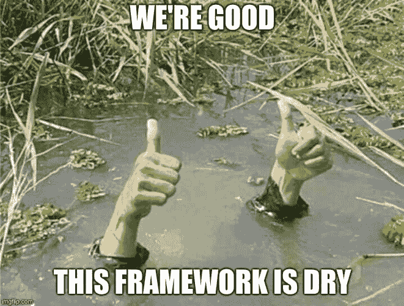
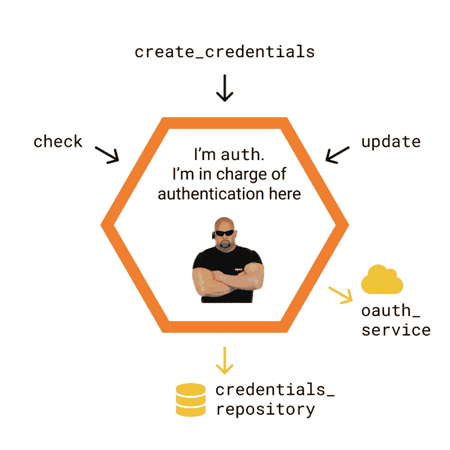
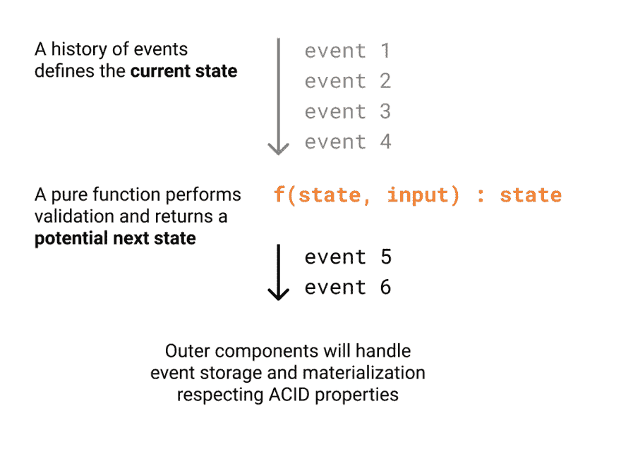
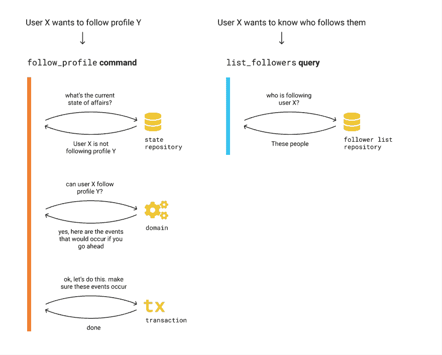
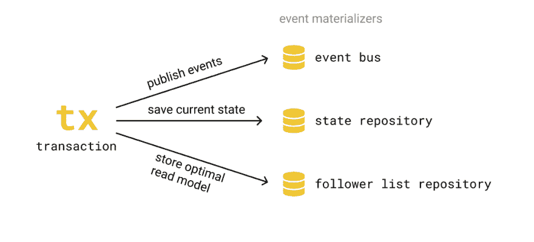

# Colmena，一种高度可伸缩的 Web 服务架构

> 原文：<https://dev.to/larribas/colmena-an-architecture-for-highly-scalable-web-services-2mlo>

大约 3 年前，我们的初创公司从一个面向医生的问答应用转向了一个教育平台(我们将其命名为 [SchoolHouse.io](https://schoolhouse.io/en/) )。这是一个重大的产品转变，我们知道许多技术变革将随之而来。

当时，我们有一个 1 岁的 Python+Django 代码库，已经*生锈，难以维护。我们怎么这么快就越过了遗产线？*

(叹气)

我们显然做错了，我们想了解*什么*，所以我们列出了我们**的主要痛点**:

*   为了理解一个特性是如何工作的，我们需要在我们的代码和框架的代码之间跳来跳去，有时是通过长继承层次结构、装饰器、钩子和某处记录的约定。因此，每次我们需要追踪一个 bug 或者做一些改变的时候，我们都需要带上印第安纳琼斯的帽子。

*   许多变更(比如一些权限、关系或验证)属于哪里并不明显。这引发了许多有趣但最终浪费时间的辩论。

*   单元测试被 stubs 和 mocks 所困扰，当它们不存在时，它们必须忙于理解 HTTP 参数或确保数据库是干净的。

<figure>

[T2】](https://res.cloudinary.com/practicaldev/image/fetch/s--xO5dcIJS--/c_limit%2Cf_auto%2Cfl_progressive%2Cq_auto%2Cw_880/https://larribas.me/posts/colmena-an-architecture-for-highly-scalable-web-servicimg/dry.jpg)

<figcaption>We tried to be DRY, but working on our codebase felt like drowning.</figcaption>

</figure>

## 我们抛弃了 MVC 框架，用我们自己的方式去做

随着时间的推移，这些问题使我们效率低下，并使我们的代码库变得凌乱不堪。

最重要的是，我们怀疑如果我们继续按常规使用 MVC 框架，我们将无法解决我们的痛点，所以我们开始**设计我们自己的架构 <sup id="fnref1">[1](#fn1)</sup> ，为长期的生产力和可维护性进行优化**。

## ...那么，这值得吗？

3 年后，我们看到我们的产品发生了很大的变化，爱上了像 Elm 和 Haskell 这样的函数式语言，并超越了全栈，负责图形设计、前端工程、系统管理和数据科学。尽管发生了所有这些变化，我们相信还是发生了一些不寻常的事情:**我们和第一天一样对我们的后端感到舒适(没有大的重构！).**

我们的建筑选择一直让我们的生活更加轻松，现在我们想与社区分享我们所学到的东西。我们还发布了现实世界规范的实现[，以提供真实的代码示例](https://github.com/schoolhouse-io/colmena-realworld-example-app)[2](#fn2) 。

## OK。我听着呢。是关于什么的？

一个 *Colmena* app 由多个单元格组成。

**单元是遵循[六边形架构](https://fideloper.com/hexagonal-architecture)的自包含服务**。每个单元格:

1.  有明确的目的和责任。
2.  有一些表示、验证和转换单元状态的内部域。
3.  依赖一系列接口从外部服务和技术接收输入(并将输出发送到外部服务和技术)。
4.  公开一个公共 API(一个声明它能做什么的契约)。

[T2】](https://res.cloudinary.com/practicaldev/image/fetch/s--loXP2pvX--/c_limit%2Cf_auto%2Cfl_progressive%2Cq_auto%2Cw_880/https://larribas.me/posts/colmena-an-architecture-for-highly-scalable-web-servicimg/basic_cell.png)

你可以把细胞想象成**非常小的微服务**。事实上，我们鼓励你尽量让你的细胞变得更小。根据我们的经验，从长远来看，围绕实体和关系细化您的领域有助于您理解、测试和维护代码库。这些是[现实世界后端](https://github.com/schoolhouse-io/colmena-realworld-example-app)的细胞:

*   **用户**
*   **认证**
*   **跟随**(用户)
*   **条**
*   **标签**
*   **评论**(文章)
*   【T0 篇】提要【T1 篇】

如果我们告诉你，我们的应用程序是一个博客平台，每个单元的目的就变得非常清楚了。只需浏览一下 [`lib/real_world`目录](https://github.com/schoolhouse-io/colmena-realworld-example-app/tree/master/lib/real_world)就能找到某个特性可能被定义的位置。从那里，开发人员可以快速查看 API 以了解它支持的操作，并以非常渐进和自然的方式导航实现。

### 基于事件的功能域

每个单元模拟一个小区域。该域可以对应于实体(例如，用户)、关系(例如，用户关注另一个用户)、或特殊特征(例如，每个用户具有他们自己的文章的物化馈送)。

在*栏中*、**域的变化被表示为一系列事件**。这个事件序列是附加的，因为事件是不可变的(它们是已经发生的*事实*)。在[事件源](https://www.youtube.com/watch?v=8JKjvY4etTY)中，该序列被称为“真相源”，它提供:

*   修改域的所有操作的审核日志。
*   其他组件(在相同或不同的单元中)监听特定事件并对其做出反应的能力。

后一种实践通常被称为*事件驱动*或*反应式编程*，它被证明是一种非常有用的方法，可以以非常低的耦合实现某些功能。

此外，由于我们有一系列不可变的数据，**域所做的一切都可以被视为一个纯粹的函数**(没有副作用，只有确定性的数据转换)。在 Ruby(或任何其他面向对象的语言)中，这可以解释为:

*   没有类、类实例或方法。
*   不调用任何外部技术或服务。
*   不需要让我们的测试变得缓慢或复杂的存根、模拟或任何其他测试工件。

> 我们可以用一种既简单又强大的方式[验证和描述我们的应用程序的行为](https://github.com/schoolhouse-io/colmena-realworld-example-app/blob/master/lib/real_world/follow/domain.rb)，忘记噪音。

[T2】](https://res.cloudinary.com/practicaldev/image/fetch/s--BN9EyTIM--/c_limit%2Cf_auto%2Cfl_progressive%2Cq_auto%2Cw_880/https://larribas.me/posts/colmena-an-architecture-for-highly-scalable-web-servicimg/evented_domain.png)

### 公共契约

每个*有用的*应用程序都需要让世界用它做些事情。我们将继续我们的现实世界的例子。

我们的`follow`单元可以满足一些用例:

*   用户遵循另一个简档。
*   用户停止关注另一个简档。
*   有人想知道特定的用户是否遵循特定的简档。
*   有人想知道用户在关注哪些个人资料。

您会注意到前两个用例是*可能*(如果验证规则允许的话)改变单元格状态的操作，而最后两个用例只是查询当前状态。

在 *Colmena* 中，我们称前者为*命令*，后者为*查询*，我们处理它们的方式略有不同。这种模式被称为 [CQRS(命令-查询责任分离)](https://martinfowler.com/bliki/CQRS.html)。链接的文章很好地解释了这种方法的优缺点，所以我们将把重点放在这个真实世界代码库的具体实现上:

[T2】](https://res.cloudinary.com/practicaldev/image/fetch/s--jS3-mTiu--/c_limit%2Cf_auto%2Cfl_progressive%2Cq_auto%2Cw_880/https://larribas.me/posts/colmena-an-architecture-for-highly-scalable-web-servicimg/cqrs_sequence_diagram.png)

对于一个项目来说，确保所有这些面向公众的组件的合同都被恰当地记录和语义版本化是非常有价值的。开发人员需要能够随时学习和信任:

*   该单元发布什么类型的事件？它们包含哪些数据？
*   这个命令的参数是什么？这个查询怎么样？

### 牢记酸的性质

考虑到这是一个分布式架构，有许多组件和单元分别工作，我们有理由怀疑...变化是原子性的吗？我们如何保持它们的一致性？

当命令需要是原子性的(通常如此)时，它们被一个事务修饰。该事务负责发布命令生成的事件序列，并运行适当的物化器。反过来，这些**物化器加强了一致性和完整性**。物化器接受一系列事件，并将它们的变化传播给查询使用的几个“读取模型”。

例如，上图中的事务可能会调用这些具体化器:

[T2】](https://res.cloudinary.com/practicaldev/image/fetch/s--QU8MMmjT--/c_limit%2Cf_auto%2Cfl_progressive%2Cq_auto%2Cw_880/https://larribas.me/posts/colmena-an-architecture-for-highly-scalable-web-servicimg/materialization_diagram.png)

让我们再试试第二个例子。我们现在正在处理*篇文章*。物化者可能得到以下事件序列:

```
article_published(...)
article_tagged(...) 
```

并执行以下操作:

*   将整篇文章存储在面向文档的数据库(例如 MongoDB)中，以优化读取操作。
*   将文章存储在`tag -> articles`的反向索引中，以获取带有特定标签的文章。
*   将文章的标题和描述存储在为搜索而优化的数据库中(如 ElasticSearch)。

这个物化过程的某些部分必须同步发生(如果一致性是一个需求的话)。其他可能异步发生(当[最终一致性](http://guide.couchdb.org/draft/consistency.html)足够时)。

### 依赖接口，不依赖具体实现

此时，我们的单元接受来自潜在不可信来源的请求，从数据库中存储和检索数据，并且可能需要调用其他单元。

这些操作是软件开发的薄弱环节。网络可能出现故障，数据库可能被破坏，公共 API 不可信。那么，我们能做些什么来最小化这些风险呢？

在 *Colmena* ，**中，我们将每一个输入/输出组件定义为一个接口(六角行话中的端口)**。特定单元可能依赖于:

*   一个`repository`端口，用于保存和读取域数据。
*   一个`event publisher`端口，允许公开事件。
*   一个`router`端口，用于与其他单元通信。

在 Ruby 中，我们用一个[共享示例](https://github.com/schoolhouse-io/colmena-realworld-example-app/blob/master/lib/real_world/follow/ports/repository/spec_shared_examples.rb)来指定这些接口应该满足的行为。所有的实现(六边形行话中的适配器)必须符合规范，如果它们是可信的，并且提供显式的错误处理，以便可以优雅地处理、记录和减轻风险。

依赖接口是最基本的设计原则之一，它有直接的实际好处:

*   我们可以为多个组件编写一个测试。
*   我们可以应用[依赖倒置原则](https://softwareengineering.stackexchange.com/questions/234747/dependency-inversion-principle-vs-program-to-an-interface-not-an-implementatio)来为每个环境注入我们需要的适配器(例如，用于测试的快速 SQLite 数据库和用于生产的完全可扩展的云数据库)。<sup id="fnref3">T33</sup>
*   我们可以切换到不同的技术，而不改变我们的细胞代码。

### 你的应用程序由多个单元格组成

细胞有明确定义的边界，但它们仍然需要相互通信。在 *Colmena* 中，细胞可以通过两种不同的方式相互交流:

*   同步地，在另一个单元上调用命令或查询。这是一个传统的[远程过程调用](https://en.wikipedia.org/wiki/Remote_procedure_call)我们通过[中央服务注册中心](https://microservices.io/patterns/service-registry.html)执行，我们称之为 [*路由器*](https://github.com/schoolhouse-io/colmena-realworld-example-app/blob/master/lib/real_world/ports/router/in_memory.rb) 。
*   异步地，监听另一个单元产生的事件并对它们做出反应。我们通过一个[事件代理](https://github.com/schoolhouse-io/colmena-realworld-example-app/blob/master/lib/real_world/ports/event_broker/in_memory.rb)来完成这项工作。

> 在我们的示例应用程序中，路由器和事件代理端口都是在内存中实现的。这些接口的美妙之处在于，它们可以通过 RabbitMQ 或 Amazon Kinesis 这样的服务来实现，并将部署在世界不同地方的细胞连接起来；甚至是用不同编程语言编写的单元格！

以下是我们如何在这个真实世界服务中将细胞粘合在一起的几个例子:

*   一个[计数器监听器](https://github.com/schoolhouse-io/colmena-realworld-example-app/blob/master/lib/real_world/tag/listeners/counter.rb)对一篇文章中添加或删除的标签做出反应，并更新标签被使用的总次数。一直以来，`article`单元甚至不知道`tag`单元的存在。
*   `api`单元格有点特殊。它公开了 RESTful HTTP API 中所有单元的一些行为。因此，它需要处理认证和授权，隐藏私有数据，并将几个操作聚合到[一个更有用的端点](https://github.com/schoolhouse-io/colmena-realworld-example-app/blob/master/lib/real_world/api/commands/api_register.rb)，在这个过程中对其他单元进行几个子调用。我们最近发现这种模式[有自己的名字](https://microservices.io/patterns/data/api-composition.html)。

<figure>

[T2】](https://res.cloudinary.com/practicaldev/image/fetch/s--2RYKjq3F--/c_limit%2Cf_auto%2Cfl_progressive%2Cq_auto%2Cw_880/https://larribas.me/posts/colmena-an-architecture-for-highly-scalable-web-servicimg/cell_layers.png)

<figcaption>The layers in the hexagonal architecture, as applied to the concepts in Colmena.</figcaption>

</figure>

## 于是，*科尔梅纳*

我们觉得最好从底层开始解释这个架构，所以我们还没有时间来解释到底什么是 Colmena。

Colmena 在西班牙语中是蜂巢的意思。就像我们的建筑一样，🐝-蜂巢由许多小的六边形单元组成，这些单元彼此独立，但作为一个强大的系统一起工作。那不是很美吗？

因此得名。

[T2】](https://res.cloudinary.com/practicaldev/image/fetch/s--JbOh05Ak--/c_limit%2Cf_auto%2Cfl_progressive%2Cq_auto%2Cw_880/https://larribas.me/posts/colmena-an-architecture-for-highly-scalable-web-servicimg/beehive.jpg)

* * *

在本文中，我们已经介绍了 Colmena 架构的概况，以及最初让我们使用它的原因。

在接下来的几篇文章中，我们将聚焦于一些主要特性，并提供更多细节和代码示例。

* * *

1.  我们的意思是，做大量的研究，将我们最喜欢的想法与我们自己的用例结合起来 [↩](#fnref1)

2.  示例应用程序是用 Ruby 编写的，但是我们已经将相同的思想应用到 Go 和 Haskell 的代码库中，效果相同。 [↩](#fnref2)

3.  请记住，在发布到生产环境之前，要测试每一个适配器，而不仅仅是您在开发环境中使用的适配器。 [↩](#fnref3)