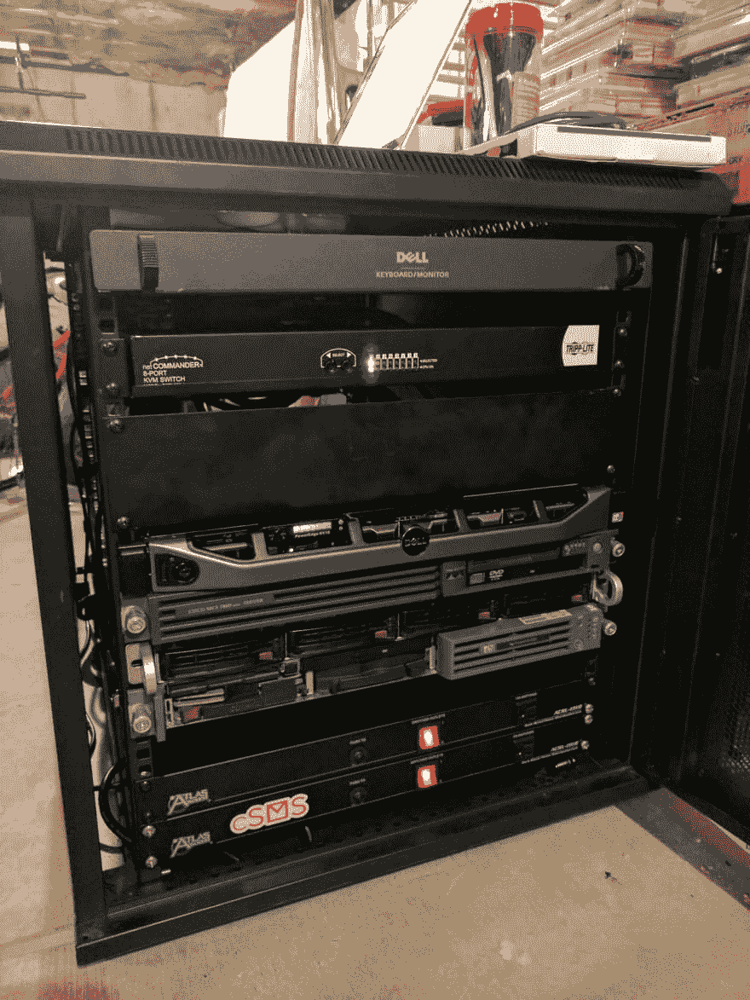

# Colo 迁移报告

> 原文：<https://dev.to/dechristopher/colo-migration-write-up--4p4g>

你好 [/r/homelab](https://reddit.com/r/homelab) ，DEV.to，以及任何在 KIWI 阅读这篇文章的人。简单介绍一下，我叫安德鲁。我经营着一个名为 [KIWI](https://kiir.us) 的大型游戏社区，运营着美国东海岸相当多最受欢迎的反恐精英服务器。我还是一个狂热的家庭劳动者和网络工程师，正在攻读计算机科学学士学位(还剩两年)。这篇博文将是一篇技术性很强的文章，它将超越被认为是“几维鸟”的正常界限，包含许多关于我个人项目和家庭实验室的信息。如果你对此不感兴趣，那么在这些照片把你套住之前，现在就离开吧！

首先，我在整个实验室场景中努力的简短历史:

我一直是那种尽可能尝试自我主持的人。这始于我在高中早期托管自己的网络文件存储和《我的世界》服务器。很快，craigslist 上的大量购买开始失控。我的实验室有许多老式的惠普和戴尔服务器，它们真的很难正常工作。

 老实验室(大约 2017 年初中)

 和冲锋陷阵

这些年来，随着对 DigitalOcean、Vultr、AWS 等的深入研究，我厌倦了每月为有计量带宽的垃圾虚拟硬件付费。现在是时候了，我准备开始一个真正的家庭实验室。上面的图片展示了我最早的实验室，处于一个非常不稳定的状态，有很多失败和很多学习经验。考虑到所有这些智慧，经过大量研究，我开始投资更好的硬件。我首先在易贝(*steeeeal*)花了不到 100 美元买了一台戴尔 R410，64G 内存，双核至强 E2650s。这台服务器运行着我家庭实验室中的大部分虚拟化工作负载。关于个人服务的更多信息将在本帖的后面部分提供。

随着计算资源的蓬勃发展，我意识到我需要一个更好的网络基础设施。在上面的图片中，有一个非常旧的 Dell PowerConnect 6024 千兆交换机。它很好地处理了我的需求，但是管理端口已经坏得无法修复，所以我根本无法配置它。平面网络很无聊，所以我买了一个很新的思科 Catalyst 3560G 24p，带 PoE。整洁！

 新装备进展顺利

#### 但是那个米色的架子看起来太俗气了...

是的。是的，确实如此。这就是为什么我花了几个星期的时间为我的实验室寻找一些全封闭的短机架。这是一个非品牌的 StarTech 24U 机架(我认为...)而且非常适合我的需求。带锁的门、可拆卸的侧板，最棒的是**方孔**！把我所有的设备都扔进这个东西里，让它完美地被电缆管理，这简直是一场爆炸。*旁注:我疯狂地爱上了完美的电缆管理。我真的很享受。讨厌我。不管怎样，看看这美景！*

 全额

 进退失据

#### 好吧，酷，但是颜色呢？

哦，对了，colo。这就是这篇文章的内容吗？开始了。

所以稍微解释一下:我不拥有 colo，我的公司拥有并支付费用。我们每个人都有自己的个人设备，我们的雇主有机架的上半部分，用于在不久的将来不可避免的云服务部门。colo 的特点:

*   42U 全深 APC 机架
*   1Gb 时提交 200Mb 95th
*   208V 时 30A 功率下降
*   24/7 钥匙卡访问
*   全天候音频和视频安全监控
*   在 DC 有很多工具和外围设备供我们免费使用
*   位于一栋不起眼的翻新工业建筑中

目前，我们机架中的一些硬件是从新泽西州迁移到我们位于科罗拉多州的旧工厂的。我们最近去了一趟那里，把所有的东西都拿走，然后和他们告别。距离太远了，事实上，对空间和带宽要求更高的大客户正在进入，这意味着当我们不可避免地续签合同时，价格会更高。

我个人拥有两台思科 UCS C240 M3s。其他大部分设备属于我的朋友，他做了很多事情，我不会在这里介绍，除了他运行最大的，也是唯一官方认可的，非官方的 EverQuest 经典服务器。

以下是一些最终产品的图片:

 驱、驱、驱...

 博科 ICX 6610-24 L2/L3 核心交换机

 野兽的腹部有两个 TrippLite PDUs 为它提供全部动力

 是的，底层服务器在架子上，完全没有插电。那又怎么样

现在，我们将深入了解我在我的实验室中做了什么，以及我在其上运行的其他项目达到了什么程度。

除非被广泛要求，否则我不会做全面的硬件分解。让我们开始列出我在实验室里做的一些事情:

*   Plex(我应该提到这一点吗？这是目前大多数实验室的主要工作)
*   这个博客(和一些其他项目的支持网站)
*   大量文件存储(我指的是超过 20TB 的大量文件)
*   当我在野外时，为我的设备提供客户端 VPN
*   我和几个朋友用 pfSense 做的站点到站点 VPN，用于分布式 labbing ( **谢谢松饼！我欠你一两个 VM，PM 我**
*   一个有 16GB 内存的 Pio-hole 盒子，我已经配置了我所有的家人、朋友和客户来使用(超过 200 个设备，峰值每分钟约 1000 次查找)
*   相当多的 CS:GO 服务器供我休闲和发展
*   相当多的 CS:GO 服务器用于我的游戏社区
*   我和几个朋友的私人 GitLab 服务器，用来保护我们的项目
*   windows 域(每个人都必须学习)
*   大量用于开发的微型虚拟机
*   超级时髦的 Grafana 仪表盘，用于*一切事物*

未来计划:

*   更多地使用 Docker(我是一个狂热的软件工程师，过去我经常使用它，但我更喜欢容器编排和微服务)
*   我现在的服务器带宽是 10g，但我喜欢使用更高的带宽，比如 40g 或上帝禁止的 100g**钱包在恐惧中尖叫**

所以，在这篇博客文章结束的时候，我强烈建议你问我任何问题。这个项目充满了错误和教训，所以让我与你分享我的经验。请在下面发表评论或在 Reddit [/u/dropslays](https://reddit.com/u/dropslays) 上 PM 我。

谢谢你的来访！

安德鲁·德克里斯多佛