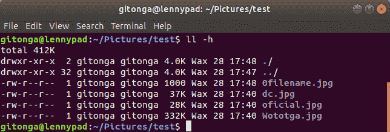

# 命令行界面照片转换

> 原文：<https://dev.to/egimba/command-line-interface-photographs-conversion-4fk>

[T2】](https://res.cloudinary.com/practicaldev/image/fetch/s--yrPMJTtQ--/c_limit%2Cf_auto%2Cfl_progressive%2Cq_auto%2Cw_880/http://egmgem.com/blog/wp-content/uploads/2018/06/Swiss-Or-Corkscrew-768x512.jpg)

在命令行上工作有一种神奇的感觉。当然，许多人觉得它超级深奥和神秘，但我喜欢它。Windows 世界真的把我宠坏了，让我习惯了图形用户界面。当然，还有命令提示符，对于那些想要更多功能的人来说，这是名副其实的 PowerShell，但这仍然没有打动我。切换到 Linux 后，我正在重新熟悉命令行界面(CLI)，我发现我对它的热爱越来越多。

在我的日常摄影工作中，我意识到我需要为某个项目生成图像的缩略图。我仍在探索 digiKam、RawTherapee 和 GIMP 的来龙去脉，但我内心的某些东西一直告诉我，对于这个特定的任务，CLI 工具更适合。所以我去寻找。我以前听说过并使用过 ImageMagick，但最初的搜索将我带到了 GraphicsMagick，我决定尝试一下。

安装之后，我用命令运行 GraphicsMagick

```
gm help
```

看看它有什么选择。在这些选项中，我感兴趣的是 convert 选项。在从手册页搜索关于它的帮助时，我找到了一个符合我需要的例子。我需要的完整命令是

```
gm convert -size 85x85 "infile.jpg" -resize 85x85 +profile "*" "outfile.jpg"
```

在用一个图像测试它时，它工作得很好，给出了我期望的输出。

下一步是试图弄清楚如何将这个命令应用于整个图像目录。我在谷歌上搜索如何做到这一点的指导。经过一番搜索，我发现了一个列表，我修改了它以满足我的特定需求，如下所示:

```
for i in *.jpg;
do
filename=${i%.*}
gm convert -size 85x85 "$filename.jpg" -resize 85x85 +profile "*" "$#filename.jpg"
done
```

我把它保存到一个文件 ***gmthumbs*** (因为我想做的是把全尺寸图像转换成缩略图)并使用

```
chmod 777 gmthumbs
```

使其可执行。

我运行了命令 ***。/gmthumbs*** 在一个测试目录中，我已经用一些图片建立了这个目录。

[T2】](https://res.cloudinary.com/practicaldev/image/fetch/s--g_XiYo5w--/c_limit%2Cf_auto%2Cfl_progressive%2Cq_auto%2Cw_880/http://egmgem.com/blog/wp-content/uploads/2018/06/Listing-1.png)

我没有得到预期的结果，因为只有第一个文件被转换并被赋予了新的名称(***【0filename.jpg】***)，如下图所示:

[T2】](https://res.cloudinary.com/practicaldev/image/fetch/s--wdQhmzFy--/c_limit%2Cf_auto%2Cfl_progressive%2Cq_auto%2Cw_880/http://egmgem.com/blog/wp-content/uploads/2018/06/Listing-2.png)

我在输出变量名上做了一些尝试，在输出文件名中只有英镑符号，添加了美元符号，然后，最终，删除了英镑符号，保留了美元符号。下面列出的最后一个选项给了我需要的结果。

```
for i in *.jpg;
do
filename=${i%.*}
gm convert -size 85x85 "$filename.jpg" -resize 85x85 +profile "*" ***"$filename.jpg"***
done
```

我现在唯一的问题是原始文件被转换后的文件覆盖。我需要它做的是将文件写入一个新目录。我添加了创建输出目录的命令，并修改了输出文件名变量，将其移动到新的输出文件夹中，如下面的清单所示

```
***mkdir output;***
for i in *.jpg;
do
filename=${i%.*}
gm convert -size 85x85 "$filename.jpg" -resize 85x85 +profile "*" "***output/***$filename.jpg"
done
```

在运行该命令并询问文件列表时，我发现原来的文件仍然完好无损，并且已经创建了一个新目录 ***output*** 。

[T2】](https://res.cloudinary.com/practicaldev/image/fetch/s--9cObaPy5--/c_limit%2Cf_auto%2Cfl_progressive%2Cq_auto%2Cw_880/http://egmgem.com/blog/wp-content/uploads/2018/06/Listing-3.png)

进入该目录，我发现转换后的文件在适当的位置。

[T2】](https://res.cloudinary.com/practicaldev/image/fetch/s--GV2H9AhA--/c_limit%2Cf_auto%2Cfl_progressive%2Cq_auto%2Cw_880/http://egmgem.com/blog/wp-content/uploads/2018/06/Listing-4.png)

成功！现在，我可以使用这个漂亮的脚本快速轻松地在任何文件夹中创建图像的缩略图。

在我结束之前，我想指出 ***feh*** ，这是我用来查看图像的命令行实用程序。不带任何选项直接运行它会将文件夹中的图像加载到一个窗口中，您可以滚动浏览该窗口。当我想从命令行查看我正在处理的图像而不需要加载庞大的 GUI 时，这非常方便！

现在开始探索我可以将哪些其他神奇的 CLI 工具整合到我的工作流程中。

资源:

https://www.imagemagick.org/script/index.php

http://www.graphicsmagick.org/

feh:[https://feh.finalrewind.org/](https://feh.finalrewind.org/)