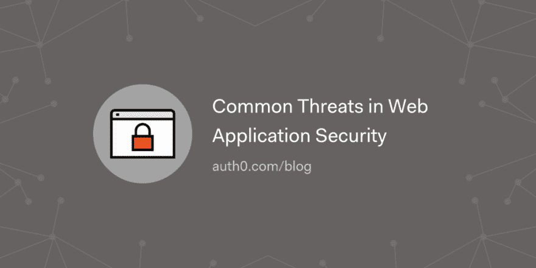

# Web 应用程序安全中的常见威胁

> 原文：<https://dev.to/auth0/common-threats-in-web-application-security-1dk4>

在本文中，我们将尝试涵盖一个全面的 web 应用程序安全策略，以防范 web 应用程序安全中的常见威胁并减轻它们的影响。

[读读🖥🔐](https://auth0.com/blog/common-threats-in-web-app-security/?utm_source=dev&utm_medium=sc&utm_campaign=web_app_security)

[T2】](https://res.cloudinary.com/practicaldev/image/fetch/s--zwU-rQFb--/c_limit%2Cf_auto%2Cfl_progressive%2Cq_auto%2Cw_880/https://thepracticaldev.s3.amazonaws.com/i/ecj8hqo96r539d2eggth.png)