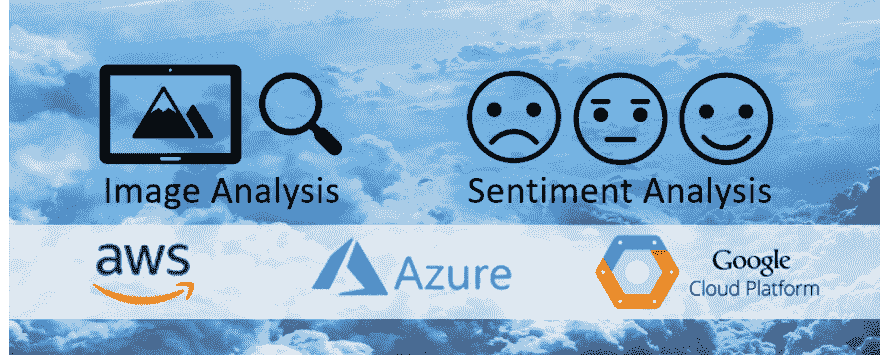
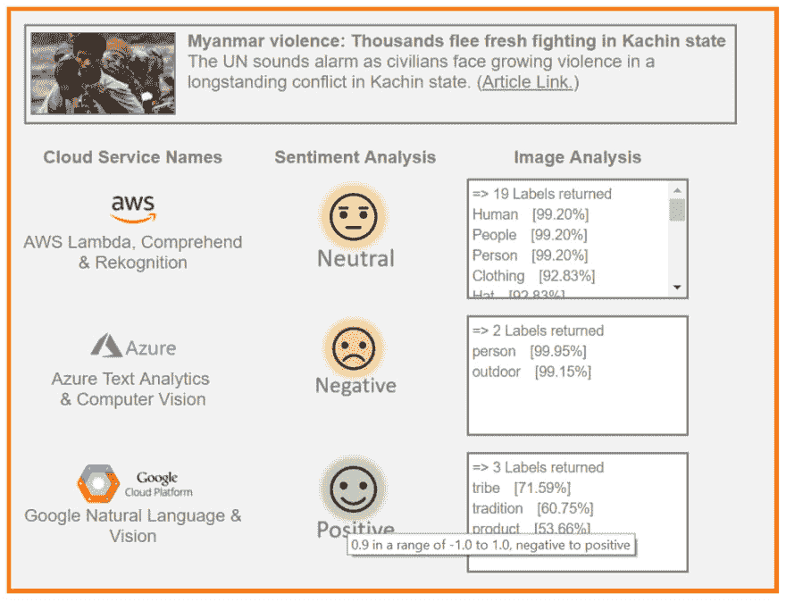
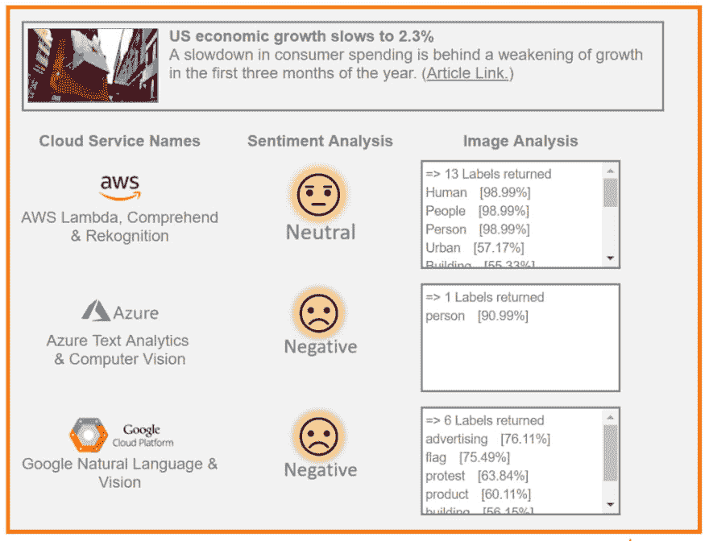
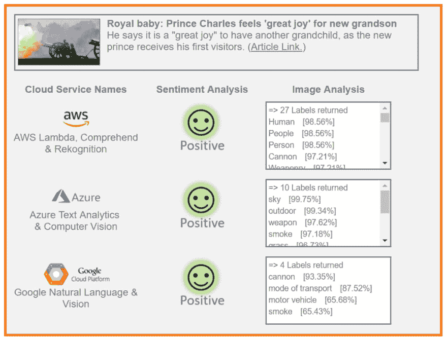
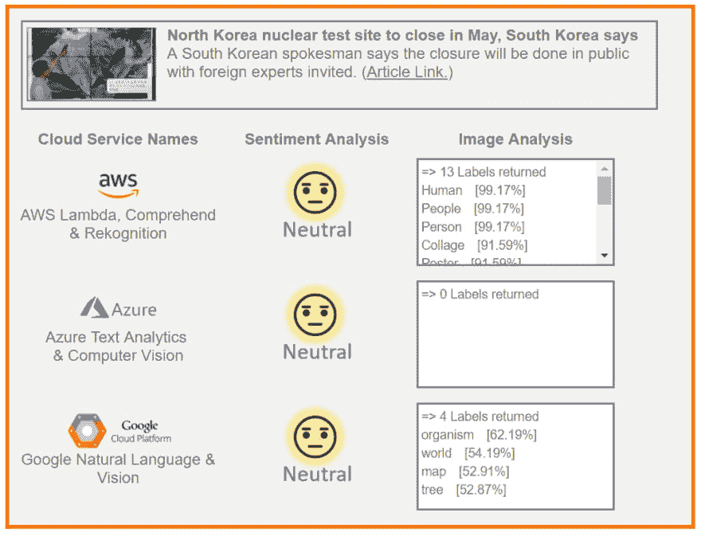
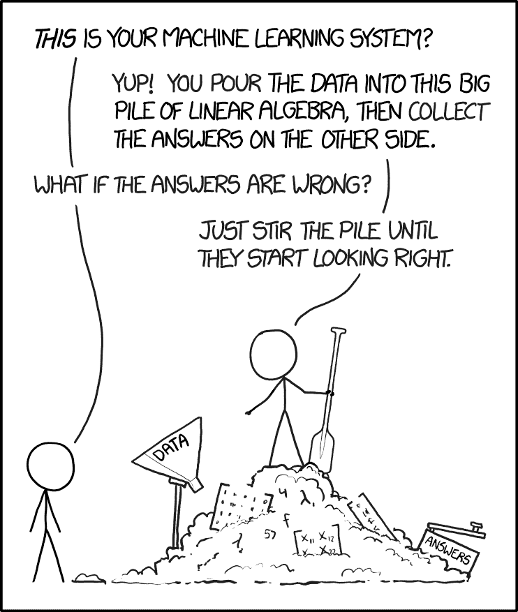

# 通过 BBC 新闻分析比较机器学习

> 原文：<https://dev.to/solacedevs/comparing-machine-learning-through-bbc-news-analysis-38fa>

 

<figcaption>对比两种基于云的机器学习能力:图像分析和情感分析</figcaption>

为您的应用程序利用机器学习(或人工智能)能力比以往任何时候都更容易。主要的云计算提供商以易于使用的方式提供这些功能，因此您可以快速开始构建应用程序。

但是，您知道不同提供商的实际结果可能会有很大差异吗？

我决定建立一个演示应用程序，使用两种机器学习能力来分析 BBC 新闻文章，并比较三大云提供商的结果:亚马逊的 [AWS](https://aws.amazon.com/) ，微软的 [Azure](https://azure.microsoft.com/) 和谷歌的[云平台](https://cloud.google.com/)。

你可以在这里 自己尝试应用 [**。**](http://london.solace.com/cloud-analytics/machine-learning.html)

### 什么是机器学习？

[机器学习](https://en.wikipedia.org/wiki/Machine_learning) (ML)是[人工智能](https://en.wikipedia.org/wiki/Artificial_intelligence) (AI)的一个分支，虽然这两个术语经常可以互换使用。它描述了计算机“T4”学习“T5”如何执行一个动作的能力，而不需要明确地告诉它如何去做，就像过去计算机的情况一样。它开启了一系列新的可能性。我最近看到了[这个](https://www.economist.com/news/special-report/21739431-artificial-intelligence-spreading-beyond-technology-sector-big-consequences)描述，它很好地总结了计算中的这种阶跃变化:

> 几十年来，计算机已经能够阅读文本和数字，但直到最近才学会看、听和说。

对于我的演示应用程序，我主要关注两个 ML 功能: [**图像分析**](https://en.wikipedia.org/wiki/Image_analysis) (又名计算机视觉)和 [**情感分析**](https://en.wikipedia.org/wiki/Sentiment_analysis) (又名自然语言处理)。

#### 什么是图像分析？

回到前面的引用，简单地说，图像分析是计算机现在“看见”的能力。更具体地说，这种“计算机视觉”是如何在照片中检测人脸的。或者这就是自动驾驶汽车可能如何不断地[处理](https://www.technologyreview.com/s/539841/one-camera-is-all-this-self-driving-car-needs/)它的周围环境，以检测前方正在过马路的行人。

在我的应用程序中，我使用这种能力来生成“标签”,以注释 BBC 新闻文章附带的中心照片。实际上，如果你看不到照片，就描述照片的内容。

#### 什么是情感分析？

情感分析就是简单地根据一篇文章的内容是积极的、中性的还是消极的来分类。例如，一个应用程序可以自动处理用户留下的产品反馈，如果反馈是负面的，就标记出来进行后续处理。营销部门也可能希望监控实时推文，如果有负面推文影响他们的品牌，就让其团队进行干预。

在金融服务领域，政治和商业新闻可以推动市场，因此对现场新闻的情绪分析可能会成为自动交易引擎的一项输入，自动交易引擎可以实时响应世界事件。

在我的应用程序中，我使用这个功能来“阅读”BBC 新闻文章的标题和描述，并提供它的情感。换句话说，关于正面事件的新闻是中性的还是负面的？

### 目前为止的观察结果…

#### 并非所有的机器都生而平等

正如开始提到的，我很惊讶地看到三个提供商的结果有所不同。下面是一个示例结果，其中他们对文章观点的看法不一致:

 

<figcaption>三家供应商的 ML 结果不一致的示例。</figcaption>

作为人类，我们很清楚这是一条令人悲伤和痛苦的消息，但谷歌的自然语言服务认为它在情感上是积极的。事实上，分数是 0.9，其中 1.0 代表积极情绪的最大值。令人惊讶的是，为什么诸如“新的战斗”、“日益增长的暴力”和“冲突”等词没有将它牢牢地引入负面情绪领域。Azure 的[文本分析](https://azure.microsoft.com/en-us/services/cognitive-services/text-analytics/)在这个例子中做得最好。

AWS 的[领悟](https://aws.amazon.com/comprehend/)所决定的中性情绪，在这里也值得强调。这项服务似乎经常为了安全起见，对“中立”的“中立”评估是其主导立场:

<figcaption>AWS 单独提供离群结果的例子。</figcaption>

更令人高兴的是，虽然每个人都喜欢一个新的王室宝宝的消息，但这似乎很普遍:

 

<figcaption>一致同意的结果的例子。</figcaption>

### 一幅画描绘了多少个字？好吧，我告诉你…

您可能已经注意到，前面的三个例子也显示了图像分析能力的巨大差异。

与 Azure 的[计算机视觉](https://azure.microsoft.com/en-us/services/cognitive-services/computer-vision/)和谷歌的[视觉](https://cloud.google.com/vision/)服务相比，趋势似乎是 AWS 的[重新认知](https://aws.amazon.com/rekognition/)为每张图像产生更多的标签。快速扫描还显示出大多数标签也与图像相关。事实上，与情绪分析的“骑墙”方法相比，图像分析功能更具侵略性，并提供更多可能与图像相关的“推断”标签。

比如皇家宝贝[文章](http://www.bbc.co.uk/news/uk-43876299)有一个皇家马炮鸣放 41 响礼炮的图像。虽然只看到了发射的枪、烟柱和 3 名服务人员，但它为该图像生成了多达 27 个标签:

***“人，人，人，大炮，武器装备，烟雾，*** *机场，* ***武器，机场，*** *发动机，机车，机器，马达，蒸汽机，火车，交通工具，车辆，飞机，飞机，喷气式飞机，* ***军队，陆军，军装，士兵，团队，部队，*** *战机”。*

Azure 和 Google 似乎更具可比性，因为它们的数量更少(更专注？)标签产生。也就是说，如果服务没有完全被难住，没有产生任何东西，就像 Azure 在这里做的那样:

<figcaption>Azure 是一个产生了零标签的离群值的示例结果。</figcaption>

### 总结…

这是迄今为止我的发现的一个非常高层次的总结。这绝不是一个全面的审查。演示应用程序可供您提交文章选择进行分析，并更好地形成您的结论:

[**http://London . solace . com/cloud-analytics/machine-learning . html**T3】](http://london.solace.com/cloud-analytics/machine-learning.html)

一如既往，正确选择机器学习提供商将取决于您自己的使用需求。例如，这些需求将决定为图像生成的一组冗长的标签是否有用，或者*少于*实际上是否更多。

我们或许可以从中吸取一点，机器学习已经取得了巨大的进步，但是我们离智能机器人取代我们所有的工作还有很长的路要走！这个系统仍然需要一点[更多的搅拌](https://xkcd.com/1838/):

<figcaption>xkcd.com 对机器学习</figcaption>

请务必让我知道你的想法。我有一个程序随时待命，对这个帖子的评论进行情感分析，并自动用相关的表情符号进行回复。

[T2】](https://res.cloudinary.com/practicaldev/image/fetch/s--BU7QFmHS--/c_limit%2Cf_auto%2Cfl_progressive%2Cq_auto%2Cw_880/https://cdn-images-1.medium.com/max/650/0%2AioDDrg_mh5zJScpi)

*最初发表于*[*【https://www.linkedin.com】*](https://www.linkedin.com/pulse/comparing-machine-learning-through-bbc-news-analysis-jamil-ahmed/)*。*