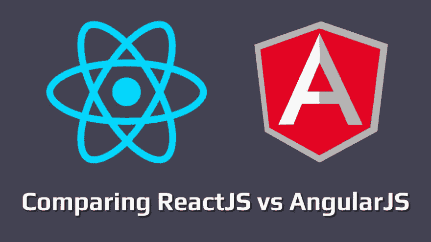

# 2018 年 AngularJS VS React 对比

> 原文：<https://dev.to/amitkhirale/comparison-between-angularjs-vs-react-in-2018-1i84>

 
在本文中，我们比较了前端开发最流行的两种技术:Angular 和 React。我们将从项目架构师、开发人员以及公司的角度对它们进行比较。

比较角度和反应是时下非常流行的话题。React 和 Angular 都是非常先进的、被广泛采用的 JavaScript 技术，我们用它们来创建响应性 web 应用程序和交互式单页面应用程序。用于快速单页面应用程序(SPAs)开发的 JavaScript 工具的数量在不断增长，因此为 web 开发人员选择正确的框架更具挑战性。

# 对比角度 vs 反应

AngularJS(框架)和 React(库)的主要区别是组件化、数据绑定、性能、依赖解析、指令和模板化。让我们详细看一下这些方面。

**角型**

Angular 版本 2 和更高版本出现的时间比 React 少，但是如果你把它的前身 AngularJS 的历史计算在内，情况就变得平衡了。它由谷歌维护，用于分析、广告词和谷歌光纤。由于 AdWords 是谷歌的关键项目之一，很明显他们在这上面下了很大的赌注，而且不太可能很快消失。

**反应**

React 由脸书开发和维护，也用于他们的产品，如 Instagram 和 WhatsApp。它已经存在了大约四年半，所以它并不算新。它也是 GitHub 上最受欢迎的项目之一，在撰写本文时有大约 92，000 颗星。我觉得不错。

**组件化**

**角型**

AngularJS 有一个非常复杂和固定的结构，因为它基于典型的单页应用程序的模型-视图-控制器架构。AngularJS 中的一个对象$scope 负责模型部分，它由控制器初始化，然后转换成 HTML，为用户创建视图。AngularJS 提供了许多标准服务、工厂、控制器、指令和其他组件。

我们在 AngularJS 中将代码分成几个文件。例如，当我们用自己的指令、控制器和模板创建一个可重用的组件时，我们必须在一个单独的文件中描述每个代码块。一旦我们描述了我们的指令，我们就在指令中添加一个到模板的链接来耦合这些部分。AngularJS 指令代表应用程序的模板逻辑。该模板是用 AngularJS 指令扩展的 HTML，通常写成标签或属性。我们还添加了控制器，为我们的模型提供必要的$scope 或上下文。控制器也写在单独的文件中。当我们以这种方式模块化我们的应用程序时，我们可以在网站的不同部分重用我们的模板或组件，这对 **[AngularJS 开发公司](https://www.angularminds.com/angularjs-development-company.html)** 非常有帮助，因为它节省了大量时间，加快了开发过程。

**反应**

用 React 构建的应用程序没有“正确”的结构，它是一个大型的 JavaScript 库，帮助我们为用户更新视图。但是 React 仍然不允许我们自己创建应用程序。该库缺少模型和控制器层。为了填补这个空白，脸书引入了 Flux 来控制应用程序的工作流程，如今 Flux 已经有了很多变种。
React 提供了一种非常简单有效的构建组件树的方法。它拥有一种函数式编程风格，其中组件定义是声明性的。从 React 组件编写应用程序就像从函数编写 JavaScript 程序一样。

## 数据绑定

在 MVC 模式中，绑定是单向或双向传递数据的最重要的主题。数据绑定是模型和视图组件之间的数据同步过程。

**角型**

Angular 应用程序中的数据绑定是模型和视图组件之间的数据自动同步。Angular 实现数据绑定的方式让您可以将模型视为应用程序中的单一事实来源。视图始终是模型的投影。当模型改变时，视图反映了变化，反之亦然。它只是以同步的方式将数据从模型附加到视图，反之亦然，因此无论何时任何模型或视图发生任何变化，其他模型或视图都应显示该变化，这就是同步。

**反应**

react 最好的特性是 Virtual-Dom。React 在构造时将数据注入到其呈现的视图中，无论是在创建根视图时还是通过嵌套视图。React 使用单向数据绑定，这意味着我们只能单向控制数据流。在类内部，传递的数据是通过当前上下文的 props 属性访问的。

## 表现

**角型**

当我们谈论 Angular 的性能时，有两点需要考虑。正如我们之前提到的，Angular 1.x 和更高版本依赖于双向数据绑定。这个概念基于“脏检查”，这种机制会使我们的 AngularJS 应用程序开发滞后。

当我们将 HTML 中的值与我们的模型绑定时，AngularJS 为每个绑定创建一个观察器来跟踪 DOM 中的变化。视图更新后，AngularJS 将新值与初始值进行比较，并运行$digest 循环。然后$digest 循环不仅检查实际上已经更改的值，还检查通过观察器跟踪的所有其他值。这就是为什么如果您的应用程序有太多的观察器，性能会下降很多。

AngularJS 框架的另一个缺点是它处理 DOM 的方式。与 React 不同，AngularJS 在浏览器中应用真实 DOM 中的更改。当真正的 DOM 更新时，浏览器必须改变许多内部值来表示一个新的 DOM。这对应用程序性能也有负面影响。
表现不佳是 Angular 2 支持者重新研究 Angular 如何改变节目状态的主要原因。Angular 2 和最新的 Angular 4 框架版本也具有类似 React 的服务器端渲染和单向数据绑定功能。尽管如此，Angular 2 和 Angular 4 还是提供了双向数据绑定选项。

**反应**

React 引入了虚拟 DOM 的概念，这是 React 与 AngularJS 相比最大的优势之一。虚拟 DOM 是如何工作的？当我们的 HTML 文档被加载时，React 从 JavaScript 对象创建一个轻量级 DOM 树，并将其保存在服务器上。当用户在浏览器的字段中输入新数据时，React 会创建一个新的虚拟 DOM，然后将其与之前保存的 DOM 进行比较。该库以这种方式发现两个对象模型之间的不同之处，并再次重建虚拟 DOM，但使用新的更改后的 HTML。所有这些工作都在服务器上完成，这减轻了浏览器的负载。
现在，React 不再向浏览器发送全新的 HTML，而是只发送已更改元素的 HTML。这种方法比 AngularJS 提供的方法更有效。

## 解析依赖关系

**角型**

依赖注入是一种软件设计模式，在这种模式中，组件被赋予它们的依赖关系，而不是将它们硬编码在组件中。这使组件不必定位依赖关系，并使依赖关系可配置。这有助于使组件可重用、可维护和可测试。AngularJS 自动找到作为$routeParams、$filter、store 和$scope 参数注入的适当对象。AngularJS 框架中有两个函数使得依赖注入成为可能:$inject 和$provide。

**反应**

React 和 AngularJS 在依赖注入方面的区别在于，React 没有为依赖注入提供任何内置容器的概念。但这并不意味着我们必须想办法在 React 项目中注入依赖项。您可以使用几个工具在 React 应用程序中自动注入依赖项。这些工具包括 Browserify、RequireJS、ECMAScript 6 模块，我们可以通过 Babel、ReactJS-di 等使用这些模块。唯一的挑战是选择一个工具来使用。

## 指令和模板

**角型**

AngularJS 中的指令是一种围绕 DOM 组织代码的方式。如果使用 AngularJS，我们只能通过指令访问 DOM。AngularJS 有很多标准的指令，比如 ng-bind 或者 ng-app，但是有时候我们会在 AngularJS 中做自己的指令，把数据插入到模板中。模板必须有一个元素，其中我们的指令作为属性编写。就这么简单。但是 AngularJS 指令，如果定义充分，是复杂的。我们在指令中返回的带有设置的对象包含大约十个属性。templateUrl 或 template 之类的属性很容易理解。

**反应**

React 不提供模板、指令或模板逻辑的划分。模板逻辑应该写在模板本身中。要查看这是什么样子，请打开 GitHub 中的一个示例。你会注意到 React 的组件应用。TodoItem 是用标准的 React.createClass()方法创建的。我们将一个带有属性的对象传递给这个函数。像 **componentDidUpdate** 、shouldComponentUpdate、handleKeyDown 或 handleSubmit 这样的属性代表了逻辑——我们的模板将会发生什么。在组件的最后，我们通常会定义 render 属性，这是一个要在浏览器中呈现的模板。一切都位于一个地方，模板中的 JSX 语法很容易理解，即使你不知道如何在 JSX 写。很清楚我们的模板将会发生什么，它应该如何呈现，以及属性将为它呈现什么信息。

## 结论:

当你进入讨论的底部时，现在你对两个框架以及哪个对 web 应用程序开发更好已经很清楚了。因此，如果你决定选择其中之一，那么这里是我的意见。如果你试图开发一个基本的网络应用程序，那么两者都可以使用。尽管如此，ReactJS 是搜索引擎优化友好的，实时的，并与繁忙的交通兼容。然而，AngularJS 提供了平稳的开发和测试以及可靠性。