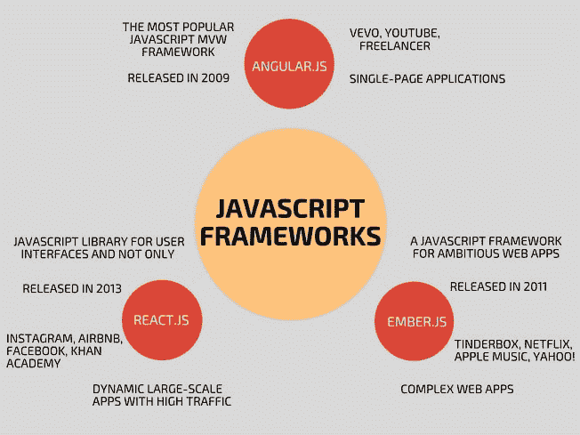

# JavaScript 框架对比:Angular.js vs React.js vs Ember.js

> 原文：<https://dev.to/julia_qubit/comparison-of-javascript-frameworks-angularjs-vs-reactjs-vs-emberjs--1d60>

JavaScript 被认为是最好的编程语言之一，被广泛用于创建多功能 web 应用程序、设计可伸缩且响应迅速的界面、实时更改网站等。

如果你想创建一个基于 JavaScript 的网站或应用程序，为你的项目选择一个合适的框架是至关重要的。如果您的选择是正确的，它可以极大地简化您的开发过程，保持您的代码有组织，确保最终产品的按时交付和整体成功。

为什么选择 JavaScript 框架
基本上，框架是一个允许通过执行某些功能来简化编码的程序。

低成本——大多数 JavaScript 框架都是免费的，所以您不需要花钱购买授权软件。此外，这些框架可以大大节省开发人员的时间，降低网站或应用程序创建的整体价格。

高效率——使用框架，开发人员可以在几分钟内使用预构建的功能，并避免数百行代码。开发过程变得更加高效，最终产品不仅可以按时交付，还可以在截止日期之前交付。

支持——几乎所有的 JavaScript 框架都是开源的，因此得到了大型在线社区的支持。这些分布式工具正在不断地被丰富，在网上有适当的文档、大量的指南和教程，如果有任何问题，你可以随时向社区求助。

安全性——如果框架被广泛使用并且是顶级框架之一，那么它就有可靠的安全安排。事实上，它的用户也是长期测试者，所以如果有任何漏洞或错误，他们会在框架的官方网站上报告。

顶级 JavaScript 框架
JavaScript 开发人员可能会对这种编程语言的框架数量感到困惑。但是，有一些经过时间检验的框架是最受编码人员欢迎的，比如 Angular.js、React.js 和 Ember.js，让我们仔细看看它们。

**Angular.js**
棱角分明。JS 发布于 2009 年，这使得它成为迄今为止最古老的框架。它主要用于创建单页面 web 应用程序，已经赢得了最大社区的信任，并得到了 Google 的支持。

赞成的意见

1.  快速代码生成；

2.  直观的改变和用户界面设计；

3.  与 DOM(文档对象模型)的双向数据绑定；

4.  易于测试；

5.  适当的文件；

6.  谷歌的支持，推动创新的实施；

7.  大型社区准备协助使用该框架。

骗局

1.  具有大量交互元素的页面性能较低；

2.  当涉及到单页应用程序时，搜索引擎的可索引性问题；

3.  复杂的第三方集成；

4.  调试的麻烦。

**React.js**
React.js 其实是一个开源的 JavaScript 库，站在 Instagram 和脸书 UI 后面的那个。难怪，因为 React.js 自然已经证明了它对于高流量的动态大规模 app 的效率。React.js 由于其显著的性能而遥遥领先于其他框架，这也是它拥有增长最快的社区的原因。

赞成的意见

1.  简单易学的 API 和界面；

2.  更新更快；

3.  海量数据集的高效渲染；

4.  非常适合调试；

5.  React 本机库；

6.  用于 HTML 引用和呈现子组件的 JSX (JavaScript 扩展语法)；

7.  容易导入组件。

骗局

1.  对初学者来说比较难；

2.  缺乏适当的文件；

3.  第三方集成的麻烦；

4.  一些开发人员不认为它是一个完整的框架，而是一个库。

**Ember.js**
Ember.js 实际上是 SproutCore 框架的一个分支。在构建交互式用户界面方面，它可以与 Angular.js 和 React.js 这样的庞然大物竞争。事实上，它针对的是这些框架的最佳特性——双向绑定和服务器端呈现。Ember.js 由一个活跃的社区支持，是一个非常有前景的 JavaScript 框架。

赞成的意见

1.  高性能；

2.  服务器端渲染；

3.  完善的文档；

4.  双向数据绑定；

5.  自我配置。

骗局

1.  处理快速变化的复杂性；

2.  最重的框架；

3.  较小的社区和网上大量过时的教程；

**Javascript 框架对比**

Angular.js

2009 年发布的最流行的 JavaScript MVW 框架

首页:【https://angularjs.org/】
GitHub:[https://github.com/angular/angular.js](https://github.com/angular/angular.js)
用于 Vevo，YouTube，自由职业者
用于单页应用
React.js

一个用于用户界面的 JavaScript 库而不仅仅是 2013 年发布的
首页:【https://reactjs.net/】
GitHub:[https://github.com/facebook/react](https://github.com/facebook/react)
用于 Instagram、Airbnb、脸书、可汗学院
用于高流量的动态大型 app
ember . js

2011 年发布的雄心勃勃的网络应用程序 JavaScript 框架

主页:【https://emberjs.com/】
GitHub:[【https://github.com/emberjs/ember.js】](https://github.com/emberjs/ember.js)
用于火绒、网飞、苹果音乐、雅虎！
对于复杂的网络应用

**如何选择一个 JavaScript 框架？**
如果你的目标是快速的 web 开发和原型制作，毫无疑问 JavaScript 框架将是你最好的朋友。然而，即使在深入研究之后，一些 JavaScript 开发人员可能会发现很难最终选择一个框架来工作。难怪！在阅读这篇关于 JavaScript 框架比较的文章时，您可能已经注意到它们都有许多共同点，并且伴随着某些好处和痛点。但是，决定正确的 JavaScript 框架并不在于它的特性。您应该对您的项目目标和需求有深刻的理解，并思考您的开发过程如何从选择这个或那个框架中获益。例如，如果你想快速建立一个单页面应用程序，你可能会选择 Angular.js。如果你的项目是关于高流量和大规模的应用程序，React.js 将是一个更好的决定。一些开发人员甚至设法将 React.js 与其他框架配对，将其用作库。

关于如何选择正确的框架，没有通用的建议。在选择一个之前，一定要分析你的项目的大小，特点，一般用途，性能，交通等。充分利用 JavaScript 框架的开源优势，不要忘记它们背后的大型社区。如果你有疑问，只需询问社区即可。最后，您可以联系专业的 JavaScript 开发公司，甚至雇佣 JavaScript 开发人员，使用最适合您项目的框架来构建出色的 web 应用程序。

最初发布于[https://qubit-labs . com/comparison-of-JavaScript-frameworks-angular-js-vs-react-js-vs-ember-js/](https://qubit-labs.com/comparison-of-javascript-frameworks-angular-js-vs-react-js-vs-ember-js/)