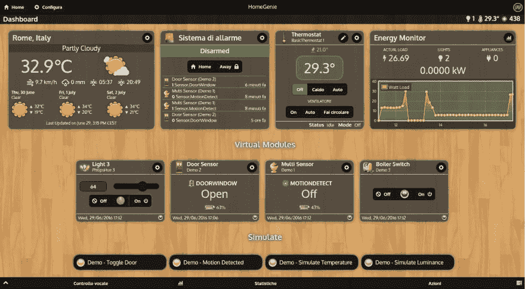

# 基于组件的 web 与 zuix.js

> 原文：<https://dev.to/genejams/component-based-web-with-zuixjs-3eha>

 <small>虽然这篇文章中的主题可能仍然是真实的，但是这些内容引用了一个旧版本的 *zuix.js* 库。最新文档见 [zuix.js](https://zuixjs.org) 网站。</small> 

* * *

## 开头

当我在 2016 年 12 月开始编写 [zuix.js](https://zuixjs.org) 时，我的意图是重新整理并创建一个库，它来自我在 2012 年为 HomeGenie web UI 编写的一些代码。

在下面的图片中，你可以看到旧的，但仍然很好的 HomeGenie web UI。

[T2】](https://res.cloudinary.com/practicaldev/image/fetch/s--g-wdbB2i--/c_limit%2Cf_auto%2Cfl_progressive%2Cq_auto%2Cw_880/https://genielabs.github.io/HomeGenimg/docs/dashboard_page_01.jpg)

这个智能家居软件很酷的一点是，人们可以通过使用集成的 web 编辑器定制和编写新的小部件(你可以在[小部件](https://homegenie.it/content/devs/widgets/)文档页面中了解更多信息)。

因此，在编写这个新 UI 库的过程中，我最终创建了 *zuix.js* ，它通过引入可加载内容、组件、延迟加载、模板、主题化等概念，远远超越了 HomeGenie 小部件。

## 创建一个组件

例如，我们将创建一个显示当前日期和时间的“时钟”组件。
首先我们将`zuix.min.js`库包含在文档的`head`部分:

```
<script src="https://cdn.jsdelivr.net/npm/zuix-dist@1.0.0/js/zuix.min.js"></script> 
```

Enter fullscreen mode Exit fullscreen mode

然后我们为`mytime`组件创建 3 个文件:

*   components/mytime.css
*   components/mytime.html
*   组件/mytime.js

为了在主`index.html`文件中实际加载组件，我们添加了下面一行:

```
<div data-ui-load="components/mytime"></div> 
```

Enter fullscreen mode Exit fullscreen mode

就是这样，super-duper easy **=)** 见下面的实例。

[https://glitch.com/embed/#!/embed/mytime?previewSize=100&path=index.html](https://glitch.com/embed/#!/embed/mytime?previewSize=100&path=index.html)

简单的内容和模板也可以以类似的方式拆分和加载，但是没有`.js`文件，并且用`data-ui-include`属性代替了`data-ui-load`。

[https://glitch.com/embed/#!/embed/mdlcard?previewSize=100&path=index.html](https://glitch.com/embed/#!/embed/mdlcard?previewSize=100&path=index.html)

## 复用性最好

可重用性概念是组件固有的。所以，这没什么新鲜的。但是，如果我们可以使用和重用跨网站的组件、内容和模板，而不需要创建副本，会怎么样呢？

[https://glitch.com/embed/#!/embed/reuse?previewSize=100&path=index.html](https://glitch.com/embed/#!/embed/reuse?previewSize=100&path=index.html)

仔细看看上面的例子，我们会发现我们正在加载两个组件，它们实际上存储在两个不同的主机上( *mytime.glitch.me* 和 *mdlcard.glitch.me* )。

## 提升性能

懒惰加载是这个库的一个内置特性，它可以通过仅在内容和组件在屏幕上可见时加载它们来提高网站速度。
在处理大数据集时，这可以带来巨大的不同。

[https://glitch.com/embed/#!/embed/lazyload?previewSize=100&path=index.html](https://glitch.com/embed/#!/embed/lazyload?previewSize=100&path=index.html)

## 更多例子

好了，对于介绍来说，这已经是很多信息了，所以现在我将为那些想要进一步探索或者做出贡献的人留下一些链接。

*   [zuix.js](https://zuixjs.org)
    图书馆网站，提供文档和示例。

*   zKit
    一个为现代网络准备的现成组件的集合。

*   [Web Starter 项目](https://github.com/zuixjs/zuix-web-starter)
    如果你熟悉 *Node.js* 你可能会喜欢 *zuix-web-starter* 这是一个“空白”的 Web 项目，具有 LESS、Markdown、Minify、ESlint 检查、自动资源打包、PWA 优化等等功能。

*   [HGUI](https://github.com/genielabs/homegenie-web-ui)
    物联网仪表盘(基于 *zuix-web-starter* )。

同时，如果你有任何问题或者只是想说声“嗨”,请在下面留下你的评论。

阅读下一篇:

[](/genejams) [## 从头开始移动 web 应用程序布局

### { Gene } Jul 22 ' 182min read

#showdev #webdev #javascript #zuixjs](/genejams/mobile-app-layout-from-scratch--5ch9)