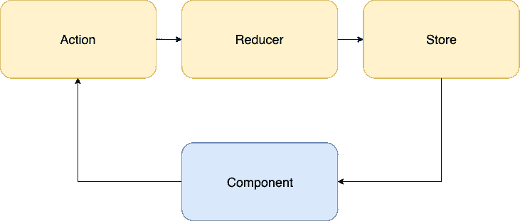
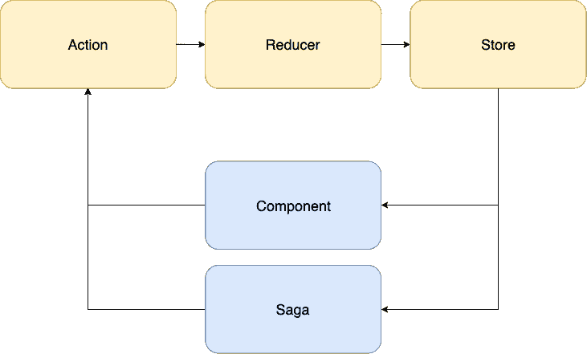

# Redux 和 Sagas 的概念漫游

> 原文：<https://dev.to/simme/conceptual-walkthrough-of-redux-and-sagas-38fd>

在我们深入研究 redux 和 sagas 之前，最好先了解一些背景知识。

## Redux 是什么？

引用 https://redux.js.org/的自述:

> Redux 是 JavaScript 应用程序的可预测状态容器。它帮助您编写行为一致、在不同环境(客户机、服务器和本机)中运行、易于测试的应用程序。

如上所述，Redux 是 web 应用程序的状态容器。它提供了一个简单的接口，用于将动作分派给 reducers(我们稍后会讲到)，这导致了其他组件(或 Sagas)可能会做出反应的状态之间的转换。Redux 最明显的用例是将它与 React 或 Angular 这样的前端框架一起使用，这两个框架都已经建立了成熟的软件包，便于集成。

尽管如此，Redux 应该被视为一种架构模式，而不是一个产品/库。参见[Redux.NET](https://github.com/GuillaumeSalles/redux.NET)、 [godux](https://github.com/luisvinicius167/godux) 和 [pydux](https://github.com/usrlocalben/pydux) 关于除 javascript 之外的其他语言的实现。

## 零件

让我们看一个插图。你的第一反应很可能是“嗯，这看起来没那么复杂”。事实是，它真的不是。到目前为止，Redux 最难的是开始。

[T2】](https://res.cloudinary.com/practicaldev/image/fetch/s--zhFA_Xgb--/c_limit%2Cf_auto%2Cfl_progressive%2Cq_auto%2Cw_880/https://simme.dimg/redux-flow.png)

### 商店

**存储**实际上与我们已经以某种方式存储在每个组件或组件控制器中的本地状态没有什么不同(取决于所使用的框架)。它是一个集中的，最好是不可变的，代表应用程序的对象图。

### 组件

**组件**依次对商店描述的状态做出反应。这可能采取呈现视图、在列表中可视化项目、调用可用动作等形式。

与这些组件的交互可能反过来将动作分派回“分派器”，与 flux 相反，这是我们不必考虑的事情，因为它是由库本身提供的。

### 动作

然后，**动作**将流经**还原器**，根据它们的过滤标准，还原器可能会创建一个新状态来替换当前存储的状态。应该努力确保**还原剂不会有任何副作用**。

## 所以，要提供一个 TL；博士:

*   存储区包含表示当前应用程序状态的对象图。
*   组件对状态作出反应，并提供可能产生动作的交互机会。
*   动作被传递给 reducers，它将创建一个新的状态来替换以前的状态
*   重复

* * *

## 什么是传奇？

抛开这些不谈，让我们也试着去理解传奇的概念。

saga 由一个或多个生成器函数组成，这些函数对某些动作做出反应，从而执行异步工作或产生副作用。我喜欢把它们想象成后台工作人员，可以卸载传统上由每个控制器和/或服务执行的异步工作。

[T2】](https://res.cloudinary.com/practicaldev/image/fetch/s---HjjM8sv--/c_limit%2Cf_auto%2Cfl_progressive%2Cq_auto%2Cw_880/https://simme.dimg/redux-saga-flow.png)

### 发电机功能

生成器(或生成器函数)不同于函数，因为它们不一定要运行到完成。相反，可以根据需要多次暂停执行，让其他代码运行。

需要注意的一点是，被暂停的生成器在没有被指示的情况下无法恢复执行。那么，我们如何管理生成器函数的暂停和恢复行为呢？

### yield 关键字

Yield 是在 ES6 (2015)中引入的，可视为发电机功能的等效回报。

它暂停当前生成器函数的执行，并返回一个 IteratorResult 对象，该对象具有两个属性值—包含 yield return —和 done，后者是一个布尔值，指示是否已到达生成器函数的末尾。然后，生成器将保持暂停状态，直到调用它的 next()函数，在调用上一个 yield 函数之后，它将继续执行。

关于发电机功能的更多信息，请访问[戴斯](https://dev.toundefined)并阅读他的[优秀文章](https://medium.com/@hidace/javascript-es6-generators-part-i-understanding-generators-93dea22bf1b)。

## 结论

当然，关于 redux、sagas 和生成器函数还有很多要谈的。然而，我希望您会发现这个简短的介绍有助于掌握核心概念。

在 [**第二部分**](https://simme.dev/posts/redux-and-sagas-2) 中，我们将通过在 typescript react 应用程序中实践来继续探索 redux 和 sagas。