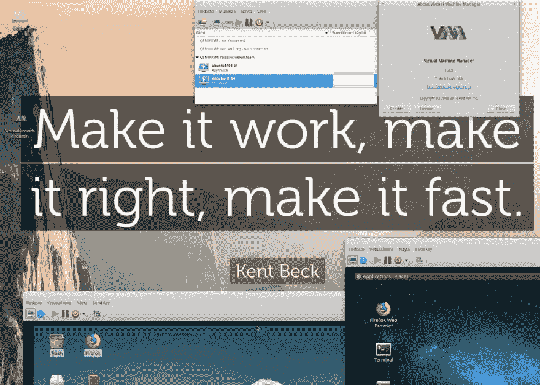

# 一位开源贡献者的自白

> 原文：<https://dev.to/xet7/confessions-of-an-open-source-contributor-2a1i>

如果你听说过叫做 [Wekan](https://wekan.github.io) 的开源看板，那么你可能也听说过我叫 xet7。我是 Wekan 上的开源爱好者贡献者。并决定与这个了不起的 dev.to 社区分享我的日常旅程，以交流知识。以下是我的自白，表明我和其他开源贡献者一样，有着不同但典型的生活。也许我们能找到共同点，谁知道呢？

> 你赶时间吗，还是我们应该用电脑来做这项工作？

## 我通常不花时间去做的事情

幸运的是，我通常不安装 Windows 及其更新。我在我领导的书呆子俱乐部(nerd club)的朋友们正试图为 Vista age 17”笔记本电脑安装 Windows 10 更新，这些笔记本电脑使用传统硬盘(不是固态硬盘)，目前还没有预算更换为固态硬盘。更新需要很多天，如果他们碰巧工作的话。那些笔记本电脑应该在一些课程中用来教学生。我不知道为什么他们不能在教学中使用 Linux。

## 几个月前:服务器调试

几个月前，我在使用 Wekan [捐赠的服务器](https://blog.wekan.team/2018/01/wekan-progress-on-x64-and-arm/index.html)时遇到了一些崩溃/重启问题。花了很多时间和支持一起调试，崩溃的原因是我确实在服务器上运行了 LXDE desktop 和 VirtualBox，它们在服务器上争夺一些有限的资源。我也能够在我的笔记本电脑上复制同样的行为。我用 x2go 连接到那个桌面。解决方案是我将移除 LXDE desktop 和 VirtualBox，并使用基于 libvirt 的 virt-manager GUI 桌面客户端。有了它，我可以通过 ssh 连接将远程桌面 VNC 连接到服务器，以查看服务器上运行的虚拟机。

[T2】](https://res.cloudinary.com/practicaldev/image/fetch/s--ST-yh3Xr--/c_limit%2Cf_auto%2Cfl_progressive%2Cq_auto%2Cw_880/https://thepracticaldev.s3.amazonaws.com/i/g4pbpuvqe6e8bq2dq9u4.png)

我还没有想出如何建立 VirtualBox。ova 文件，因为我没有让 VirtualBox 在 KVM/QEMU 中运行。我可能需要使用 [https://packer.io](https://packer.io) 或其他工具。

## 在我的笔记本电脑上构建快照包

曾几何时，snap build 服务器出现了错误，因此构建失败，而 snapcraft 的错误在 repo 中有一个尚未发布的修复程序，因此[我想出了如何从 source](https://github.com/wekan/wekan-snap/issues/58) 安装 snapcraft 并在我的笔记本电脑上构建 snap 包。那些 bug 前段时间已经修复了。

## 回答 GitHub 问题

我确实收到了每一个新的 GitHub 问题和评论的邮件。我确实喜欢它，因为我的电子邮件过滤器可以整齐地组织收到的电子邮件。有时会有关于制造一个能回答一般问题的机器人的讨论，但是还没有那么多重复的问题。当其他 Wekan 贡献者也回答 GitHub 问题并发送 pull 请求时，这是非常好的。

## 日常生活中，没有代码相关的进展

*   有些日子，咖啡似乎不足以帮助清醒，我发现很难集中注意力。所以我需要昼夜不停地睡觉。当我前一天一直在集中编程，或者前一天在城市里走了很多路时，这种情况有时会发生。
*   购买食物等经常需要一整天的时间。
*   帮助亲戚朋友需要很多天。
*   清理工作通常需要一整天。
*   我确实喜欢听鸟儿歌唱，在阳光明媚的日子，在下雨的日子。虽然，从今天拍摄的照片中可以看到，有时候会有电锯声——是的，他们最终得到了在我居住的城市砍树的许可。嗯，一年前有人在停车场用圆锯锯断了一根铁条，那也不错。

[T2】](https://res.cloudinary.com/practicaldev/image/fetch/s--SlrCSMpp--/c_limit%2Cf_auto%2Cfl_progressive%2Cq_auto%2Cw_880/https://thepracticaldev.s3.amazonaws.com/i/re6d4b4lo2bgc71lqlpl.jpg)

## 客户工作

以上所有这些都拖慢了客户的工作，所以我在一个项目中迟到了。我已经看到，限制项目最初的范围有助于使时间表更加现实。客户对我说，因为我有这么多的经验，我会想出办法的。因为客户是如此友好和鼓励，我尽我所能去执行每一件事。

## 日常生活，当我很有效率的时候

我在家做远程工作很多年了。在一个非常多产的日子里，我发布了 7 个 Wekan。有一天，我得到了一个完整的功能，基本上完成了，“没有评论”的许可。有人在聊天中评论说，以那样的速度做问答会很难，想知道我是机器还是人。

对我来说，发布过程中还是有太多的手动步骤。

## 如果我在办公室全职工作，我的生活会是什么样子

早上，我会花时间在交通上，以便早点去办公室。整天在办公室工作，休息时在办公室喝酒，然后回家，很累。共享的办公空间是最糟糕的，在所有额外的噪音下很难集中注意力。有人会问一些不相关的工作，所以我不得不从头开始调试。下班后，我会花时间在回家的路上，会很累。很可能我在下一个工作日之前没有足够的时间休息和恢复。是的，我已经这样做了好几天，无论是去公司还是住酒店。

(最初发布于:[https://blog . wekan . team/2018/09/decentations-of-a-open-source-contributor/index . html](https://blog.wekan.team/2018/09/confessions-of-an-open-source-contributor/index.html))