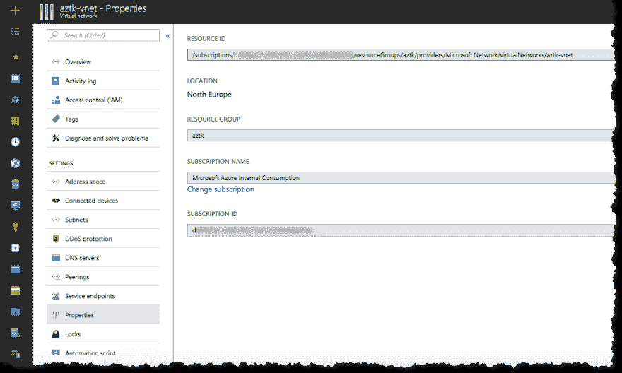
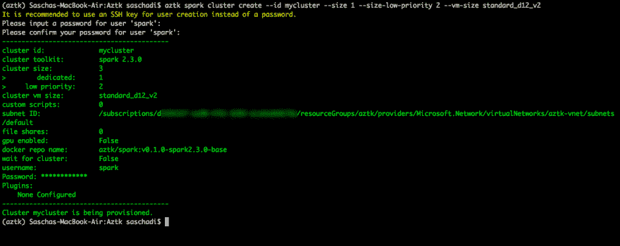

# 配置 Azure VNET 以混合模式使用 AZTK

> 原文：<https://dev.to/saschadittmann/configuring-an-azure-vnet-to-use-aztk-in-mixed-mode-kac>

在我的上一篇文章中，我向您展示了如何在 Azure 批处理服务、低优先级虚拟机和 Azure 分布式数据工程工具包(AZTK)的帮助下，在 Microsoft Azure 上提供低成本的 Apache Spark 集群。

但是，您是否尝试过将集群与专用虚拟机以及低优先级虚拟机混合使用？

如果你这样做了，你可能会遇到一个错误…

## 混合专用虚拟机和低优先级虚拟机

我尝试用下面的命令提供一个 Spark 集群:

```
aztk spark cluster create --id mycluster --size 1 --size-low-priority 2 --vm-size standard_d12_v2 
```

但是我得到的是下面的错误消息:

<figure>[](https://res.cloudinary.com/practicaldev/image/fetch/s--y6nzHNVT--/c_limit%2Cf_auto%2Cfl_progressive%2Cq_auto%2Cw_880/https://datainsights.cloimg/posts/AztkMixedMode01.png) 

<figcaption>您必须配置一个 VNET 以混合模式使用 AZTK(专用和低优先级节点)</figcaption>

</figure>

## 我需要混合模式集群做什么

但是让我先从为什么开始。

Azure 提供低优先级虚拟机(VM)来降低工作负载的成本。低优先级虚拟机通过以极低的成本使用大量计算能力，使新型工作负载成为可能。

低优先级虚拟机利用 Azure 中的剩余容量。当您在集群中指定低优先级虚拟机时，Azure 可以使用剩余的虚拟机。

使用低优先级虚拟机的代价是，这些虚拟机可能无法分配，也可能随时被抢占，具体取决于可用容量。

专用虚拟机始终保持在线，以处理您的 Spark 作业，即使一些低优先级虚拟机离线也是如此。这就是为什么您可能也想在集群中添加专用虚拟机的原因。

如果您有一个包含两种类型虚拟机的混合模式 Spark 集群，主节点将始终被分配给一个专用虚拟机。

<figure>[](https://res.cloudinary.com/practicaldev/image/fetch/s--sMlogRHt--/c_limit%2Cf_auto%2Cfl_progressive%2Cq_auto%2Cw_880/https://datainsights.cloimg/posts/AztkMixedMode02.png) 

<figcaption>阿兹克星火集群以混合模式运行</figcaption>

</figure>

## 创建 Azure 虚拟网络

所以我做的第一件事就是在 AZTK 资源组中创建一个 Azure 虚拟网络([如何使用 Azure 门户](https://docs.microsoft.com/en-us/azure/virtual-network/quick-create-portal)创建虚拟网络)。

之后，我打开新创建的 VNET 的**属性**部分，并将资源 ID 复制到我的剪贴板。

<figure>[](https://res.cloudinary.com/practicaldev/image/fetch/s--sr7zscuZ--/c_limit%2Cf_auto%2Cfl_progressive%2Cq_auto%2Cw_880/https://datainsights.cloimg/posts/AztkMixedMode03.png) 

<figcaption>蔚蓝虚拟网-属性</figcaption>

</figure>

## 更新 cluster.yaml 文件

我打开了一个终端窗口，用 vim 编辑了**中的 **cluster.yaml** 文件。aztk** 文件夹。

在该文件中，有一个名为“**的部分，用于将您的集群添加到虚拟网络中，并在**下面提供完整的 arm 资源 id。

我从包含“ **subnet_id:** ”属性的行中删除了注释符号，并添加了来自虚拟网络的资源 id。

我还添加了带有前缀 **/subnets/** 的子网名称。

```
subnet_id: /subscriptions/XXXXXXXX-XXXX-XXXX-XXXX-XXXXXXXXXXXX/resourceGroups/aztk/providers/Microsoft.Network/virtualNetworks/aztk-vnet/subnets/default 
```

<figure>[](https://res.cloudinary.com/practicaldev/image/fetch/s--O_HbdwbX--/c_limit%2Cf_auto%2Cfl_progressive%2Cq_auto%2Cw_880/https://datainsights.cloimg/posts/AztkMixedMode04.png) 

<figcaption>。aztk/cluster.yaml 子网设置</figcaption>

</figure>

## 创建集群

在将机会保存到 cluster.yaml 文件之后，我能够用工具包创建一个混合模式的集群。

<figure>[](https://res.cloudinary.com/practicaldev/image/fetch/s--jL6gyiyw--/c_limit%2Cf_auto%2Cfl_progressive%2Cq_auto%2Cw_880/https://datainsights.cloimg/posts/AztkMixedMode05.png) 

<figcaption>创造一个混合模式的火花簇</figcaption>

</figure>