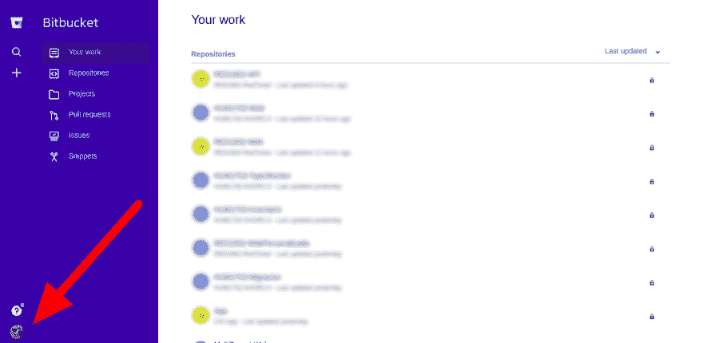
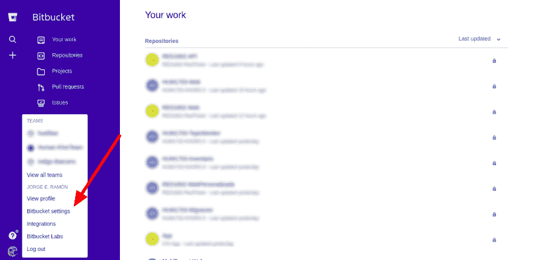
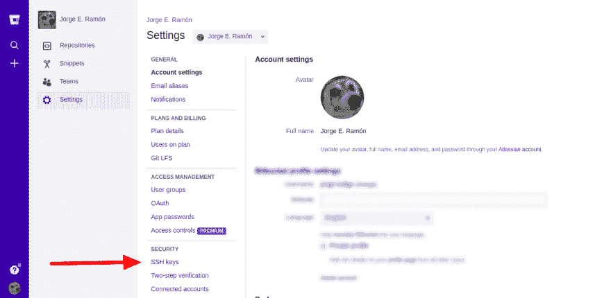
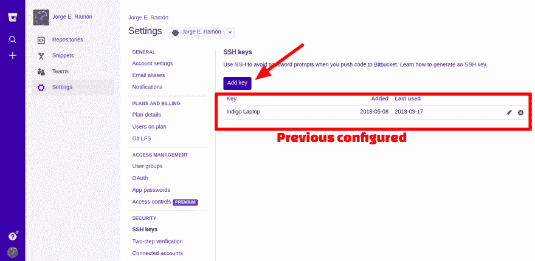
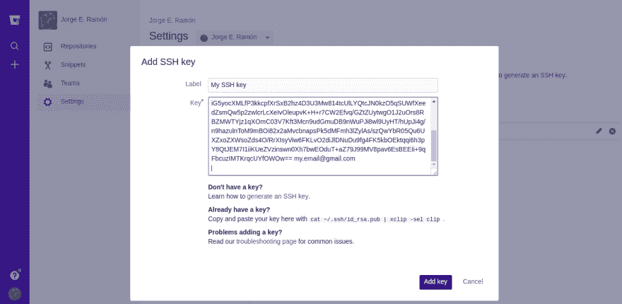
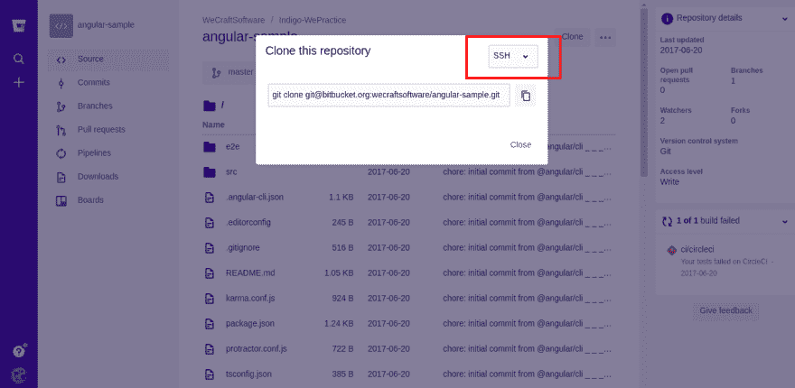
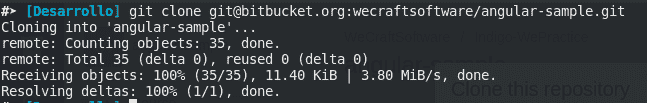

# 为位存储库配置 SSH 密钥

> 原文：<https://dev.to/jorge_rockr/configuring-ssh-key-for-bitbucket-repositories-2925>

初级开发人员习惯于一遍又一遍地做同样的事情，更具体地说，每隔`pull`和`push`登录 bitbucket server，这是很常见的，因为...为什么不呢？。

好吧，如果你这样做，让我告诉你:

1.  你在浪费你宝贵的时间
2.  您键入的内容超出了应有的数量
3.  请不要这样做

所以，让我们开始吧！

## 步骤 0:安装 Git

我想你以前做过这个😒，不管你用的是 Windows 还是 Linux，但如果你用的是 Windows...请安装 GIT BASH 。

## 第一步:创建文件`id_rsa.pub`

打开您的终端(如果您使用的是 Windows，则打开 Git Bash)并键入:

```
ssh-keygen -t rsa -b 4096 -C "your@email.com" 
```

Enter fullscreen mode Exit fullscreen mode

如果你做得很好，那么这应该出现:

```
Generating public/private rsa key pair.
Enter file in which to save the key (/home/<your-user>/.ssh/id_rsa): 
```

Enter fullscreen mode Exit fullscreen mode

从现在开始，你只需要做一件事...**反复按回车键**得到这个:

```
Created directory '/home/<your-user>/.ssh'.
Enter passphrase (empty for no passphrase): 
Enter same passphrase again: 
Your identification has been saved in /home/<your-user>/.ssh/id_rsa.
Your public key has been saved in /home/<your-user>/.ssh/id_rsa.pub.
The key fingerprint is:
SHA256:lXhYzNtK37chmNGsV5/278yr6LrWuUygcYvqklcdtzI my.email@gmail.com
The key's randomart image is:
+---[RSA 4096]----+
|         o.      |
|         +o.     |
|        o +oo    |
|         +oo.o . |
|       .S+oo*.. o|
|       .=E+=.o.+o|
|    . .o .+.o o.+|
|   o ..  .oo.  +.|
|    +o  .o+=...oB|
+----[SHA256]-----+ 
```

Enter fullscreen mode Exit fullscreen mode

创建了一个名为`id_rsa.pub`的文件。

## 第二步:检查自己做得好不好

为了保险起见，让我们用这个命令来看看文件的内容(也适用于 Windows 用户):

```
cat ~/.ssh/id_rsa.pub 
```

Enter fullscreen mode Exit fullscreen mode

您应该会看到这样的内容:

```
ssh-rsa AAAAB3NzaC1yc2EAAAADAQABAAACAQDKk+oiraZNtLEOsnoipb2vQneDKEu/KRjkimYucyrISkELCIqudGDhPyOxsKDIh61+tkoufJ6l0i9OCWVF/ckF2b8EZmqDLPIQR0x3Idg8vkmYS+aD/DdeUDrCYOR0rWXrCAdOOMJrkuoN0z+rFEGHW+Lkx8JqIwUm237RVOnJy9g8XG9bpRjjNZGLvhVIR0rmNtJ3NdEHZTrXmkookIU1/XTr/WVn6W7L695yyIYonNGczDrhAmnqYFm6HQabb4NTUm37PiZRxbkiJLjAo44AMM+4FhUrYN9FJkfgSqa3yJAYAGwFxRarw0JiG5yocXMLfP3kkcpfXrSxB2hz4D3U3Mw814tcUlLYQtcJN0kzO5qSUWfXeedZsmQw5p2zwlcrLcXeIvOleupvK+H+r7CW2Efvq/GZtZUytwgO1J2uOrs8RBZMWTYjz1qXOmC03V7Kft3Mcn9udGmuDB9nWuPJi8wl9UyHT/hUpJi4g/n9hazulnToM9mBOi82x2aMvcbnapsPk5dMFmh3lZylAs/szQwYbR05Qu6UXZxoZXWsoZds4O/RrXIsyViw6FKLvO2diJlDNuDu9fg4FK5kbOEktqqi6h3pY8QtJEM7I1iiKUeZVzinswn0Xh7bwEOduT+aZ79J99MV8pav6EsBEEIi+9qFbcuzIMTKrqcUYfOWOw== my.email@gmail.com 
```

Enter fullscreen mode Exit fullscreen mode

那是你的 **SSH 密钥**。

## 第三步:将您的 SSH 密钥配置到 Bitbucket 中(类似的情况也适用于 Github)

登录 [Bitbucket](//www.bitbucket.org) 并搜索您的用户图标:

[T2】](https://res.cloudinary.com/practicaldev/image/fetch/s--1AZx2qfB--/c_limit%2Cf_auto%2Cfl_progressive%2Cq_auto%2Cw_880/https://thepracticaldev.s3.amazonaws.com/i/40waihj872lwzahnhrkm.png)

现在点击*位桶设置*选项:

[T2】](https://res.cloudinary.com/practicaldev/image/fetch/s--lASLBpbu--/c_limit%2Cf_auto%2Cfl_progressive%2Cq_auto%2Cw_880/https://thepracticaldev.s3.amazonaws.com/i/t4m3d3x6am4v4xaodprl.png)

现在点击 *SSH 键*选项:

[T2】](https://res.cloudinary.com/practicaldev/image/fetch/s--CGOvwpkQ--/c_limit%2Cf_auto%2Cfl_progressive%2Cq_auto%2Cw_880/https://thepracticaldev.s3.amazonaws.com/i/u2wcmdxualmchg7gb42q.png)

现在按下*添加键*按钮。如果您之前配置了一个 SSH 密钥，那么它将被列出(像我的一样):

[T2】](https://res.cloudinary.com/practicaldev/image/fetch/s--IALLi8ZI--/c_limit%2Cf_auto%2Cfl_progressive%2Cq_auto%2Cw_880/https://thepracticaldev.s3.amazonaws.com/i/txiuxth6gu9akto1bdfo.png)

最后，输入您喜欢的任何名称，然后**粘贴您在步骤 2** 中看到的内容:

[T2】](https://res.cloudinary.com/practicaldev/image/fetch/s--LcFR9BWE--/c_limit%2Cf_auto%2Cfl_progressive%2Cq_auto%2Cw_880/https://thepracticaldev.s3.amazonaws.com/i/nxguns78en77fd76j6fa.png)

仅此而已。很容易不是吗？

## 步骤 4:使用 SSH 协议克隆您的存储库

是时候证明你做得很好了，所以创建或转到任何存储库并按下*克隆*按钮。您应该看到 SSH 选项被选中:

[T2】](https://res.cloudinary.com/practicaldev/image/fetch/s--w6o2b3l6--/c_limit%2Cf_auto%2Cfl_progressive%2Cq_auto%2Cw_880/https://thepracticaldev.s3.amazonaws.com/i/tqonb9ntz5irguvqm44j.png)

最后，克隆你的库，然后**开心点**😁：

[T2】](https://res.cloudinary.com/practicaldev/image/fetch/s--Pqe2bD_i--/c_limit%2Cf_auto%2Cfl_progressive%2Cq_auto%2Cw_880/https://thepracticaldev.s3.amazonaws.com/i/vlygkwmj214e8rn0tkac.png)