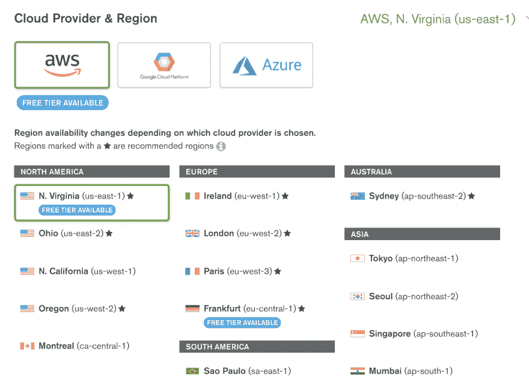
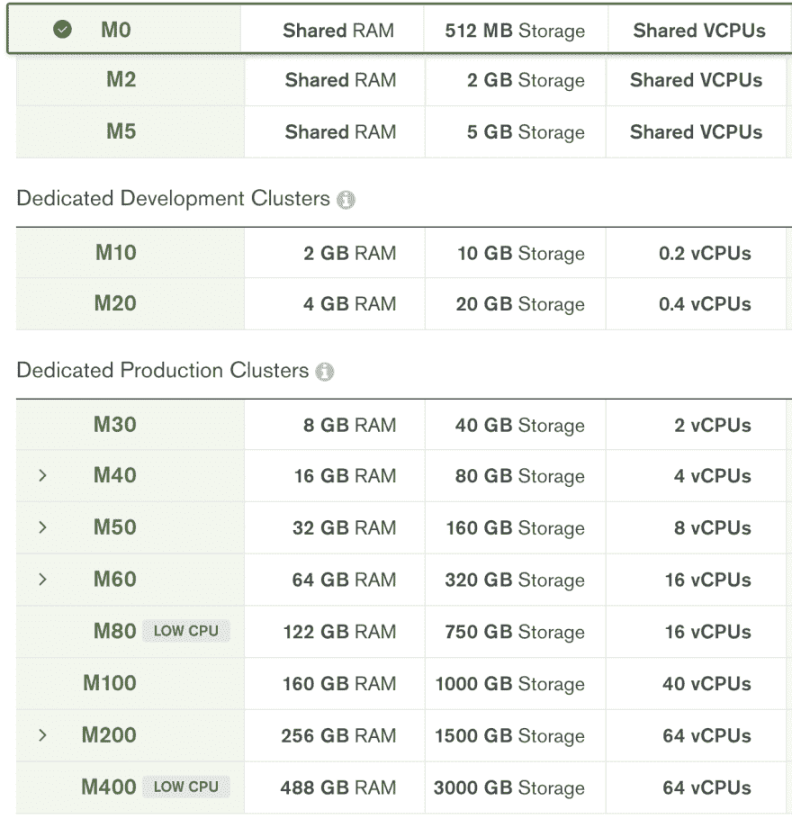
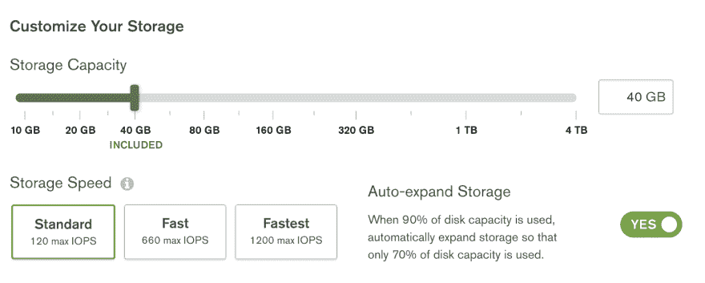
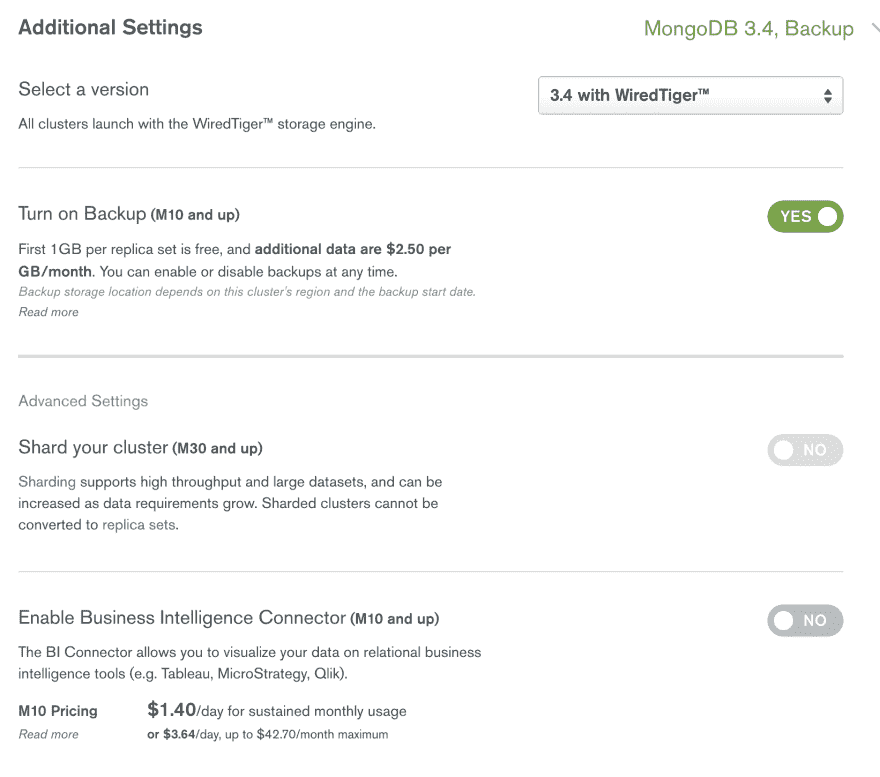
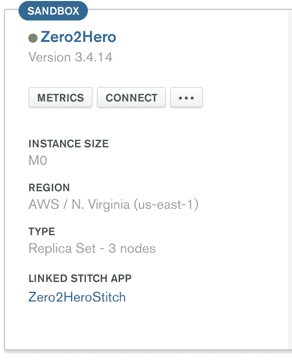
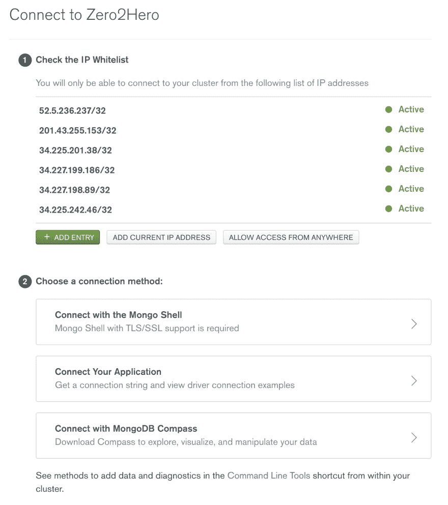

# 知道蒙戈布地图集——蒙戈布的 dbaas，现在是 3.6！

> 原文：<https://dev.to/delbussoweb/conhecendo-o-mongodb-atlas---o-dbaas-da-mongodb-1alo>

大家好，今天我给大家介绍一下蒙戈布地图集！

对于从未听说过 mongodb atlas 的人来说，他是 mongob 提供的 dbaas(数据库即服务)服务。基本上，您只关心管理驻留在那里的数据，所有的机器基础架构和维护，以及所有这些都由他们负责。所以让我们多了解一下这项服务。我将逐步介绍用于创建群集的选项。我指的群集是因为 mongodb atlas 有一个包含三个计算机的复制集(mongob 建议的最小部署)，也可以配置为 Sharding，但这将保留到下一个。

## Iniciando no MongoDB 图册

嗯，要从蒙戈布地图集开始就非常简单，通过这个链接只需点击“Get started free”，你就会被引导到地籍屏幕上。mongodb atlas 提供了 M0 层，对于想要了解 mongob 或使用 mongob 进行某种测试的人来说非常有用(请参阅:数据模型测试或类似的测试，因为 M0 层在磁盘、内存和处理方面受到限制)，因此您无需输入信用卡数据即可使用该层 rssss(消歧义)

M0 层提供了以下功能:

```
1\. Memória RAM compartilhada
2\. 512 MB de Disco
3\. vCPUs compartilhadas 
```

如我所说，这一层足以进行小测试，甚至了解蒙戈布地图集的动态。

## 云提供商和地区

mongodb atlas 支持在以下三个主要云提供商中部署环境:AWS、google cloud plataform 和 Azure。并在每个区域内支持多个区域。

仅在美国东部的 AWS 中允许使用 M0 层。现在，它仍然只在 AWS，但有另一个区域:我-中心-1 在德国法兰克福。

[T2】](https://res.cloudinary.com/practicaldev/image/fetch/s--D_gqJmGQ--/c_limit%2Cf_auto%2Cfl_progressive%2Cq_auto%2Cw_880/https://thepracticaldev.s3.amazonaws.com/i/xupljboad3ztrbgvfcd0.png)

## Tipos de Clusters

mongodb atlas 提供了三种群集类型，分为以下几类:

#### 共享集群

共享群集包含 M0 层，它是空闲的，另外还有两个层会改变 RAM 的大小。我推荐了解蒙戈布地图集的工作方式；

#### 专用开发集群

但是，用于开发应用程序的群集已经具有更多资源，并且是专用的。也就是说，根据数据库的大小和需要，它们可以用于生产；

#### 专用生产集群

具有更强大机器的群集，并且可以自订 M40 或更高版本的磁碟(大小和速度)。

[T2】](https://res.cloudinary.com/practicaldev/image/fetch/s--Aocmnw9E--/c_limit%2Cf_auto%2Cfl_progressive%2Cq_auto%2Cw_880/https://thepracticaldev.s3.amazonaws.com/i/wyse5ukjftsen0dgbcey.png)

我隐藏了价格列，因为它们可能会随着时间的推移而变化，但您可以在站点上了解群集在配置时的成本。

从 M10 开始，您可以配置 10GB 到 4TB 的磁盘大小。从 M30 开始，除了大小之外，我们还可以通过选择三个级别来配置磁盘速度，这三个级别会改变 IOPS 的数量。

[T2】](https://res.cloudinary.com/practicaldev/image/fetch/s--suGJ7dV8--/c_limit%2Cf_auto%2Cfl_progressive%2Cq_auto%2Cw_880/https://thepracticaldev.s3.amazonaws.com/i/ip9ds07ow4k2l8zz8rh6.png)

## 其他设置

从 M10 开始，我们提供了一些有趣的配置，例如 mongodb 的版本切换，现在有 3.2、3.4 和 3.6 可供 WiredTiger 使用。此外，还提供了按 GB 收费的备份选项，每个复制集的第一 GB 是免费的！还有 BI Connector。

从 M30 开始，我们提供了 Sharding 选项，其中提供了更多的复制集，您可以根据需要配置更多的复制集。

[T2】](https://res.cloudinary.com/practicaldev/image/fetch/s--8mt5ENd---/c_limit%2Cf_auto%2Cfl_progressive%2Cq_auto%2Cw_880/https://thepracticaldev.s3.amazonaws.com/i/poq2or4a9uey5htbktz5.png)

## 集群名称

完成这些设置后，只需为群集命名，几分钟后即可使用。很简单吧？

## 下一步行动

现在您已经部署了群集，只需连接到群集并向数据发送子弹。单击 *CONNECT* 按钮，您将看到各种连接选项，例如 mongoshell、各种编程语言(甚至 Java rssss)的连接字符串示例，以及如何通过[mongob compass](https://www.mongodb.com/products/compass)连接到群集。此外，我们还可以在此屏幕上指定 IPs 可以访问群集的内容。

[](https://res.cloudinary.com/practicaldev/image/fetch/s--0VwpwRvG--/c_limit%2Cf_auto%2Cfl_progressive%2Cq_auto%2Cw_880/https://thepracticaldev.s3.amazonaws.com/i/7xuw2gyh6s3q3g06lxf1.png)
[T6】](https://res.cloudinary.com/practicaldev/image/fetch/s--_mtCULuY--/c_limit%2Cf_auto%2Cfl_progressive%2Cq_auto%2Cw_880/https://thepracticaldev.s3.amazonaws.com/i/72gv5c52csem5lnpos3t.png)

好了，伙计们，暂时如此！希望你们喜欢，任何疑问都可以留在评论里或者在社交网站上！

一个拥抱！