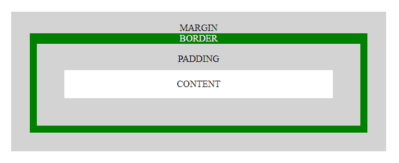
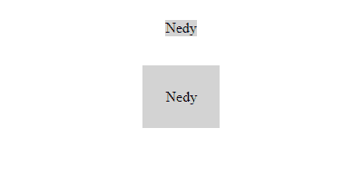
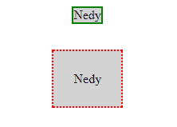

# 内容、填充、边距和边框:盒子模型

> 原文：<https://dev.to/nedyudombat/content-padding-margin-and-border-the-box-model-28hp>

无论你是设计师还是开发人员，或者对整个技术感兴趣，都有一些重要的事情适用于我们每一个人。

**盒子模型**的概念已经存在了很长一段时间，所以在学习并获得了有用的知识后，我觉得有必要与开发者分享。

在本文中，我将以最简单的方式为前端开发人员重点讲述 ***内容*** 、 ***填充*** 、 ***边距*** 和 ***边框*** 之间的主要区别，但无论您的角色如何，都可以随意阅读。

**盒子模型:**CSS 盒子模型描述了环绕[文档树](https://www.w3.org/TR/CSS2/conform.html#doctree)中每个元素(HTML 元素)的矩形框，并根据[可视格式模型](https://www.w3.org/TR/CSS2/visuren.html)进行布局。它由内容、填充、边框和边距组成。

 

<figcaption>框模型视觉</figcaption>

**架构:**内容被边框包围，内容与边框之间的空间称为填充，边框与文档中其他元素之间的空间称为边距。

这就像房间里的床，床是内容，床和房间四面墙之间的空间是填充物，房间的四面墙是边界，然后房间和房子里另一个房间之间的空间是边缘

*   床=内容；
*   床和墙之间的空间=衬垫；
*   墙壁=边框；
*   一个房间和另一个房间之间距离=边距；
*   房间=元素{如`
` `` `
` }。

**让我们以前端的方式来做这件事**

**内容:**内容是元素标签中包含的内容。举个例子，如果你有这个:`
Nedy
`。这个标签的内容是“Nedy”。默认情况下，所有内容总是左上对齐(意味着它们的左填充和顶填充小于它们的右填充和底填充)。

**填充:**填充是指一个元素的内容和该元素的边框之间的空间，或者我们可以简单的说是边框内部的空间。这类似于你的床和房间墙壁之间的空间。大多数时候我们看不到填充，因为默认情况下它通常是透明的，但是如果你设置背景色:浅灰色；该元素的填充将是灰色的，如下图所示。

 

<figcaption>第一个< p >元素填充为 0，第二个< p >元素填充为 2%。他们都没有国界。</figcaption>

Padding 只有 5 个 CSS 属性:padding；垫顶；填充-右侧；底部填充；填充-左侧。

**边框:**这是包围元素的墙，它与文档中的任何其他元素都有区别。这就像你房间的墙壁把它和厨房分开一样。实际上可以去掉边框，或者改变样式。边框和填充之间的一个重要区别是，边框不是一个空间，它是一个词的每一个意义上的边框，因此在风格上的灵活性。我们都知道我们不能改变空间的风格，因为空间就是空间。边框比填充和边距有更多的属性。所以在这里，我们将通过设置 CSS border 属性为 border: 2px solid green，尝试使我们的边框为实线和虚线；和边框:2px 虚线红色；

 

<figcaption>第一个< p >元素有绿色的实线边框，而第二个< p >元素有红色的虚线边框。</figcaption>

一些常用的边框 CSS 属性:border；边框顶部；右边界；边框式；边框宽度；边框半径；。

“边框半径”属性根据当时的边框半径值，将边框相交形成的四个角的度数从 90 度减小。查看[*W3schools.com*](https://www.w3schools.com/css/css_border.asp)了解更多。

最后是保证金唷！！！

**边距:**边距是两个元素之间的空间，或者我们可以简单的说是一个元素边框之外的空间。大多数情况下，边距采用根元素的颜色，最有可能是

or tags or any actual root element.

可以肯定地说，两个元素之间的水平空间是由两个边距组成的；第一个元素的右边距和第二个元素的左边距。同样的事情也适用于两个元素之间的垂直空间。结账*查看更多。*

 * 

<figcaption>边境</figcaption>

绿色边框外的空间是该`
`元素的边距。红色边框外的空间也是如此。

**我们终于可以说:**

**内容**包含在**边框中，**边框内的空间是**填充**，边框外的空间是**边距**。这就组成了**箱型。**

希望这篇文章能帮助你更好的理解* *盒子模型概念** 。

不要忘记评论和分享你的想法。一份爱。*