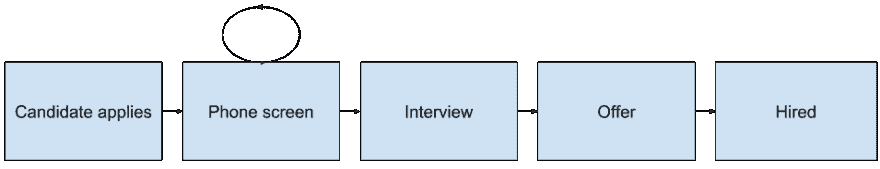

# 招聘的连续交付

> 原文：<https://dev.to/acceldelivery/continuous-delivery-for-hiring-1iel>

*这篇文章最初发表在[加速交付](https://accelerate.delivery/continuous-delivery-for-hiring/)博客上。*

连续交付消除了将代码交付给产品的摩擦。我们可以将类似的原则应用到软件工程的招聘过程中。像软件交付管道一样，我们可以优化流程中的步骤。在持续交付中，我们希望最大限度地提高招聘渠道的吞吐量和稳定性。在招聘过程中,“吞吐量”和“稳定性”有特定的含义:

*   **吞吐量**是我们雇佣候选人的速度
*   **稳定性**是候选人在团队配合和工程技能方面的素质

我们将考察一些你可以在自己的招聘渠道上进行的实验，以及你应该期望获得的好处。

## 战术

以下实验可以单独进行，也可以同时进行。你可以 100%采纳它们，或者在很小程度上采纳它们。像所有持续交付的事情一样，最好采取最小的、可行的步骤。

### 清除手机屏幕

让我们假设一个雇用工程师的典型流程如下:

[T2】](https://res.cloudinary.com/practicaldev/image/fetch/s--J4h-cx2W--/c_limit%2Cf_auto%2Cfl_progressive%2Cq_auto%2Cw_880/https://thepracticaldev.s3.amazonaws.com/i/6g56zmbe95k9hmrrotp2.png)

电话屏幕阶段有规律地循环几次。有招聘人员、人力资源代表、工程经理和工程师的电话屏幕。雇主希望创建一个申请人漏斗，随着每次电话筛选，数量减少，质量提高。目标是让最优秀的候选人进入面试阶段。这里的反模式是高质量和低质量的候选人都要经历相同的步骤。每一步都有机会剔除不好的契合点，但也会阻止好的契合点。想象一下当候选人面对这些守门人时是什么样的。高质量的候选人有选择。为什么他们会选择与你的公司进行另一次电话筛选？从招聘公司的角度来看，这是一个产生优秀候选人的渠道。从工程师的角度来看，这是一个挑战。

作为一名招聘经理，我希望用“信任”来取代尽可能多的手机屏幕。信任的一种形式是其他人在做他们的工作。在招聘过程中与上游人员建立关系。了解他们如何筛选候选人。教他们你是怎么做的。帮助他们成为你偏好的冠军。另一种信任是你在做你的工作。说服其他看门人，你的手机屏幕将代表他们的需求。目标是完全去除你自己，或者成为决定性的电话屏幕。从候选人的角度来看，这意味着他们可能只有一个手机屏幕。如果他们已经和你或你信任的人建立了关系，他们可能没有手机屏幕。

### 高信号面试

面试就像代码审查。在这个比喻中，候选人是一个拉动式请求，面试团队正在进行同行评审。一位同行评审员相信 CI 会使用 linters 和 formatters 强制执行一个风格基线。同行评审员不评审代码风格。同行评审员检查需求实现、逻辑缺陷和可维护性。这是工程师的宝贵成果。这是一种独特的、创造性的代码，人类可以产生，而计算机不能。像代码审查一样，你不应该在面试中验证风格观点。面试官应该检查候选人的逻辑和文化。

为了消除风格上的顾虑，在面试前尽可能多地核实候选人的情况。寻找任何可能的代码样本。面试前读代码捷径尴尬的白板问题关于打印奇数|质数|可被 5 整除的数字。在面试前提高你对候选人的基本了解。这使得面试可以关注候选人的宝贵成果。

在面试中，向候选人提出一些重要的问题。这些问题应该引导面试团队做出最终决定:是或否。“高信号”对于不同的团队有不同的含义。给出你的团队想要的特征，向候选人提问来验证匹配。如果你的团队“偏向行动”、“协作”、“热情”、“好奇”等。围绕这些特征提出问题并获得答案。避免像“你更喜欢哪个 CSS-in-JS 库？”这是午餐时讨论的一个很好的话题，但在面试中没有帮助。我们在寻找“[强有力的观点，弱有力的观点](https://blog.codinghorror.com/strong-opinions-weakly-held/)”，但我们不应该根据候选人当前的观点来衡量他们。核实候选人是否根据新信息改变了他们的观点比那些观点实际上是什么更重要。

### 面试结束时的录用信

再看一下面试流程图:

[T2】](https://res.cloudinary.com/practicaldev/image/fetch/s--J4h-cx2W--/c_limit%2Cf_auto%2Cfl_progressive%2Cq_auto%2Cw_880/https://thepracticaldev.s3.amazonaws.com/i/6g56zmbe95k9hmrrotp2.png)

遗憾的是，面试只是中途。我们甚至可以在面试后进行优化。雇主通过在面试结束时准备好录取通知书来赢得时间和好感。如果你已经磨砺了你的面试过程来产生一个高信号，那么是什么阻止了你呢？起草录取通知书需要一些准备工作，但没什么不寻常的。变量一般是:你能提供的薪水，签约奖金，股票期权，候选人的名字。对于许多候选人来说，你可以提前做好这项工作。随着面试的进行，你可以调整范围，但是变化应该是最小的。这是对一位高级工程师的面试，或者说是对一位董事的面试。在面试开始之前，预算和变化是众所周知的。

面试中有动力。候选人会见他们可能一起工作的人。候选人开始与他们发展关系。候选人会问一些问题，表达一些担忧，希望能得到回答和缓解。面试结束了，然后，候选人等待。试着在面试前起草录取通知书。在面试结束前从面试官那里得到反馈。你可以用一封聘书来延续面试的势头，离录用更近一步。这并不是说这个过程的“提供”阶段完全陷入了“面试”阶段。仍有时间就报价进行协商。这就是说，你可以立即开始要约阶段。

## 好处

在招聘中应用这些策略与软件开发中的持续交付具有相似的优势。

### 低风险

很像一个小公关降低风险。简短的面试过程消除了候选人的风险。他们不用想着为了很多电话屏幕或者几次现场面试而偷偷离开现在的岗位。作为一名雇主，你已经展示了你知道你在寻找什么，并且你让合适的候选人很容易地简单地说“是的”。

雇主的风险也降低了。你更有可能把优秀的候选人从面试阶段带到雇佣阶段。高质量的候选人有较少的时间去面试和考虑其他的工作机会。

### 高吞吐量

公开的人数是企业和你的团队有需求的信号。人数开放的时间越长，需求得不到满足的时间就越长。在人手不足的情况下，在职工程师的压力更大。这些开发人员绕开这个缺口，或者试图收拾残局。尽快用合适的人填补空缺。当你优化招聘流程时，你可以让合格的候选人更快地进入角色。

## 结论

招聘和软件交付一样，可以通过关注稳定性和吞吐量而受益。你不想为了一个牺牲另一个。进行修改以使两者都可信。