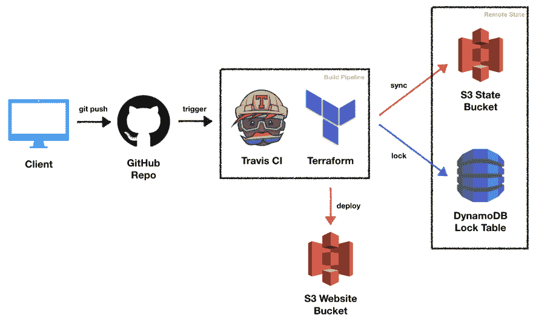
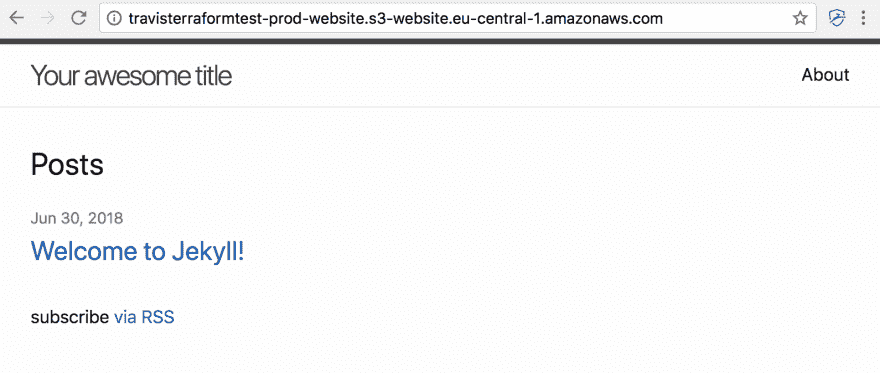
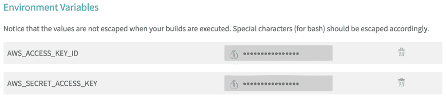
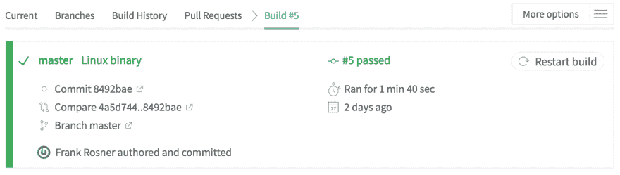

# 使用 Terraform 和 Travis CI 在 AWS 上持续交付

> 原文：<https://dev.to/frosnerd/continuous-delivery-on-aws-with-terraform-and-travis-ci-3914>

这篇博文是我的 AWS 系列的一部分:

*   [基础设施作为使用 Terraform 的代码管理 AWS](https://dev.to/frosnerd/infrastructure-as-code---managing-aws-with-terraform-i9o)
*   [使用 Lambda 和 API 网关在 AWS 上部署 HTTP API](https://dev.to/frosnerd/deploying-an-http-api-on-aws-using-lambda-and-api-gateway-g61)
*   [使用 Elastic Beanstalk 在 AWS 上部署 HTTP API](https://dev.to/frosnerd/deploying-an-http-api-on-aws-using-elastic-beanstalk-5dh7)
*   [部署 AWS RDS MySQL 实例并进行基准测试](https://dev.to/frosnerd/deploying-and-benchmarking-an-aws-rds-mysql-instance-2faf)
*   [AWS 中使用社交网络、SQS 和 Lambda 的事件处理](https://dev.to/frosnerd/event-handling-in-aws-using-sns-sqs-and-lambda-2ng)
*   [**使用 Terraform 和 Travis CI 在 AWS 上连续交付**](#)
*   [使用物联网核心、Kinesis 和 ElastiCache 在 AWS 上处理传感器数据](https://dev.to/frosnerd/sensor-data-processing-on-aws-using-iot-core-kinesis-and-elasticache-26j1)
*   [使用 CloudWatch 监控 AWS Lambda 功能](https://dev.to/frosnerd/monitoring-aws-lambda-functions-with-cloudwatch-1nap)

# 简介

在之前的帖子中，我们介绍并广泛使用了 Terraform 来自动化基础设施部署。如果你的目标是真正的连续交付，高度自动化是至关重要的。连续交付(CD)是关于在短周期内高信心地生产软件，减少交付变更的风险。

在这篇博文中，我们希望将 Terraform 与 Travis CI 的自动化构建管道结合起来。为了在共享设置中使用 Terraform，我们必须将其配置为使用[远程状态](https://www.terraform.io/docs/state/remote.html)，因为本地状态不能用于任何涉及多个开发人员或自动化构建管道的项目。我们正在部署的应用程序将是一个由 [Jekyll](https://jekyllrb.com/) 生成的静态网站。

该员额的其余部分结构如下。在第一部分中，我们将简要讨论整体解决方案架构，重点放在持续部署基础设施上。下一节将详细阐述如何使用 Terraform 提供远程状态资源的两种解决方案。之后，我们将介绍远程状态引导、静态网站部署和使用 Travis CI 的自动化的实现。我们通过总结主要观点来结束这篇博文。

# 建筑

[T2】](https://res.cloudinary.com/practicaldev/image/fetch/s--4Ms1b6wG--/c_limit%2Cf_auto%2Cfl_progressive%2Cq_auto%2Cw_880/https://thepracticaldev.s3.amazonaws.com/i/m1abt2656tiyxybgpdy9.png)

上图显示了解决方案架构，包括持续集成(CI)和 CD 的组件。在这种情况下，客户端是开发者，因为我们是从开发的角度来看设置的。

一旦开发人员向远程 GitHub 存储库推送新的更改，就会触发 Travis CI 构建。Travis CI 是一个托管构建服务，可免费用于开源项目。然后 Travis 构建网站工件，部署基础设施，并将工件推向生产。

我们使用一个 [S3 后端](https://www.terraform.io/docs/backends/types/s3.html)和 [DynamoDB](http://aws.amazon.com/dynamodb) 用于 Terraform。Terraform 将在 S3 内存储状态，并在执行更改时使用 DynamoDB 获取锁。锁对于避免两个 Terraform 二进制文件同时修改相同的状态很重要。

要使用 S3 远程状态后端，我们需要事先创建 S3 桶和 DynamoDB 表。这种引导也是通过 Terraform 来完成和自动化的。但是我们如何管理使用 Terraform 所需的 Terraform 基础设施呢？下一节将讨论解决这个问题的两种方法🐔&🥚问题。

# 遥邦鸡和蛋的问题

我们如何使用 Terraform 来设置我们想要用于远程状态后端的 S3 桶和 DynamoDB 表？首先，我们用本地状态创建远程后端资源。然后，我们需要以某种方式共享这个状态，以允许以后修改后端资源。据我所知，有两种可行的解决方案:

1.  **共享本地状态。将本地状态提交到您的版本控制中，并在远程存储库中共享它。**
2.  **迁移状态。**将本地状态迁移到远程状态后端。

这两种解决方案都涉及使用本地状态创建远程状态资源。它们的不同之处在于如何共享用于提供远程状态资源的状态。虽然第一个选项很容易设置，但有两个主要风险需要考虑:

*   地形状态可能包含秘密。在只有 S3 桶和 DynamoDB 表的情况下，只有一个变量可能有问题:AWS 访问键。如果您正在使用私有存储库，这可能不是一个大问题。在处理开放源代码时，在提交状态文件之前对其进行加密可能是有用的。你可以用 [OpenSSL](https://www.openssl.org/) 或者更专业的工具比如 [Ansible Vault](https://docs.ansible.com/ansible/2.4/vault.html) 来做这件事。
*   共享本地状态没有锁定或同步机制。当将您的本地 Terraform 状态发布到远程源代码库时，您必须手动确保与所有开发人员保持该状态文件同步。如果有人对资源进行修改，他或她必须提交并推送更新后的状态文件，并确保没有其他人同时修改基础设施。

就上述问题而言，第二种选择更安全一些。S3 支持开箱即用的静态加密，您可以对存储桶进行精细的访问控制。此外，如果 DynamoDB 用于锁定，双方不能同时修改资源。缺点是解决方案比较复杂。

在我们将本地状态迁移到创建的远程状态后端之后，它将包含后端本身的状态以及应用程序基础设施状态。幸运的是，Terraform 提供了一种内置的方式来隔离不同环境的状态:[工作区](https://www.terraform.io/docs/state/workspaces.html)。我们可以为后端资源创建一个单独的工作区，以避免后端基础架构和应用程序基础架构的变化之间的干扰。

使用工作空间有点难以理解，所以我们将在这篇文章的过程中处理这个选项，让它了解细节。实际上，我不确定增加的复杂性是否值得付出努力，特别是当你通常不接触后端基础设施，除非你想关闭项目。下一节将逐步解释引导和应用程序的实现和部署。

# 实现

## 开发工具栈

为了开发该解决方案，我们使用了以下工具:

*   Terraform v0.11.7
*   哲基尔
*   Git 2.15
*   IntelliJ + Terraform 插件

[源代码](https://github.com/FRosner/aws_travis)可以在 GitHub 上获得。现在让我们来看看每个组件的实现细节。

## 远程状态引导和配置

我们将在工作区和文件夹中组织我们的 Terraform 文件。工作区将后端资源状态与应用程序资源状态隔离开来。文件夹将用于组织 Terraform 资源文件。

我们将创建两个工作区:`state`和`prod`。`state`工作区将管理远程状态资源，即 S3 桶和 DynamoDB 表。`prod`工作区将管理我们网站的生产环境。您可以添加更多的工作空间用于以后的试运行或测试，但是这超出了本文的范围。

我们将创建三个包含地形文件的文件夹:`bootstrap`、`backend`和`website`。下一个清单概述了项目的目录和文件结构。

```
.
├── locals.tf
├── providers.tf
├── backend
│   ├── backend.tf
│   ├── backend.tf.tmpl
│   ├── locals.tf -> ../locals.tf
│   ├── providers.tf -> ../providers.tf
│   └── state.tf -> ../bootstrap/state.tf
├── bootstrap
│   ├── locals.tf -> ../locals.tf
│   ├── providers.tf -> ../providers.tf
│   └── state.tf
└── website
    ├── backend.tf -> ../backend/backend.tf
    ├── locals.tf -> ../locals.tf
    ├── providers.tf -> ../providers.tf
    └── website.tf 
```

Enter fullscreen mode Exit fullscreen mode

项目根将包含一个共享的 AWS 提供者配置`providers.tf`，以及一个项目名称变量`locals.tf`。我们稍后将详细讨论文件内容。

除了共享文件之外，`bootstrap`还包含`state.tf`，它定义了 S3 桶和 DynamoDB 表后端资源。我们使用符号链接在文件夹间共享它们。`backend`文件夹将拥有相同的资源，但是使用已经存在的在`backend.tf`中定义的 S3 后端。在初始配置后从`bootstrap`切换到`backend`时，Terraform 会将本地状态迁移到远程后端。

`website`文件夹包含远程后端配置和所有与实际网站部署相关的资源。我们将从`state`工作区访问`backend`和`bootstrap`，从`prod`访问`website`以及任何其他与应用程序相关的工作区。

下一个清单显示了 [`bootstrap/state.tf`](https://github.com/FRosner/aws_travis/blob/d1b5241e5fad4f1356a761cf3c9299968c4006c8/bootstrap/state.tf) 文件的样子。在共享的 [`locals.tf`](https://github.com/FRosner/aws_travis/blob/d1b5241e5fad4f1356a761cf3c9299968c4006c8/locals.tf) 文件中定义了`project_name`局部变量。当前的`aws_caller_identity`和`aws_region`在共享的 [`providers.tf`](https://github.com/FRosner/aws_travis/blob/d1b5241e5fad4f1356a761cf3c9299968c4006c8/providers.tf) 文件中定义。

```
# state.tf 
locals {
  state_bucket_name = "${local.project_name}-${data.aws_caller_identity.current.account_id}-${data.aws_region.current.name}"
  state_table_name = "${local.state_bucket_name}"
}

resource "aws_dynamodb_table" "locking" {
  name           = "${local.state_table_name}"
  read_capacity  = "20"
  write_capacity = "20"
  hash_key       = "LockID"

  attribute {
    name = "LockID"
    type = "S"
  }
}

resource "aws_s3_bucket" "state" {
  bucket = "${local.state_bucket_name}"
  region = "${data.aws_region.current.name}"

  versioning {
    enabled = true
  }

  server_side_encryption_configuration {
    "rule" {
      "apply_server_side_encryption_by_default" {
        sse_algorithm = "AES256"
      }
    }
  }

  tags {
    Name = "terraform-state-bucket"
    Environment = "global"
    project = "${local.project_name}"
  }
}

output "BACKEND_BUCKET_NAME" {
  value = "${aws_s3_bucket.state.bucket}"
}

output "BACKEND_TABLE_NAME" {
  value = "${aws_dynamodb_table.locking.name}"
} 
```

Enter fullscreen mode Exit fullscreen mode

在这里，我们定义了 S3 桶，并启用了加密和版本控制。加密很重要，因为地形状态可能包含秘密变量。强烈建议版本控制能够在意外状态修改的情况下回滚。

我们还配置了用于锁定的 DynamoDB 表。Terraform 使用了一个名为 [`LockID`](https://github.com/hashicorp/terraform/blob/v0.11.7/backend/remote-state/s3/client.go#L238) 的属性，所以我们必须创建它并使它成为主键。当使用 DynamoDB 而不使用自动缩放时，在请求限制生效之前，您必须指定一个最大的[读写容量](https://docs.aws.amazon.com/amazondynamodb/latest/developerguide/HowItWorks.ProvisionedThroughput.html)。老实说，我认为你应该用最少的钱。

我们现在可以创建`state`工作区，并开始用本地状态引导:

*   `terraform workspace new state`
*   `terraform init bootstrap`
*   `terraform apply bootstrap`

在创建了 S3 桶和 DynamoDB 表之后，我们将迁移本地状态。这是通过用新创建的远程后端初始化状态资源来完成的。然而，在我们继续之前，我们需要将`BACKEND_BUCKET_NAME`和`BACKEND_TABLE_NAME`变量包含到`backend/backend.tf`中。我用 [`envsubst`](https://www.gnu.org/software/gettext/manual/html_node/envsubst-Invocation.html) 和 [`backend/backend.tf.tmpl`](https://github.com/FRosner/aws_travis/blob/d1b5241e5fad4f1356a761cf3c9299968c4006c8/backend/backend.tf.tmpl) :
生成了这个文件

```
# backend.tf.tmpl 
terraform {
  backend "s3" {
    bucket         = "${BACKEND_BUCKET_NAME}"
    key            = "terraform.tfstate"
    region         = "eu-central-1"
    dynamodb_table = "${BACKEND_TABLE_NAME}"
  }
} 
```

Enter fullscreen mode Exit fullscreen mode

现在让我们初始化远程后端资源来迁移本地状态。

```
$ terraform init backend

Initializing the backend...
Do you want to migrate all workspaces to "s3"?
  Both the existing "local" backend and the newly configured "s3" backend support
  workspaces. When migrating between backends, Terraform will copy all
  workspaces (with the same names). THIS WILL OVERWRITE any conflicting
  states in the destination.

  Terraform initialization doesn't currently migrate only select workspaces.
  If you want to migrate a select number of workspaces, you must manually
  pull and push those states.

  If you answer "yes", Terraform will migrate all states. If you answer
  "no", Terraform will abort.

  Enter a value: yes

Successfully configured the backend "s3"! Terraform will automatically
use this backend unless the backend configuration changes. 
```

Enter fullscreen mode Exit fullscreen mode

就是这样！我们使用本地状态创建了远程状态后端，然后迁移了本地状态。接下来，我们将使用远程状态后端部署一些实际的应用程序资源。

## 静态网站

我选择了一个静态网页作为本文的示例应用程序。原因是主要焦点在于自动化和使用远程状态，所以这一个将保持相当简单。网站使用 Jekyll 生成，源代码存储在 [`website/static`](https://github.com/FRosner/aws_travis/blob/d1b5241e5fad4f1356a761cf3c9299968c4006c8/website/static) 。

为了使网站公开可用，我们将使用另一个 S3 桶，并将其配置为作为网站显示文件。这里是 [`website/website.tf`](https://github.com/FRosner/aws_travis/blob/d1b5241e5fad4f1356a761cf3c9299968c4006c8/website/website.tf) 内铲斗的配置。

```
# website.tf 
locals {
  website_bucket_name = "${local.project_name}-${terraform.workspace}-website"
}

resource "aws_s3_bucket" "website" {
  bucket = "${local.website_bucket_name}"
  acl    = "public-read"
  policy = <<POLICY
{
    "Version":"2012-10-17",
    "Statement":[
      {
        "Sid":"PublicReadGetObject",
        "Effect":"Allow",
        "Principal": "*",
        "Action":["s3:GetObject"],
        "Resource":["arn:aws:s3:::${local.website_bucket_name}/*"]
      }
    ]
}
POLICY

  website {
    index_document = "index.html"
    error_document = "error.html"
  }

  tags {
    Environment = "${terraform.workspace}"
  }
} 
```

Enter fullscreen mode Exit fullscreen mode

我们使用适当的 ACL 和策略将 bucket 配置为公开可读。我们可以使用`website`节设置网站托管。当没有特定的资源被请求时，`index_document`将被服务，而如果所请求的资源不存在，则使用`error_document`。

接下来，我们必须指定 HTML 和 CSS 文件。这有点麻烦，因为我们不能告诉 Terraform 上传整个文件夹结构。我们还将输出最终可以用来访问网站的 URL。

```
# website.tf 
locals {
  site_root = "website/static/_site"
  index_html = "${local.site_root}/index.html"
  about_html = "${local.site_root}/about/index.html"
  post_html = "${local.site_root}/jekyll/update/2018/06/30/welcome-to-jekyll.html"
  error_html = "${local.site_root}/404.html"
  main_css = "${local.site_root}/assets/main.css"
}

resource "aws_s3_bucket_object" "index" {
  bucket = "${aws_s3_bucket.website.id}"
  key    = "index.html"
  source = "${local.index_html}"
  etag   = "${md5(file(local.index_html))}"
  content_type = "text/html"
}

resource "aws_s3_bucket_object" "post" {
  bucket = "${aws_s3_bucket.website.id}"
  key    = "jekyll/update/2018/06/30/welcome-to-jekyll.html"
  source = "${local.post_html}"
  etag   = "${md5(file(local.post_html))}"
  content_type = "text/html"
}

resource "aws_s3_bucket_object" "about" {
  bucket = "${aws_s3_bucket.website.id}"
  key    = "about/index.html"
  source = "${local.about_html}"
  etag   = "${md5(file(local.about_html))}"
  content_type = "text/html"
}

resource "aws_s3_bucket_object" "error" {
  bucket = "${aws_s3_bucket.website.id}"
  key    = "error.html"
  source = "${local.error_html}"
  etag   = "${md5(file(local.error_html))}"
  content_type = "text/html"
}

resource "aws_s3_bucket_object" "css" {
  bucket = "${aws_s3_bucket.website.id}"
  key    = "assets/main.css"
  source = "${local.main_css}"
  etag   = "${md5(file(local.main_css))}"
  content_type = "text/css"
}

output "url" {
  value = "http://${local.website_bucket_name}.s3-website.${aws_s3_bucket.website.region}.amazonaws.com"
} 
```

Enter fullscreen mode Exit fullscreen mode

在我们部署变更之前，我们应该创建一个新的工作区。只有当我们需要修改远程状态后端资源时，才会使用`state`工作区。我们将调用新的工作区`prod`，并使用它来初始化和部署网站资源。

*   `terraform workspace new prod`
*   `terraform init website`
*   `cd website/static && jekyll build && cd -`
*   `terraform apply website`
*   🎉🎉🎉

[T2】](https://res.cloudinary.com/practicaldev/image/fetch/s--341lFmyC--/c_limit%2Cf_auto%2Cfl_progressive%2Cq_auto%2Cw_880/https://thepracticaldev.s3.amazonaws.com/i/vpkrnboq718ax4074it1.png)

我听到你问“但是持续交付怎么办”？下一节将介绍如何设置自动化的 Travis 作业。

## 特拉维斯的工作

要使用 Travis CI，我们必须提供一个名为`.travis.yml`的构建配置文件。简单地说，它告诉构建服务器要执行哪些命令。下面是我们将要做的:

```
# .travis.yml

language: generic

install:
  - gem install bundler jekyll

script:
  - ./build.sh 
```

Enter fullscreen mode Exit fullscreen mode

`build.sh`文件包含实际的逻辑。虽然可以将所有命令直接放在 YAML 文件中，但这有点笨拙。下面的清单包含构建脚本的内容。请注意，我们在存储库中提交了 Terraform Linux 二进制文件，因此我们不必在每次构建时都下载它，并确保拥有正确的版本。

```
# build.sh

cd website/static
bundle install
bundle exec jekyll build
cd -

./terraform-linux init
./terraform-linux validate website

if [[ $TRAVIS_BRANCH == 'master' ]]
then
    ./terraform-linux workspace select prod
    ./terraform-linux apply -auto-approve website
fi 
```

Enter fullscreen mode Exit fullscreen mode

请注意，我们只从主分支将变更部署到生产中。在其他分支上，Terraform 只验证语法，并检查是否定义了所有必需的变量。

为了使 Terraform 二进制文件能够从构建服务器内部与 AWS 对话，我们还需要设置 AWS 凭证。这可以通过在构建设置中设置秘密环境变量来实现:

[T2】](https://res.cloudinary.com/practicaldev/image/fetch/s--3SVErCnX--/c_limit%2Cf_auto%2Cfl_progressive%2Cq_auto%2Cw_880/https://thepracticaldev.s3.amazonaws.com/i/e6robyfmw80kvoblmfmv.png)

然后，我们只需在 Travis 仪表板上启用存储库，并通过提交或使用 UI 来触发构建。如果一切按预期运行，您将获得一个[绿色建筑](https://travis-ci.org/FRosner/aws_travis/builds/399020823):

[T2】](https://res.cloudinary.com/practicaldev/image/fetch/s--GrCuo6hX--/c_limit%2Cf_auto%2Cfl_progressive%2Cq_auto%2Cw_880/https://thepracticaldev.s3.amazonaws.com/i/dj6fri27no3yaa61njar.png)

# 结论

在本帖中，我们看到了如何在自动化环境中使用 Terraform 进行连续部署。使用 AWS 远程状态后端和工作区的组合，我们能够解决在提供远程状态资源时的先有鸡还是先有蛋的问题。然后，我们使用 S3 部署了一个 Jekyll 生成的静态网站。

然而，在我看来，状态迁移和所有符号链接的解决方案相当复杂。如果可能的话，我可能只选择本地状态，并将它直接存储在存储库中。你怎么想呢?你曾经在 Terraform 中使用过远程状态吗？您是如何调配的？请在评论中告诉我。