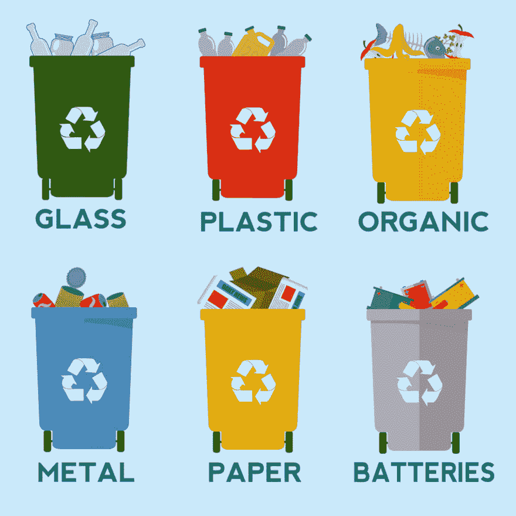

# 现实世界中的矛盾

> 原文：<https://dev.to/vitornovictor/contravariance-in-the-real-world-29l>

*反差*伤脑！[的定义](https://en.wikipedia.org/wiki/Covariance_and_contravariance_(computer_science)#Formal_definition)很简单，但是将其应用到现实世界中并没有多大意义。为什么`Container[Waste]`是`Container[Paper]`的一个子类型，而`Paper`是`Waste`的一个更特殊的类型？

理解*矛盾*的关键是停止用*“是一种更专门化的类型”*来思考类型，将焦点切换到**接受**的想法上。

在 Scala 中想象以下场景:

```
class Waste
class Paper extends Waste
class Glass extends Waste

class Container[T] {
  //...
}

object Office {
    def setPaperContainer(container: Container[Paper]): Unit = ???

    def setGlassContainer(container: Container[Glass]): Unit = ???
} 
```

Enter fullscreen mode Exit fullscreen mode

`Office`仅**接受**特定类型的集装箱:`Container[Paper]`和`Container[Glass]`。但那不实际！实际上，相同类型的容器有不同的颜色:

[T2】](https://res.cloudinary.com/practicaldev/image/fetch/s--VHl7Sq6l--/c_limit%2Cf_auto%2Cfl_progressive%2Cq_auto%2Cw_880/https://thepracticaldev.s3.amazonaws.com/i/kbgqpvdt51a17433hmj7.jpg)

它们并不像例子中所暗示的那样专门化。

下面的话更好地表达了现实中发生的事情:

```
object Office {
  def setPaperContainer(container: Container[Waste]): Unit = ???

  def setGlassContainer(container: Container[Waste]): Unit = ???
} 
```

Enter fullscreen mode Exit fullscreen mode

但是，如果办公室的政策需要一个特殊的容器来存放撕碎的东西呢？让`Container`是*协变*有意义吗？`Office` **可以接受** `Container[Waste]`或者其他更专业的类型给`Paper`和`Glass`吗？

```
class Container[+T] { //<---- Covariant
  //...
}

object Office {
  def setPaperContainer(container: Container[Waste]): Unit = ???

  def setGlassContainer(container: Container[Waste]): Unit = ???
} 
```

Enter fullscreen mode Exit fullscreen mode

答案是否定的。否则，`Office`将**接受**一个碎纸机作为`Container[Glass]`，结果将是一团糟！

那么，如何表达一个`Container`既可以是基本类型，也可以是只针对给定类型的专用类型呢？换句话说，如何**接受**一个`Container[Waste]`和一个`Container[Paper]`做`Paper`，而仅仅**接受**一个`Container[Waste]`和`Container[Glass]`做`Glass`？

使用*逆变*！

```
class Container[-T] {//<---- Contravariant
  //...
}

object Office {
  def setPaperContainer(container: Container[Paper]): Unit = ???

  def setGlassContainer(container: Container[Glass]): Unit = ???
} 
```

Enter fullscreen mode Exit fullscreen mode

通过制作`Container` *逆变*,`Office`**为`Paper`和`Glass`接受**一个`Container[Waste]`，或者为每一个接受一个专用类型。并且**不接受**用于`Glass`的碎纸机，或用于`Paper`的专用`Glass`容器。

不要用碎纸机碎玻璃。使用*逆变*！