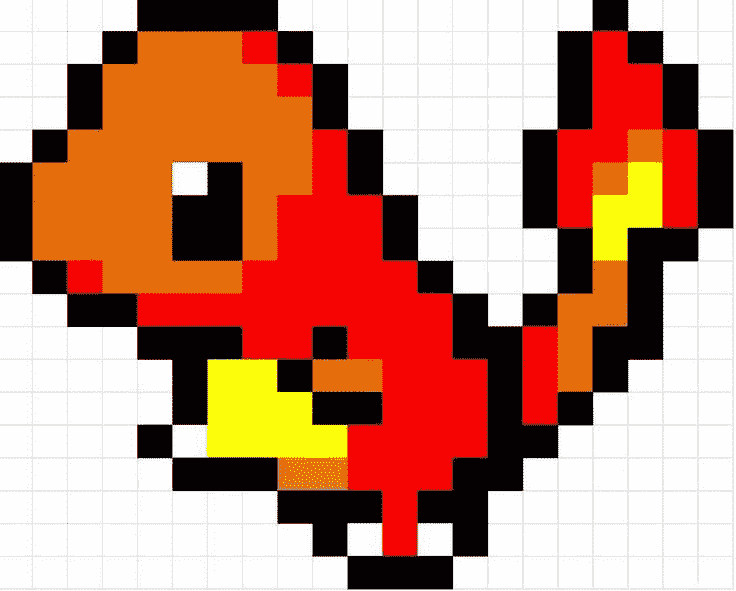

# 控制流:初学者指南

> 原文：<https://dev.to/howtocodejs/control-flow-the-beginners-guide-3mp9>

[T2】](https://res.cloudinary.com/practicaldev/image/fetch/s--6wgvjVIX--/c_limit%2Cf_auto%2Cfl_progressive%2Cq_auto%2Cw_880/https://thepracticaldev.s3.amazonaws.com/i/j7bp97fz7u35xzqydjaw.jpg)

有时，您需要依靠自动化任务来运行代码。想想控制交通的交通灯，它们让城市免去了在每个十字路口指派交通警察的麻烦。或者以令人难以置信的速度完成日常工作的装配线。

类似地，条件和循环允许我们编写有效和高效的代码。之所以使用术语控制流，是因为解释器从上到下读取代码。循序渐进。

当你写了一串语句，比如，

```
 let firstVar = 'dummy';
 let secondVar = 'bozo';
 let thirdVar = 'stoog';

 console.log(firstVar);
 console.log(secondVar);
 console.log(thirdVar); 
```

Enter fullscreen mode Exit fullscreen mode

解释器从上到下读取代码，并按顺序执行。如果我们不必考虑用户将与我们的应用程序交互的事实，这将是很好的。与机器人不同，人类可能不会按照我们希望的方式与我们的应用程序进行交互，所以我们必须通过设置条件来为此做好计划。

把条件句想象成岔路口。你现在可能已经熟悉了 if 语句。让我们试着在用户与我们的应用程序交互的场景中使用它。

### 如果/否则

假设我们的任务是为一个名为宠物天堂的宠物日托中心构建一个提交表单。首席执行官拉里·戴维斯想问他的潜在客户的一个问题是，“你有多少宠物？”。

```
var answer = prompt("how many pets do you have?");
alert(answer); 
```

Enter fullscreen mode Exit fullscreen mode

> 专业提示:`prompt`方法接受用户的响应并返回用户的输入。我们可以用它来测试用户输入。曾几何时，`alert`方法被用来测试输出，但是`console.log()`接管了这个角色。

我们假设用户会输入一个数字，但是如果有人想输入一个很长的字符串来扰乱我们呢？

如果没有控制流，这就是我们可能从恶意用户那里得到的:`DROP/*you got jacked!*/users`

这一小段 SQL 代码可以删除数据库中的所有用户。这只是一个例子。真的，只需要一个简单的字符串就可以破坏我们的应用程序。

想象一下，如果我们想计算每个主人的平均宠物数量，这样戴维斯先生就可以知道他应该在用品上花多少钱。

不要担心功能。将下面的代码复制到编辑器中，并尝试输入一个数字。

```
var pets = 35;
var owners = 15;
var petsPerOwner = average(pets, owners);
//======Pet Info Form
var answer = prompt("how many pets do you have?");
//============
updateAvg(answer) // update based on answer, add new owner

console.log(`There are now ${petsPerOwner} pets per owner at Pet Nirvana `)

//============
//Functions are hoisted up in JavaScript.
//We'll deal with 'em later

function average(total, number){
    return total / number;
}
function updateAvg(newNum){
  pets += Number(newNum); // register new pet(s)
  owners += 1 // register new owner
  petsPerOwner = Math.ceil(average(pets, owners)); // find new average, round up
} 
```

Enter fullscreen mode Exit fullscreen mode

你应该得到一个很好的平均分数。现在，尝试在提示符中插入一个随机字符串。

你应该得到“宠物天堂现在每个主人有 10 只宠物”

> 亲提示:具体错误源于 Number()函数。该函数将字符串类型的数字(`'3'`)强制转换为 T4 类型的数字(`3`)。每当我们收到用户输入时，它很可能是字符串形式的。所以当我们期待一个数字时,`Number()`就派上了用场。如果输入是一个普通的单词串，我们试图将它转换成一个数字，我们得到`NaN`。

这可能看起来没什么大不了的，但在现实世界中，这将是一场灾难。我们无法访问重要信息，只是因为我们无法过滤数据。

必须对我们想要处理的数据进行控制。

### 如果/否则

谢天谢地，我们有 if/else 语句。

```
var answer = prompt("how many pets do you have?");
if(isNaN(answer)){
    alert("Error: input a number");
}else{
  updateAvg(answer) // update based on answer, add new owner
  console.log(`There are now ${petsPerOwner} pets per owner at Pet Nirvana `)
} 
```

Enter fullscreen mode Exit fullscreen mode

我们可以通过检查答案是否是一个数字来控制数据流，而不是接受任何旧的响应。还记得我们的`NaN`错误吗？这是当你试图在字符串上执行不兼容的算术运算符时出现的错误。如果条件为真，if 语句中的任何代码块都将自动执行。

> 注意:没有必要写`isNaN(answer) == true`，因为 if 语句可以评估一个值的真实性。

```
"hello" / 4; //> NaN 
```

Enter fullscreen mode Exit fullscreen mode

嗯，有一个名为`isNaN()`的内置函数可以检查数据类型是否是数字。如果数据类型不是数字，则返回 true。否则，它返回 false。

为了更好的理解，我们把刚才写的代码翻译成伪代码。

```
/*
If the answer is not a number
     output an error
Else(otherwise)
    update the average
*/ 
```

Enter fullscreen mode Exit fullscreen mode

### 短路

有另一种控制数据流的方法。我们可以短路 OR 运算符。

```
 isNaN(answer) || (petsPerOwner = updateAvg(answer));
console.log(`There are now ${petsPerOwner} pets per owner at Pet Nirvana `); 
```

Enter fullscreen mode Exit fullscreen mode

OR 运算符查找第一个真值。当它找到它的时候，它就脱离了这个条件。因此，如果答案不是一个数字，我们就不必更新平均值。

这里的问题是,`answer`仍然保存着不需要的值，限制了我们对这个变量的处理。您还会注意到，没有办法给用户任何反馈。短路 OR 操作符是一个很好的技巧，但是它不是控制数据流的最佳方法。

### 否则如果

如果我们想检查两种以上的可能情况，该怎么办？如果宠物天堂的首席执行官也想警告宠物主人，该公司目前只能为每个主人提供 3 只宠物，该怎么办？我们现在不仅需要检查用户输入的数据类型，我们还必须警告拥有四只以上宠物的主人注意这个限制。

else if 语句会很有用。你可以随心所欲地把它们连在一起。

```
if(/*first condition*/){

}else if(/*second condition*/){

}else if(/*third condition*/){

} 
```

Enter fullscreen mode Exit fullscreen mode

在开始编码之前，我们为什么不先尝试对我们的解决方案进行伪编码呢？

```
/*
If the answer is not a number
     output an error
Else if the answer is greater than three     
    warn the user that they have too many pets
Else(otherwise)
    update the average
*/ 
```

Enter fullscreen mode Exit fullscreen mode

让我们在我们的代码上尝试一下。当你输入一个大于 3 的数字时，你会得到一个警告。

```
var answer = prompt("how many pets do you have?");
if(isNaN(answer)){
    alert("Error: input a number");
}else if(Number(answer) > 3){
  alert("Sorry, we currently only accept 3 pets");
}
else{
  updateAvg(answer) // update based on answer, add new owner
  console.log(`There are now ${petsPerOwner} pets per owner at Pet Nirvana `)
} 
```

Enter fullscreen mode Exit fullscreen mode

### 任务

哦哦。你和你的委托人之间的沟通出现了问题。显然，即使主人的宠物总数超过了限制，他也希望平均值得到更新，但是他希望在这样做之前询问用户他们是否接受这个限制。

伪代码已经为您提供。

```
/*
Else if the answer is greater than three   
  Prompt the user and ask if they're ok with the limit
  If the prompt equals yes
     update the average

*/ 
```

Enter fullscreen mode Exit fullscreen mode

# 切换报表

随着您继续使用 if 语句，您可能会遇到这种类型的代码:

```
if (x == "case 1") runThis();
else if (x == "case 2") runThat();
else if (x == "case 3") runThis();
else if (x == "case 4") runThat(); 
```

Enter fullscreen mode Exit fullscreen mode

如果您正在处理如此多的情况，使用一个叫做`switch`的控制流结构可能会更好。

基本的 switch 语句从初始值开始，然后提供带有可选默认值的 case 块。

case 语句只是一个读者友好的 if 语句。

```
let greeting = 'hello'
switch(greeting){
  case 'hello': // is the same as if(greeting === 'hello')
    //code goes here
    //break

  default: // is the same as else
} 
```

Enter fullscreen mode Exit fullscreen mode

这里有一个更具体的例子供你咀嚼。

```
let number = 2;

switch(number) {
  case 1:
    console.log("this is one");
    break;
  case 2:
    console.log("this is two");
    break;
  case 3:
    console.log("this is three");
    break;
  default:
    console.log("I can't count past three.");
}

//can you guess what the result will be? 
```

Enter fullscreen mode Exit fullscreen mode

break 关键字至关重要。如果您忽略它们，并且满足条件，switch 语句将继续，自动执行下一个 case 块，直到遇到断点或用完所有的 case。

因此，如果我们省略了`case 2:`中的`break`，我们将得到:

```
"this is two"
"this is three" 
```

Enter fullscreen mode Exit fullscreen mode

将 switch 语句想象成一个管道。中断声明作为堤坝，防止泄漏到管道的其他部分。

关于 switch 语句需要注意的另一件事是分组事例的能力。让我们扩展我们的问候示例来展示我们的案例链。

```
 switch(prompt('greet me!')){
  case 'hello':
  case 'hi':
  case 'yo':
    console.log("Hey? What's up?");
    break;
  default:
    console.log("I don't speak your lingo.");
} 
```

Enter fullscreen mode Exit fullscreen mode

# 循环往复

现在我们知道了如何控制传入的数据，但是传出给用户的数据呢？

戴维斯先生现在想给他的训练员增加一个评级系统。他希望明星以他们的名字出现。

我们可以手动渲染所有的星星...

```
//you can see that Becky has accumulated a rounded average of four stars
var becky = {name:'Becky Star', stars: 4}

//====Profile
//Mock profile name
console.log(becky.name)
//we can render our stars four times
render() + render() + render() + render();
//====
//Dummy render function
function render(){
  return '*';
} 
```

Enter fullscreen mode Exit fullscreen mode

### while 循环

或者我们可以使用一个`while`循环。while 循环检查条件是否为真，并将继续运行代码块，直到条件为假。确保你的循环最终会产生一个假值。否则，您将面临一个无限循环。

```
// you usually have to set a counter and either decrement or increment it till it satisfies the condition.
counter = 4;

while(counter != 0){
  console.log(counter);
  --counter //we decrease the counter by 1
} 
```

Enter fullscreen mode Exit fullscreen mode

试着点燃你的创造力。使用 while 循环渲染一行四颗星。输出应该是这样的:`'****'`

> 提示:计数器的数字和星星的数字是有意义的。
> 
> 提示:加号等于运算符会很有用

### 边做边看

do while 循环类似于 while 循环，除了保证在第一轮循环中执行代码块。

这就像说，“肯定要先做这个(这是代码块)。现在，只要我的条件是真的，就继续做那个街区里的事。

让我们重新看看宠物号提示，并使用 do while 循环重写它。

```
let answer;
do {
  answer = prompt("how many pets do you have?");

}while(isNaN(answer)) 
```

Enter fullscreen mode Exit fullscreen mode

如果用户不输入数字，这段代码会一直纠缠用户输入信息。

让我们在循环中添加一个条件来加强我们对信息的控制。

```
let answer;
do {
  answer = prompt("how many pets do you have?");
  if(isNaN(answer)){
     alert("error: enter a number");
  }
}while(isNaN(answer)) 
```

Enter fullscreen mode Exit fullscreen mode

现在，我们已经创建了一个反馈循环，提醒用户他们的错误，并允许他们立即纠正错误。

### 为循环

简单来说，for 循环就是包含电池的 while 循环。你知道如何在循环之外建立一个计数器，然后确保递减或递增它吗？

使用 for 循环，您可以在单个参数`()`中设置所有内容。

```
/* first you set the counter*/
//var x = 4;
/* then you set the condition*/
//x != 0;
/*finally, you decrement or increment
depending on your condition
*/
//--x
//Now let's install the batteries
for(var x = 4; x!= 0; --x){
  //we're ready to loop
} 
```

Enter fullscreen mode Exit fullscreen mode

还记得你之前要做的渲染任务吗？下面是使用 for 循环的解决方案。

```
//we can see here that Becky has accumulated a rounded total of four stars
var becky = {name:'Becky Star', stars: 4}
var starRow = '';
//====Profile
//Mock profile name
console.log(becky.name)
//rendering with the for loop
for(cnt = becky.stars; cnt != 0; --cnt){
  starRow += render();
}
starRow; // > '****'

//Dummy render function
function render(){
  return '*'
} 
```

Enter fullscreen mode Exit fullscreen mode

# 打破循环

循环继续运行，直到条件为假。有时我们可能想用关键字`break`打破循环——Inception 式的。

```
//this is a potential infinite loop
while(true){
  console.log("I'm free!");
  break; // phew
} 
```

Enter fullscreen mode Exit fullscreen mode

您可能会遇到需要嵌套 for 循环的问题。

```
var matrix = [[1,2,3],[4,5,6],[7,8,9]];
//prints 1,2,3,4...
for(var outer=0;outer < matrix.length; ++outer){
   for(var inner=0;inner < matrix.length; ++inner){
    console.log(matrix[outer][inner])   
   }
} 
```

Enter fullscreen mode Exit fullscreen mode

在内部 for 循环中编写 break 语句会中断内部循环，但外部循环会继续运行。

```
var matrix = [[1,2,3],[4,5,6],[7,8,9]];
//prints 1,2,3,4...
for(var outer=0;outer < matrix.length; ++outer){
   for(var inner=0;inner < matrix.length; ++inner){
      if(matrix[outer][inner] === 2){
        break;
      }   
   }
} 
```

Enter fullscreen mode Exit fullscreen mode

如果你想完全摆脱每一个循环，你需要标记你的循环。您可以在 for 循环前面加上您想要的任何名称，后跟一个冒号。然后，当您准备好打破循环时，您可以在 break 关键字后追加标签名称。

```
labelName: for(){
  for(){
    break labelName;
  }  
} 
```

Enter fullscreen mode Exit fullscreen mode

这是我们修改过的嵌套循环。

```
var matrix = [[1,2,3],[4,5,6],[7,8,9]];
//the for loop can start on a newline
outer:
for(var outer=0;outer < matrix.length; ++outer){
   for(var inner=0;inner < matrix.length; ++inner){
      if(matrix[outer][inner] === 2){
        break outer;
      }   
   }
} 
```

Enter fullscreen mode Exit fullscreen mode

# 持续循环

continue 指令允许我们跳过循环中的步骤。也许这个指令应该叫做 skip，但是，唉，我们还是用 continue 吧。

```
for (let i = 0; i < 10; i++) {
// if i is even, skip the rest of the code.
  if (i % 2 == 0) continue;

  console.log(i); // 1, 3, 5, 7, 9
} 
```

Enter fullscreen mode Exit fullscreen mode

> 专业提示:如果代码块可以写在一行中，就不需要花括号。

# 总结

我们攻克了`if/else if/else`语句，攻克了`switch`语句，解开了`while`、`do while`和`for loops`。我们还学习了如何打破循环并继续循环。接下来，我们将学习 JavaScript 程序如何围绕函数流动。