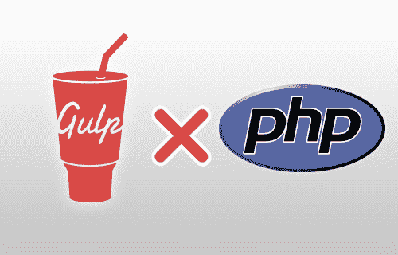

# 使用 PHP、SVN 和 Gulp 控制版本

> 原文：<https://dev.to/prelias/controlando-verses-com-php-svn-e-gulp-1in0>

[T2】](https://res.cloudinary.com/practicaldev/image/fetch/s--1tlCNSWy--/c_limit%2Cf_auto%2Cfl_progressive%2Cq_auto%2Cw_880/https://highmoon-miyabi.com/blimg/article_thumb/gulp_php.png)

随着 Git 越来越多地用于存储库控制，这一提示可能不再那么有用，但是，就像我在这里工作的公司仍然使用 Tortoise SVN 一样，世界各地可能还有其他公司和个人对今天的帖子感兴趣。

它在 *.Net* 项目中也运行得更好，因为它是编译的，但是这里提供的信息可以很容易地适应它(我也会在适当的时候做一个说明，表明基本的区别)。

post 的重点是演示如何使用名为“**subwcrev . exe**”的 SVN 可执行文件，该可执行文件用于读取存储库信息(如最新版本号或日期)，并将变量交换到模板文件中的返回值。

但是，由于 PHP 不是编译语言，如果要将此部署到您的项目中，则需要使用软件包管理器。虽然您也可以直接从作业系统主控台执行指令，但大部分的自动化都会遗失。

首先创建一个模板文件，您可以在其中包含要使用的变量(有关这些变量的完整列表，请参阅 SVN 文档)。在我的示例中，我将文件命名为“*”version-template . PHP*，它包含以下内容:

`<?php return array( 'version' => '1.0.0.$WCREV$ data: $WCDATE$'>);`

请注意，它包含一个 PHP 数组，其中包含 WCREV 和 WCDATE 变量，调用后，这些变量将被可执行文件替换。

在我们的文件*gulpfeile*中，我们需要包括一个*要求*(如果它不存在的话)。如下所示:

`var exec = require('child_process').exec;`

这样，我们就可以创建执行可执行文件调用的任务:

`gulp.task('version-number', function (cb) {
exec('"C:/Program Files/TortoiseSVN/bin/SubWCRev.exe" "." "C:/Source/Projeto/branches/branch1/version-
template.php" "C:/Source/Projeto/branches/branch1/version.php"', function (err, stdout, stderr) {
console.log(stdout);
console.log(stderr);
cb(err);
});
})`

下面让我们简要解释一下上面的脚本。该任务被命名为*版本号*，以便在 gulp 文件中稍后引用(在字符串 *build* 旁边)。它使用 *exec* 调用命令，该命令由以下内容组成:

`[diretório do exe][diretório da solution][arquivo template][arquivo final]`

它还提供了在控制台窗口中登录信息和出现错误的说明。

例如，如果您的服务器[**【Jenkins】**](https://jenkins.io/)上的是远程的，则需要调整命令以适应您的目录，并且要格外小心，但基本上包括这一*任务*

`'version' => '1.0.0.93528 data: 2018/06/07 09:36:50'`

此文件在我的示例中命名为“*version . PHP*”，建议将其放在 SVN 的忽略列表中，以避免每次都被吃掉。

如果您在. Net 项目中，则可以将类似的命令作为预构建事件运行，同时使用 Visual Studio 变量，并且必须使用文件“*assembly yinfo . cs*”保存信息。就像这样。

`"C:\Program Files\TortoiseSVN\bin\SubWCRev.exe" $(ProjectDir). $(ProjectDir)Properties\AssemblyInfo_template.cs $(ProjectDir)Properties\AssemblyInfo.cs`

准备就绪后，您可以将读取此文件并向用户显示或不显示其版本的内容放入应用程序中。当然，由于实际上不是汇编的问题，这个过程最终变得不那么有趣，因为处理一些文件和不运行‘t0’gulpfle’t1’更容易。但是，如果您忠实于您的“T2”工作流程，并且始终使用 Gulp 生成构建，则可以在组织项目和评估所使用的版本方面获得很大的合作伙伴关系。

我拥抱每个人，直到下一个帖子