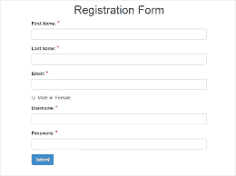

# 以受控方式处理表单输入

> 原文：<https://dev.to/firebase007/controlled-form-inputs-in-react-586c>

[T2】](https://res.cloudinary.com/practicaldev/image/fetch/s--cenV-0pw--/c_limit%2Cf_auto%2Cfl_progressive%2Cq_auto%2Cw_880/https://thepracticaldev.s3.amazonaws.com/i/xs6nywaxcpy35c8frvh3.png)

[**React**](https://www.reactjs.org) 主张在处理状态或数据变化时采用单一的真实来源。在 **HTML** 中，像`__input__`和`__textarea__`这样的表单元素基于用户输入以不受控制的方式维护和更新它们的**状态**。然而，由于 React 为**提供了一个单独的状态存储库**来处理状态更新(通过 setState() API ),所以我们最好寻找一种更好的方法来以可控的方式处理表单状态——以确保在一个地方处理状态更新的一致性。当然，作为一名开发人员，这样做的好处是，它可以让您完全控制表单输入状态，并允许您快速知道错误来自哪里。

在本教程中，我们将学习如何处理和跟踪用户在表单**输入**或**文本区域**字段中输入的值。所以在这里，我们将看一个在 React 中处理状态更新的简单例子。

注意，React 状态只是一个简单的 Javascript 对象——我们这样声明它

```
 state = {}; 
```

同样，建议不要直接篡改或改变这个状态对象，而只能通过 **setState** 方法【我们将在后面看到】。

旁白:脸书的 React 团队为快速构建和引导 React 应用程序提供了样板文件。 **Create-react-app** 是一款帮助快速启动 react 应用程序的工具，可以在很短的时间内启动并运行，避免处理整个初始设置过程的复杂性。有关这方面的更多信息，请查阅关于 [Create React App](https://facebook.github.io/create-react-app/) 的文档。此外，对于快速原型制作和演示，React 也只需要一个 HTML 文件和一些脚本标签，而不需要大量的设置或安装步骤。有关这方面的更多信息，请查看如何[将 React 组件添加到 HTML 页面](https://reactjs.org/docs/add-react-to-a-website.html)。

现在开始，我们创建一个**有状态的** React 组件——这是必要的，因为我们打算处理表单输入字段的状态更新。为了编写有状态的组件，我们使用下面概述的 eS6 类语法；

```
class App extends React.Component {
constructor(...args) {
  super();
  this.state = {
    value: '', 
  }
  this.onHandleChange = this.onHandleChange.bind(this);
} 
```

讨论:在这里，我们的 App 类扩展或继承了 React 组件 API 的功能，这允许我们使用 declare constructor 函数，然后我们可以在其中声明我们的初始状态对象。ES6 改进了 ***类继承*** 用**扩展了**关键字。 **super** 让我们引用父对象构造函数/类，在本例中，是 React 组件。这允许我们设置组件状态，并将组件方法绑定到组件类。状态对象包含一个值属性，该属性最初被设置为空字符串。

接下来，我们实现我们的组件方法；

```
onHandleChange (e) {
  console.log(e.target.value); //logs the user event to the console
  this.setState({ value: e.target.value
  })
} 
```

注意，我们也可以使用新的 es6 胖箭头函数声明组件方法，避免将类方法绑定到构造函数。这是因为箭头函数有自己的*这个*上下文。为了避免我们过多的钻研，你可以在这里查看如何使用箭头函数

讨论:-这里， *onHandleChange* 组件方法为我们提供了一种方法，可以使用我们之前提到的 *setState* 方法更新输入字段的状态值。我们还可以看到，我们正在根据表单输入字段上的用户事件更新值的状态。此外，就像我们之前提到的一样， **setState** 方法是处理 React 组件中状态更新的唯一可取的方式，而不是直接突变或更改`this.state.value`。

接下来，我们调用 render 方法，该方法返回要在浏览器中呈现的 JSX。

```
render (){
  return (
    <div>
      <h1>A Simple Form Input Example</h1>
      <input type = 'text'  onChange = {this.onHandleChange} value = {this.state.value}/>   
    </div>
  );
}
} 
```

讨论:这里，输入字段包含一个*文本*的*类型*。一个 *onChange* 属性，帮助**将组件方法绑定**到输入字段，以便执行状态更新；最后是一个*值*属性，它使输入字段成为一个 React 特定的状态控制字段。

最后，我们将 app 类组件呈现给 DOM。我们通过用 HTML 文件中的组件类和目标元素的 id 调用 **ReactDOM.render** 方法来实现，如下所示；

```
const rootElement = document.getElementById("root");
ReactDOM.render(<App />, rootElement); 
```

如果你感兴趣，你可以查看这篇文章的链接[这里](https://codesandbox.io/s/7m53wv27p6)来感受一下它是如何工作的。请不要犹豫，留下你的赞、问题和评论。

感谢阅读。下次见。:)