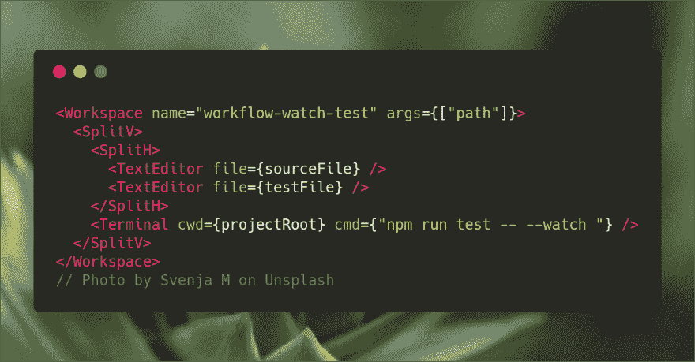

# 使用 React 控制您的桌面布局

> 原文：<https://dev.to/havardh/controlling-your-desktop-layout-with-react-1g0b>

本帖是对 [`workflow`](https://github.com/havardh/workflow) 写流文件的简单介绍。如果你是第一次接触`workflow`，那么[介绍帖](https://dev.to/havardh/introducing-workflow-18h6)是一个很好的起点。下一篇[文章](https://dev.to/havardh/spotify-on-workflow-4fo6)将向你展示如何添加对新应用的支持。

*更新了代码样本以支持[工作流@ 2 . x](https://github.com/havardh/workflow/commit/ca77860)T3。*

[T2】](https://res.cloudinary.com/practicaldev/image/fetch/s--2qyiMios--/c_limit%2Cf_auto%2Cfl_progressive%2Cq_auto%2Cw_880/https://thepracticaldev.s3.amazonaws.com/i/f8v95okq5cqmio7pooit.png)

流文件是布局声明，您可以在其中声明要打开哪些应用程序以及它们应该出现在屏幕上的什么位置。这篇文章将向你展示如何使用 [`workflow-react`](https://github.com/havardh/workflow/tree/master/packages/workflow-react) 包编写一个流文件作为一个小的 React 应用程序。

### 运行示例。

作为一个简单的例子，我们将为编写单元测试构建一个流文件。这个流将包含两个文本编辑器[【1】](#footnotes)，以及一个终端。编辑器将打开源文件和相应的测试文件，而终端将在观察模式下执行测试。我们将假设这个项目使用了一个文件名约定，这样我们就可以从源文件中获得测试文件的位置和名称，反之亦然。我们还将假设项目处于源代码控制之下。

此外，我们假设您正在使用一个工作流主文件夹，该文件夹是由`workflow`在第一次执行时创建的文件夹派生或等效的。

### 贝壳

每个流文件都有一个默认导出，导出的对象应该是一个树结构，以工作区节点为根节点。当使用`workflow-react`时，这是通过在`Workspace`组件上调用`render`来实现的。

```
import React from "react";
import { render, Workspace} from "workflow-react";

export const flow = render(
  <Workspace name="workflow-watch-test" />
); 
```

### 接受论点

workspace 节点有一个名为`args`的属性，可以用来传递流需要的命令行参数列表。我们例子中的参数将是测试文件或者源文件的绝对路径。因为我们只有一个参数，所以我们将组件的`args`属性设置为我们想要给参数的字符串名称。如果需要更多的值，则传递一个字符串数组。该数组中的位置表示参数在命令行中的位置。[【2】](#footnotes)

```
<Workspace name="workflow-watch-test" args="path" /> 
```

### 定义布局

工作流有两个用于定义布局的主要包。 [`workflow-layout-yoga`](https://github.com/havardh/workflow/tree/master/packages/workflow-layout-yoga) 包提供了一个类似于 CSS 语言`Flexbox`的 api。 [`workflow-layout-tiled`](https://github.com/havardh/workflow/tree/master/packages/workflow-layout-tiled) 是一种更简单的方法，公开两个节点；垂直和水平拆分(SplitV 和 SplitH)。这些可以用来将父节点水平地或垂直地分割成多个子节点，子节点的大小由`percent`属性给出。我们将使用这些节点中的一个，在终端和文本编辑器之间进行 80%-20%的分割，在文本编辑器之间进行 50%-50%的分割。

```
import {requireComponent} from "workflow-react";

const {SplitV, SplitH} = requireComponent("workflow-layout-tiled");

export const flow = render(
  <Workspace ...>
    <SplitV percent={1.0}>
      <SplitH percent={0.8}>
        <... percent={0.5} />
        <... percent={0.5} />
      </SplitH>
      <... percent={0.2} />
    </SplitV>
  </Workspace>
); 
```

请注意，`SplitV`和`SplitH`组件是用一个定制的 require 函数导入的，这个函数是由`workflow-react`包导出的。这个函数将在内部`require`NPM 包`workflow-layout-tiled`，并将内容包装到 React 组件中。使用这种方法是为了让布局和应用程序定义都不依赖于 React，也可以与其他前端共享，如 [`workflow-angular`](https://github.com/havardh/workflow/tree/master/packages/workflow-angular) 。您可以在此阅读更多关于此功能的信息[。](https://github.com/havardh/workflow/tree/master/packages/workflow-react#the-requirecomponent-function)

### 实例化应用程序

现在，拼图的最后一块是将适当的道具传递到应用程序组件中，以便它们能够使用预期的文件和命令启动。

#### 导入默认应用程序

首先要注意的是导入。我们使用名为`workflow-apps-defaults`的默认应用程序收集包。这个包输出`TextEditor`、`Terminal`和`Browser`。每个平台都有默认值，但是用户可以在工作流主目录中[覆盖](https://github.com/havardh/workflow/tree/master/packages/create-workflow-home/files/static#appsdefaultsjs)。通过使用这个包，不同平台和具有不同应用程序偏好的用户无需修改就可以共享流文件。

```
const {Terminal, TextEditor} = requireComponent("workflow-apps-defaults"); 
```

#### 加载源文件

默认情况下，，`workflow`将调用 app 节点中的所有属性，这些属性是带有命令行参数的函数[【4】](#footnotes)。在本例中，我们将参数命名为`path`。因此，我们将一个函数传递给`TextEditor`组件的`file`属性，让它评估从命令行参数到源文件的路径。如果参数是测试文件，该函数将处理从路径到测试文件的转换。

```
function sourceFile({path}) {
  if (path.includes("src")) {
    return path;
  } else {
    return path.replace("test/unit", "src").replace("_tests.js", ".js");
  }
}

export const flow = render(
     <...>
        <TextEditor ... file={sourceFile} />
        <... />
      </...>
); 
```

#### 加载测试文件

测试文件的加载方式与源文件完全相同。只是转换方向相反。

```
function testFile({path}) {
  if (path.includes("test/unit")) {
    return path;
  } else {
    return path.replace("src", "test/unit").replace(".js", "_tests.js");
  }
}

export const flow = render(
     <...>
        <TextEditor ... file={testFile} />
        <... />
      </...>
); 
```

#### 在终端中启动测试

最后一个组件使用`npm`包 [`execa`](https://github.com/sindresorhus/execa) 来执行一个`git`命令，以找出库的根。打开终端时，根路径用作当前工作目录。我们重用`testFile`函数来计算测试路径。这被传递给终端的`args`属性。如果属性被设置为包含函数的数组，这些函数也会用命令行参数调用。

```
import {dirname} from "path";
import execa from "execa";

function projectRoot({path}) {
  const cwd = dirname(path);
  const {stdout} = execa.sync('git', ["rev-parse", "--show-toplevel"], {cwd});
  return stdout.trim();
}

export const flow = render(
    <...>
      <Terminal 
        percent={0.2} 
        cwd={projectRoot}
        cmd={"npm run test -- --watch "}
        args={[testFile]}
      />
    </...>
); 
```

### 执行流程

如果你把完整的例子作为文件`WorkflowRunTest.js`添加到你的`WORKFLOW_HOME/flows`目录下，用`npm i execa`安装`execa`包。然后，下面的命令将执行我们的示例流。

```
$  workflow WorkflowWatchTest.js /path/to/workflow-repo/packages/workflow-resolver-absolute/src/index.js 
```

这将在默认编辑器中打开`packages/workflow-resolver-absolute/src/index.js`和`packages/workflow-resolver-absolute/test/unit/index_tests.js`，并在`/path/to/workflow-repo`中运行`npm run test -- --watch /path/to/workflow-repo/packages/workflow-resolver-absolute/test/unit/index_tests.js`命令。

### 完整的例子

这是我们示例的完整流文件。

```
import {dirname} from "path";
import React from "react";
import execa from "execa";
import { render, Workspace, requireComponent} from "workflow-react";

const {SplitV, SplitH} = requireComponent("workflow-layout-tiled");
const {Terminal, TextEditor} = requireComponent("workflow-apps-defaults");

function sourceFile({path}) {
  if (path.includes("src")) {
    return path;
  } else {
    return path.replace("test/unit", "src").replace("_tests.js", ".js");
  }
}

function testFile({path}) {
  if (path.includes("test/unit")) {
    return path;
  } else {
    return path.replace("src", "test/unit").replace(".js", "_tests.js");
  }
}

function projectRoot({path}) {
  const cwd = dirname(path);
  const {stdout} = execa.sync('git', ["rev-parse", "--show-toplevel"], {cwd});
  return stdout.trim();
}

export const flow = render(
  <Workspace name="workflow-watch-test" args="path">
    <SplitV percent={1.0}>
      <SplitH percent={0.8}>
        <TextEditor percent={0.5} file={sourceFile} />
        <TextEditor percent={0.5} file={testFile} />
      </SplitH>
      <Terminal
        percent={0.2}
        cwd={projectRoot}
        cmd={"npm run test -- --watch "}
        args={[testFile]}
      />
    </SplitV>
  </Workspace>
); 
```

### 脚注

[1]:你可能会想，我们需要一个内部带有分割线的文本编辑器。这在工作流中是可能的，但是目前只有少数应用程序支持，比如 emacs。这是怎么回事:

```
<Emacs percent={0.8}>
  <SplitH >
    <File percent={0.5} file={sourceFile} />
    <File percent={0.5} file={testFile} />
  </SplitH>
</Emacs> 
```

点击查看完整示例[。](https://github.com/havardh/workflow/blob/17411a81a4b2af02c487c11751ed8b94bc2b5005/packages/workflow-app-emacs/flows/Example.js)

[2]:由于参数解析中的一个[错误](https://github.com/havardh/workflow/issues/108)，你可能需要将参数指定为`<Workspace ... args={["ignore", "path]} />`来运行这个例子。

[3]:如果您让`workflow`在第一次执行时设置您的个人文件夹，您将使用默认的工作流-个人文件夹。它包含了 [`workflow-transformer-apply-arguments-to-fields`](https://github.com/havardh/workflow/tree/master/packages/workflow-transformer-apply-arguments-to-fields) 。这个转换器实现了将命令行参数传递给应用程序节点上的属性的功能。

[4]:除了`open`功能。这个功能将在下一篇关于创建新应用的文章中详细描述。