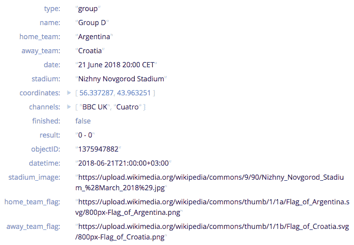
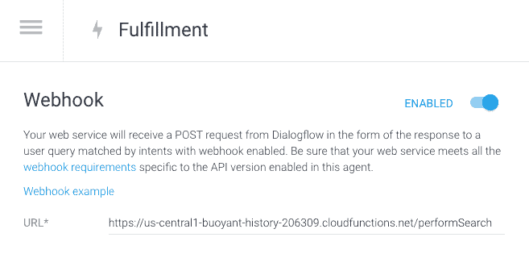
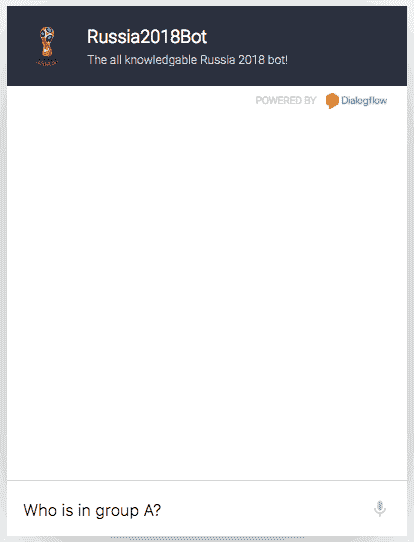
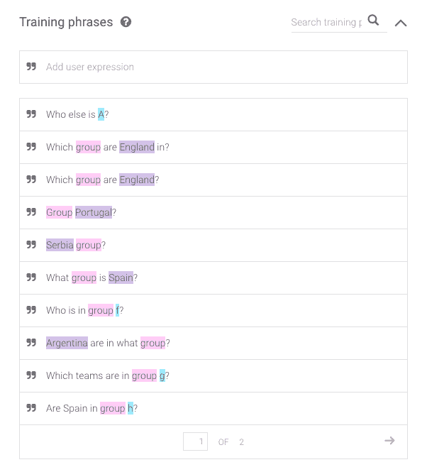
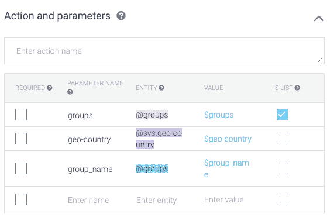
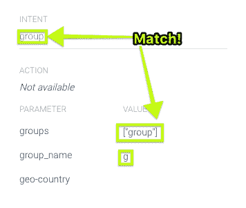
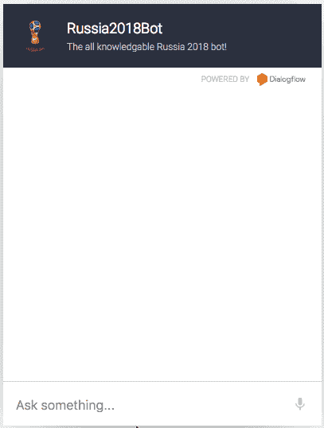
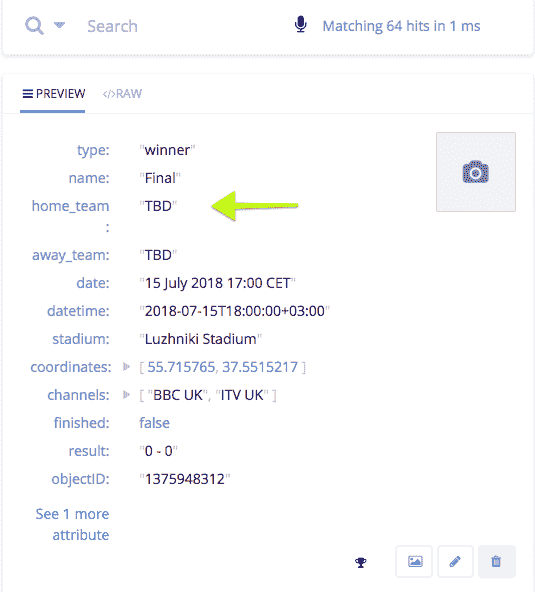
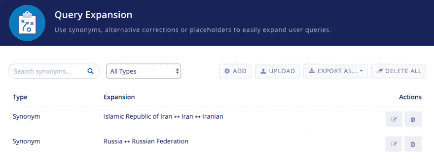

# 使用 Algolia 和 Google Dialogflow 进行对话式搜索

> 原文：<https://dev.to/martyndavies/conversational-search-with-algolia--google-dialogflow-4o1b>

搜索不再仅仅是右上角白盒的领域。随着越来越多的人对自己的手机、Alexa 或谷歌助手感到舒适，对支持对话式搜索的应用程序的需求与日俱增。

对我们开发者来说幸运的是，这种增加的需求带来了过多的新 API 和工具，以加速从右上角到消息应用程序或你选择的便捷助手设备的转变过程。

我发现的让你快速启动并运行的工具之一是 Google 的 Dialogflow。这个服务以前被称为 API.ai，它允许你为一个对话界面构建、训练甚至编写代码。更好的是，它甚至可以帮助你在众多服务上推出你新制作的“机器人”，包括 Slack、Facebook Messenger 和 Telegram。

## 我们开始吧

如果你想自己尝试一下，你需要以下东西:

*   一个 [Algolia](https://algolia.com) 账户(免费开始)，里面有你想搜索的数据索引
*   一个 [Dialogflow](https://dialogflow.com/) 账户。你需要使用谷歌账户登录。

我们搜索背后的逻辑以及返回的结果将由一个 webhook 端点来处理，Dialogflow 会将每个出站请求发送到这个端点。在这个例子中，这个 webhook 将是一个脚本，用 NodeJS 编写，但是作为一个 [Google Cloud 函数](https://cloud.google.com/functions/)托管。

如果您还不想使用 GCF，那么请注意，这里的代码也可以作为一个普通的 NodeJS 应用程序，您可以在任何您喜欢的地方托管它，只要它仍然可以公开访问。

## 阿尔戈利亚指数

在这个例子中，我们将使用 Algolia 作为我们的托管搜索平台。您可以选择任何您喜欢的数据来填充您的索引，但是请考虑这是人们将在对话/机器人 UX 中搜索的东西。

我使用的是即将到来的俄罗斯世界杯的分组列表索引，这也是我的同事[莎拉·达扬](https://frontstuff.io/)开发的这个伟大的[世界杯搜索](https://sarahdayan.github.io/world-cup-2018-lookup/#/)应用程序的基础。

下面是我们必须处理的数据的一个例子:

[T2】](https://res.cloudinary.com/practicaldev/image/fetch/s--PJy0h_Dq--/c_limit%2Cf_auto%2Cfl_progressive%2Cq_auto%2Cw_880/https://cl.ly/132t1y0A1z3u/Image%25202018-06-11%2520at%25204.19.23%2520pm.png)

这是一个非常丰富的数据集，有很多字段，适合对话式的 UX 风格。仅仅看一下这个，你就已经可以看到我们可能要考虑处理的一些问题:

*   "阿根廷什么时候和克罗地亚比赛？"
*   "克罗地亚在哪个小组？"
*   "哪个电视频道会播放克罗地亚和阿根廷的比赛？"
*   "阿根廷和克罗地亚在哪里比赛？"

让我们开始把它转换成我们可以使用的查询。

## 设置对话流

一旦您创建了 Dialogflow 帐户，您需要确保两件事情得到处理。

*   决定你的机器人将如何以及从哪里返回响应
*   训练机器人理解和模式匹配各种查询

在这个例子中，我们将从 Algolia 索引中返回数据，所以我们需要使用一个 webhook。

[T2】](https://res.cloudinary.com/practicaldev/image/fetch/s--pEkvhgk0--/c_limit%2Cf_auto%2Cfl_progressive%2Cq_auto%2Cw_880/https://cl.ly/1S0c0I39300C/Image%25202018-06-20%2520at%25202.09.17%2520pm.png)

您的 webhook 可以是任何接受 POST 请求并返回一些数据的服务的 URL。你可以使用 Node、Ruby、Go 或者任何你喜欢的语言来编写一个小型的 HTTP 服务器。只要确保您使用的端点是公开可用的。

我选择使用[谷歌云功能](https://cloud.google.com/functions/)来构建这个应用。GCF 是由 Google 托管的“无服务器”脚本，可以使用他们的 [GCloud 命令行界面](https://cloud.google.com/functions/docs/quickstart)进行部署和更新。

我的函数有一个端点:`performSearch`，它在部署到 GCF 时自动分配的 URL 是:[https://us-central 1-buoyant-history-206309 . cloud functions . net/perform search](https://us-central1-buoyant-history-206309.cloudfunctions.net/performSearch)。

这是我用来设置 webhook 的 URL，正如你在上面的图片中看到的。你的网址会不一样。

一旦 webhook 启用，所有与您的 Dialogflow 应用程序的交互都将发布到它上面，您可以从那里处理响应。

## 训练

在设计对话界面时，背景是非常重要的，培训是帮助你的应用理解用户真正在问什么的重要部分。

[T2】](https://res.cloudinary.com/practicaldev/image/fetch/s--uxYy0WFp--/c_limit%2Cf_auto%2Cfl_progressive%2Cq_66%2Cw_880/https://cl.ly/2g1l0I1x0H40/Screen%2520Recording%25202018-06-14%2520at%252004.45%2520pm.gif)

上面你可以看到用户问了几个关于世界杯小组赛的问题。我们需要我们的机器人来理解什么样的问题会与这个上下文相关，或者用对话流的话说，这个*‘意图’*。

在 intent 能够提取您需要在服务器端做出决策的信息之前，您需要给它足够的信息来消化。

这是我给系统的两页训练短语中的一页，这样它就可以了解“组”了:

[T2】](https://res.cloudinary.com/practicaldev/image/fetch/s--NGp3KwIV--/c_limit%2Cf_auto%2Cfl_progressive%2Cq_auto%2Cw_880/https://cl.ly/1P181p0Q2f1G/Image%25202018-06-20%2520at%25202.21.01%2520pm.png)

Dialogflow 将尝试将某些数据点与您键入的内容进行匹配。在上面的图片中，你可以看到不同的颜色突出了某些单词。当该词与您设置的任何一个操作和/或参数匹配时，就会发生这种情况

[T2】](https://res.cloudinary.com/practicaldev/image/fetch/s--qo7YpZDI--/c_limit%2Cf_auto%2Cfl_progressive%2Cq_auto%2Cw_880/https://cl.ly/3j0Q3P242I06/Image%25202018-06-20%2520at%25202.26.10%2520pm.png)

对于这个特定的数据集，并且为了与组一起工作，我们需要能够识别三件事情:

1.  目的是谈论“群体”
2.  一个国家
3.  一组字母(a、b、c、d 等)

或者，你可以从编程的角度来看。为了让我们的功能发挥作用，我们需要:

1.  一种确定使用哪个函数返回数据的方法
2.  作为搜索参数传递给 Algolia 的国家
3.  作为搜索参数传递给 Algolia 的组字母

一旦你加载了训练短语，你就可以使用 Dialogflow 模拟器(在每一页上都有)来测试你是否得到了你所需要的匹配参数:

[T2】](https://res.cloudinary.com/practicaldev/image/fetch/s--WJkz0y4B--/c_limit%2Cf_auto%2Cfl_progressive%2Cq_66%2Cw_880/https://cl.ly/0Y3t2q230u3M/Screen%2520Recording%25202018-06-20%2520at%252002.39%2520pm.gif)

您不会得到任何响应，因为您还没有编写任何代码，但是您将能够看到您是否得到了匹配。

[T2】](https://res.cloudinary.com/practicaldev/image/fetch/s--dBQfxDOs--/c_limit%2Cf_auto%2Cfl_progressive%2Cq_auto%2Cw_880/https://cl.ly/0H2l0X2l3h2N/%255B72dfc9b5cedaeeb1a37f4c7f9a724a52%255D_Image%25202018-06-20%2520at%25202.44.00%2520pm.png)

## 处理发布请求

一旦你得到了合适的匹配，你就可以开始处理将发布到你的 webhook 上的数据了。

为了处理涉及组数据的 Algolia 请求，我们的函数如下所示:

```
exports.performSearch = (req, res) => {
  let intent = req.body.queryResult.intent.displayName;
  let params = req.body.queryResult.parameters;

  switch (intent) {
    case 'group':
      groups(params);
      break;

    default:
      res.json({
        fulfillmentText: "Sorry, I don\'t understand what you're asking me about"
      });
  }

  function groups(intentParams) {
    if (_.isEmpty(intentParams['geo-country'])) {
      const groupName = intentParams.group_name.includes('?')
        ? intentParams.group_name.split('?')[0]
        : intentParams.group_name;

      index.search({ query: `Group ${groupName}` }, (err, data) => {
        const teams = data.hits.map(hit => hit.home_team);
        const teamsUnique = [...new Set(teams)];

        res.json({
          fulfillmentText: `The teams in Group ${groupName.toUpperCase()} are ${teamsUnique.join(
            ', '
          )}`
        });
      });
    } else {
      const country = intentParams['geo-country'];

      index.search({ query: country }, (err, data) => {
        res.json({
          fulfillmentText: `${country} are in ${data.hits[0].name}`
        });
      });
    }
  }
} 
```

Enter fullscreen mode Exit fullscreen mode

这里有相当多的清理和格式化代码，因为我希望返回给用户的结果更“人性化”，或者至少更具可读性。

让我们分解上面显示的代码:

我们从帖子请求
中获取传入的**意图**和相关的**参数**

```
let intent = req.body.queryResult.intent.displayName;
let params = req.body.queryResult.parameters; 
```

Enter fullscreen mode Exit fullscreen mode

Google Cloud Functions 实际上对 HTTP 部分使用了 Express，所以如果你以前使用过，你会感觉很熟悉。

使用意图，我们决定**哪个函数将处理数据**并返回响应:

```
switch (intent) {
  case 'group':
    groups(params);
    break;

  // Insert further case statements for other intents here

  default:
    res.json({
      fulfillmentText: "Sorry, I dont understand what you're asking me about"
    });
} 
```

Enter fullscreen mode Exit fullscreen mode

一旦我们有一个函数可以使用，我们需要确定**用户是否在询问一个一般的组信，或者想知道一个特定的团队在**的哪个组。我们通过使用 Lodash 的`isEmpty`方法:
来检查`geo-country`参数中值的存在

```
if (_.isEmpty(intentParams['geo-country'])) {
  /* No country present so get all the teams in the group*/
} else {
  /* A country has been mentioned, get what group they are in */
} 
```

Enter fullscreen mode Exit fullscreen mode

然后我们搜索我们的 Algolia 索引。因为 Algolia 在文本字符串中有很好的匹配性，**我们只需将我们的查询设置为“B 组”,我们将得到所有与那个**匹配的内容。相当漂亮。

```
index.search({ query: `Group ${groupName}` }, (err, data) => {
  const teams = data.hits.map(hit => hit.home_team);

  const teamsUnique = [...new Set(teams)];
  res.json({
    fulfillmentText: `The teams in Group ${groupName.toUpperCase()} are ${teamsUnique.join(
      ', '
    )}`
  });
}); 
```

Enter fullscreen mode Exit fullscreen mode

我们的查询将返回与包含我们正在搜索的组字母的记录以及其他所有字段相匹配的所有内容。我们不需要所有这些，所以我们**使用`map`高阶数组方法来创建一个新的数组，只包含团队名称** :

```
const teams = data.hits.map(hit => hit.home_team); 
```

Enter fullscreen mode Exit fullscreen mode

我们还希望**确保数组只包含唯一的团队名称**。有一些不同的方法可以做到这一点，但是我在这里使用的方法对我来说是新的，使用[扩展操作符](https://developer.mozilla.org/en-US/docs/Web/JavaScript/Reference/Operators/Spread_syntax)来解析一个独特的[集合](https://developer.mozilla.org/en-US/docs/Web/JavaScript/Reference/Global_Objects/Set) :

```
// const teams = ['France', 'Spain', 'Argentina', 'Argentina']
const teamsUnique = [...new Set(teams)]; 
```

Enter fullscreen mode Exit fullscreen mode

一旦数组被唯一化，就该**把它返回给 Dialogflow** 了，就像你处理任何 Express/Node 应用程序一样:作为一个 JSON 对象:

```
res.json({
  fulfillmentText: `The teams in Group ${groupName.toUpperCase()} are ${teamsUnique.join(', ')}`
}); 
```

Enter fullscreen mode Exit fullscreen mode

Dialogflow 需要一个至少具有关键字`fulfillmentText`的对象。这个值可以是您喜欢的任何文本字符串或数字。上面，我们将团队的数组展平成一个字符串，并将其传递回去。

你可以在这里看到它的作用:

[T2】](https://res.cloudinary.com/practicaldev/image/fetch/s--lZJ1VocK--/c_limit%2Cf_auto%2Cfl_progressive%2Cq_66%2Cw_880/https://cl.ly/392i1P3e0z0o/Screen%2520Recording%25202018-06-20%2520at%252003.22%2520pm.gif)

我们还需要处理一个用户询问一个国家属于哪个组。 **Dialogflow 自动检测文本中是否存在国家，并将它们作为名为`geo-country`** 的参数传递。在函数开始时，我们检查它是否存在，如果存在，我们在 Algolia 中执行一个稍微不同的搜索:

```
const country = intentParams['geo-country'];

index.search({ query: country }, (err, data) => {
  res.json({
    fulfillmentText: `${country} are in ${data.hits[0].name}`
  });
}); 
```

Enter fullscreen mode Exit fullscreen mode

同样，Algolia 的文本搜索能力的好处意味着我们可以在如何构建查询方面相当宽松。在这种情况下，我们只需传递国家名称，其工作方式如下:

[T2】](https://res.cloudinary.com/practicaldev/image/fetch/s--n9yI4cKu--/c_limit%2Cf_auto%2Cfl_progressive%2Cq_66%2Cw_880/https://cl.ly/2s151h2q1W1y/Screen%2520Recording%25202018-06-20%2520at%252003.33%2520pm.gif)

## 测试

Dialogflow 允许你使用许多不同的接口与同一个机器人交互。您可以在仪表板上的 *Integrations* 选项卡中找到它们，并使用它们中的任何一个进行测试。

最快的是网络演示。这为您提供了一个带有聊天窗口的页面的动态 URL，您可以使用它来测试您的查询。

## 使用 Algolia 处理边缘案例

构建这个例子提供了一个很好的边缘案例，Algolia 能够帮助我在几秒钟内解决这个问题。

Dialogflow 确实很擅长识别你写的关于一个国家的文章，但是在它发出的 POST 请求的参数中忽略的是一个国家的官方名称。

示例:

用户输入:*“伊朗”*

Dialogflow 输出:*“伊朗伊斯兰共和国”*

如果你搜索伊朗伊斯兰共和国的索引，你不会得到任何东西。俄罗斯也是一样，因为他们的官方名称是俄罗斯联邦。

您可以围绕这一点进行编码，但这并不是真正正确的方法，如果有很多这种类型的不匹配，可能会变得难以控制。

为了解决这个问题，我使用了 Algolia 为每个索引提供的查询扩展特性，该特性允许您指定一组同义词，索引应该将这些同义词视为同一事物。基本上允许我说*‘如果你看到伊朗伊斯兰共和国，那么我真正指的是伊朗’*。

[T2】](https://res.cloudinary.com/practicaldev/image/fetch/s--qUn35DUd--/c_limit%2Cf_auto%2Cfl_progressive%2Cq_auto%2Cw_880/https://cl.ly/3K0K0C3A1812/Image%25202018-06-20%2520at%25203.44.16%2520pm.png)

在训练你的机器人时使用这个特性将允许你以更低的代码开销非常快速地得到非常准确的结果。

## 上前搭讪搜索

当你把 Dialogflow 和 Algolia 结合起来的时候，我几乎没有触及什么是可能的，但是很容易看到如何联合使用两者可以帮助建立一些强大的体验。

如果您已经在 Algolia 中有了一个索引，尝试为它构建一个简单的对话界面。作为使用我们在这里使用的 Webhook 方法的替代方法，Dialogflow 允许您直接在用户界面中编写 Firebase 函数，这将允许您进行试验并非常快速地启动和运行。