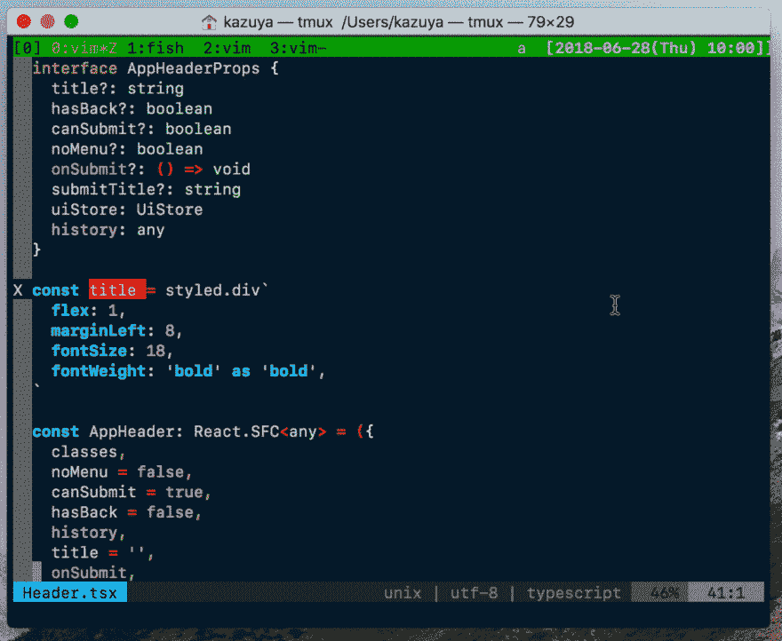

# 在命令中将 JS 对象转换为 CSS

> 原文：<https://dev.to/acro5piano/convert-js-object-to-css-in-command-1che>

[T2】](https://res.cloudinary.com/practicaldev/image/fetch/s--oMYT8ljC--/c_limit%2Cf_auto%2Cfl_progressive%2Cq_66%2Cw_880/https://thepracticaldev.s3.amazonaws.com/i/ri161v1uem9tb2wc1xl1.gif)

我发现样式组件对我来说用 React 写样式更方便。

但是，我已经用 JS object 写了很多样式了，用的是 jss。所以我需要把 JSS 转换成 CSS。

我写了一个很小的脚本，它是一组 perl one liners，并从 Vim 调用命令。

`~/bin/obj2style`

```
#!/bin/bash

perl -pe 's/ +$//g' \
    | perl -pe 's/ as .+//g' \
    | perl -pe 's/([A-Z])/-\L\1/g' \
    | perl -pe 's/^_//' \
    | perl -pe 's/"([a-z]+)"$/\1/g' \
    | perl -pe "s/'([a-z]+)'$/\1/g" \
    | perl -pe 's/([0-9]+),?$/\1px/g' \
    | perl -pe 's/,?$/;/' 
```

Enter fullscreen mode Exit fullscreen mode

(可能存在更优雅的正则表达式，但这是最不费力的)

测试:

```
~> echo fontSize: 12 | obj2style 
font-size: 12px;

~> echo fontSize: 'large' | obj2style 
font-size: large;

~> echo "fontSize: 'large', " | obj2style 
font-size: large;

~> echo "fontWeight: 'bold' as 'bold'" | obj2style 
font-weight: bold; 
```

Enter fullscreen mode Exit fullscreen mode

然后，在 vim 中使用该命令！