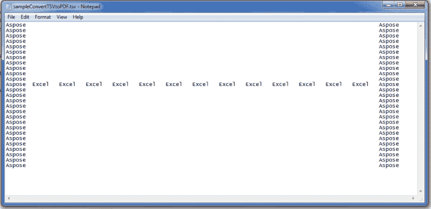

# 在 C++中将 TSV 转换为 PDF

> 原文：<https://dev.to/asposecells/convert-tsv-to-pdf-in-c-k8f>

阿斯波斯。细胞是能够加载 TSV 文件，并将其转换为 PDF 格式的多种选择。在本文中，我们将解释 C++开发人员如何使用 Aspose。将 TSV 转换为 PDF 的单元格 API...

*   直接地
*   每张纸一页选项

**TSV 信息:**

> [TSV 文件](https://en.wikipedia.org/wiki/Tab-separated_values)是制表符分隔值的缩写，因为它使用制表符分隔一行中的字段。

**Aspose。细胞信息:**

> [Aspose。Cells](https://products.aspose.com/cells/) API 支持多个平台，例如。NET，Java，C++，Android，JavaScript，PHP 等等。此外，[阿斯波斯。Cells 在云中作为 REST 或 RESTful APIs 可用](https://products.aspose.cloud/cells)。

# 样本 TSV 文件

您可以用任何 TSV 文件尝试本文*中给出的代码。但是为了便于说明，我们在代码[中使用这个](https://github.com/AsposeCells/AsposeCells-Screenshots-and-Sample-Files/blob/master/Convert-TSV-to-PDF/Sample-TSV-file-to-be-converted-to-PDF-formats-using-Aspose.Cells-API.png)[样本 TSV 文件](https://github.com/AsposeCells/AsposeCells-Screenshots-and-Sample-Files/blob/master/Convert-TSV-to-PDF/sampleConvertTSVToPDF.tsv)，如图所示，以供参考。*

> ***标题:**使用 Aspose 将样本 TSV 文件转换为 PDF 格式。细胞 API*

[T2】](https://res.cloudinary.com/practicaldev/image/fetch/s--grlX-LKD--/c_limit%2Cf_auto%2Cfl_progressive%2Cq_auto%2Cw_880/https://raw.githubusercontent.com/AsposeCells/AsposeCells-Screenshots-and-Sample-Files/master/Convert-TSV-to-PDF/Sample-TSV-file-to-be-converted-to-PDF-formats-using-Aspose.Cells-API.png)

# 直接将 TSV 转换成 PDF

以下示例代码加载示例 TSV 文件，如前所示，并将其直接转换为 PDF。