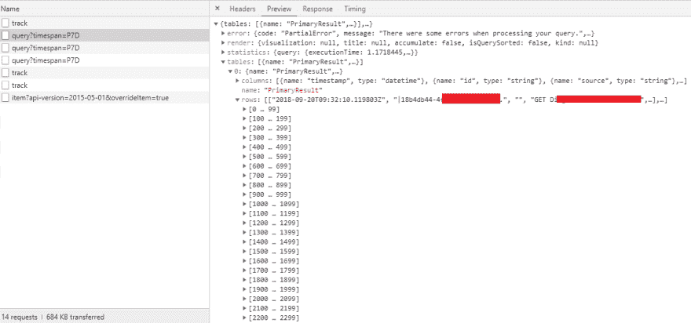
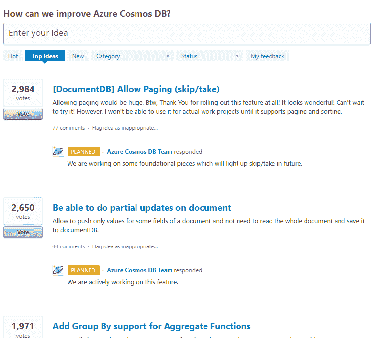

# CosmosDB 与宇航员流畅分页

> 原文：<https://dev.to/elfocrash/cosmosdb-fluent-pagination-with-cosmonaut-25gh>

### 简介

想知道为什么 Azure 门户有向前滚动分页和下一个/上一个分页，但没有页面大小+页码分页吗？继续大胆猜测吧。如果你说“因为它运行在 CosmosDB 上”，那么你是对的。Azure 门户从 CosmosDB 获取结果，这就是为什么你看不到任何形式的服务器端跳转和分页。

如果您在门户中看到页面大小和页码的组合，那么分页就发生在客户端。一个例子是 Application Insights 的“日志”部分，它能够返回带有页面大小和页码的分页结果，但这些结果是预先获取的，它们只是在现场呈现。我们知道这一点，因为你可以在我们选择的浏览器的网络流量工具中找到 100 页返回的所有结果。客户端代码将完成剩余的分页工作。

[T2】](https://res.cloudinary.com/practicaldev/image/fetch/s--PRQfVagD--/c_limit%2Cf_auto%2Cfl_progressive%2Cq_auto%2Cw_880/https://i.imgur.com/hmlVle3.png)

### CosmosDB 分页支持

CosmosDB 不支持传统类型的跳转分页。相反，结果总是以最大页面大小分页。

然而，跳过分页是自 2014 年 8 月以来请求最多的 CosmosDB 特性。ComosDB 团队官方账号在 2018 年 3 月回复说，他们正在计划实施，所以我们很好。

[T2】](https://res.cloudinary.com/practicaldev/image/fetch/s--_5QJhF8O--/c_limit%2Cf_auto%2Cfl_progressive%2Cq_auto%2Cw_880/https://i.imgur.com/vDpygqr.png)

根据目前发布特性的速度来判断，我不认为它会很快发布，所以我们需要一个替代品，至少现在是这样。

那么就分页而言，CosmosDB 目前支持什么呢？

你有两个与结果返回方式相关的值。

*   MaxItemCount
*   请求继续

MaxItemCount 是枚举操作中返回的最大项数。他们可以少一点，但不会超过那个数字。RequestContinuation 是一个 Continuation 标记，它标识了该操作的最后一个结果集，并将 CosmosDB 指向它需要返回的下一个数据集。

对于某些人来说，这已经足够解决缺少跳过分页的问题了。这就是宇航员开始为你做繁重工作的时候了。

### 宇航员的实现

[T2】](https://github.com/Elfocrash/Cosmonaut)

自从我开始开发 [Cosmonaut](https://github.com/Elfocrash/Cosmonaut) 以来，我知道，最终，我必须添加流畅的分页支持。

我不想弄乱`Skip`和`Take` LINQ 方法，因为我知道最终 CosmosDB 会支持这两种方法(目前只支持`Take`)。

宇航员支持一个名为`WithPagination()`的`IQueryable`扩展。此方法有两个重载。

*   `WithPagination(int pageNumber, int pageSize)`
*   `WithPagination(string continuationToken, int pageSize)`

如您所见，第一个签名看起来非常像分页的一个清晰的 skip/take 类型实现。第二种是直接 CosmosDB 方法。

它们是如何工作的？

第一个签名既有页码又有页面大小，随着页码值的增加，它会变得低效和昂贵。这是因为该方法能够工作的唯一方式是从头开始遍历所有页面，直到达到所请求的页码和页面大小。

第二个签名既高效又快速，因为它直接指向下一组结果。那是因为你提供了延续令牌。

这些方法在 Cosmonaut 中既适用于 LINQ 查询，也适用于 SQL 查询。

你如何使用它们？

第一个签名使用起来很简单，如下所示。

```
var firstPage = await booksStore.Query().WithPagination(1, 10).OrderBy(x => x.Name).ToListAsync();
var secondPage = await booksStore.Query().WithPagination(2, 10).OrderBy(x => x.Name).ToListAsync(); 
```

Enter fullscreen mode Exit fullscreen mode

如你所见，这读起来很简单，我认为也很直接。SQL 也是如此:

```
var firstPage = await booksStore.Query("select * from c order by c.Name asc").WithPagination(1, 10).ToListAsync();
var secondPage = await booksStore.Query("select * from c order by c.Name asc").WithPagination(2, 10).ToListAsync(); 
```

Enter fullscreen mode Exit fullscreen mode

*这些方法同时适用于`CosmonautClient`和`CosmosStore`方法。*

然而，正如我之前提到的，这种方法会随着页码的增加而变得低效。这就是为什么推荐支持延续令牌的`WithPagination`签名。

“但是我怎样才能得到延续令牌呢？”

分页更新还引入了一个名为`ToPagedListAsync()`的新结果扩展方法。这个方法返回一个`CosmosPagedResults`对象。这个对象包含 3 个非常方便的属性用于分页操作:

*   `Results`，这是您查询的结果列表
*   `HasNextPage`，这是一个布尔值，表示是否有更多的页面
*   `NextPageToken`，这是一个为您提供下一页延续标记(如果有)的字符串

让我们看看这是如何工作的。我将编写与上面相同的两页代码，但这次我将使用延续标记方法。

```
var firstPage = await booksStore.Query().WithPagination(1, 10).OrderBy(x => x.Name).ToPagedListAsync();
var secondPage = await booksStore.Query().WithPagination(firstPage.NextPageToken, 10).OrderBy(x => x.Name).ToPagedListAsync(); 
```

Enter fullscreen mode Exit fullscreen mode

简单？我希望如此。在现实生活中，您将获得延续令牌，将其存储在客户端(web 应用程序、桌面应用程序、移动应用程序)，并为下一个页面提供它。

`CosmosPagedResults`还支持一个`GetNextPageAsync`方法，该方法自动从最后一页获取令牌和大小。同样的两个查询应该是这样的:

```
var firstPage = await booksStore.Query().WithPagination(1, 10).OrderBy(x => x.Name).ToPagedListAsync();
var secondPage = await firstPage.GetNextPageAsync(); 
```

Enter fullscreen mode Exit fullscreen mode

注意:

以上所有都适用于`CosmonautClient`查询方法:

```
var result = await cosmonautClient.Query<Book>("localtest", "shared").WithPagination(1, 1).ToListAsync(); 
```

Enter fullscreen mode Exit fullscreen mode

### 分页推荐

因为页码和页面大小分页会遍历所有文档，直到到达所请求的页面，所以它会变得很慢，而且开销很大。推荐的方法是对第一页使用一次页码和页面大小方法，并使用`.ToPagedListAsync()`方法获得结果。这个方法将返回下一个延续标记，它还会告诉您这个查询是否有更多的页面。然后使用延续标记替代`WithPagination`从上一个查询继续。

请记住，这种方法意味着您必须为下一个查询在客户机上保存状态，但是如果您使用 previous/next 按钮的话，这也是您应该做的。

我希望这有助于您更容易地与 CosmosDB 集成。如果有什么不清楚的地方，不要忘记在评论中提问，并随时为[宇航员](https://github.com/Elfocrash/Cosmonaut)建议功能或表达想法。此外，如果你喜欢这个项目，那么在 Github 上给它一颗星意味着很多。谢谢你。