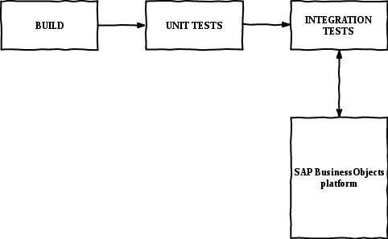

# 在 EC2 上运行的供应商设备上进行经济高效的集成测试

> 原文：<https://dev.to/julbrs/cost-efficient-integration-testing-on-vendor-appliances-running-on-ec2-4411>

我们正在构建依赖于单片商业应用程序的应用程序，如 SAP Business Objects 或 T2 Tableau 软件。遵循我们的质量标准，我们希望运行可靠、高效且经济的测试来验证我们的工作。下面是我们如何使用 AWS EC2 实例来实现这一点。

## 需要

集成测试和**验收测试**是确保我们产品质量的必要步骤。但是这种测试需要与现有的供应商解决方案进行交互，这在 [SaaS](https://en.wikipedia.org/wiki/Software_as_a_service) 模型中是无法实现的。例如，我们围绕 SAP BusinessObjects 做了很多工作，我们需要针对这类软件运行测试。

<figure>[](https://res.cloudinary.com/practicaldev/image/fetch/s--u-Q_gssW--/c_limit%2Cf_auto%2Cfl_progressive%2Cq_auto%2Cw_880/https://cdn-images-1.medium.com/max/482/1%2AxTj_39MGz9jOH7dQFi2ukA.png) 

<figcaption>依赖外部系统的集成测试</figcaption>

</figure>

## 第一个想法

一个简单的解决方案是部署一个集成服务器，保护它不让任何人修改内容(它需要保持稳定，因为测试依赖于内容)，并一直运行它。例如，在您现有的本地基础架构中这样做，或者在 AWS 的 EC2 上放弃。这是一个简单的解决方案，但可能非常昂贵(你一天只需要几分钟！)并且因为内容需要相同，所以您可能希望在执行附加测试之前将其重置为原始状态。当 t2.xlarge 的价格一直上涨时，你需要支付大约 143 美元。

## 解

因为我们的构建过程是由 Maven 管理的，所以我们正在为此寻找一个 Maven 插件解决方案。瞧，它真的存在！

##  [【威廉姆】](https://github.com/wiiisdom)/[【ec2-maven 插件】](https://github.com/wiiisdom/ec2-maven-plugin)

### 通过 Maven 操纵亚马逊弹性计算云中的资源

我们已经决定派生一个现有的项目，并使其适应我们的特定需求。当集成测试目标启动时，插件能够根据现有的映像按需创建 EC2 实例，并在目标结束时终止它。定制允许我们等待，直到供应商应用程序在 EC2 上完全启动(通过监听 TCP 端口)。

它不依赖于现有的 EC2 实例，而是依赖于 Amazon 机器映像(AMI ),这是个好消息:

*   每次运行的集成测试都是在完全相同的 AMI 上进行的，我们可以相信服务器的内容在时间上是绝对一致的。
*   多个集成测试可以并行启动(2 个开发人员，jenkins 服务器…)，每个测试将创建一个特定的实例。

<figure>[](https://res.cloudinary.com/practicaldev/image/fetch/s--AlUVb5oY--/c_limit%2Cf_auto%2Cfl_progressive%2Cq_auto%2Cw_880/https://cdn-images-1.medium.com/max/592/1%2A8uBl-TkCckXinRdpu4Hu0w.png) 

<figcaption>进程的 Maven 插件动作</figcaption>

</figure>

项目集成非常简单。你可以在 pom.xml 文件中调用合适的 maven 插件:

```
<build>
<plugins>
    <plugin>
     <groupId>com.gbs.maven.plugins</groupId>
     <artifactId>ec2-maven-plugin</artifactId>
     <version>1.1.8</version>
     <configuration>
      <accessKey>XXX</accessKey>
      <secretKey>xxxx</secretKey>
      <ami>${bobj.ami.id}</ami>
      <key>gbandsmith</key>
      <type>t2.large</type>
      <securityGroups>
       <securityGroup>bobj</securityGroup>
      </securityGroups>
      <tags>
       <tag>
        <key>Name</key>
        <value>sapbi-integration-test</value>
       </tag>
      </tags>
      <waitPorts>
       <waitPort>6400</waitPort>
       <waitPort>6402</waitPort>
      </waitPorts>
     </configuration>
     <executions>
      <execution>
       <id>start-ec2-instance</id>
       <phase>pre-integration-test</phase>
       <goals>
        <goal>launchinstance</goal>
       </goals>
      </execution>
      <execution>
       <id>stop-ec2-instance</id>
       <phase>post-integration-test</phase>
       <goals>
        <goal>terminateinstance</goal>
       </goals>
       <configuration>
        <instanceId>${ec2.instance.id}</instanceId>
       </configuration>
      </execution>
     </executions>
    </plugin>
</build> 
```

Enter fullscreen mode Exit fullscreen mode

*执行*和*终止*目标与经典 [Maven 故障保护插件](https://maven.apache.org/surefire/maven-failsafe-plugin/)的*预集成测试*和*后集成测试*阶段相关联。

为了使用 AWS DNS 条目，我们使用 failsafe 的配置来设置一个可以在代码中使用的*系统属性*变量:

```
<plugin>
  <groupId>org.apache.maven.plugins</groupId>
  <artifactId>maven-failsafe-plugin</artifactId>
  <configuration>
    <systemPropertyVariables>
      <myvar>${ec2.instance.dns}</myvar>
    </systemPropertyVariables>
  </configuration>
</plugin> 
```

Enter fullscreen mode Exit fullscreen mode

我们现在有一个依赖 AWS 的健壮的集成测试系统，成本非常低(10 人项目每月大约 30 美元)。

## 接下来

仍有一些改进的余地。我们有一些想法:

*   用别的东西代替故障保护插件。目前，当测试失败时，集成后测试步骤不会被触发，因此 EC2 实例不会终止。
*   当我们构建多模块 Maven 项目时，优化构建(目前每个 Maven 模块启动一个独立的实例，当多个模块运行 IT 测试时，我们正在浪费时间)。