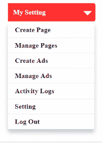

# 使用 ReactJS 创建下拉菜单

> 原文：<https://dev.to/skptricks/create-a-dropdown-menu-using-reactjs-3kcb>

帖子链接:[https://www . skp tricks . com/2018/05/create-drop down-using-react js . html](https://www.skptricks.com/2018/05/create-dropdown-using-reactjs.html)

使用 ReactJS
创建下拉菜单今天，在本教程中，我们将讨论如何在 ReactJS 中创建简单的下拉菜单，我们已经尽力使本教程尽可能简单。在这里，我们将借助 ReactJS 和 onClick 事件来设计 CSS 下拉菜单，我们将显示和隐藏下拉菜单的内容。

[T2】](https://res.cloudinary.com/practicaldev/image/fetch/s--g144v_s4--/c_limit%2Cf_auto%2Cfl_progressive%2Cq_66%2Cw_880/https://2.bp.blogspot.com/-OWfym2bt-2g/WvhgT-zNf4I/AAAAAAAABi0/m-GM5q77T6EUK0jIFj27HYvDe3IWo3sLwCLcBGAs/s320/ezgif-4-c0d51f3e95.gif)

[React 下拉菜单教程](https://www.skptricks.com/2018/05/create-dropdown-using-reactjs.html)

[https://www.youtube.com/embed/KwtVRXbS4c8](https://www.youtube.com/embed/KwtVRXbS4c8)

[阅读更多...](https://www.skptricks.com/2018/05/create-dropdown-using-reactjs.html)