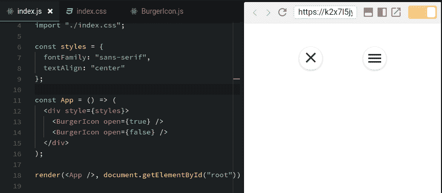

# 使用 reactjs-popup 创建一个别致的汉堡菜单

> 原文：<https://dev.to/elaziziyoussouf/create-a-fancy-burger-menu-using-reactjs-popup-3b9d>

> 这篇文章是一个循序渐进的教程，使用 reactjs-popup 为你的网站创建一个简单的汉堡菜单

[T2】](https://res.cloudinary.com/practicaldev/image/fetch/s--N2TrZy6C--/c_limit%2Cf_auto%2Cfl_progressive%2Cq_66%2Cw_880/https://cdn-images-1.medium.com/max/1600/1%2AttcLA5BrtUAXSBo6YfoQoA.gif)

Reactjs-popup 是一个新的简单的 react 弹出组件，使用 react 片段构建，这是 react 16 的新特性之一。它可以处理多种用例。通过使用这个小小的反应弹出组件，你可以创建工具提示，模态和菜单。

到本文结束时，你将能够用 reactjs-popup 创建你自己的汉堡菜单。

> 准备好了。！让我们开始吧。

#### 第一步:创建汉堡图标组件。

我们将从构建一个汉堡图标组件开始，

```
import React from "react";

export default ({ open, ...props }) => (
  <div className={open ? "burger-menu open" : "burger-menu"} {...props}>
    <div className="bar1" key="b1" />
    <div className="bar2" key="b2" />
    <div className="bar3" key="b3" />
  </div>
); 
```

Enter fullscreen mode Exit fullscreen mode

正如你所看到的，我们将“打开”属性传递给组件，这样我们就可以替换图标类名，预览示例解释了
[](https://res.cloudinary.com/practicaldev/image/fetch/s--xp07XFKk--/c_limit%2Cf_auto%2Cfl_progressive%2Cq_auto%2Cw_880/https://thepracticaldev.s3.amazonaws.com/i/e6vzbxy5coywxkukd4y0.png) 

```
.burger-menu,
.burger-menu.open {
  display: inline-block;
  cursor: pointer;
  position: fixed;
  right: 20px;
  bottom: 40px;
  z-index: 9999;
  background: #fff;
  padding: 10px;
  border-radius: 25px;
  box-shadow: 0 1px 4px rgba(0, 0, 0, 0.3);
}

.burger-menu .bar1,
.bar2,
.bar3 {
  width: 25px;
  height: 3px;
  background-color: #333;
  margin: 4px 0;
  transition: 0.4s;
}

.burger-menu.open .bar1 {
  -webkit-transform: rotate(-45deg) translate(-4px, 4px);
  transform: rotate(-45deg) translate(-4px, 4px);
}

.burger-menu.open .bar2 {
  opacity: 0;
}

.burger-menu.open .bar3 {
  -webkit-transform: rotate(45deg) translate(-6px, -6px);
  transform: rotate(45deg) translate(-6px, -6px);
} 
```

Enter fullscreen mode Exit fullscreen mode

你可以在这里找到一些很好的汉堡图标动画[的例子](https://jonsuh.com/hamburgers/)

#### 第二步:自定义 CSS 菜单

我们的菜单将是一个简单的列表，所以让我们以 reactjs-popup 主页菜单为例。

```
import React from "react";

export default ({ close }) => (
  <div className="menu">
    <ul>
      <li onClick={close}>Home</li>
      <li onClick={close}>Getting Started</li>
      <li onClick={close}>Component API</li>
      <li onClick={close}>Use Case - Tooltip</li>
      <li onClick={close}>Use Case - Modal</li>
      <li onClick={close}>Use Case - Menu</li>
      <li onClick={close}>Contributing</li>
    </ul>
  </div>
); 
```

Enter fullscreen mode Exit fullscreen mode

正如你看到的，这个菜单是一个简单的 ul 元素，没有什么特别的。

## 第三步:用 reactjs-popup 整合所有东西

在这一部分中，我们需要做的就是导入 reactjs-popup 组件，并将 burger menu 设置为 popup 组件的触发器属性，将 menu 设置为 popup 子组件。简单，是吗？神奇！！

```
import React from "react";
import { render } from "react-dom";
import Popup from "reactjs-popup";
import BurgerIcon from "./BurgerIcon";
import Menu from "./Menu";
import "./index.css";

const App = () => (
  <div style={styles}>
    <Hello name="Create cool burger menu using reactjs-popup" />
    <Popup
      modal
      overlayStyle={{ background: "rgba(255,255,255,0.98" }}
      contentStyle={contentStyle}
      closeOnDocumentClick={false}
      trigger={open => <BurgerIcon open={open} />}
    >
      {close => <Menu close={close} />}
    </Popup>
  </div>
);

render(<App />, document.getElementById("root")); 
```

Enter fullscreen mode Exit fullscreen mode

由于“作为子模式的功能”,触发器可以很容易地进入弹出状态。我们还需要像下面这样将道具传递给汉堡组件。

添加一些自定义的 css，这是最终的结果。

[T2】](https://res.cloudinary.com/practicaldev/image/fetch/s--N2TrZy6C--/c_limit%2Cf_auto%2Cfl_progressive%2Cq_66%2Cw_880/https://cdn-images-1.medium.com/max/1600/1%2AttcLA5BrtUAXSBo6YfoQoA.gif)

如果你在你的智能手机上阅读这篇文章，你可以在 reactjs-popup 主页上看到启动菜单的汉堡按钮。

## 演示&代码源码

[https://codesandbox.io/s/k2x7l5jy27](https://codesandbox.io/s/k2x7l5jy27)

[https://github.com/yjose/reactjs-popup-burger-menu](https://github.com/yjose/reactjs-popup-burger-menu)

感谢阅读！如果你认为其他人应该阅读这篇文章并使用这个组件，发推特并分享这篇文章。