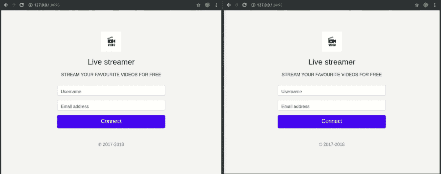

# 创建具有在线状态的 GO 应用程序

> 原文：<https://dev.to/neo/create-a-go-application-with-online-presence-4696>

你需要在你的机器上安装 Go 0.10+。

当构建允许多个用户相互交互的应用程序时，显示他们的在线状态是至关重要的，这样每个用户就可以知道有多少其他用户在线。

在本文中，我们将构建一个实时流媒体应用程序，显示当前正在播放视频的用户的在线状态。我们将使用 [Go](https://golang.org/doc/install) ，JavaScript (Vue)和 [Pusher](http://pusher.com/) 进行开发。

下面是最终应用的演示:
[](https://res.cloudinary.com/practicaldev/image/fetch/s--jWFDS1x5--/c_limit%2Cf_auto%2Cfl_progressive%2Cq_66%2Cw_880/https://thepracticaldev.s3.amazonaws.com/i/beaph54uz3kz5asj9wgi.gif)

本教程的源代码可以在 GitHub 上找到。

## 先决条件

要阅读本文，您需要以下内容:

*   像 Visual Studio 代码这样的代码编辑器。
*   Go 编程语言的基础知识。
*   Go(版本> = 0.10.x)安装在您的计算机上。[安装指南](https://golang.org/doc/install)。
*   JavaScript (Vue)基础知识。
*   推送应用程序。在这里创建一个。一旦你有了以上所有的要求，我们就可以继续了。

## 构建后端服务器

我们将在 Go 中构建后端服务器。在位于`$GOPATH`的 src 目录下创建一个新的项目目录，我们称这个目录为`go-pusher-presence-app`。

```
 $ cd $GOPATH/src
    $ mkdir go-pusher-presence-app
    $ cd go-pusher-presence-app 
```

Enter fullscreen mode Exit fullscreen mode

接下来，创建一个新的 Go 文件，并将其命名为`presence.go`，这个文件将是我们整个后端服务器逻辑所在的位置。现在，让我们用这个命令拉进官方的 Go Pusher 包:

```
 $ go get github.com/pusher/pusher-http-go 
```

Enter fullscreen mode Exit fullscreen mode

打开`presence.go`文件，粘贴以下代码:

```
 // File: ./presence.go
    package main

    import (
        "encoding/json"
        "fmt"
        "io/ioutil"
        "log"
        "net/http"
        pusher "github.com/pusher/pusher-http-go"
    )

    var client = pusher.Client{
        AppId:   "PUSHER_APP_ID",
        Key:     "PUSHER_APP_KEY",
        Secret:  "PUSHER_APP_SECRET",
        Cluster: "PUSHER_APP_CLUSTER",
        Secure:  true,
    }

    type user struct {
        Username  string `json:"username" xml:"username" form:"username" query:"username"`
        Email string `json:"email" xml:"email" form:"email" query:"email"`
    }

    var loggedInUser user

    func main() {
        // Define our routes
        http.Handle("/", http.FileServer(http.Dir("./static")))
        http.HandleFunc("/isLoggedIn", isUserLoggedIn)
        http.HandleFunc("/new/user", NewUser)
        http.HandleFunc("/pusher/auth", pusherAuth)

        // Start executing the application on port 8090
        log.Fatal(http.ListenAndServe(":8090", nil))
    } 
```

Enter fullscreen mode Exit fullscreen mode

```
Replace the PUSHER_APP_* keys with the keys on your Pusher dashboard. 
```

Enter fullscreen mode Exit fullscreen mode

下面是我们在上面代码中所做工作的分解:

*   我们导入了应用程序运行所需的所有包，包括 Pusher。
*   我们实例化了 Pusher 客户端，我们将使用它从客户端对用户进行身份验证。
*   我们定义了一个用户结构，并赋予它两个属性——用户名和电子邮件——以便 Go 知道如何处理传入的有效负载，并正确地将其绑定到用户实例。
*   我们创建了 user struct 的一个全局实例，这样我们就可以用它来存储用户名和电子邮件。该实例将在某种程度上服务于服务器上的会话目的，我们将在允许用户访问该应用程序的仪表板之前检查它的设置。在主函数中，我们注册了四个端点:

1.  / -从静态目录中加载所有静态文件。
2.  /isLoggedIn -检查用户是否已登录，并返回一条合适的消息。
3.  /new/user -允许新用户连接并初始化全局用户实例。
4.  /pusher/auth —从客户端授权用户。在同一个文件中，在`main`函数的上方，添加`/isLoggedIn`端点的处理函数的代码:

```
 // File: ./presence.go

    // [...]

    func isUserLoggedIn(rw http.ResponseWriter, req *http.Request){
        if loggedInUser.Username != "" && loggedInUser.Email != "" {
            json.NewEncoder(rw).Encode(loggedInUser)
        } else {
            json.NewEncoder(rw).Encode("false")
        }
    }

    // [...] 
```

Enter fullscreen mode Exit fullscreen mode

在上面的函数之后，让我们为`/new/user`端点添加处理函数:

```
 // File: ./presence.go

    // [...]

    func NewUser(rw http.ResponseWriter, req *http.Request) {
        body, err := ioutil.ReadAll(req.Body)
        if err != nil {
            panic(err)
        }
        err = json.Unmarshal(body, &loggedInUser)
        if err != nil {
            panic(err)
        }
        json.NewEncoder(rw).Encode(loggedInUser)
    }

    // [...] 
```

Enter fullscreen mode Exit fullscreen mode

上面，我们在一个`POST`请求中接收到一个新用户的详细信息，并将其绑定到 user struct 的一个实例。我们进一步使用这个用户实例来检查用户是否登录

最后，在上面的函数之后，让我们为`/pusher/auth`端点添加代码:

```
 // File: ./presence.go

    // [...]

    // -------------------------------------------------------
    // Here, we authorize users so that they can subscribe to 
    // the presence channel
    // -------------------------------------------------------

    func pusherAuth(res http.ResponseWriter, req *http.Request) {
        params, _ := ioutil.ReadAll(req.Body)

        data := pusher.MemberData{
            UserId: loggedInUser.Username,
            UserInfo: map[string]string{
                "email": loggedInUser.Email,
            },
        }

        response, err := client.AuthenticatePresenceChannel(params, data)
        if err != nil {
            panic(err)
        }

        fmt.Fprintf(res, string(response))
    }

    // [...] 
```

Enter fullscreen mode Exit fullscreen mode

为了确保每个连接的用户都有唯一的存在，我们在设置 pusher 时使用了全局变量`loggedInUser`的属性。MemberData 实例。

用于认证`Pusher`存在通道的语法是:

```
 client.AuthenticatePresenceChannel(params, presenceData) 
```

Enter fullscreen mode Exit fullscreen mode

## 建筑前端

接下来，在项目的根目录下，创建一个`static`文件夹。在目录下创建两个文件，分别命名为`index.html`和`dashboard.html`。在`index.html`文件中，我们将编写 HTML 代码，允许用户使用他们的姓名和电子邮件连接到直播应用程序。

## 设置连接页面

打开`index.html`文件，用下面的代码更新它:

```
 <!-- File: ./static/index.html -->
    <!DOCTYPE html>
    <html lang="en">
        <head>
            <meta charset="utf-8">
            <meta name="viewport" content="width=device-width, initial-scale=1, shrink-to-fit=no">
            Live streamer
            <link rel="stylesheet" href="https://stackpath.bootstrapcdn.com/bootstrap/4.1.3/css/bootstrap.min.css">
            <style>
                  :root {
                    --input-padding-x: .75rem;
                    --input-padding-y: .75rem;
                  }
                  html,
                  body, body > div {
                    height: 100%;
                  }
                  body > div {
                    display: -ms-flexbox;
                    display: flex;
                    -ms-flex-align: center;
                    align-items: center;
                    padding-top: 40px;
                    padding-bottom: 40px;
                    background-color: #f5f5f5;
                  }
                  .form-signin {
                    width: 100%;
                    max-width: 420px;
                    padding: 15px;
                    margin: auto;
                  }
                  .form-label-group {
                    position: relative;
                    margin-bottom: 1rem;
                  }
                  .form-label-group > input,
                  .form-label-group > label {
                    padding: var(--input-padding-y) var(--input-padding-x);
                  }
                  .form-label-group > label {
                    position: absolute;
                    top: 0;
                    left: 0;
                    display: block;
                    width: 100%;
                    margin-bottom: 0; /* Override default `<label>` margin */
                    line-height: 1.5;
                    color: #495057;
                    cursor: text; /* Match the input under the label */
                    border: 1px solid transparent;
                    border-radius: .25rem;
                    transition: all .1s ease-in-out;
                  }
                  .form-label-group input::-webkit-input-placeholder {
                    color: transparent;
                  }
                  .form-label-group input:-ms-input-placeholder {
                    color: transparent;
                  }
                  .form-label-group input::-ms-input-placeholder {
                    color: transparent;
                  }
                  .form-label-group input::-moz-placeholder {
                    color: transparent;
                  }
                  .form-label-group input::placeholder {
                    color: transparent;
                  }
                  .form-label-group input:not(:placeholder-shown) {
                    padding-top: calc(var(--input-padding-y) + var(--input-padding-y) * (2 / 3));
                    padding-bottom: calc(var(--input-padding-y) / 3);
                  }
                  .form-label-group input:not(:placeholder-shown) ~ label {
                    padding-top: calc(var(--input-padding-y) / 3);
                    padding-bottom: calc(var(--input-padding-y) / 3);
                    font-size: 12px;
                    color: #777;
                  }
            </style>
          </head>

          <body>
            <div id="app">
              <form class="form-signin">
                <div class="text-center mb-4">
                  
                  <h1 class="h3 mb-3 font-weight-normal">Live streamer</h1>
                  <p>STREAM YOUR FAVOURITE VIDEOS FOR FREE</p>
                </div>
                <div class="form-label-group">
                    <input type="name" id="inputUsername" ref="username" class="form-control" placeholder="Username" required="" autofocus="">
                      <label for="inputUsername">Username</label>
                  </div>

                <div class="form-label-group">
                  <input type="email" id="inputEmail" ref="email" class="form-control" placeholder="Email address" autofocus="" required>
                    <label for="inputEmail">Email address</label>
                </div>

                <button class="btn btn-lg btn-primary btn-block" type="submit" @click.prevent="login">Connect</button>
                <p class="mt-5 mb-3 text-muted text-center">© 2017-2018</p>
              </form>
              </div>

              <script src="https://cdn.jsdelivr.net/npm/vue/dist/vue.js"></script>
        </body>
    </html> 
```

Enter fullscreen mode Exit fullscreen mode

在第 106 行，我们使用 CDN 添加了 Vue。让我们为页面添加 Vue 脚本。

在结束的`body`标签前添加以下代码:

```
<script>
      var app = new Vue({
        el: '#app',
        methods: {
          login: function () {
            let username = this.$refs.username.value
            let email = this.$refs.email.value

            fetch('new/user', {
              method: 'POST',
              headers: {
                'Accept': 'application/json',
                'Content-Type': 'application/json'
              },
              body: JSON.stringify({username, email})
            })
            .then(res => res.json())
            .then(data => window.location.replace('/dashboard.html'))
          }
        }
      })
    </script> 
```

Enter fullscreen mode Exit fullscreen mode

上面的脚本将用户数据提交到后端 Go 服务器，并将浏览器的位置导航到仪表板的 URL。

接下来，让我们构建仪表板。

## 设置仪表板

打开`dashboard.html`文件，用下面的代码更新它:

```
 <!-- File: ./static/dashboard.html -->
    <!DOCTYPE html>
    <html lang="en">
      <head>
        <meta charset="utf-8">
        <meta name="viewport" content="width=device-width, initial-scale=1, shrink-to-fit=no">
        <link rel="stylesheet" href="https://stackpath.bootstrapcdn.com/bootstrap/4.1.3/css/bootstrap.min.css">
        Live streamer | Dashboard
      </head>
      <body>
        <div id="app">
          <div class="container-fluid row shadow p-1 mb-3">
            <div class="col-3">
              
            </div>
            <div class="col-6 ml-auto mt-3">
              <div class="input-group">
                <input type="text" class="form-control" aria-label="Text input with dropdown button">
                <div class="input-group-append">
                  <button class="btn btn-outline-secondary dropdown-toggle" type="button" data-toggle="dropdown" aria-haspopup="true" aria-expanded="false">Search</button>
                </div>
              </div>
            </div>
            <div class="col-3 float-right">
              
              <p class="mr-auto mt-3 d-inline"> {{ username }} </p>
            </div>
          </div>
          <div class="container-fluid">
            <div class="row">
              <div class="col-8">
                <div class="embed-responsive embed-responsive-16by9">
                  <iframe width="854" height="480" class="embed-responsive-item" src="https://www.youtube.com/embed/VYOjWnS4cMY" frameborder="0" allow="autoplay; encrypted-media" allowfullscreen></iframe>
                </div>
                <div class="text-center mt-3 p-3 text-muted font-weight-bold border">
                  {{ member }} person(s) is/are currently viewing this video 
                  <hr>
                  <li class="m-auto text-success" v-for="member in connectedMembers">
                    {{ member }}
                  </li>
                </div>
              </div>
              <div class="col-4 border text-justify" style="background: #e0e0e0; height: 30em; overflow-y: scroll; position: relative;">
                <div class="border invisible h-50 w-75 text-center" ref="added" style="font-size: 2rem; position: absolute; right: 0; background: #48cbe0">{{ addedMember }} just started watching.</div>
                <div class="border invisible h-50 w-75 text-center" ref="removed" style="font-size: 2rem; position: absolute; right: 0; background: #ff8325">{{ removedMember }} just stopped watching.</div>
                <div class="h-75 text-center">
                  <h2 class="text-center my-3"> Lyrics </h2>
                  <p class="w-75 m-auto" style="font-size: 1.5rem">
                    We just wanna party<br>
                    Party just for you<br>
                    We just want the money<br>
                    Money just for you<br>
                    I know you wanna party<br>
                    Party just for me<br>
                    Girl, you got me dancin' (yeah, girl, you got me dancin')<br>
                    Dance and shake the frame<br>
                    We just wanna party (yeah)<br>
                    Party just for you (yeah)<br>
                    We just want the money (yeah)<br>
                    Money just for you (you)<br>
                    I know you wanna party (yeah)<br>
                    Party just for me (yeah)<br>
                    Girl, you got me dancin' (yeah, girl, you got me dancin')<br>
                    Dance and shake the frame (you)<br>
                    This is America<br>
                    Don't catch you slippin' up<br>
                    Don't catch you slippin' up<br>
                    Look what I'm whippin' up<br>
                    This is America (woo)<br>
                    Don't catch you slippin' up<br>
                    Don't catch you slippin' up<br>
                    Look what I'm whippin' up<br>
                  </p>
                </div>
              </div>
            </div>
          </div>
        </div>
        <script src="https://cdn.jsdelivr.net/npm/vue/dist/vue.js"></script>
        <script src="https://js.pusher.com/4.2/pusher.min.js"></script>
      </body>
    </html> 
```

Enter fullscreen mode Exit fullscreen mode

`⚠️ Video is an embed from YouTube and may not play depending on your region.`

在第 80 行，我们导入了 JavaScript Pusher 库，所以让我们添加一些代码来使用它。在结束 body 标记之前，添加以下代码:

```
 <script>
    var app = new Vue({
        el: '#app',
        data: {
            username: '',
            member: 0,
            addedMember: '',
            removedMember: '',
            connectedMembers: []
        },

        created() {
            fetch('/isLoggedIn', {
                method: 'GET',
                headers: {
                    'Accept': 'application/json',
                    'Content-Type': 'application/json'
                }
            })
            .then(res => res.json())
            .then(data => {
                if (data != 'false') {
                    this.username = data.username
                } else {
                    window.location.replace('/')
                }
            })

            this.subscribe()
        },

        methods: {
            subscribe: function () {
                const pusher = new Pusher('PUSHER_APP_KEY', {
                    authEndpoint: '/pusher/auth',
                    cluster: 'PUSHER_APP_CLUSTER',
                    encrypted: true
                });

                let channel = pusher.subscribe('presence-channel')

                channel.bind('pusher:subscription_succeeded', data => {
                    this.member = data.count
                    data.each(member => this.connectedMembers.push(member.id))
                })

                // Display a notification when a member comes online
                channel.bind('pusher:member_added', data => {
                    this.member++
                    this.connectedMembers.push(data.id)
                    this.addedMember = data.id

                    this.$refs.added.classList.add('visible')
                    this.$refs.added.classList.remove('invisible')

                    window.setTimeout(() => {
                        this.$refs.added.classList.remove('visible');
                        this.$refs.added.classList.add('invisible');
                    }, 3000)
                });

                // Display a notification when a member goes offline
                channel.bind('pusher:member_removed', data => {
                    this.member--
                    let index = this.connectedMembers.indexOf(data.id)

                    if (index > -1) {
                        this.connectedMembers.splice(index, 1)
                    }

                    this.removedMember = data.id
                    this.$refs.removed.classList.add('visible')
                    this.$refs.removed.classList.remove('invisible')

                    window.setTimeout(() => {
                        this.$refs.removed.classList.remove('visible')
                        this.$refs.removed.classList.add('invisible')
                    }, 3000)
                })
            }
        }
    })
    </script> 
```

Enter fullscreen mode Exit fullscreen mode

你需要在你的机器上安装 Go 0.10+。当构建允许多个用户相互交流的应用程序时，显示他们的在线状态是至关重要的，这样每个用户就可以知道有多少其他用户在线。

在本文中，我们将构建一个实时流媒体应用程序，显示当前正在播放视频的用户的在线状态。我们将使用 Go、JavaScript (Vue)和 Pusher 进行开发。

这是最终应用的演示:

在线状态演示

本教程的源代码可以在 GitHub 上找到。

## 先决条件

要阅读本文，您需要以下内容:

像 Visual Studio 代码这样的代码编辑器。
Go 编程语言的基础知识。你电脑上安装的
Go(版本> = 0.10.x)。安装指南。
JavaScript(Vue)基础知识。
一个推动器应用程序。在这里创建一个。
一旦你具备以上所有要求，我们就可以继续进行了。

## 构建后端服务器

我们将在 Go 中构建后端服务器。在位于$GOPATH 中的 src 目录中创建一个新的项目目录，我们把这个目录称为 go-pusher-presence-app。

```
$ cd $GOPATH/src
$ mkdir go-pusher-presence-app
$ cd go-pusher-presence-app 
```

Enter fullscreen mode Exit fullscreen mode

接下来，创建一个新的 Go 文件，并将其命名为 presence.go，这个文件将是我们整个后端服务器逻辑所在的位置。现在，让我们用这个命令来获取官方的 Go Pusher 包:

```
$ go get github.com/pusher/pusher-http-go 
```

Enter fullscreen mode Exit fullscreen mode

打开 presence.go 文件，粘贴以下代码:
// File:。/presence.go
包主

```
import (
    "encoding/json"
    "fmt"
    "io/ioutil"
    "log"
    "net/http"
    pusher "github.com/pusher/pusher-http-go"
)

var client = pusher.Client{
    AppId:   "PUSHER_APP_ID",
    Key:     "PUSHER_APP_KEY",
    Secret:  "PUSHER_APP_SECRET",
    Cluster: "PUSHER_APP_CLUSTER",
    Secure:  true,
}

type user struct {
    Username  string `json:"username" xml:"username" form:"username" query:"username"`
    Email string `json:"email" xml:"email" form:"email" query:"email"`
}

var loggedInUser user

func main() {
    // Define our routes
    http.Handle("/", http.FileServer(http.Dir("./static")))
    http.HandleFunc("/isLoggedIn", isUserLoggedIn)
    http.HandleFunc("/new/user", NewUser)
    http.HandleFunc("/pusher/auth", pusherAuth)

    // Start executing the application on port 8090
    log.Fatal(http.ListenAndServe(":8090", nil))
} 
```

Enter fullscreen mode Exit fullscreen mode

用 PUSHER 仪表板上的按键替换 PUSHER_APP_*按键。

下面是我们在上面代码中所做工作的分解:

我们导入了应用程序运行所需的所有包，包括 Pusher。
我们实例化了 Pusher 客户端，我们将使用它从客户端对用户进行身份验证。
我们定义了一个用户结构，并赋予它两个属性——用户名和电子邮件——以便 Go 知道如何处理传入的有效负载，并正确地将其绑定到用户实例。
我们创建了 user struct 的一个全局实例，这样我们就可以用它来存储用户名和电子邮件。该实例将在某种程度上服务于服务器上的会话目的，我们将在允许用户访问该应用程序的仪表板之前检查它的设置。
在主函数中，我们注册了四个端点:

/ -从静态目录中加载所有静态文件。
/isLoggedIn -检查用户是否登录，并返回一个 fitting 消息。
/new/user -允许新用户连接并初始化全局用户实例。
/pusher/auth —从客户端授权用户。
在同一个文件中，在 main 函数的上方，添加/isLoggedIn 端点的处理函数代码:

```
// File: ./presence.go

// [...]

func isUserLoggedIn(rw http.ResponseWriter, req *http.Request){
    if loggedInUser.Username != "" && loggedInUser.Email != "" {
        json.NewEncoder(rw).Encode(loggedInUser)
    } else {
        json.NewEncoder(rw).Encode("false")
    }
}

// [...] 
```

Enter fullscreen mode Exit fullscreen mode

在上面的函数之后，让我们为/new/user 端点添加处理函数:

```
// File: ./presence.go

// [...]

func NewUser(rw http.ResponseWriter, req *http.Request) {
    body, err := ioutil.ReadAll(req.Body)
    if err != nil {
        panic(err)
    }
    err = json.Unmarshal(body, &loggedInUser)
    if err != nil {
        panic(err)
    }
    json.NewEncoder(rw).Encode(loggedInUser)
}

// [...] 
```

Enter fullscreen mode Exit fullscreen mode

上面，我们在 POST 请求中接收到一个新用户的详细信息，并将其绑定到 user struct 的一个实例。我们进一步使用这个用户实例来检查用户是否登录

最后，在上面的函数之后，让我们添加/pusher/auth 端点的代码:

```
// File: ./presence.go

// [...]

// -------------------------------------------------------
// Here, we authorize users so that they can subscribe to 
// the presence channel
// -------------------------------------------------------

func pusherAuth(res http.ResponseWriter, req *http.Request) {
    params, _ := ioutil.ReadAll(req.Body)

    data := pusher.MemberData{
        UserId: loggedInUser.Username,
        UserInfo: map[string]string{
            "email": loggedInUser.Email,
        },
    }

    response, err := client.AuthenticatePresenceChannel(params, data)
    if err != nil {
        panic(err)
    }

    fmt.Fprintf(res, string(response))
}

// [...] 
```

Enter fullscreen mode Exit fullscreen mode

为了确保每个连接的用户都有唯一的存在，我们在设置 pusher 时使用了全局 loggedInUser 变量的属性。MemberData 实例。

认证推送器存在通道的语法是:
客户端。AuthenticatePresenceChannel(params，presenceData)

## 建筑前端

接下来，在项目的根目录下，创建一个静态文件夹。在目录下创建两个名为 index.html 和 dashboard.html 的文件。在 index.html 文件中，我们将编写 HTML 代码，允许用户使用他们的姓名和电子邮件连接到直播应用程序。

## 设置连接页面

打开 index.html 文件，用下面的代码更新它:

```
<!-- File: ./static/index.html -->
    <!DOCTYPE html>
    <html lang="en">
        <head>
            <meta charset="utf-8">
            <meta name="viewport" content="width=device-width, initial-scale=1, shrink-to-fit=no">
            Live streamer
            <link rel="stylesheet" href="https://stackpath.bootstrapcdn.com/bootstrap/4.1.3/css/bootstrap.min.css">
            <style>
                  :root {
                    --input-padding-x: .75rem;
                    --input-padding-y: .75rem;
                  }
                  html,
                  body, body > div {
                    height: 100%;
                  }
                  body > div {
                    display: -ms-flexbox;
                    display: flex;
                    -ms-flex-align: center;
                    align-items: center;
                    padding-top: 40px;
                    padding-bottom: 40px;
                    background-color: #f5f5f5;
                  }
                  .form-signin {
                    width: 100%;
                    max-width: 420px;
                    padding: 15px;
                    margin: auto;
                  }
                  .form-label-group {
                    position: relative;
                    margin-bottom: 1rem;
                  }
                  .form-label-group > input,
                  .form-label-group > label {
                    padding: var(--input-padding-y) var(--input-padding-x);
                  }
                  .form-label-group > label {
                    position: absolute;
                    top: 0;
                    left: 0;
                    display: block;
                    width: 100%;
                    margin-bottom: 0; /* Override default `<label>` margin */
                    line-height: 1.5;
                    color: #495057;
                    cursor: text; /* Match the input under the label */
                    border: 1px solid transparent;
                    border-radius: .25rem;
                    transition: all .1s ease-in-out;
                  }
                  .form-label-group input::-webkit-input-placeholder {
                    color: transparent;
                  }
                  .form-label-group input:-ms-input-placeholder {
                    color: transparent;
                  }
                  .form-label-group input::-ms-input-placeholder {
                    color: transparent;
                  }
                  .form-label-group input::-moz-placeholder {
                    color: transparent;
                  }
                  .form-label-group input::placeholder {
                    color: transparent;
                  }
                  .form-label-group input:not(:placeholder-shown) {
                    padding-top: calc(var(--input-padding-y) + var(--input-padding-y) * (2 / 3));
                    padding-bottom: calc(var(--input-padding-y) / 3);
                  }
                  .form-label-group input:not(:placeholder-shown) ~ label {
                    padding-top: calc(var(--input-padding-y) / 3);
                    padding-bottom: calc(var(--input-padding-y) / 3);
                    font-size: 12px;
                    color: #777;
                  }
            </style>
          </head>

          <body>
            <div id="app">
              <form class="form-signin">
                <div class="text-center mb-4">
                  
                  <h1 class="h3 mb-3 font-weight-normal">Live streamer</h1>
                  <p>STREAM YOUR FAVOURITE VIDEOS FOR FREE</p>
                </div>
                <div class="form-label-group">
                    <input type="name" id="inputUsername" ref="username" class="form-control" placeholder="Username" required="" autofocus="">
                      <label for="inputUsername">Username</label>
                  </div>

                <div class="form-label-group">
                  <input type="email" id="inputEmail" ref="email" class="form-control" placeholder="Email address" autofocus="" required>
                    <label for="inputEmail">Email address</label>
                </div>

                <button class="btn btn-lg btn-primary btn-block" type="submit" @click.prevent="login">Connect</button>
                <p class="mt-5 mb-3 text-muted text-center">© 2017-2018</p>
              </form>
              </div>

              <script src="https://cdn.jsdelivr.net/npm/vue/dist/vue.js"></script>
        </body>
    </html> 
```

Enter fullscreen mode Exit fullscreen mode

在第 106 行，我们使用 CDN 添加了 Vue。让我们为页面添加 Vue 脚本。

在结束 body 标记之前，添加以下代码:

```
<script>
  var app = new Vue({
    el: '#app',
    methods: {
      login: function () {
        let username = this.$refs.username.value
        let email = this.$refs.email.value

        fetch('new/user', {
          method: 'POST',
          headers: {
            'Accept': 'application/json',
            'Content-Type': 'application/json'
          },
          body: JSON.stringify({username, email})
        })
        .then(res => res.json())
        .then(data => window.location.replace('/dashboard.html'))
      }
    }
  })
</script> 
```

Enter fullscreen mode Exit fullscreen mode

上面的脚本将用户数据提交到后端 Go 服务器，并将浏览器的位置导航到仪表板的 URL。

接下来，让我们构建仪表板。

## 设置仪表板

打开 dashboard.html 文件，用下面的代码更新它:

```
 <!-- File: ./static/dashboard.html -->
    <!DOCTYPE html>
    <html lang="en">
      <head>
        <meta charset="utf-8">
        <meta name="viewport" content="width=device-width, initial-scale=1, shrink-to-fit=no">
        <link rel="stylesheet" href="https://stackpath.bootstrapcdn.com/bootstrap/4.1.3/css/bootstrap.min.css">
        Live streamer | Dashboard
      </head>
      <body>
        <div id="app">
          <div class="container-fluid row shadow p-1 mb-3">
            <div class="col-3">
              
            </div>
            <div class="col-6 ml-auto mt-3">
              <div class="input-group">
                <input type="text" class="form-control" aria-label="Text input with dropdown button">
                <div class="input-group-append">
                  <button class="btn btn-outline-secondary dropdown-toggle" type="button" data-toggle="dropdown" aria-haspopup="true" aria-expanded="false">Search</button>
                </div>
              </div>
            </div>
            <div class="col-3 float-right">
              
              <p class="mr-auto mt-3 d-inline"> {{ username }} </p>
            </div>
          </div>
          <div class="container-fluid">
            <div class="row">
              <div class="col-8">
                <div class="embed-responsive embed-responsive-16by9">
                  <iframe width="854" height="480" class="embed-responsive-item" src="https://www.youtube.com/embed/VYOjWnS4cMY" frameborder="0" allow="autoplay; encrypted-media" allowfullscreen></iframe>
                </div>
                <div class="text-center mt-3 p-3 text-muted font-weight-bold border">
                  {{ member }} person(s) is/are currently viewing this video 
                  <hr>
                  <li class="m-auto text-success" v-for="member in connectedMembers">
                    {{ member }}
                  </li>
                </div>
              </div>
              <div class="col-4 border text-justify" style="background: #e0e0e0; height: 30em; overflow-y: scroll; position: relative;">
                <div class="border invisible h-50 w-75 text-center" ref="added" style="font-size: 2rem; position: absolute; right: 0; background: #48cbe0">{{ addedMember }} just started watching.</div>
                <div class="border invisible h-50 w-75 text-center" ref="removed" style="font-size: 2rem; position: absolute; right: 0; background: #ff8325">{{ removedMember }} just stopped watching.</div>
                <div class="h-75 text-center">
                  <h2 class="text-center my-3"> Lyrics </h2>
                  <p class="w-75 m-auto" style="font-size: 1.5rem">
                    We just wanna party<br>
                    Party just for you<br>
                    We just want the money<br>
                    Money just for you<br>
                    I know you wanna party<br>
                    Party just for me<br>
                    Girl, you got me dancin' (yeah, girl, you got me dancin')<br>
                    Dance and shake the frame<br>
                    We just wanna party (yeah)<br>
                    Party just for you (yeah)<br>
                    We just want the money (yeah)<br>
                    Money just for you (you)<br>
                    I know you wanna party (yeah)<br>
                    Party just for me (yeah)<br>
                    Girl, you got me dancin' (yeah, girl, you got me dancin')<br>
                    Dance and shake the frame (you)<br>
                    This is America<br>
                    Don't catch you slippin' up<br>
                    Don't catch you slippin' up<br>
                    Look what I'm whippin' up<br>
                    This is America (woo)<br>
                    Don't catch you slippin' up<br>
                    Don't catch you slippin' up<br>
                    Look what I'm whippin' up<br>
                  </p>
                </div>
              </div>
            </div>
          </div>
        </div>
        <script src="https://cdn.jsdelivr.net/npm/vue/dist/vue.js"></script>
        <script src="https://js.pusher.com/4.2/pusher.min.js"></script>
      </body>
    </html> 
```

Enter fullscreen mode Exit fullscreen mode

⚠️视频是 YouTube 上的嵌入内容，可能无法播放，这取决于您所在的地区。

在第 80 行，我们导入了 JavaScript Pusher 库，所以让我们添加一些代码来使用它。在结束 body 标记之前，添加以下代码:

```
 <script>
    var app = new Vue({
        el: '#app',
        data: {
            username: '',
            member: 0,
            addedMember: '',
            removedMember: '',
            connectedMembers: []
        },

        created() {
            fetch('/isLoggedIn', {
                method: 'GET',
                headers: {
                    'Accept': 'application/json',
                    'Content-Type': 'application/json'
                }
            })
            .then(res => res.json())
            .then(data => {
                if (data != 'false') {
                    this.username = data.username
                } else {
                    window.location.replace('/')
                }
            })

            this.subscribe()
        },

        methods: {
            subscribe: function () {
                const pusher = new Pusher('PUSHER_APP_KEY', {
                    authEndpoint: '/pusher/auth',
                    cluster: 'PUSHER_APP_CLUSTER',
                    encrypted: true
                });

                let channel = pusher.subscribe('presence-channel')

                channel.bind('pusher:subscription_succeeded', data => {
                    this.member = data.count
                    data.each(member => this.connectedMembers.push(member.id))
                })

                // Display a notification when a member comes online
                channel.bind('pusher:member_added', data => {
                    this.member++
                    this.connectedMembers.push(data.id)
                    this.addedMember = data.id

                    this.$refs.added.classList.add('visible')
                    this.$refs.added.classList.remove('invisible')

                    window.setTimeout(() => {
                        this.$refs.added.classList.remove('visible');
                        this.$refs.added.classList.add('invisible');
                    }, 3000)
                });

                // Display a notification when a member goes offline
                channel.bind('pusher:member_removed', data => {
                    this.member--
                    let index = this.connectedMembers.indexOf(data.id)

                    if (index > -1) {
                        this.connectedMembers.splice(index, 1)
                    }

                    this.removedMember = data.id
                    this.$refs.removed.classList.add('visible')
                    this.$refs.removed.classList.remove('invisible')

                    window.setTimeout(() => {
                        this.$refs.removed.classList.remove('visible')
                        this.$refs.removed.classList.add('invisible')
                    }, 3000)
                })
            }
        }
    })
    </script> 
```

Enter fullscreen mode Exit fullscreen mode

在上面的代码片段中，我们创建了一些 Vue 数据变量来显示 DOM 不同部分的反应性更新。我们还注册了一个`created()`生命周期挂钩，它在调用`subscribe()`方法之前检查用户是否连接到后端服务器，是否有资格查看仪表板。

`subscribe()`方法首先使用仪表板上提供的键配置 Pusher 实例，然后订阅一个存在通道。接下来，它绑定到存在通道订阅的返回对象上可用的几个事件。

在这些绑定的回调函数中，我们能够更新数据变量的状态，这就是我们如何在这个应用程序中显示用户存在的可视更新。

## 测试应用程序

我们可以通过编译 Go 源代码并使用以下命令运行它来测试应用程序:

```
$ go run presence.go 
```

Enter fullscreen mode Exit fullscreen mode

该应用程序将可在此地址进行测试 [http://127.0.0.1:8090](http://127.0.0.1:8090/) ，这里显示了该应用程序的外观:

[T2】](https://res.cloudinary.com/practicaldev/image/fetch/s--PVA1-VM4--/c_limit%2Cf_auto%2Cfl_progressive%2Cq_66%2Cw_880/https://thepracticaldev.s3.amazonaws.com/i/wfru5wpy5ysq0eypd6ld.gif)

## 结论

在本教程中，我们学习了如何利用 Pusher SDK 创建一个由 Go 后端服务器支持的实时流应用程序。

本教程的源代码可以在[GitHub([https://github.com/neoighodaro/go-pusher-presence-app](https://github.com/neoighodaro/go-pusher-presence-app))上获得。

这是第一次发表在[推手](https://pusher.com/tutorials/go-vue-online-presence)网站上。