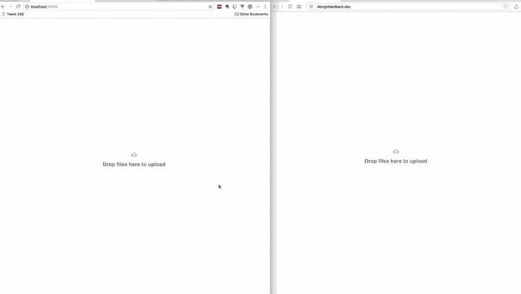
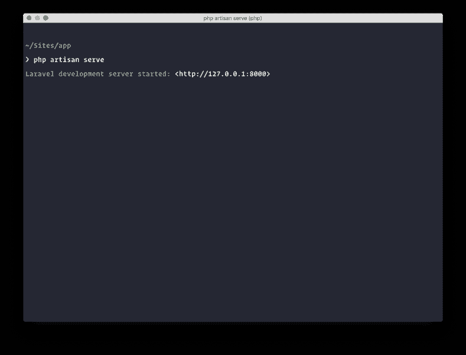

# 使用 VueJS 和 Pusher 创建实时原型反馈应用程序

> 原文：<https://dev.to/neo/create-a-realtime-prototype-feedback-app-using-vuejs-and-pusher--5g92>

像 Invision 这样的公司已经开发了一些应用程序，设计人员可以用它们来获得其他人的反馈。设计师只需加载 Invision 应用程序，上传他们的设计，并将链接发送给留下反馈的人，然后他们就可以在设计的不同部分留下反馈。这对设计师来说很好，因为他们可以看到这些反馈并采取行动。

在本文中，我们将创建一个设计反馈应用程序。这将允许您上传图像，然后将链接发送给其他人，以留下对您的设计的反馈，您可以实时看到。

下面是一个屏幕记录，记录了我们完成构建后，我们的应用程序将能够做些什么:

[T2】](https://res.cloudinary.com/practicaldev/image/fetch/s--6-S6FGVY--/c_limit%2Cf_auto%2Cfl_progressive%2Cq_66%2Cw_880/https://blog.pusher.com/wp-content/uploads/2017/11/Create-a-realtime-design-feedback-app-using-VueJS-Pusher-and-Laravel.gif)

## 需求我们将需要构建我们的应用程序

在我们开始之前，我们需要先准备一些东西。一些要求如下:
–PHP 知识&[Laravel](https://laravel.com)框架。
–JavaScript 知识(ES6)。
–vue . js 的知识
–本地安装在你机器上的 PHP 7.0+。
–[本地安装的 Laravel CLI](https://laravel.com/docs/5.5/installation#installing-laravel) 。
–[作曲](https://getcomposer.org/doc/00-intro.md#installation-linux-unix-osx)本地安装。
–[NPM](https://docs.npmjs.com/cli/install)和 Node.js 本地安装。
–推杆应用。在[pusher.com](https://pusher.com)上创建一个。

一旦你确认你有上述要求，我们可以开始创建我们的应用程序。

## 设置我们的原型反馈应用

让我们开始设置我们的应用程序。使用以下命令创建一个新的 Laravel 应用程序:

```
 $ laravel new your_application_name 
```

Enter fullscreen mode Exit fullscreen mode

当安装完成后，`cd`转到应用程序目录。打开`.env`文件，让我们对文件做一些修改。

**设置我们的数据库和迁移**
首先要做的是设置我们的数据库并创建它的迁移。让我们从建立数据库开始。替换下面的配置项:

```
 DB_CONNECTION=mysql
    DB_HOST=127.0.0.1
    DB_PORT=3306
    DB_DATABASE=homestead
    DB_USERNAME=homestead
    DB_PASSWORD=secret 
```

Enter fullscreen mode Exit fullscreen mode

同:

```
 DB_CONNECTION=sqlite 
```

Enter fullscreen mode Exit fullscreen mode

这将使应用程序使用 SQLite 作为数据库选择。在您的终端中，运行下面的命令来创建一个新的 SQLite 数据库:

```
 $ touch database/database.sqlite 
```

Enter fullscreen mode Exit fullscreen mode

现在让我们创建一些迁移，这些迁移将创建数据库所需的表。在您的终端中，运行以下命令来创建我们将需要的迁移:

```
 $ php artisan make:model Photo --migration --controller
    $ php artisan make:model PhotoComment --migration 
```

Enter fullscreen mode Exit fullscreen mode

上面的命令将创建一个模型，然后`--migration`和`--controller`标志将指示它在模型旁边创建一个迁移和一个控制器。

现在，我们对模型和迁移感兴趣。打开在`./database/migrations`目录中创建的两个迁移文件。我们先来编辑一下`CreatePhotosTable`类。将`up`方法的内容替换为以下内容:

```
 public function up()
    {
        Schema::create('photos', function (Blueprint $table) {
            $table->increments('id');
            $table->string('url')->unique();
            $table->string('image')->unique();
            $table->timestamps();
        });
    } 
```

Enter fullscreen mode Exit fullscreen mode

这将在使用 artisan 命令运行迁移时创建`photos`表。它还会在表内创建新的列，如上所述。

打开第二个迁移类`CreatePhotoCommentsTable`，用下面的内容替换`up`方法:

```
 public function up()
    {
        Schema::create('photo_comments', function (Blueprint $table) {
            $table->increments('id');
            $table->unsignedInteger('photo_id');
            $table->text('comment');
            $table->integer('top')->default(0);
            $table->integer('left')->default(0);
            $table->timestamps();

            $table->foreign('photo_id')->references('id')->on('photos');
        });
    } 
```

Enter fullscreen mode Exit fullscreen mode

这将在迁移运行时创建表`photo_comments`,还将创建表`photos`的外键。

现在转到您的终端，运行下面的命令来运行迁移:

```
 $ php artisan migrate 
```

Enter fullscreen mode Exit fullscreen mode

现在应该可以创建数据库表了。

**设置模型**
现在我们已经运行了我们的迁移，我们需要对我们的模型文件做一些更改，以便它可以更好地与表一起工作。

打开`Photo`模型，将内容替换为以下内容:

```
 <?php
    namespace App;

    use Illuminate\Database\Eloquent\Model;

    class Photo extends Model
    {
        protected $with = ['comments'];

        protected $fillable = ['url', 'image'];

        public function comments()
        {
            return $this->hasMany(PhotoComment::class);
        }
    } 
```

Enter fullscreen mode Exit fullscreen mode

在上面的例子中，我们添加了`fillable`属性，当我们试图使用`Photo::create`更新那些列时，该属性阻止我们出现批量赋值异常。我们还设置了`with`属性，它将加载`comments`关系。

我们已经定义了一个雄辩的关系`comments`，它只是说`Photo`有许多`PhotoComments`。

打开`PhotoComment`模型，将内容替换为以下内容:

```
 <?php
    namespace App;

    use Illuminate\Database\Eloquent\Model;

    class PhotoComment extends Model
    {
        protected $fillable = ['photo_id', 'comment', 'top', 'left'];

        protected $appends = ['position'];

        public function getPositionAttribute()
        {
            return [
                'top' => $this->attributes['top'], 
                'left' => $this->attributes['left']
            ];
        }
    } 
```

Enter fullscreen mode Exit fullscreen mode

就像`Photo`模型一样，我们已经定义了`fillable`属性。我们还使用[雄辩的访问器](https://laravel.com/docs/5.5/eloquent-mutators#accessors-and-mutators)来配置一个名为`position`的新属性，该属性随后被追加，因为我们在`appends`属性中指定了它。

**为我们的应用程序设置前端**
接下来我们要做的是设置应用程序的前端。让我们从安装应用程序中需要的几个 NPM 包开始。在您的终端应用程序中，运行下面的命令来安装所需的软件包:

```
 $ npm install --save laravel-echo pusher-js vue2-dropzone@^2.0.0
    $ npm install 
```

Enter fullscreen mode Exit fullscreen mode

这将安装 [Laravel Echo](https://laravel.com/docs/5.5/broadcasting#installing-laravel-echo) 、 [Pusher JS SDK](https://github.com/pusher/pusher-js) 和 [vue-dropzone](https://github.com/rowanwins/vue-dropzone) 。稍后我们将需要这些包来处理实时事件。

当软件包安装成功后，我们现在可以开始添加一些 HTML 和 JavaScript。

打开`./routes/web.php`文件，让我们添加一些路线。将文件内容替换为以下内容:

```
 <?php

    Route::post('/feedback/{image_url}/comment', 'PhotoController@comment');
    Route::get('/feedback/{image_url}', 'PhotoController@show');
    Route::post('/upload', 'PhotoController@upload');
    Route::view('/', 'welcome'); 
```

Enter fullscreen mode Exit fullscreen mode

在上面的代码中，我们定义了几条路线。第一个是处理反馈。第二条路线将显示接收反馈的图像。第三条路线将处理上传，最后一条路线将显示主页。

现在打开`./resources/views/welcome.blade.php`文件，用下面的 HTML 代码替换其中的内容:

```
 <!doctype html>
    <html lang="{{ app()->getLocale() }}">
    <head>
        <meta charset="utf-8">
        <meta http-equiv="X-UA-Compatible" content="IE=edge">
        <meta name="viewport" content="width=device-width, initial-scale=1">
        <meta name="csrf-token" content="{{csrf_token()}}">
        Upload to get Feedback
        <link href="https://fonts.googleapis.com/css?family=Roboto:400,600" rel="stylesheet" type="text/css">
        <link href="https://fonts.googleapis.com/icon?family=Material+Icons" rel="stylesheet">
        <link rel="stylesheet" href="{{ asset('css/app.css') }}">
    </head>
    <body>
        <div id="app">
            <div class="flex-center position-ref full-height">
                <div class="content">
                    <uploadarea></uploadarea>
                </div>
            </div>
        </div>
        <script src="js/app.js"></script>
    </body>
    </html> 
```

Enter fullscreen mode Exit fullscreen mode

这是一个简单的 HTML 文档，如果仔细观察，您会看到对一个`uploadarea`标签的引用，这个标签在 HTML 中并不存在，但却是一个 Vue 组件。

打开`./resources/assets/sass/app.scss`文件，将以下代码粘贴到导入语句下面:

```
 html, body {
        background-color: #fff;
        color: #636b6f;
        font-family: 'Roboto', sans-serif;
        font-weight: 100;
        height: 100vh;
        margin: 0;
    }
    .full-height {
        height: 100vh;
    }
    .flex-center {
        align-items: center;
        display: flex;
        justify-content: center;
    }
    .position-ref {
        position: relative;
    }
    .content {
        text-align: center;
    }
    .m-b-md {
        margin-bottom: 30px;
    }
    .dropzone.dz-clickable {
        width: 100vw;
        height: 100vh;
        .dz-message {
            span {
                font-size: 19px;
                font-weight: 600;
            }
        }
    }
    #canvas {
        width: 90%;
        margin: 0 auto;
        img {
            width: 100%;
        }
    }
    .modal {
      text-align: center;
      padding: 0!important;
      z-index: 9999;
    }
    .modal-backdrop.in {
        opacity: 0.8;
        filter: alpha(opacity=80);
    }
    .modal:before {
      content: '';
      display: inline-block;
      height: 100%;
      vertical-align: middle;
      margin-right: -4px;
    }
    .modal-dialog {
      display: inline-block;
      text-align: left;
      vertical-align: middle;
    }
    .image-hotspot {
        position: relative;
        > img {
            display: block;
            height: auto;
            transition: all .5s;
        }
    }
    .hotspot-point {
        z-index: 2;
        position: absolute;
        display: block;
        span {
            position: relative;
            display: flex;
            justify-content: center;
            align-items: center;
            width: 1.8em;
            height: 1.8em;
            background: #cf00f1;
            border-radius: 50%;
            animation: pulse 3s ease infinite;
            transition: background .3s;
            box-shadow: 0 2px 10px rgba(#000, .2);
            &:after {
                content: attr(data-price);
                position: absolute;
                bottom: 130%;
                left: 50%;
                color: white;
                text-shadow: 0 1px black;
                font-weight: 600;
                font-size: 1.2em;
                opacity: 0;
                transform: translate(-50%, 10%) scale(.5);
                transition: all .25s;
            }
        }
        svg {
            opacity: 0;
            color: #cf00f1;
            font-size: 1.4em;
            transition: opacity .2s;
        }
        &:before,
        &:after  {
            content: '';
            position: absolute;
            top: 0;
            left: 0;
            width: 100%;
            height: 100%;
            border-radius: 50%;
            pointer-events: none;
        }
        &:before {
            z-index: -1;
            border: .15em solid rgba(#fff, .9);
            opacity: 0;
            transform: scale(2);
            transition: transform .25s, opacity .2s;
        }
        &:after {
            z-index: -2;
            background:#fff;
            animation: wave 3s linear infinite;
        }
        &:hover{
            span {
                animation: none;
                background: #fff;
                &:after {
                    opacity: 1;
                    transform: translate(-50%, 0) scale(1);
                }
            }
            svg {
                opacity: 1;
            }
            &:before {
                opacity: 1;
                transform: scale(1.5);
                animation: borderColor 2s linear infinite;
            }
            &:after {
                animation: none;
                opacity: 0;
            }
        }
    }
    @-webkit-keyframes pulse{
        0%, 100% { transform: scale(1); }
        50% { transform: scale(1.1); }
    }
    @keyframes pulse{
        0%, 100% { transform: scale(1); }
        50% { transform: scale(1.1); }
    }
    .popover {
        min-width: 250px;
    } 
```

Enter fullscreen mode Exit fullscreen mode

保存文件并退出。现在让我们继续创建我们的 Vue 组件。

## 使用 Vue 创建我们的原型反馈应用程序的功能

打开`./resources/assets/js/app.js`文件，在那里我们创建我们的 Vue 组件。在这个文件中找到下面一行:

```
 Vue.component('example', require('./components/Example.vue')); 
```

Enter fullscreen mode Exit fullscreen mode

并替换为:

```
 Vue.component('uploadarea', require('./components/UploadArea.vue'));
    Vue.component('feedback', require('./components/FeedbackCanvas.vue')); 
```

Enter fullscreen mode Exit fullscreen mode

现在让我们创建我们的第一个 Vue 组件。在`./resources/assets/js/components`目录中创建一个名为`UploadArea.vue`的文件。在新文件中粘贴以下内容:

```
 <template>
        <dropzone ref="dropzone" id="dropzone"
                url="/upload"
                accepted-file-types="image/*"
                v-on:vdropzone-success="showImagePage"
                :headers="csrfHeader"
                class="flex-center position-ref full-height">
            <input type="hidden" name="csrf-token" :value="csrfToken">
        </dropzone>
    </template> 
    <script>
    import Dropzone from 'vue2-dropzone';

    const LARAVEL_TOKEN = document.head.querySelector('meta[name="csrf-token"]').content

    export default {
        components: { Dropzone },
        data() {
            return {
                csrfToken: LARAVEL_TOKEN,
                csrfHeader: { 'X-CSRF-TOKEN': LARAVEL_TOKEN }
            }
        },
        methods: {
            showImagePage: (file, response) => {
                if (response.url) {
                    return window.location = `/feedback/${response.url}`;
                }
            }
        },
        mounted () {
            this.$refs.dropzone.dropzone.on('addedfile', function (file) {
                if (this.files.length > 1) {
                    this.removeFile(this.files[0])
                }
            })
        }
    }
    </script> 
```

Enter fullscreen mode Exit fullscreen mode

在`template`部分，我们简单地使用 Vue dropzone 包来定义一个可以上传文件的区域。你可以在这里查看文档[。](https://github.com/rowanwins/vue-dropzone)

在`script`部分，我们从页面的头部获取了 Laravel CSRF 令牌，并将`Dropzone`组件导入到我们当前的 Vue 组件中。

在`methods`属性中，我们定义了一个`showImagePage`方法，该方法在图像成功上传后将用户重定向到图像页面。在`mounted`方法中，我们将 dropzone 文件限制为一次只能上传一个文件。

让我们创建下一个 Vue 组件。在`./resources/assets/js/components`目录下创建一个名为`FeedbackCanvas.vue`的新文件，并粘贴以下内容:

```
 <template>
        <div class="feedback-area">
            <div class="content">
                <div id="canvas">
                    <div class="image-hotspot" id="imghotspot">
                        <transition-group name="hotspots">
                          <a
                            href="#"
                            class="hotspot-point"
                            v-for="(comment, index) in image.comments"
                            v-bind:style="{ left: comment.position.left+'%', top: comment.position.top+'%' }"
                            :key="index"
                            @click.prevent
                            data-placement="top"
                            data-toggle="popover"
                            :data-content="comment.comment"
                          >
                                <span>
                                    
                                        <path d="M18.984 12.984h-6v6h-1.969v-6h-6v-1.969h6v-6h1.969v6h6v1.969z"></path>
                                    
                                </span>
                          </a>
                        </transition-group>
                        
                    </div>
                </div>
            </div>
            <add-comment-modal :image="image"></add-comment-modal>
        </div>
    </template> 
```

Enter fullscreen mode Exit fullscreen mode

我们已经为 Vue 组件定义了`template`。这是将显示图像和给出反馈的区域。

让我们把它的一些部分分解一下。`a`标签设置了一系列属性。`v-for`遍历图像的每个评论/反馈。

`v-bind:style`使用评论/反馈的`left`和`top`属性将`style`属性应用于`a`标签。我们也有`:data-content`、`data-toggle`和`data-placement`，Bootstrap 需要它们用于它的[popover](https://www.w3schools.com/bootstrap/bootstrap_popover.asp)。

`img`标签有一个`@click`事件，当图像的一个区域被点击时，该事件触发函数`addCommentPoint`。最后，还有一个接受属性`image`的 Vue 组件`add-comment-modal`。该组件将显示一个表单，这样任何人都可以留下评论。

在同一个文件中，在结束的`template`标记之后，粘贴以下代码:

```
 <script>
        let AddCommentModal = require('./AddCommentModal.vue')

        export default {
            props: ['photo'],
            components: { AddCommentModal },
            data() {
                return { image: this.photo }
            },
            mounted() {
                let vm = this

                Echo.channel(`feedback-${this.photo.id}`)
                    .listen('.added', (e) => {
                        // Look through the comments and if no comment matches the 
                        // existing comments, add it
                        if (vm.image.comments.filter((comment) => comment.id === e.comment.id).length === 0) {
                            vm.image.comments.push(e.comment)
                            $(document).ready(() => $('[data-toggle="popover"]').popover())
                        }
                    })
            },
            created() {
                /** Activate popovers */
                $(document).ready(() => $('[data-toggle="popover"]').popover());

                /** Calculates the coordinates of the click point */
                this.calculateClickCordinates = function (evt) {
                    let rect = evt.target.getBoundingClientRect()
                    return {
                        left: Math.floor((evt.clientX - rect.left - 7) * 100 / this.$refs.img.width),
                        top: Math.floor((evt.clientY - rect.top - 7) * 100 / this.$refs.img.height)
                    }
                }

                /** Removes comments that have not been saved */
                this.removeUnsavedComments = function () {
                    var i = this.image.comments.length
                    while (i--) {
                        if ( ! this.image.comments[i]['id']) {
                            this.image.comments.splice(i, 1)
                        }
                    }
                }
            },
            methods: {
                addCommentPoint: function(evt) {
                    let vm       = this
                    let position = vm.calculateClickCordinates(evt)
                    let count    = this.image.comments.push({ position })

                    // Show the modal and add a callback for when the modal is closed
                    let modalElem = $("#add-modal")
                    modalElem.data({"comment-index": count-1, "comment-position": position})
                    modalElem.modal("show").on("hide.bs.modal", () => vm.removeUnsavedComments())
                }
            },
        }
    </script> 
```

Enter fullscreen mode Exit fullscreen mode

> 💡**`**created**`**和** `**mounted**` **方法是在创建 Vue 组件期间自动调用的钩子。你可以** [**在这里**](https://alligator.io/vuejs/component-lifecycle) **了解 Vue 生命周期。****

 **在`mounted`方法中，我们使用 Laravel Echo 来监听 Pusher 通道。频道名称取决于当前正在查看的图像的 ID。基于图像的 ID，每个图像将在不同的频道上广播。

当在`feedback-$id`通道上触发`added`事件时，它会查看可用的`image.comments`，如果广播的评论不存在，它会将其添加到评论数组中。

在`create`方法中，我们激活 Bootstrap popovers，定义一个计算点击点坐标的函数，并定义一个从`image.comments`数组中删除未保存的注释的函数。

在`methods`下，我们定义了计算点击坐标的`addCommentPoint`方法，然后启动一个新的引导模型，该模型将在`add-comment-modal` Vue 组件中创建。

为了让 Laravel Echo 工作，我们需要打开`./resources/assets/js/bootstrap.js`文件，并在文件底部添加下面的代码:

```
 import Echo from 'laravel-echo'

    window.Pusher = require('pusher-js');

    window.Echo = new Echo({
        broadcaster: 'pusher',
        key: 'PUSHER_KEY',
        encrypted: true,
        cluster: 'PUSHER_CLUSTER'
    }); 
```

Enter fullscreen mode Exit fullscreen mode

您应该将`PUSHER_KEY`和`PUSHER_CLUSTER`替换为用于您的推动器应用的键和串。

现在让我们创建下一个 Vue 组件，`AddCommentModal.vue`。它已经在我们的`FeedbackCanvas.vue` Vue 组件中被引用。

在与我们的其他 Vue 组件相同的目录中创建一个`AddCommentModal.vue`文件。在这个文件中粘贴下面的代码:

```
 <template>
      <div id="add-modal" class="modal fade" role="dialog" data-backdrop="static" data-keyboard="false">
          <div class="modal-dialog">
              <div class="modal-content">
                  <form method="post" :action="'/feedback/'+photo.url+'post'" @submit.prevent="submitFeedback()">
                      <div class="modal-header">
                          <h4 class="modal-title">Add Feedback</h4>
                      </div>
                      <div class="modal-body">
                          <textarea name="feedback" id="feedback-provided" cols="10" rows="5" class="form-control" v-model="feedback" placeholder="Enter feedback..." required minlength="2" maxlength="2000"></textarea>
                      </div>
                      <div class="modal-footer">
                          <button type="submit" class="btn btn-primary pull-right">Submit</button>
                          <button type="button" class="btn btn-default pull-left" data-dismiss="modal">Cancel</button>
                      </div>
                  </form>
              </div>
        </div>
      </div>
    </template> 
    <script>
    export default {
        props: ['image'],
        data() {
            return { photo: this.image, feedback: null }
        },
        methods: {
            submitFeedback: function () {
                let vm = this
                let modal = $('#add-modal')
                let position = modal.data("comment-position")

                // Create url and payload
                let url = `/feedback/${this.photo.url}/comment`;
                let payload = {comment: this.feedback, left: position.left, top: position.top}
                axios.post(url, payload).then(response => {
                    this.feedback = null
                    modal.modal('hide')
                    vm.photo.comments[modal.data('comment-index')] = response.data
                    $(document).ready(() => $('[data-toggle="popover"]').popover())
                })
            }
        }
    }
    </script> 
```

Enter fullscreen mode Exit fullscreen mode

在`template`部分，我们定义了一个典型的自举模型。在模态表单中，我们附加了一个对`submitFeedback()`的调用，当提交表单时会触发这个调用。

在`script`部分，我们已经在 Vue 组件的`methods`属性中定义了`submitFeedback()`方法。这个函数只是将一条评论发送到后端进行存储。如果 API 给出了满意的响应，引导模式将被隐藏，注释将被添加到`image.comments`数组中。然后，引导弹出窗口被重新加载，这样它就可以获得更改。

随着最后的改变，我们已经定义了所有的 Vue 组件。打开您的终端并运行下面的命令来构建您的 JS 和 CSS 资产:

```
 $ npm run dev 
```

Enter fullscreen mode Exit fullscreen mode

太好了！现在让我们构建后端。

## 为原型反馈应用程序创建端点

在您的终端中，输入以下命令:

```
 php artisan make:event FeedbackAdded 
```

Enter fullscreen mode Exit fullscreen mode

这将创建一个名为`FeedbackAdded`的事件类。当我们添加一些反馈时，我们将使用这个文件来触发事件。这将使反馈实时出现在任何观看图像的人面前。

打开`PhotoController`类，用下面的代码替换内容:

```
 <?php
    namespace App\Http\Controllers;

    use App\Events\FeedbackAdded;
    use App\{Photo, PhotoComment};

    class PhotoController extends Controller
    {
        public function show($url)
        {
            $photo = Photo::whereUrl($url)->firstOrFail();

            return view('image', compact('photo'));
        }

        public function comment(string $url)
        {
            $photo = Photo::whereUrl($url)->firstOrFail();

            $data = request()->validate([
                "comment" => "required|between:2,2000",
                "left" => "required|numeric|between:0,100",
                "top"  => "required|numeric|between:0,100",
            ]);

            $comment = $photo->comments()->save(new PhotoComment($data));

            event(new FeedbackAdded($photo->id, $comment->toArray()));

            return response()->json($comment);
        }

        public function upload()
        {
            request()->validate(['file' => 'required|image']);

            $gibberish = md5(str_random().time());

            $imgName = "{$gibberish}.".request('file')->getClientOriginalExtension();

            request('file')->move(public_path('storage'), $imgName);

            $photo = Photo::create(['image' => $imgName, 'url' => $gibberish]);

            return response()->json($photo->toArray());
        }
    } 
```

Enter fullscreen mode Exit fullscreen mode

在上面的例子中，我们有一个`show`方法来显示一张图片，这样人们可以在上面留下反馈。接下来是保存图片新评论的`comment`方法。最后一种方法是`upload`方法，它简单地将图像上传到服务器并保存到数据库。

让我们为`show`方法创建视图。在`./resources/views`目录下创建一个名为`image.blade.php`的新文件。在这个文件中，粘贴下面的代码:

```
 <!doctype html>
    <html lang="{{ app()->getLocale() }}">
    <head>
        <meta charset="utf-8">
        <meta http-equiv="X-UA-Compatible" content="IE=edge">
        <meta name="viewport" content="width=device-width, initial-scale=1">
        <meta name="csrf-token" content="{{csrf_token()}}">
        Laravel
        <link href="https://fonts.googleapis.com/css?family=Roboto:400,600" rel="stylesheet" type="text/css">
        <link href="https://fonts.googleapis.com/icon?family=Material+Icons" rel="stylesheet">
        <link rel="stylesheet" href="{{ asset('css/app.css') }}">
    </head>
    <body>
        <div id="app">
            <feedback :photo='@json($photo)'></feedback>
        </div>
        <script src="{{asset('js/app.js')}}"></script>
    </body>
    </html> 
```

Enter fullscreen mode Exit fullscreen mode

在上面，唯一突出的是`feedback`标签，它基本上是指我们在文章前面构建的反馈 Vue 组件。其他的都是基本的 Blade 和 HTML。

现在我们已经创建了视图，我们需要添加在`upload`方法中定义的上传目录。在您的终端中，运行以下命令:

```
 $ php artisan storage:link 
```

Enter fullscreen mode Exit fullscreen mode

该命令将创建一个从`./storage`目录到`./public/storage`目录的符号链接。如果你在`./public`目录中查找，你应该会看到符号链接。

现在我们已经创建了后端来支持我们的 web 应用程序，我们需要向后端添加 Pusher，这样所做的评论就会被广播，并且可以被其他浏览图像的人获取。

## 使用 Pusher 为原型反馈应用添加实时功能

打开你的终端，输入下面的命令来安装 [Pusher PHP SDK](https://github.com/pusher/pusher-http-php) :

```
 $ composer require pusher/pusher-php-server "~3.0" 
```

Enter fullscreen mode Exit fullscreen mode

打开`.env`文件，滚动到底部，配置按钮，如下所示:

```
 PUSHER_APP_ID="PUSHER_ID"
    PUSHER_APP_KEY="PUSHER_KEY"
    PUSHER_APP_SECRET="PUSHER_SECRET" 
```

Enter fullscreen mode Exit fullscreen mode

同样在同一个文件中，查找`BROADCAST_DRIVER`，并将其从`log`更改为`pusher`。

接下来，打开`./config/broadcasting.php`并滚动到`pusher`键。将该配置的`options`键替换为以下代码:

```
 // ...
    'options' => [
        'cluster' => 'PUSHER_CLUSTER',
        'encrypted' => true
    ], 
    // ... 
```

Enter fullscreen mode Exit fullscreen mode

> 💡**记住用 Pusher 应用程序中的值替换** `**PUSHER_ID**` **、** `**PUSHER_KEY**` **、** `**PUSHER_SECRET**` **和** `**PUSHER_CLUSTER**` **。**

现在，打开`FeedbackAdded`类，用下面的代码替换内容:

```
 <?php

    namespace App\Events;

    use Illuminate\Broadcasting\Channel;
    use Illuminate\Queue\SerializesModels;
    use Illuminate\Foundation\Events\Dispatchable;
    use Illuminate\Broadcasting\InteractsWithSockets;
    use Illuminate\Contracts\Broadcasting\ShouldBroadcast;

    class FeedbackAdded implements ShouldBroadcast
    {
        use Dispatchable, InteractsWithSockets, SerializesModels;

        public $comment;

        public $photo_id;

        public function __construct(int $photo_id, array $comment)
        {
            $this->comment = $comment;
            $this->photo_id = $photo_id;
        }

        public function broadcastOn()
        {
            return new Channel("feedback-{$this->photo_id}");
        }

        public function broadcastAs()
        {
            return 'added';
        }
    } 
```

Enter fullscreen mode Exit fullscreen mode

在上面的类中，我们定义了`comment`对象和`photo_id`，它们将用于在`broadcastOn`方法中组成频道名称。我们还定义了`broadcastAs`方法，该方法允许我们定制发送给 Pusher 的事件的名称。

仅此而已。现在，让我们运行我们的应用程序。在您的终端中，运行下面的代码:

```
 $ php artisan serve 
```

Enter fullscreen mode Exit fullscreen mode

[T2】](https://res.cloudinary.com/practicaldev/image/fetch/s--Ijifs3h3--/c_limit%2Cf_auto%2Cfl_progressive%2Cq_auto%2Cw_880/https://blog.pusher.com/wp-content/uploads/2017/11/Create-a-realtime-design-feedback-app-using-VueJS-Pusher-and-Laravel-2-789x600.png)

这将启动一个新的 PHP 服务器，然后您可以使用它来测试您的应用程序。转到给定的 URL，您应该会看到您的应用程序。

## 结论

在本文中，我们已经成功地创建了一个原型应用程序的反馈功能，该功能允许设计人员与其他人共享他们的设计并接收反馈。如果您有问题或反馈，请在下面留言。

该应用的源代码可在 [GitHub](https://github.com/neoighodaro/Design-Prototype-Feedback-Application) 上获得。

这篇文章最初出现在 [Pusher 博客](https://blog.pusher.com/create-realtime-prototype-feedback-app-using-vuejs-pusher/)上。**