# 使用基本身份验证在 Codeigniter 中创建 REST API

> 原文：<https://dev.to/pardip_trivedi/create-a-rest-api-in-codeigniter-with-basic-authentication-1e7f>

CodeIgniter RESTful API 是一组简单的模块化助手，可以轻松集成到您的 CodeIgniter 项目中，允许您创建满足您所有需求的可定制 RESTful API。该包包括数据库操作、JSON Web 令牌生成、验证和签名、身份验证方法、使用 URI 访问资源的方法，以及一些有助于简化工作流的实用方法。

## 什么是 REST API

REST 代表代表性状态转移。REST API 是一个 web 服务，它使用 HTTP 方法，如 GET、PUT、POST、DELETE，在跨平台上进行数据操作。

在本教程中，我将演示如何在 Codeigniter 中创建 REST API。为了创建 API，我将使用由 Phil Sturgeon 编写的、目前由 Chris Kacerguis 支持的 codeigniter-restserver。我还将使用 codeigniter-restclient 库。

[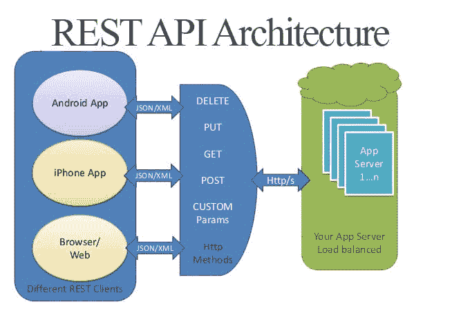T2】](https://res.cloudinary.com/practicaldev/image/fetch/s--FkyXorEz--/c_limit%2Cf_auto%2Cfl_progressive%2Cq_auto%2Cw_880/https://thepracticaldev.s3.amazonaws.com/i/ueg7okh8thprev2cay9s.jpg)

在 Codeigniter 中创建 REST API 的过程包括以下步骤:

在 Cloudways 上安装 Codeigniter 框架
数据库和表创建
设置库和权限
设置认证和 API 密钥
设置 HTTP 调用(GET、PUT、POST、DELETE)
测试 HTTP 调用。

## 在 Cloudways 上安装 Codeigniter

首先在 Cloudways 注册一个免费帐户。一旦帐户准备好，登录到您的帐户，并创建一个新的服务器。填写服务器和应用程序详细信息，并选择 PHP Stack 作为您的应用程序。接下来，输入应用程序、服务器和项目的名称。

注意:您可以在一台服务器上托管无限的应用程序。

选择您的提供商(Google、Amazon、Vultr、DigitalOcean、Kyup)，根据您的需求选择服务器大小，然后单击启动按钮。更多细节请看下面的 GIF:

[T2】](https://res.cloudinary.com/practicaldev/image/fetch/s--X3MGeGdX--/c_limit%2Cf_auto%2Cfl_progressive%2Cq_66%2Cw_880/https://thepracticaldev.s3.amazonaws.com/i/7keo603sxo7f3p0fucjb.gif)

现在您的服务器和应用程序已经准备好了，通过单击服务器名称打开您的服务器。

[T2】](https://res.cloudinary.com/practicaldev/image/fetch/s--a9ELXpfS--/c_limit%2Cf_auto%2Cfl_progressive%2Cq_auto%2Cw_880/https://thepracticaldev.s3.amazonaws.com/i/wru2oimg53a46vnva785.png)

使用主凭据区域中提供的用户名和密码登录。

[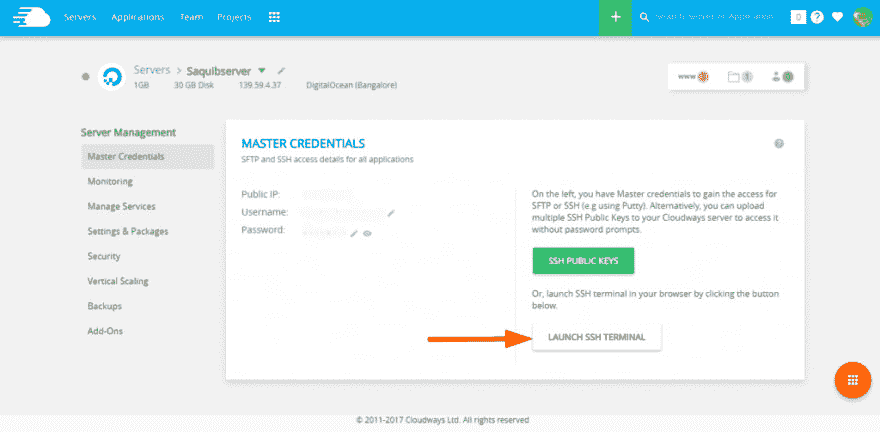T2】](https://res.cloudinary.com/practicaldev/image/fetch/s--nktwVmKb--/c_limit%2Cf_auto%2Cfl_progressive%2Cq_auto%2Cw_880/https://thepracticaldev.s3.amazonaws.com/i/jr8zv6r0h3hrc57866eh.png)

现在您已经连接到了您的服务器，转到 SSH 终端并键入以下命令来安装 Codeigniter。

```
cd applications

cd applicationname/public_html

wget https://github.com/bcit-ci/CodeIgniter/archive/develop.zip 
```

Enter fullscreen mode Exit fullscreen mode

[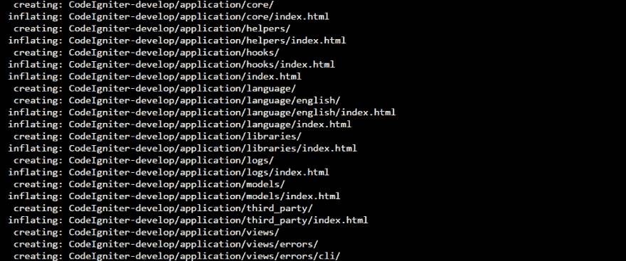T2】](https://res.cloudinary.com/practicaldev/image/fetch/s--yVnz3dMO--/c_limit%2Cf_auto%2Cfl_progressive%2Cq_auto%2Cw_880/https://thepracticaldev.s3.amazonaws.com/i/aboc65oj1uqksllfswtt.png)

zip 文件下载完成后，使用以下命令解压缩该文件。

```
unzip develop.zip
mv CodeIgniter-develop codeigniter
rm index.php
rm develop.zip 
```

Enter fullscreen mode Exit fullscreen mode

至此，安装完成。

转到 Cloudways 面板上的 Application 选项卡，选择您的应用程序。单击突出显示的按钮(见下图)访问该应用程序。记得将/codeigniter 添加到 URL 中，然后按回车键。

[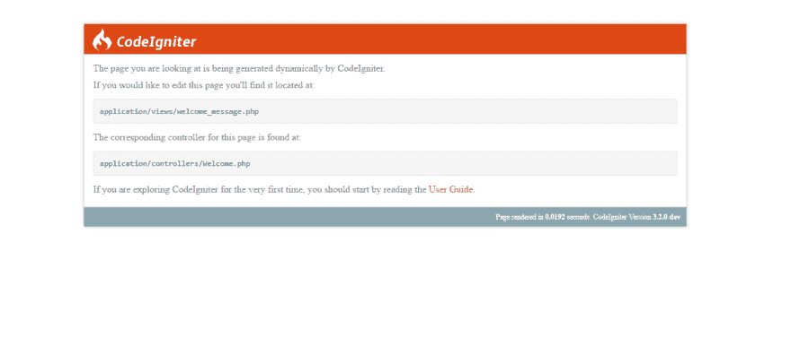T2】](https://res.cloudinary.com/practicaldev/image/fetch/s--maJoboyS--/c_limit%2Cf_auto%2Cfl_progressive%2Cq_auto%2Cw_880/https://thepracticaldev.s3.amazonaws.com/i/rq5p7bvxlrv3xpm9sfei.png)

## 创建数据库和表格

我现在将创建一个简单的数据库，其中包含一个名为 User 的表。为了创建数据库，请转到应用程序管理选项卡并启动数据库管理器。

[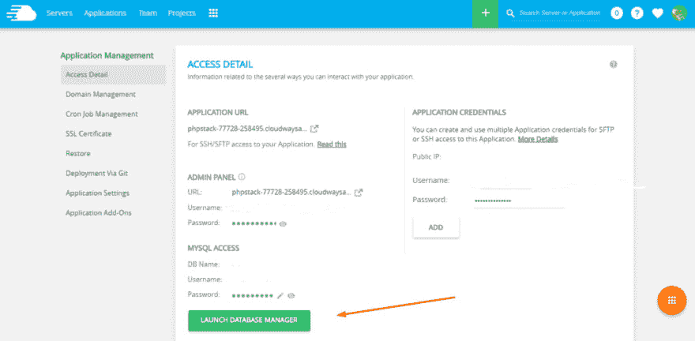T2】](https://res.cloudinary.com/practicaldev/image/fetch/s--Zmsm332M--/c_limit%2Cf_auto%2Cfl_progressive%2Cq_auto%2Cw_880/https://thepracticaldev.s3.amazonaws.com/i/ob18w3vdqltxoj3rfswj.png)

在 SQL 命令字段中键入以下命令:

```
CREATE TABLE `tbl_user` (
 `user_id` int(11) NOT NULL,
 `user_name` varchar(40) NOT NULL,
 `user_password` varchar(40) NOT NULL,
 `user_type` varchar(15) NOT NULL
) ENGINE=InnoDB DEFAULT CHARSET=utf8; 
```

Enter fullscreen mode Exit fullscreen mode

[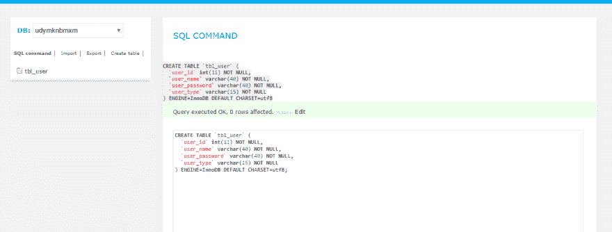T2】](https://res.cloudinary.com/practicaldev/image/fetch/s--rANAbnhB--/c_limit%2Cf_auto%2Cfl_progressive%2Cq_auto%2Cw_880/https://thepracticaldev.s3.amazonaws.com/i/3qusu3qmslufj10wzm1q.png)

## 设置库和权限

首先下载 codeigniter-restserver 和 codeigniter-restclient 库。提取内容，然后将 application/libraries/format . PHP 和 application/libraries/REST _ controller . PHP 文件拖放到应用程序的目录中。记住在控制器的顶部添加 require_once，以便将它们加载到作用域中。此外，从应用程序的配置目录中的 application/config 复制 rest.php 文件。

现在，在应用程序的根文件夹中创建一个文件，并将其命名为. htaccess。

```
RewriteEngine On

RewriteCond %{REQUEST_FILENAME} !-f

RewriteCond %{REQUEST_FILENAME} !-d

RewriteRule ^(.*)$ index.php/$1 [L] 
```

Enter fullscreen mode Exit fullscreen mode

## 设置认证和 API 密钥

要设置认证，首先在数据库中创建以下表格:

```
CREATE TABLE `keys` (

 `id` int(11) NOT NULL,

 `key` varchar(40) NOT NULL,

 `level` int(2) NOT NULL,

 `ignore_limits` tinyint(1) NOT NULL DEFAULT '0',

 `is_private_key` tinyint(1) NOT NULL DEFAULT '0',

 `ip_addresses` text,

 `date_created` int(11) NOT NULL

) ENGINE=InnoDB DEFAULT CHARSET=utf8; 
```

Enter fullscreen mode Exit fullscreen mode

```
CREATE TABLE `logs` (

 `id` int(11) NOT NULL,

 `uri` varchar(255) NOT NULL,

 `method` varchar(6) NOT NULL,

 `params` text,

 `api_key` varchar(40) NOT NULL,

 `ip_address` varchar(45) NOT NULL,

 `time` int(11) NOT NULL,

 `rtime` float DEFAULT NULL,

 `authorized` varchar(1) NOT NULL,

 `response_code` smallint(3) DEFAULT '0'

) ENGINE=InnoDB DEFAULT CHARSET=utf8; 
```

Enter fullscreen mode Exit fullscreen mode

表键将用于存储 API 键，而日志表将保存服务器收到的请求的日志。

现在打开应用程序/database.php，输入您的主机名、数据库名和密码(可在应用程序访问详情中找到)。

[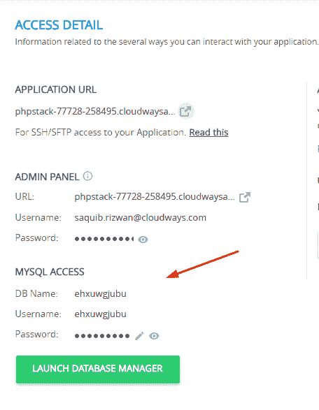T2】](https://res.cloudinary.com/practicaldev/image/fetch/s--yYQoHQLp--/c_limit%2Cf_auto%2Cfl_progressive%2Cq_auto%2Cw_880/https://thepracticaldev.s3.amazonaws.com/i/bpqoqmv4jq7nral1w1ar.png)

[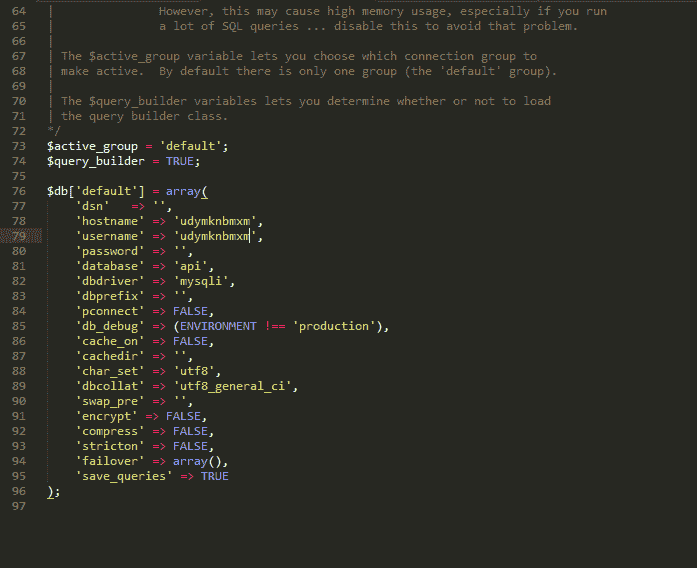T2】](https://res.cloudinary.com/practicaldev/image/fetch/s--xnmExvlb--/c_limit%2Cf_auto%2Cfl_progressive%2Cq_auto%2Cw_880/https://thepracticaldev.s3.amazonaws.com/i/ww4t68tlp2kvts66pxp5.png)

下一步是设置身份验证。为此，打开应用程序/autoload.php，更改这行代码

```
$autoload['libraries'] = array( ); 
```

Enter fullscreen mode Exit fullscreen mode

到此

```
$autoload['libraries'] = array('database'); 
```

Enter fullscreen mode Exit fullscreen mode

现在转到应用程序/rest.php，设置如下所示的实体

```
$config['rest_enable_keys'] = TRUE;
$config['rest_logs_table'] = 'logs';
$config['rest_auth'] = 'basic';
$config['auth_source'] = ''; 
```

Enter fullscreen mode Exit fullscreen mode

认证现在已经准备好了。嵌套是模型和 HTTP 调用的创建。

## 设置 HTTP 调用

我现在将创建两个文件。

转到应用程序/控制器，并创建一个新文件的名称为 api.php。将以下代码粘贴到其中。

```
<?php
defined('BASEPATH') OR exit('No direct script access allowed');

require(APPPATH.'/libraries/REST_Controller.php');
class Api extends REST_Controller
{

       public function __construct() {
               parent::__construct();
               $this->load->model('user_model');

       }    
       public function user_get(){
           $r = $this->user_model->read();
           $this->response($r); 
       }
       public function user_put(){
           $id = $this->uri->segment(3);

           $data = array('name' => $this->input->get('name'),
           'pass' => $this->input->get('pass'),
           'type' => $this->input->get('type')
           );

            $r = $this->user_model->update($id,$data);
               $this->response($r); 
       }

       public function user_post(){
           $data = array('name' => $this->input->post('name'),
           'pass' => $this->input->post('pass'),
           'type' => $this->input->post('type')
           );
           $r = $this->user_model->insert($data);
           $this->response($r); 
       }
       public function user_delete(){
           $id = $this->uri->segment(3);
           $r = $this->user_model->delete($id);
           $this->response($r); 
       } 
```

Enter fullscreen mode Exit fullscreen mode

接下来，转到应用程序/模型，并将以下代码粘贴到其中。

```
<?php

defined('BASEPATH') OR exit('No direct script access allowed');

/**

*

*/

class User_model extends CI_Model

{

public function read(){

       $query = $this->db->query("select * from `tbl_user`");

       return $query->result_array();

   }

   public function insert($data){

       $this->user_name    = $data['name']; // please read the below note

       $this->user_password  = $data['pass'];

       $this->user_type = $data['type'];

       if($this->db->insert('tbl_user',$this))

       {    

           return 'Data is inserted successfully';

       }

         else

       {

           return "Error has occured";

       }

   }

   public function update($id,$data){

      $this->user_name    = $data['name']; // please read the below note

       $this->user_password  = $data['pass'];

       $this->user_type = $data['type'];

       $result = $this->db->update('tbl_user',$this,array('user_id' => $id));

       if($result)

       {

           return "Data is updated successfully";

       }

       else

       {

           return "Error has occurred";

       }

   }

   public function delete($id){

       $result = $this->db->query("delete from `tbl_user` where user_id = $id");

       if($result)

       {

           return "Data is deleted successfully";

       }

       else

       {

           return "Error has occurred";

       }

   }

} 
```

Enter fullscreen mode Exit fullscreen mode

## 测试 HTTP 调用

为了测试 API 的 HTTP 调用，我将使用 Postman。转到 Postman，设置方法为 GET，然后设置认证和 API 密钥，如下所示:

[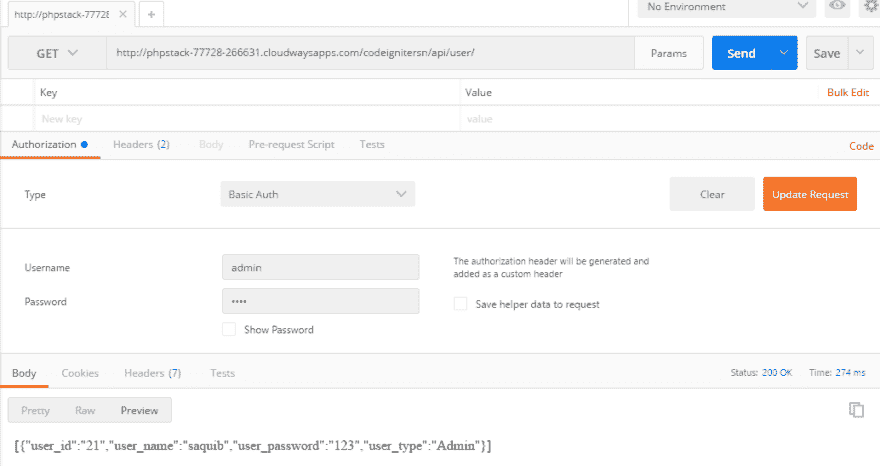T2】](https://res.cloudinary.com/practicaldev/image/fetch/s--T96ek2Qu--/c_limit%2Cf_auto%2Cfl_progressive%2Cq_auto%2Cw_880/https://thepracticaldev.s3.amazonaws.com/i/jvpq2jrahiuvcquagdk9.png)

[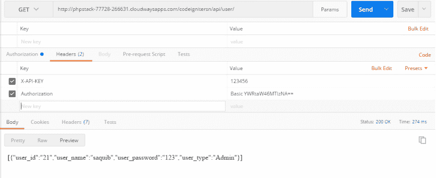T2】](https://res.cloudinary.com/practicaldev/image/fetch/s--a9Hyf-4U--/c_limit%2Cf_auto%2Cfl_progressive%2Cq_auto%2Cw_880/https://thepracticaldev.s3.amazonaws.com/i/3pidxgsb6plhnyxzas5x.png)

现在测试 POST 请求，将请求设置为 POST 并添加身份验证和 API 密钥。如下所示填写变量:

[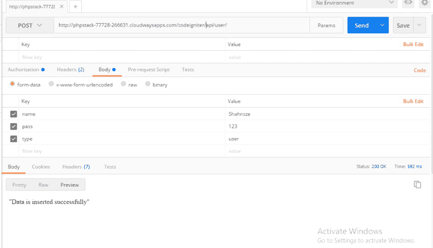T2】](https://res.cloudinary.com/practicaldev/image/fetch/s--gJQA1mjs--/c_limit%2Cf_auto%2Cfl_progressive%2Cq_auto%2Cw_880/https://thepracticaldev.s3.amazonaws.com/i/42bbctvf05lw6ock2mvn.png)

接下来，我将测试 PUT 请求。在 URL 的第三段传递 id，将请求设置为 PUT，设置身份验证和 API 密钥，并填写参数，如下所示:

[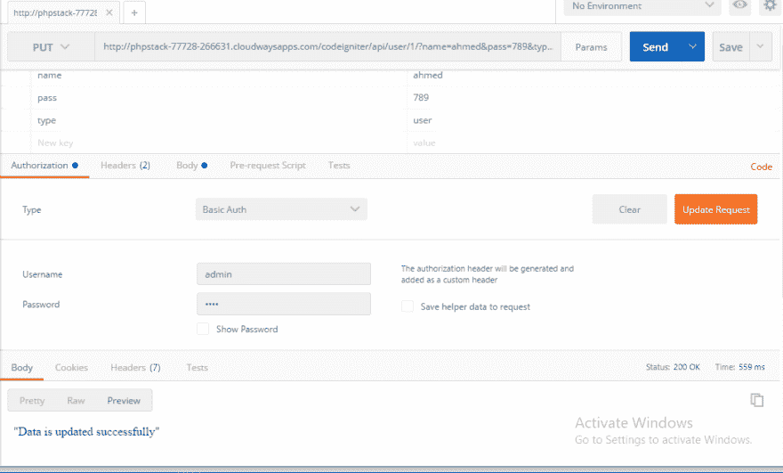T2】](https://res.cloudinary.com/practicaldev/image/fetch/s--qoLk1fP4--/c_limit%2Cf_auto%2Cfl_progressive%2Cq_auto%2Cw_880/https://thepracticaldev.s3.amazonaws.com/i/gtmm2bppe3dytc0euu0n.png)

要测试删除请求，请在 URL 的第三段中传递 id，设置要删除的请求，设置身份验证和 API 密钥，并填写如下所示的参数:

[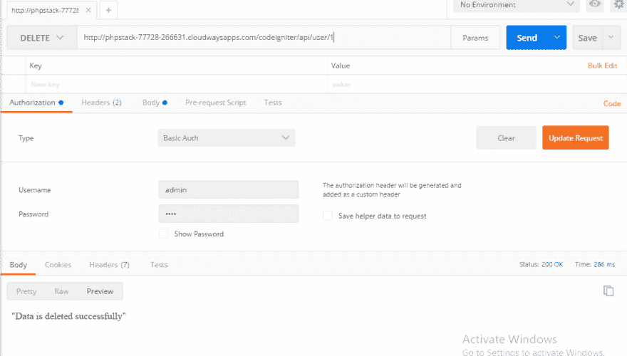T2】](https://res.cloudinary.com/practicaldev/image/fetch/s--00jVVGh_--/c_limit%2Cf_auto%2Cfl_progressive%2Cq_auto%2Cw_880/https://thepracticaldev.s3.amazonaws.com/i/an85wb90aodczgul0nh2.png)

结论

这就是我如何用 PHP 创建 Rest API。我希望它对你有帮助。如果你需要任何关于代码的帮助或者在 Codeigniter 中实现你自己的 RESTful API 的想法，请在下面留下评论。