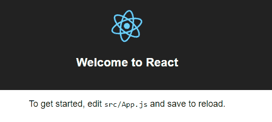
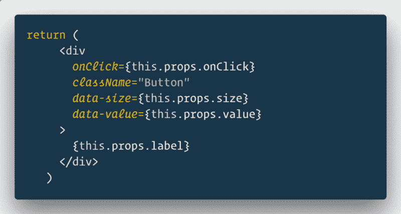
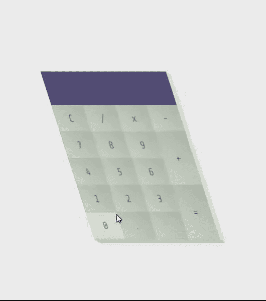
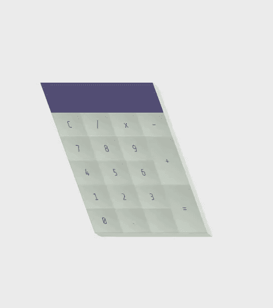

# 在 React 中创建一个简单的计算器应用程序

> 原文：<https://dev.to/kris/create-a-simple-calculator-app-in-react-2o99>

今天我们将创建一个新的 react 应用程序，一个计算器。虽然操作非常简单，但要将东西固定在适当的位置并保持适当的状态还是有点困难。

这是我们将要创建的应用程序的演示。

`create-react-app`是我们开始确保您照常拥有`node`、`npm`、`create-react-app`的地方。

如果没有，从[这里](https://nodejs.org/)安装 NodeJS(NPM 自带)。

将带有`npm install create-react-app --global`的`create-react-app`安装在端子上。

这就是所有的安装部分。

用`create-react-app react-calculator`新建一个 react app。确保你的应用程序名称中没有空格，初学者经常犯这个错误。

`cd react-calculator
npm start`

这将启动一个 react 欢迎页面，如下所示。

[T2】](https://res.cloudinary.com/practicaldev/image/fetch/s--XUpS2_hi--/c_limit%2Cf_auto%2Cfl_progressive%2Cq_auto%2Cw_880/https://cdn-images-1.medium.com/max/800/0%2AQwkXB-kakz6ohvs3)

我将把计算器应用程序分解成单独的小块。首先，它有一些 JSX，看起来像 HTML，但实际上是 JavaScript。这个 JSX 使计算器应用程序呈现在屏幕上。它有一堆带有类名的 div 和按钮。CSS 的魔力融入了类名，使其看起来更好。

### 库用于在 React 中创建计算器

1.  反应，反应-dom
2.  马西斯
3.  不变性助手

**如何开始？**

我从`create-react-app`开始，继续添加组件。现在，该应用程序包含以下组件:

*   **App** —主占位符组件
*   **按钮** —单个按钮的占位符
*   **按钮** —单个按钮
*   **显示** —顶部的显示条

### 处理计算器组件

我们的计算器进行加减乘除运算。我们将所有用户输入存储在一个变量中，并在输入等号(`=`)时进行计算。

因为每次按下按钮都必须修改输入变量，所以我们将使用状态来处理这个问题。

> React 是什么状态？
> 
> react 中的`state`指的是组件中的数据状态。如果使用相同的状态来呈现页面中的多个部分，当它在应用程序中的任何位置发生变化时，所有值都将更新。我们用它来存储按钮按压和显示栏中的显示值。

我们必须初始化状态，我们通过构造函数来完成。

```
class App extends Component { constructor() { super() this.state = { operations: [] } } .....} 
```

操作变量是按钮输入的数组，可能看起来像`[2, *,4, -, 1]`。

我们有数字按钮 0-9 和运算符+、-、*、/。我们也有清除，等于和十进制按钮。每个按钮都有一个点击处理程序。

```
render() { return ( <div className="App"> <Display data={this.state.operations} /> <Buttons> <Button onClick={this.handleClick} label="C" value="clear" /> <Button onClick={this.handleClick} label="7" value="7" /> <Button onClick={this.handleClick} label="4" value="4" /> <Button onClick={this.handleClick} label="1" value="1" /> <Button onClick={this.handleClick} label="0" value="0" /> <Button onClick={this.handleClick} label="/" value="/" /> <Button onClick={this.handleClick} label="8" value="8" /> <Button onClick={this.handleClick} label="5" value="5" /> <Button onClick={this.handleClick} label="2" value="2" /> <Button onClick={this.handleClick} label="." value="." /> <Button onClick={this.handleClick} label="x" value="\*" /> <Button onClick={this.handleClick} label="9" value="9" /> <Button onClick={this.handleClick} label="6" value="6" /> <Button onClick={this.handleClick} label="3" value="3" /> <Button label="" value="null" /> <Button onClick={this.handleClick} label="-" value="-" /> <Button onClick={this.handleClick} label="+" size="2" value="+" /> <Button onClick={this.handleClick} label="=" size="2" value="equal" /> </Buttons> </div> ) 
```

它返回一个按钮，将所有的按钮放在一起。

```
class Buttons extends Component { render() { return <div className="Buttons"> {this.props.children} </div> }} 
```

`props.children`保存在之间传递的所有内容，它们都是按钮。我已经计划了一个关于`props.children`细节的帖子。所以它只是按原样呈现传递的按钮。

> **更新:**我在这里创建了一个关于`props.children` [的帖子。](https://medium.com/@krissanawat/introduction-to-props-children-in-react-661e1b6e45c3)

这个按钮是一个独立的按钮。

```
class Button extends Component { render() { return ( <div onClick={this.props.onClick} className="Button" data-size={this.props.size} data-value={this.props.value} > {this.props.label} </div> ) }} 
```

从`App`开始，它接收一个`label`、`value`和`onClick`函数。`Button`组件利用这些数据来呈现按钮。

我们还没有谈到的一个组件是应用程序，那就是显示器。

显示器从应用程序获取状态`operations`(数组)作为道具。

```
class Display extends Component { render() { const string = this.props.data.join('') return <div className="Display"> {string} </div> }} 
```

接收到的数据是来自状态的`operations`，它被转换成字符串以显示在计算器顶部的`Display`组件中。您在显示区域看到的操作是一个字符串。

这些都是你在屏幕上看到的组件。

### React 计算器中的运算

操作由点击按钮时调用的`handleClick`函数处理。

```
handleClick = e => { const value = e.target.getAttribute('data-value') switch (value) { case 'clear': this.setState({ operations: [], }) break case 'equal': this.calculateOperations() break default: const newOperations = update(this.state.operations, { $push: [value], }) this.setState({ operations: newOperations, }) break } 
```

单击按钮后，事件按钮被传递。如果在`Button`组件中查找，该值被存储为`data-value`。

[T2】](https://res.cloudinary.com/practicaldev/image/fetch/s--4QFm89Qw--/c_limit%2Cf_auto%2Cfl_progressive%2Cq_auto%2Cw_880/https://cdn-images-1.medium.com/max/800/0%2Az-97sZ86CTX3D1Iw)

使用`e.target.getAttribute('data-value')`，我们获得分配给属性`data-value`的值，该值与从`App`组件传递的`value`相同。

使用`switch`和`case`，我们清除所选值是否被清除，即清除按钮是否被按下。在状态下，操作数组被设置为空白。

`calculateOperations`函数在点击`equal`时执行，我们接下来会谈到。对于所有其他选项，我们使用更新功能。

### 更新 react 应用中的状态

按钮的不清楚，或者等于它去操作数组。其中包含计算显示器上最终输出的所有内容。

在`App`的顶部，我们从`immutability-helper`导入了`update`，我们使用相同的函数。

**为什么更新而不是直接将新值推送到数组？**

[T2】](https://res.cloudinary.com/practicaldev/image/fetch/s--ZR9syuKd--/c_limit%2Cf_auto%2Cfl_progressive%2Cq_auto%2Cw_880/https://cdn-images-1.medium.com/max/800/0%2AfD-m8bE8tCHuFB9C)

`this.state.comment = 'Hello'`不会重新渲染组件。

`this.setState({comment: 'Hello'})`将重新渲染组件。

当状态改变时，组件被重新渲染是很重要的，这是 react 的基本概念。你不可能照顾到所有使用状态的地方并一个一个地修改它。我们使用状态而不是那样做。

唯一可以赋值`this.state`的地方是构造函数！

你可以在[官方文档中读到更多关于这个的内容，这里是](https://reactjs.org/docs/state-and-lifecycle.html#do-not-modify-state-directly)。

我们所做的不是修改操作数组，而是创建它的一个副本(`newOperations`)以及一个新的值。然后我们将`operations`状态设置为`newOperations`。这解决了问题，功能由库`immutability-helper`提供。

一旦我们更新了状态，react 就知道 DOM 需要更新。

### 计算操作

计算器必须算出运算的答案！

```
calculateOperations = () => { let result = this.state.operations.join('') if (result) { result = math.eval(result) result = math.format(result, { precision: 14 }) result = String(result) this.setState({ operations: [result], }) } } 
```

它从数组中形成字符串。

如果数组中存在任何内容，则用 math.eval 计算字符串。我们不使用全局 eval 函数来计算该字符串，它将计算任何 JavaScript 表达式，而不仅仅是数学表达式。这是一个相当大的安全问题。我们没有修补潜在的安全问题，而是使用了一个名为 [mathjs](http://mathjs.org/) 的包。

有自己的 eval 函数，它只解析数学表达式。

`math.eval()`取字符串并给出一个数字。

**为什么要格式化？**

JavaScript 中的算法有一个基本问题。与其他语言不同，数字只有一种类型。它有很高的精度，它不在乎你实际使用了多少。

如果我不控制精度，这就是我得到的…

[T2】](https://res.cloudinary.com/practicaldev/image/fetch/s--tm-sWGJ7--/c_limit%2Cf_auto%2Cfl_progressive%2Cq_auto%2Cw_880/https://cdn-images-1.medium.com/max/800/0%2ALaKGoCQDEEGx_mPf)

即使是 14 位精度，我们也能得到正确的结果。它将显示多达 14 个十进制字符的正确结果。对我们来说这就足够了。

随着精密设置，我得到这个…

[T2】](https://res.cloudinary.com/practicaldev/image/fetch/s--uZRGUYbU--/c_limit%2Cf_auto%2Cfl_progressive%2Cq_auto%2Cw_880/https://cdn-images-1.medium.com/max/800/0%2AehuPTCW9JO2uUZUx)

然后，我们将状态设置为结果，以便显示得到更新。

简单回顾一下，顶部的`Display`组件使用`state.operations`来显示输入和结果。这是上面讨论的最后一个组件。

就是这样，现在您在 react 中有了一个工作的计算器！

尽管有一些陷阱，表达式必须是有效的。类似`2*/5`的东西会让应用崩溃。表情`2.4.5 + 1`也会让 app 崩溃。这是应用程序的逻辑方面(纯 JavaScript 逻辑),与 react 无关。

可以通过在用`newOperations`更新`operations`之前在`handleClick`中使用条件语句来检查无效操作符(`2*/`)或小数(`.`)来解决这个问题。今天我们保持简单，但是如果你有兴趣修复它，不要忘记[发送 PR 到这个库](https://github.com/therj/react-calculator)。

### 想要了解更多

#### [React 16 —完全指南(含 React 路由器 4 & Redux)](http://thebestdevlist.link/react-the-complete-16-guide-incl-redux)

4.7/5 星 **||** 33.5 小时视频**| |**61597 名学生

学习反应或深入研究。学习理论，解决作业，在演示项目中实践，并构建一个在整个课程中不断改进的大型应用程序:汉堡生成器！ [**了解更多。**T3】](http://thebestdevlist.link/react-the-complete-16-guide-incl-redux)

#### [采用 React 专业化的全栈式 Web 开发](http://thebestdevlist.link/coursera-full-stack-react)

构建完整的 Web 和混合移动解决方案。在 Coursera [**注册的四门综合课程中掌握前端 web、混合移动应用程序和服务器端开发，开始为期 7 天的完全免费试用。**T3】](http://thebestdevlist.link/coursera-full-stack-react)

### 期末备注:

我在 [**React Ninja**](http://reactninja.io/) 上发表 React、React Native 以及其他一切与 web 开发相关的文章。请务必关注我的 [**推特**](https://twitter.com/reactninjaio) 。

加入我们的 [**简讯**](https://reactninja.io/subscribe-our-newsletter/) 获取最新最棒的内容，让你成为更好的开发者。

#### 如果这篇帖子有帮助，请点击下面的按钮几下以示支持！ 

在 React 中创建一个简单的计算器应用的帖子[首先出现在](https://reactninja.io/2018/06/26/create-simple-calculator-app-react/)[React inja](https://reactninja.io)上。