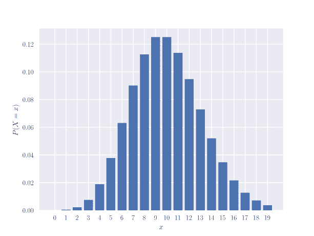
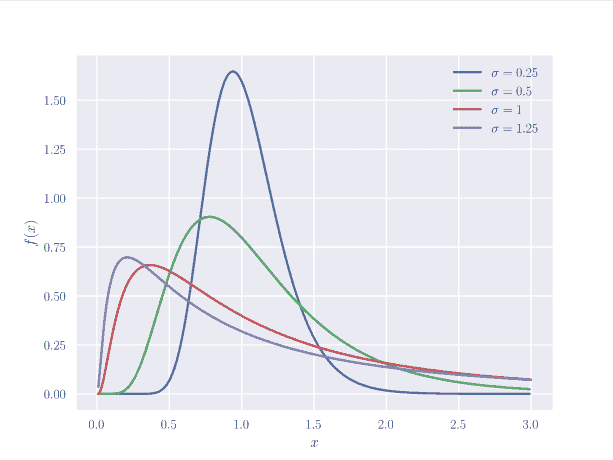
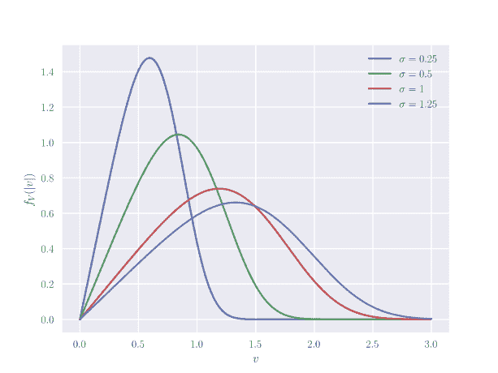
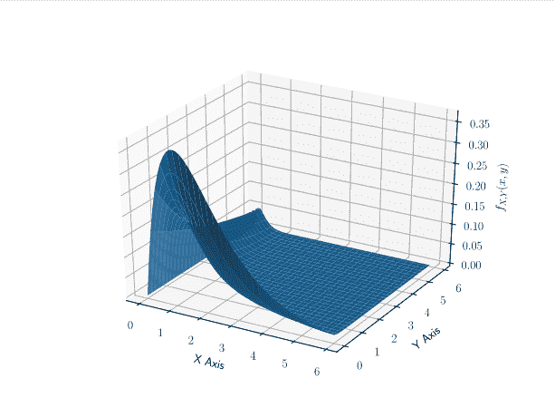

# 创建漂亮的数学作业

> 原文：<https://dev.to/pianomanfrazier/create-beautiful-math-homework-1dn5>

在我获得计算机科学学位的整个过程中，我一直用 Latex 做很多作业。它有一个陡峭的学习曲线，但结果是惊人的。

在我的技术写作课上，我说服我的小组使用 Latex，而不是 Word 或 Google Docs。事后看来，这给我带来了很多额外的工作，但是我学到了很多关于定制 Latex 文档的知识。

我生成的乳胶模板见[这里](https://github.com/pianomanfrazier/ENGR_3080_latex)。

我非常喜欢这个设置，因为它能够将文档模块化，并为不同的团队成员分配一个部分。然后我们使用[https://www.overleaf.com](https://www.overleaf.com)在文档上合作。背面有 git 集成，所以我可以在我的笔记本电脑上编辑文档，并将更改推回到背面。这样做的缺点是，我的其他团队成员不是程序员，不知道如何使用 git，必须使用 web 界面进行编辑。使用 Bibliotex 生成和管理书目也非常容易。

对于我的个人作业，我编写了一个 bash 脚本，它读取我所在班级的配置文件，其中包含教师、学期、班级名称等数据，并使用 makefile 生成一个新的 Latex 项目。我已经使用这个系统 2 个学期了，它一直工作得很好。参见[作业-发电机](https://github.com/pianomanfrazier/homework-generator)。

在这学期的概率课上，我还想制作图表。我一直在使用 python 库 [matplotlib](https://matplotlib.org) 和 [seaborn](https://seaborn.pydata.org/index.html) 来创建令人惊叹的图形。我的作业经常比我的课本好看(imho)。

这是我为家庭作业做的图表中的一些亮点。可视化帮助我了解了数学是怎么回事。

<figure> 

<figcaption>泊松分布凡$ $ \λ= 10 $ $[【下载泊松. py】](https://pianomanfrazier.com/files/plots/poisson.py)</figcaption>

</figure>

<figure> 

<figcaption>对数正态分布$ f(x) = \frac{1}</figcaption>

</figure>

使用 [moviepy](https://zulko.github.io/moviepy/) 我们可以创建一个很好的图表视频，其中(\sigma)随时间变化。[【下载 log norm _ video . py】](https://pianomanfrazier.com/files/plots/lognorm_video.py)

<video controls="" loop=""><source src="https://pianomanfrazier.com/video/lognormal.mp4" type="video/mp4"> Your browser does not support this video.</video> 

<figure> 

<figcaption>质点速度的正态分布$ $ f(x)= 2 \ frac { mv } { \ sigma \ sqrt { 2 \ pi } } e^{-(\ frac { 1 } { 2 } mv^2-\mu)^2/2 \ sigma ^2} $ $[【下载 velocity . py】](https://pianomanfrazier.com/files/plots/velocity.py)</figcaption>

</figure>

<figure> 

<figcaption>二元分布图$f_{XY}(x，y) = x e^{-x(y+1)}$ [【下载二元. py】](https://pianomanfrazier.com/files/plots/bivariate.py)</figcaption>

</figure>

为了好玩，让我们画一个圆环，然后用它做一个视频。[【下载 torus . py】](https://pianomanfrazier.com/files/plots/torus.py)

<video controls="" loop=""><source src="https://pianomanfrazier.com/video/torus.mp4" type="video/mp4"> Your browser does not support this video.</video>