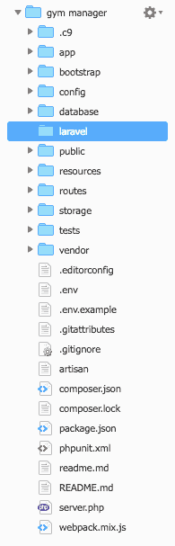
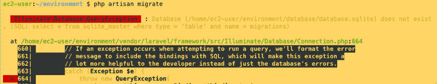

# 在 Laravel 5.7 第 0 部分中创建健身房管理::在 AWS cloud9 上安装 Laravel

> 原文：<https://dev.to/kris/create-gym-management-in-laravel-57-part-0-install-laravel-on-aws-cloud9-2elf>

### 在 Laravel 5.7 part 0 中创建健身房管理::在 AWS cloud9 上安装 Laravel

[T2】](https://res.cloudinary.com/practicaldev/image/fetch/s--uS_b2dPs--/c_limit%2Cf_auto%2Cfl_progressive%2Cq_auto%2Cw_880/https://cdn-images-1.medium.com/max/1024/1%2Ab7NFZNKFKNMMiTdmQAIsyw.png)

#### 旅程赞助商

[**使用 Laravel 和 Vue.js 进行 Fullstack Web 开发**](https://click.linksynergy.com/link?id=qt/jYwyHv8A&offerid=507388.1608944&type=2&murl=https%3A%2F%2Fwww.udemy.com%2Flaravel-vuejs-fullstack-web-development%2F)

了解如何使用 Laravel 5、Laravel Mix、Vue js、Bootstrap 4 & Sass 构建 fullstack web 应用

[**带推送器的实时单页论坛 App&vuejs**](https://click.linksynergy.com/link?id=qt/jYwyHv8A&offerid=507388.1587178&type=2&murl=https%3A%2F%2Fwww.udemy.com%2Freal-time-single-page-forum-app-with-pusher-laravel-vuejs%2F)

在单页 App 中用推送器实时做事情

AWS Cloud9 提供基于云的 Ubuntu 环境。它具有一个基于浏览器的编辑器，支持许多语法高亮和单词补全，一个基于 GUI 的 GDB 调试，对基于云的 Ubuntu 环境的完全控制，以及许多其他功能，包括主题，可定制的布局和键盘快捷键。因为它是基于云的，即使你使用不同的计算机，你也可以继续做你的习题集！

并且可以与 Lambda、Codestar、Light Sail 等其他 AWS 服务集成

在这一章中我已经演练了如果我们需要跟我来

您需要 AWS 帐户

[T2】](https://res.cloudinary.com/practicaldev/image/fetch/s--jRYvfHeV--/c_limit%2Cf_auto%2Cfl_progressive%2Cq_auto%2Cw_880/https://cdn-images-1.medium.com/max/1024/1%2A5rYIAoMvyCF9IBhG1TBcqQ.png)

尝试搜索 Cloud9

[T2】](https://res.cloudinary.com/practicaldev/image/fetch/s--Ztp7EASJ--/c_limit%2Cf_auto%2Cfl_progressive%2Cq_auto%2Cw_880/https://cdn-images-1.medium.com/max/1024/1%2AjvnxvfMS1r2ISs4YQSThoQ.png)

接下来，我们创建环境

[T2】](https://res.cloudinary.com/practicaldev/image/fetch/s--D8BBqtXW--/c_limit%2Cf_auto%2Cfl_progressive%2Cq_auto%2Cw_880/https://cdn-images-1.medium.com/max/1015/1%2A_o26LyzjkelWFTbZ5JOyhg.png)

填充名称和描述

然后

[T2】](https://res.cloudinary.com/practicaldev/image/fetch/s--ZBY9IPBX--/c_limit%2Cf_auto%2Cfl_progressive%2Cq_auto%2Cw_880/https://cdn-images-1.medium.com/max/927/1%2AnILZTNBNw5RjHbcqU60ERw.png)

选择环境类型和实例类型，查看您在图像中看到的更多描述

[T2】](https://res.cloudinary.com/practicaldev/image/fetch/s--omASPZXK--/c_limit%2Cf_auto%2Cfl_progressive%2Cq_auto%2Cw_880/https://cdn-images-1.medium.com/max/957/1%2A0qMOQozLfL7hh13YaULrrg.png)

上一步我们看到了实例摘要

[T2】](https://res.cloudinary.com/practicaldev/image/fetch/s--ppsaxVYw--/c_limit%2Cf_auto%2Cfl_progressive%2Cq_auto%2Cw_880/https://cdn-images-1.medium.com/max/1024/1%2Ath3Eu4Za3WtoOua9AHiD1Q.png)

然后等待…

[T2】](https://res.cloudinary.com/practicaldev/image/fetch/s--CdM5XaCy--/c_limit%2Cf_auto%2Cfl_progressive%2Cq_auto%2Cw_880/https://cdn-images-1.medium.com/max/1024/1%2A2U3kwocjrUGWYbrbjGFXMA.png)

你有了新操场

尝试用你自己去发现新事物

#### 安装 Laravel 5.7

这个版本需要 php 7.1.3 或更高版本，现在这台机器上的 php 是 5.6

[T2】](https://res.cloudinary.com/practicaldev/image/fetch/s--ExvK6G2Y--/c_limit%2Cf_auto%2Cfl_progressive%2Cq_auto%2Cw_880/https://cdn-images-1.medium.com/max/901/1%2AfQmDSEI4ZnhMOZcl3LPUVw.png)

当你试着去得到

[T2】](https://res.cloudinary.com/practicaldev/image/fetch/s--O16gA65---/c_limit%2Cf_auto%2Cfl_progressive%2Cq_auto%2Cw_880/https://cdn-images-1.medium.com/max/1024/1%2AEd7-EU7o7hRIHZKTnROxNA.png)

因为基于 Centos 的 Amzon linux

所以首先我们需要用这个命令删除 php 5.6

[T2】](https://res.cloudinary.com/practicaldev/image/fetch/s--9XiXr11Y--/c_limit%2Cf_auto%2Cfl_progressive%2Cq_auto%2Cw_880/https://cdn-images-1.medium.com/max/1024/1%2AuHybDo4QQ5YihKO074bu2Q.png)

sudo yum 删除 php56*

我们删除了 php5.6 中所有与*相关内容

我们用这个命令安装所有与 php 7.2 相关东西

sudo yum 安装 php72*

[T2】](https://res.cloudinary.com/practicaldev/image/fetch/s--B13GXxx9--/c_limit%2Cf_auto%2Cfl_progressive%2Cq_auto%2Cw_880/https://cdn-images-1.medium.com/max/1024/1%2AhksxpSPfBHnxCNZMEntyKA.png)

接下来尝试 php -v

[T2】](https://res.cloudinary.com/practicaldev/image/fetch/s--H5nmGg65--/c_limit%2Cf_auto%2Cfl_progressive%2Cq_auto%2Cw_880/https://cdn-images-1.medium.com/max/818/1%2ANK858xPxq-vWYF65K_wrsw.png)

下一次安装作曲家

导航至[作曲家下载页面](http://getcomposer.org/download)

[T2】](https://res.cloudinary.com/practicaldev/image/fetch/s--lB1xbz1d--/c_limit%2Cf_auto%2Cfl_progressive%2Cq_auto%2Cw_880/https://cdn-images-1.medium.com/max/1024/1%2A3dJubyF4cayf4JZ4wuxLNg.png)

我们在终端
使用 php

```
php -r "copy('https://getcomposer.org/installer', 'composer-setup.php');"
php -r "if (hash\_file('SHA384', 'composer-setup.php') === '93b54496392c062774670ac18b134c3b3a95e5a5e5c8f1a9f115f203b75bf9a129d5daa8ba6a13e2cc8a1da0806388a8') { echo 'Installer verified'; } else { echo 'Installer corrupt'; unlink('composer-setup.php'); } echo PHP\_EOL;"
php composer-setup.php
php -r "unlink('composer-setup.php');" 
```

在终端中复制粘贴

[T2】](https://res.cloudinary.com/practicaldev/image/fetch/s--qha5uZkc--/c_limit%2Cf_auto%2Cfl_progressive%2Cq_auto%2Cw_880/https://cdn-images-1.medium.com/max/1024/1%2AE_5Xyr5G1LJJ-eZLNib7AA.png)

当安装成功时，你会在文件管理器中看到 composer.phar

下一次尝试调用编写器

[T2】](https://res.cloudinary.com/practicaldev/image/fetch/s--UFMDAGU9--/c_limit%2Cf_auto%2Cfl_progressive%2Cq_auto%2Cw_880/https://cdn-images-1.medium.com/max/1024/1%2AV9xuw20sB0C1C9DPQp0hzw.png)

在这种情况下，我们需要调用长命令总是浪费时间

然后我们需要用
给 composer 命令起别名

```
sudo mv composer.phar /usr/local/bin/composer 
```

[T2】](https://res.cloudinary.com/practicaldev/image/fetch/s--Ek20G1bN--/c_limit%2Cf_auto%2Cfl_progressive%2Cq_auto%2Cw_880/https://cdn-images-1.medium.com/max/1024/1%2A84GXTbyv0x6LNABo4mKwqQ.png)

现在您可以直接调用 composer

#### 安装 Laravel 5.7

使用命令

composer create-project laravel/laravel

[T2】](https://res.cloudinary.com/practicaldev/image/fetch/s--9lniRcdO--/c_limit%2Cf_auto%2Cfl_progressive%2Cq_auto%2Cw_880/https://cdn-images-1.medium.com/max/1024/1%2AEGVQ69WMzafeUX_NqxUr_Q.png)

当你在文件管理器中运行完成时

[T2】](https://res.cloudinary.com/practicaldev/image/fetch/s--mf78sz_p--/c_limit%2Cf_auto%2Cfl_progressive%2Cq_auto%2Cw_880/https://cdn-images-1.medium.com/max/234/1%2AFOdL57Bw1-004yfwFHFeIQ.png)

接下来，我们将 Sqlite 用于开发模式。所以敞开心扉吧。包封/包围（动词 envelop 的简写）

[T2】](https://res.cloudinary.com/practicaldev/image/fetch/s--oNl8vIQA--/c_limit%2Cf_auto%2Cfl_progressive%2Cq_auto%2Cw_880/https://cdn-images-1.medium.com/max/1024/1%2AzqoKsL8FZjJLt-I1SOjEFA.png)

把 mysql 改成 sqlite

[T2】](https://res.cloudinary.com/practicaldev/image/fetch/s--O6H-rMoG--/c_limit%2Cf_auto%2Cfl_progressive%2Cq_auto%2Cw_880/https://cdn-images-1.medium.com/max/685/1%2AumvXNgOvIGcYcR9aJbTYQw.png)

以及删除或插入注释

[T2】](https://res.cloudinary.com/practicaldev/image/fetch/s--bHEkYYmb--/c_limit%2Cf_auto%2Cfl_progressive%2Cq_auto%2Cw_880/https://cdn-images-1.medium.com/max/408/1%2AIaeULWujwsBOg6O2osqNwQ.png)

不要忘记将 laravel 文件夹中的每个文件移到根目录

[T2】](https://res.cloudinary.com/practicaldev/image/fetch/s--cZmgsM_b--/c_limit%2Cf_auto%2Cfl_progressive%2Cq_auto%2Cw_880/https://cdn-images-1.medium.com/max/195/1%2Aml79YjrD7rD-n9XprhKFJw.png)

现在尝试 php artisan 迁移

[T2】](https://res.cloudinary.com/practicaldev/image/fetch/s--HhjYb0L2--/c_limit%2Cf_auto%2Cfl_progressive%2Cq_auto%2Cw_880/https://cdn-images-1.medium.com/max/1024/1%2ABjFS7WC_yE4_EXv8LB9jrw.png)

错误来自于我们忘记了创建 sqlite 文件，这是用文件管理器创建的简单方法

[T2】](https://res.cloudinary.com/practicaldev/image/fetch/s--WGDjhxFu--/c_limit%2Cf_auto%2Cfl_progressive%2Cq_auto%2Cw_880/https://cdn-images-1.medium.com/max/183/1%2ArsuHSTjbnvyd_JmP1JIxMA.png)

现在 php 工匠再次迁移

[T2】](https://res.cloudinary.com/practicaldev/image/fetch/s--C2zDwFIB--/c_limit%2Cf_auto%2Cfl_progressive%2Cq_auto%2Cw_880/https://cdn-images-1.medium.com/max/621/1%2AScBibrw-cH9qgF8yYbVqXg.png)

接下来，我们使用 php 内置服务器在端口 8080 上使用 artisan 命令启动服务器，因为 cloud9 允许端口 8080、8081 和 8082

[T2】](https://res.cloudinary.com/practicaldev/image/fetch/s--aLZ8pRYi--/c_limit%2Cf_auto%2Cfl_progressive%2Cq_auto%2Cw_880/https://cdn-images-1.medium.com/max/744/1%2ALFt6TyvsO4uvidUp0gAgIA.png)

然后选择预览，并选择预览正在运行的应用程序

[T2】](https://res.cloudinary.com/practicaldev/image/fetch/s--VC5ml0nY--/c_limit%2Cf_auto%2Cfl_progressive%2Cq_auto%2Cw_880/https://cdn-images-1.medium.com/max/651/1%2AaCTFIH-IE-zJLIJZ3I9qHw.png)

你已经看到新窗口出现在终端的侧面

我的天啊，我在一个页面中集成了文件管理器、文件编辑器、终端和浏览器

[T2】](https://res.cloudinary.com/practicaldev/image/fetch/s--pvEBrT5x--/c_limit%2Cf_auto%2Cfl_progressive%2Cq_auto%2Cw_880/https://cdn-images-1.medium.com/max/1024/1%2ACu-qLrYr_eWrv_hb0irVBw.png)

您可以在新标签页中打开

[T2】](https://res.cloudinary.com/practicaldev/image/fetch/s--mg_doxTU--/c_limit%2Cf_auto%2Cfl_progressive%2Cq_auto%2Cw_880/https://cdn-images-1.medium.com/max/1024/1%2AKhDhfA3oWpjwOg-eBsuh3w.png)

明白了，我们已经在 AWS cloud9 上完成了 Laravel 的设置

但这还不够，在下一篇文章中，我已经创建了 Github 存储库，然后将其部署在 Heroku 上，用于最终的开发工作流

#### 关闭赞助商

#### [终极进阶 Laravel Pro 课程(含 Vuejs)](https://click.linksynergy.com/link?id=qt/jYwyHv8A&offerid=507388.1382640&type=2&murl=https%3A%2F%2Fwww.udemy.com%2Fthe-ultimate-advanced-laravel-pro-course-incl-vuejs-2%2F)

[T2】](https://click.linksynergy.com/link?id=qt/jYwyHv8A&offerid=507388.1382640&type=2&murl=https%3A%2F%2Fwww.udemy.com%2Fthe-ultimate-advanced-laravel-pro-course-incl-vuejs-2%2F)

#### [Laravel 5.7 电子商务商店](https://click.linksynergy.com/link?id=qt/jYwyHv8A&offerid=507388.1510962&type=2&murl=https%3A%2F%2Fwww.udemy.com%2Flaravel-ecommerce-shop%2F)

[T2】](https://click.linksynergy.com/link?id=qt/jYwyHv8A&offerid=507388.1510962&type=2&murl=https%3A%2F%2Fwww.udemy.com%2Flaravel-ecommerce-shop%2F)

[**了解更多。**T3】](https://click.linksynergy.com/link?id=qt/jYwyHv8A&offerid=507388.1510962&type=2&murl=https%3A%2F%2Fwww.udemy.com%2Flaravel-ecommerce-shop%2F)

#### 期末备注:

如果你需要和我一起探索海洋，普通海盗可以登上黑珍珠号

#### 如果你需要为这次旅行筹集资金

[T2】](https://www.patreon.com/krissanawat)

[T2】](https://bit.ly/2O1yNyY)

* * *