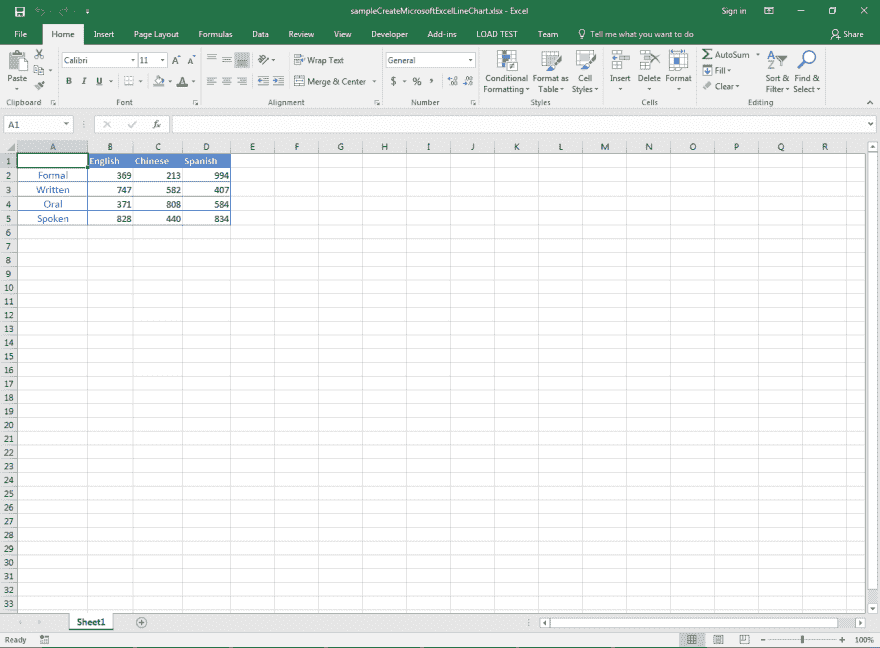

# 用 C#创建 Microsoft Excel 折线图。网

> 原文：<https://dev.to/asposecells/create-microsoft-excel-line-chart-in-c-2kh2>

图表是数据的图形表示，使用户能够轻松理解大量数据以及数据各部分之间的关系。Microsoft Excel 中有许多类型的图表可用，并且几乎所有的图表都受 [Aspose 支持。的单元格。网](https://products.aspose.com/cells/net)。阿斯波斯。几乎可以在任何平台上使用 Cells 来创建、编辑和操作 Excel 电子表格，而无需安装 Microsoft Excel 或使用任何类型的 Microsoft Office automation。

**文章描述**

> 本文的目的是解释开发人员如何用 C#.NET 创建 Microsoft Excel 折线图。

**支持的平台**

> [Aspose。Cells](https://products.aspose.com/cells/) API 支持所有。NET 框架，例如。NET 2.0，。NET 3.5，。NET 4.0，。NET 7.0，。网芯，。NET Standard 2.0、Xamarin 等。它也可用于其他平台，如 Java、C++、Android、JavaScript、PHP 等。此外，[阿斯波斯。Cells 在云中作为 REST 或 RESTful APIs 提供。](https://products.aspose.cloud/cells)

# 折线图的类型

折线图有多种类型，下面列出了其中一些。

*   线条
*   线条堆叠
*   百分比堆积折线图
*   带数据标记的线条
*   堆积有数据标记的折线图
*   带数据标记的百分比堆积线

# 样本输入微软 Excel 文档

为了演示，我们将使用下面的[样本输入包含图表数据的 Microsoft Excel 文档](https://github.com/AsposeCells/AsposeCells-Screenshots-and-Sample-Files/blob/master/Create-Microsoft-Excel-Line-Chart/sampleCreateMicrosoftExcelLineChart.xlsx)。这里，列 A 包含分类轴数据，其他列 B、C 和 D 包含图表系列数据。

> ***标题:**样本输入包含图表数据的 Microsoft Excel 文档。*

[T2】](https://res.cloudinary.com/practicaldev/image/fetch/s--hsTbqeBa--/c_limit%2Cf_auto%2Cfl_progressive%2Cq_auto%2Cw_880/https://raw.githubusercontent.com/AsposeCells/AsposeCells-Screenshots-and-Sample-Files/master/Create-Microsoft-Excel-Line-Chart/Input-Microsoft-Excel-Document-containing-Chart-Data.png)

# 样本代码

以下示例代码通过执行这些步骤来创建 Microsoft Excel 折线图。

*   加载[样本输入包含图表数据的 Microsoft Excel 文档](https://github.com/AsposeCells/AsposeCells-Screenshots-and-Sample-Files/blob/master/Create-Microsoft-Excel-Line-Chart/sampleCreateMicrosoftExcelLineChart.xlsx)。
*   创建具有指定维度的折线图。
*   在图表区应用两种颜色渐变。
*   设置图表标题并格式化。
*   添加三个垂直系列，设置它们的名称和线宽。
*   格式化各种图表项目，例如绘图区、数值轴、分类轴、主要刻度线等。
*   以 XLSX 格式保存工作簿。您也可以保存为其他格式，如 XLS，XLSB，XLSM 等。